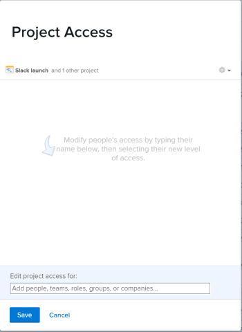

# Compartir un objeto

El administrador de Adobe Workfront concede a los usuarios acceso para ver o editar objetos cuando asignen niveles de acceso. Para obtener más información sobre la concesión de acceso a objetos, consulte [Crear o modificar niveles de acceso personalizados](../../administration-and-setup/add-users/configure-and-grant-access/create-modify-access-levels.md).

Junto con el nivel de acceso al que se concede a los usuarios, también puede concederles permisos para ver o editar objetos específicos que haya creado o que tengan acceso para compartir. Para obtener más información sobre los niveles de acceso y los permisos, consulte [Cómo funcionan juntos los niveles de acceso y los permisos](../../administration-and-setup/add-users/access-levels-and-object-permissions/how-access-levels-permissions-work-together.md).

Los permisos son específicos para un elemento de Workfront y definen qué acciones se pueden realizar en ese elemento.

Para obtener información sobre cómo compartir permisos en objetos, consulte [Información general sobre cómo compartir permisos en objetos](../../workfront-basics/grant-and-request-access-to-objects/sharing-permissions-on-objects-overview.md).

>[!NOTE]
>
>Un administrador de Workfront puede agregar o quitar permisos para cualquier elemento del sistema, para todos los usuarios, sin ser el propietario de esos elementos.

En este artículo se describe cómo compartir los siguientes objetos para los que compartir es idéntico: 

* Proyectos, tareas, problemas
* Portfolio, programas
* Documentos

Para obtener información sobre cómo compartir todos los demás objetos en Workfront, consulte también los siguientes artículos:

* Para plantillas, consulte [Compartir plantillas de proyecto](../../manage-work/projects/create-and-manage-templates/share-project-template.md).
* Para ver las pruebas, consulte [Uso compartido de una prueba en la prueba de Workfront](../../workfront-proof/wp-work-proofsfiles/share-proofs-and-files/share-proof.md).
* Para ver informes, tableros y calendarios, consulte los siguientes artículos:

   * [Compartir un informe en Adobe Workfront](../../reports-and-dashboards/reports/creating-and-managing-reports/share-report.md)
   * [Compartir un tablero](../../reports-and-dashboards/dashboards/creating-and-managing-dashboards/share-dashboard.md)
   * [Compartir un informe de calendario](../../reports-and-dashboards/reports/calendars/share-a-calendar-report.md)

   Además, consulte [Compartir informes, tableros y calendarios](../../workfront-basics/grant-and-request-access-to-objects/permissions-reports-dashboards-calendars.md) para obtener información general sobre cómo compartir informes, tableros y calendarios. 

* Para ver los filtros, las vistas y las agrupaciones, consulte [Compartir un filtro, una vista o una agrupación](../../reports-and-dashboards/reports/reporting-elements/share-filter-view-grouping.md).
* Para carpetas de documentos, consulte [Compartir una carpeta de documento](../../workfront-basics/grant-and-request-access-to-objects/share-a-document-folder.md).
* Para ver los planes, consulte [Compartir un plan en el planificador de escenarios](../../scenario-planner/share-a-plan.md).

   Esto requiere una licencia adicional.

* Para los objetivos, consulte [Compartir un objetivo en los objetivos de Workfront](../../workfront-goals/workfront-goals-settings/share-a-goal.md). Esto requiere una licencia adicional.

## Requisitos de acceso

<!--drafted for P&P:

<table style="table-layout:auto"> 
 <col> 
 <col> 
 <tbody> 
  <tr> 
   <td role="rowheader">Adobe Workfront plan*</td> 
   <td> 
Any 
 </td> 
  </tr> 
  <tr> 
   <td role="rowheader">Adobe Workfront license*</td> 
   <td> 
Current license: Standard
 
   Or
   
Legacy license: Work or higher

   </td> 
  </tr> 
  <tr> 
   <td role="rowheader">Access level configurations*</td> 
   <td> 
View access or higher to the objects you want to share
 
<b>NOTE</b>
   
   If you still don't have access, ask your Workfront administrator if they set additional restrictions in your access level. For information on how a Workfront administrator can modify your access level, see <a href="../../administration-and-setup/add-users/configure-and-grant-access/create-modify-access-levels.md" class="MCXref xref">Create or modify custom access levels</a>.
 </td> 
  </tr> 
  <tr> 
   <td role="rowheader">Object permissions</td> 
   <td> 
View permissions or higher to the objects you want to share
 
For information on requesting additional access, see <a href="../../workfront-basics/grant-and-request-access-to-objects/request-access.md" class="MCXref xref">Request access to objects </a>.
 </td> 
  </tr> 
 </tbody> 
</table>
-->

Debe tener lo siguiente para compartir objetos:

<table style="table-layout:auto"> 
 <col> 
 <col> 
 <tbody> 
  <tr> 
   <td role="rowheader">plan de Adobe Workfront*</td> 
   <td> 
Cualquiera 
 </td> 
  </tr> 
  <tr> 
   <td role="rowheader">Licencia de Adobe Workfront*</td> 
   <td> 
Trabajo o superior
 </td> 
  </tr> 
  <tr> 
   <td role="rowheader">Configuraciones de nivel de acceso*</td> 
   <td> 
Ver acceso o superior a los objetos que desea compartir
 
<b>NOTA</b>

Si todavía no tiene acceso, pregunte a su administrador de Workfront si establece restricciones adicionales en su nivel de acceso. Para obtener información sobre cómo un administrador de Workfront puede modificar su nivel de acceso, consulte <a href="../../administration-and-setup/add-users/configure-and-grant-access/create-modify-access-levels.md" class="MCXref xref">Crear o modificar niveles de acceso personalizados</a>.
 </td>
</tr> 
  <tr> 
   <td role="rowheader">Permisos de objeto</td> 
   <td> 
Ver permisos o superiores de los objetos que desea compartir
 
Para obtener información sobre la solicitud de acceso adicional, consulte <a href="../../workfront-basics/grant-and-request-access-to-objects/request-access.md" class="MCXref xref">Solicitar acceso a objetos </a>.
 </td> 
  </tr> 
 </tbody> 
</table>

&#42;Para saber qué plan, tipo de licencia o acceso tiene, póngase en contacto con el administrador de Workfront.

## Compartir un único objeto {#share-a-single-object}

1. Vaya al objeto que desea compartir.

   Para obtener información sobre los objetos que se pueden compartir, consulte [Información general sobre cómo compartir permisos en objetos](../../workfront-basics/grant-and-request-access-to-objects/sharing-permissions-on-objects-overview.md).
1. Haga clic en el **Más** icono junto al nombre del objeto y, a continuación, haga clic en **Uso compartido** o **Compartir.**

   

1. En el **Dar `<Object Name>` acceso a** , empiece a escribir el nombre del usuario, equipo, función, grupo o empresa con el que desee compartir el objeto y, a continuación, haga clic en el nombre cuando aparezca en la lista desplegable.

   Por ejemplo, si está compartiendo un proyecto, use el **Dar acceso al proyecto a** campo .

   >[!TIP]
   >
   >Puede compartir un objeto únicamente con usuarios, equipos, funciones o empresas activos.

   

   >[!TIP]
   >
   >Si tiene varias entidades con un nombre similar, todas ellas se enumeran bajo su tipo. Los nombres de las entidades aparecen en orden alfabético. Sin embargo, el orden en que aparecen los tipos de entidades es aleatorio.
   >
   >
   >   >

1. (Opcional) Repita el paso 3 con cada usuario, equipo, función o grupo al que desee conceder acceso al objeto.

   <!--
   <MadCap:conditionalText data-mc-conditions="QuicksilverOrClassic.Draft mode">
   (NOTE: esnure this stays accurate; in the editor it looks like step 4 but one step is conditioned entirely for one version or another)
   </MadCap:conditionalText>
   -->

1. Especifique los permisos para cada usuario, equipo, función, grupo o empresa que agregó en el paso 3 haciendo clic en el menú desplegable y, a continuación, seleccionando el nivel de permiso que desea conceder.

   Estas son las opciones disponibles:

   * **Ver:** Los usuarios pueden revisar y compartir el elemento. 
   * **Contribute****:** Los usuarios pueden realizar actualizaciones, registrar información, realizar pequeñas ediciones y compartir, además de todos los permisos de visualización.

      >[!TIP]
      >
      >Los permisos de Contribute sólo se pueden conceder a los siguientes objetos: 
      * Proyectos
      * Tareas
      * Problemas

   * **Administrar:**Los usuarios tienen acceso completo al objeto sin derechos administrativos, que se conceden en el nivel de acceso, además de todos los permisos de Vista y Contribute.

      >[!NOTE]
       El administrador de Workfront o el creador de objetos pueden eliminar permisos de estas entidades.

       

      

1. (Opcional) Haga clic en **Opciones avanzadas** para configurar permisos específicos en el objeto.

   Ver, Administrar y Contribute tienen diferentes opciones avanzadas en función del objeto seleccionado.\
   Para obtener más información sobre los niveles de permisos, consulte [Información general sobre cómo compartir permisos en objetos](../../workfront-basics/grant-and-request-access-to-objects/sharing-permissions-on-objects-overview.md).

   

1. (Opcional) Para que este objeto esté disponible para todos los usuarios del sistema, haga clic en el **Engranaje** icono  y, en el menú desplegable, haga clic en **Hacer que esto sea visible en todo el sistema**.

   Todos los usuarios pueden ver el objeto en función de los permisos que haya establecido.

1. (Opcional y condicional) Al compartir un proyecto, haga clic en el **Engranaje** icono y, en el menú desplegable, haga clic en **Establecer como plantilla de acceso al proyecto** para establecer los permisos como plantilla.\
   Después de definir los permisos en un proyecto, estos mismos permisos se aplican automáticamente la próxima vez que cree un proyecto desde cero.

   >[!NOTE]
   La plantilla de acceso al proyecto anula los valores predeterminados de uso compartido que le ha concedido el administrador de Workfront en su nivel de acceso.\
   Para obtener más información sobre cómo especificar valores predeterminados de uso compartido para proyectos en el nivel de acceso, consulte [Concesión de acceso a proyectos](../../administration-and-setup/add-users/configure-and-grant-access/grant-access-projects.md) . >
   <!--   >
   ><MadCap:conditionalText data-mc-conditions="QuicksilverOrClassic.Draft mode">   >
   >(NOTE: (this note also appears in Understanding Project Permissions.))   >
   ></MadCap:conditionalText>   >
   >-->   >

   Puede especificar permisos para los proyectos que se crearán a partir de una plantilla al compartir la plantilla. Para obtener más información, consulte [Compartir plantillas de proyecto](../../manage-work/projects/create-and-manage-templates/share-project-template.md).

1. (Opcional) Para que el objeto sea público, haga clic en **Convertir esto en público para usuarios externos**.

   >[!TIP]
   Esta opción no está disponible para todos los objetos.

   

1. (Condicional) Si hizo el objeto público para usuarios externos, haga clic en **copiar vínculo,** a continuación, distribuya el vínculo a usuarios externos.\
   Cualquier usuario con el vínculo puede ver el objeto .

   >[!CAUTION]
   Se recomienda tener cuidado al compartir un objeto que contenga información confidencial con usuarios externos. Esto les permite ver información sin ser usuarios de Workfront ni formar parte de su organización.

1. Haga clic en **Guardar**.

## Compartir objetos de forma masiva

Desde una lista de objetos, puede compartir varios objetos al mismo tiempo con otros usuarios, equipos, grupos, funciones de trabajo o empresas.

>[!IMPORTANT]
Cuando se comparten objetos de forma masiva, no se muestran los nombres de las entidades que tienen permisos para objetos individuales. Al compartir objetos de forma masiva, las entidades que agregue a la lista de uso compartido se agregan a los objetos seleccionados. No anulan las entidades asociadas a los objetos individuales. 

Para compartir objetos de forma masiva:

1. Vaya a una lista de objetos.
1. Seleccione dos o más objetos en la lista.
1. Haga clic en el **Compartir** icono .\
   Los usuarios que ya tienen acceso al objeto no aparecen como disponibles cuando se comparten por lotes.

   >[!NOTE]
   Si no tiene permisos para compartir un objeto que ha seleccionado, la variable **Compartir** no está visible.

1. En el **Editar `<Object Name>` acceso para** , empiece a escribir el nombre de un usuario, equipo, grupo, función de trabajo o empresa a la que desee conceder permisos.

   Por ejemplo, si está compartiendo un proyecto, use el **Dar acceso al proyecto para** campo .

   

1. Continúe compartiendo los objetos seleccionados como se describe en los pasos 4-9 de la sección [Compartir un único objeto](#share-a-single-object) en este artículo.

   <!--
   <MadCap:conditionalText data-mc-conditions="QuicksilverOrClassic.Draft mode">
   (NOTE: ensure these steps stay accurate; always look at them in the viewer; because of condiitoning, the steps numbers in the editor are different!!!!!!*****)
   </MadCap:conditionalText>
   -->

1. Haga clic en **Guardar**.
