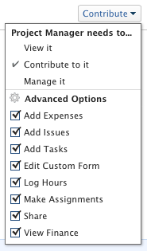

# Compartir permisos financieros en un objeto

El administrador de Adobe Workfront puede concederle acceso para ver o editar datos financieros al asignar su nivel de acceso. Para obtener más información, consulte [Concesión de acceso a datos financieros](../../administration-and-setup/add-users/configure-and-grant-access/grant-access-financial.md).

Junto con el nivel de acceso al que se concede a los usuarios, también puede otorgarles permisos para ver o administrar finanzas para proyectos, tareas o problemas específicos a los que tenga acceso para compartir.

Para obtener información sobre qué pueden hacer los usuarios de cada nivel de acceso con los datos financieros, consulte la sección [Datos financieros](../../administration-and-setup/add-users/access-levels-and-object-permissions/functionality-available-for-each-object-type.md#financia) en el artículo [Funcionalidad disponible para cada tipo de objeto](../../administration-and-setup/add-users/access-levels-and-object-permissions/functionality-available-for-each-object-type.md).

## Requisitos de acceso

<!--drafted for P&P:

<table style="table-layout:auto"> 
 <col> 
 <col> 
 <tbody> 
  <tr> 
   <td role="rowheader">Adobe Workfront plan*</td> 
   <td> 
Any 
 </td> 
  </tr> 
  <tr> 
   <td role="rowheader">Adobe Workfront license*</td> 
   <td> 
Current license: Standard 
 
   Or
   
Legacy license: Plan 
</td> 
  </tr> 
  <tr> 
   <td role="rowheader">Access level configurations*</td> 
   <td> 
View or higher access to Projects, Tasks, Issues, and Financial&nbsp;Data
 
<b>NOTE</b>
   
   If you still don't have access, ask your Workfront administrator if they set additional restrictions in your access level. For information on how a Workfront administrator can modify your access level, see <a href="../../administration-and-setup/add-users/configure-and-grant-access/create-modify-access-levels.md" class="MCXref xref">Create or modify custom access levels</a>.
 </td> 
  </tr> 
  <tr> 
   <td role="rowheader">Object permissions</td> 
   <td> 
View permissions or higher to projects, tasks, and issues that include at least View Finance permissions
 
For information on requesting additional access, see <a href="../../workfront-basics/grant-and-request-access-to-objects/request-access.md" class="MCXref xref">Request access to objects </a>.
 </td> 
  </tr> 
 </tbody> 
</table>
-->
Debe tener lo siguiente para compartir información de datos financieros sobre objetos:

<table style="table-layout:auto"> 
 <col> 
 <col> 
 <tbody> 
  <tr> 
   <td role="rowheader">plan de Adobe Workfront*</td> 
   <td> 
Cualquiera 
 </td> 
  </tr> 
  <tr> 
   <td role="rowheader">Licencia de Adobe Workfront*</td> 
   <td> 
Plan 
 </td> 
  </tr> 
  <tr> 
   <td role="rowheader">Configuraciones de nivel de acceso*</td> 
   <td> 
Ver o acceder más a Proyectos, Tareas, Problemas y Datos Financieros
 
Nota: Si todavía no tiene acceso, pregunte a su administrador de Workfront si establece restricciones adicionales en su nivel de acceso. Para obtener información sobre cómo un administrador de Workfront puede modificar su nivel de acceso, consulte <a href="../../administration-and-setup/add-users/configure-and-grant-access/create-modify-access-levels.md" class="MCXref xref">Crear o modificar niveles de acceso personalizados</a>.
 </td> 
  </tr> 
  <tr> 
   <td role="rowheader">Permisos de objeto</td> 
   <td> 
Ver permisos o superiores para proyectos, tareas y problemas que incluyen al menos permisos de Ver finanzas
 
Para obtener información sobre la solicitud de acceso adicional, consulte <a href="../../workfront-basics/grant-and-request-access-to-objects/request-access.md" class="MCXref xref">Solicitar acceso a objetos </a>.
 </td> 
  </tr> 
 </tbody> 
</table>

&#42;Para saber qué plan, tipo de licencia o acceso tiene, póngase en contacto con el administrador de Workfront.

## Compartir un objeto y conceder permisos financieros

Tenga en cuenta lo siguiente al conceder permisos financieros a objetos:

* Puede conceder permisos financieros a proyectos, tareas y problemas.
* Los permisos se pueden heredar: si tiene permisos de Ver finanzas para un proyecto, heredará automáticamente los permisos de Ver finanzas para las tareas y los problemas del proyecto.

Para conceder permisos financieros a un objeto:

1. Vaya a una tarea, proyecto o problema que desee compartir con otros.
1. Cerca del nombre del objeto, haga clic en el menú Más y haga clic en **Uso compartido**.

1. En el **Dar `<Object name>` acceso a** comience a escribir el nombre de un usuario, equipo, función, grupo o empresa con la que desee compartir el objeto.

   >[!TIP]
   >
   >Puede compartir un objeto únicamente con usuarios, equipos, funciones o empresas activos.

1. Si aparece un menú desplegable a la derecha del nombre seleccionado, haga clic en una de las siguientes opciones disponibles:

   * **Verlo**
   * **Aportar al mismo**
   * **Administrarlo**

             

1. En el mismo menú desplegable, haga clic en **Configuración avanzada** y, a continuación, realice una de las siguientes acciones:

   * Si ha seleccionado una de las tres opciones del paso anterior, asegúrese de **Ver finanzas** está seleccionado.
   * Si ha seleccionado **Administrar finanzas** en el paso anterior, asegúrese de **Administrar finanzas** está seleccionado.

1. Haga clic en **Guardar**.

## Permiso financiero para todos los niveles de uso compartido

En la tabla siguiente se muestran los permisos financieros que obtienen los usuarios al concederles permisos de visualización, Contribute o gestión de objetos: 

<table style="table-layout:auto"> 
 <col> 
 <col> 
 <col> 
 <col> 
 <thead> 
  <tr> 
   <th><strong>Acciones</strong> </th> 
   <th><strong>Administrar</strong> </th> 
   <th><strong>Aportar</strong> </th> 
   <th><strong>Vista</strong> </th> 
  </tr> 
 </thead> 
 <tbody> 
  <tr> 
   <td>Administrar registros de facturación</td> 
   <td>✓</td> 
   <td> 
 
 </td> 
   <td> </td> 
  </tr> 
  <tr> 
   <td>Administrar/ver tasas de facturación y costes de funciones</td> 
   <td>✓</td> 
   <td> </td> 
   <td> </td> 
  </tr> 
  <tr> 
   <td>Administrar/ver tasas de facturación y costes de usuario</td> 
   <td>✓</td> 
   <td> </td> 
   <td> </td> 
  </tr> 
  <tr> 
   <td>Ver finanzas</td> 
   <td>✓</td> 
   <td>✓</td> 
   <td> ✓</td> 
  </tr> 
  <tr> 
   <td>Ver información por costo en las herramientas de planificación de recursos</td> 
   <td>✓</td> 
   <td>✓</td> 
   <td>✓</td> 
  </tr> 
  <tr> 
   <td>Recursos presupuestarios en las herramientas de planificación de recursos*</td> 
   <td>✓</td> 
   <td> </td> 
   <td> </td> 
  </tr> 
  <tr> 
   <td>Ver recursos en las herramientas de planificación de recursos*</td> 
   <td>✓</td> 
   <td>✓</td> 
   <td> 
✓
 </td> 
  </tr> 
 </tbody> 
</table>

&#42;Requiere acceso adicional de Gestión de Recursos.

Para obtener información sobre el acceso a la Administración de recursos, consulte [Conceder acceso a la Administración de recursos](../../administration-and-setup/add-users/configure-and-grant-access/grant-access-resource-management.md).
