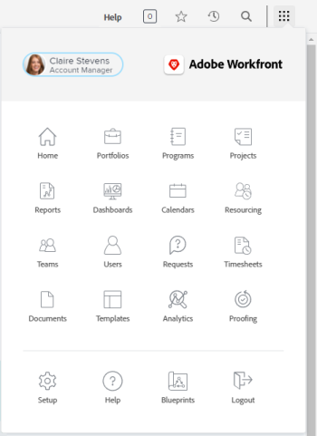

# Restablecer la contraseña de un usuario con autenticación mejorada

<!--This article has been hidden by request-->

Cuando la Autenticación mejorada (eAuth) está habilitada para el entorno de [!DNL Workfront], un administrador de [!DNL Workfront] no puede restablecer las credenciales de inicio de sesión de otro usuario. Esto difiere de los entornos sin eAuth de [!DNL Workfront] o de aquellos entornos para los cuales está habilitado el Inicio de sesión único (SSO).

## Requisitos de acceso

Debe tener el siguiente acceso para realizar los pasos de este artículo:

<table style="table-layout:auto"> 
 <col> 
 <col> 
 <tbody> 
  <tr> 
   <td role="rowheader"><strong>[!DNL Adobe Workfront] plan*</strong></td> 
   <td> 
 Cualquiera
 </td> 
  </tr> 
  <tr> 
   <td role="rowheader"><strong>[!DNL Adobe Workfront] licencia*</strong></td> 
   <td> 
[!UICONTROL Plan]
 </td> 
  </tr> 
  <tr> 
   <td role="rowheader"><strong>Configuraciones de nivel de acceso*</strong></td> 
   <td> 
Administrador del sistema 
 </td> 
  </tr> 
 </tbody> 
</table>

Para saber qué plan, tipo de licencia o acceso tienes, contacta al administrador de [!DNL Workfront].

## Restablecer la contraseña de un usuario en un entorno habilitado para eAuth

1. Haga clic en el icono **[!UICONTROL Menú principal]**  en la esquina superior derecha de [!DNL Workfront], luego haga clic en **[!UICONTROL Usuarios]** .

   

1. Selecciona al **[!UICONTROL Usuario]** que necesita restablecer la contraseña.
   

1. Haga clic en el botón **[!UICONTROL Más]** que aparece después de haber seleccionado el **[!UICONTROL Usuario]** deseado y selecciona la opción **[!UICONTROL Enviar correo de contraseña olvidada]** del menú desplegable.

   

Después de seleccionar la opción **[!UICONTROL Enviar correo de contraseña olvidada]** se envía un correo al usuario seleccionado que contiene instrucciones para que cambie su propia contraseña.

