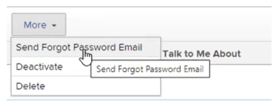

# Restablecer la contraseña de un usuario con autenticación mejorada

<!--This article has been hidden by request-->

Cuando la autenticación mejorada (eAuth) está habilitada para su [!DNL Workfront] Entorno, a [!DNL Workfront] el administrador no puede restablecer las credenciales de inicio de sesión de otro usuario. Esto difiere de [!DNL Workfront] Entornos sin eAuth o los entornos para los que está habilitado el inicio de sesión único (SSO).

## Requisitos de acceso

Debe tener el siguiente acceso para realizar los pasos de este artículo:

<table style="table-layout:auto"> 
 <col> 
 <col> 
 <tbody> 
  <tr> 
   <td role="rowheader"><strong>[!DNL Adobe Workfront] plan*</strong></td> 
   <td> 
 Cualquiera
 </td> 
  </tr> 
  <tr> 
   <td role="rowheader"><strong>[!DNL Adobe Workfront] licencia*</strong></td> 
   <td> 
[!UICONTROL Plan]
 </td> 
  </tr> 
  <tr> 
   <td role="rowheader"><strong>Configuraciones de nivel de acceso*</strong></td> 
   <td> 
Administrador del sistema 
 </td> 
  </tr> 
 </tbody> 
</table>

Para saber qué plan, tipo de licencia o acceso tiene, póngase en contacto con su [!DNL Workfront] administrador.

## Restablecer la contraseña de un usuario en un entorno habilitado para eAuth

1. Haga clic en **[!UICONTROL Menú principal]** icono  en la esquina superior derecha de [!DNL Workfront], luego haga clic en **[!UICONTROL Usuarios]** .

   

1. Seleccione el **[!UICONTROL Usuario]** que requiere un restablecimiento de contraseña.
   

1. Haga clic en **[!UICONTROL Más] botón** que aparece después de elegir el deseado **[!UICONTROL Usuario]** y seleccione la **[!UICONTROL Enviar correo electrónico sobre contraseña olvidada]** en el menú desplegable.

   

Después de seleccionar el **[!UICONTROL Enviar correo electrónico sobre contraseña olvidada]** opción, se envía un correo electrónico al usuario seleccionado que contiene instrucciones para que cambie su propia contraseña.

