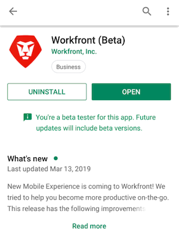

# Ser un probador beta de [!DNL Android]

## Descargar la aplicación beta

Hay un par de formas de probar la versión beta de la aplicación [!DNL Adobe Workfront]:

### Almacén [!DNL Google Play]

Puede usar [!DNL Google Play Store] para buscar y descargar la aplicación:

1. Acceda a la aplicación [!DNL Play Store] en su dispositivo.
1. Busque [!DNL Workfront] y, a continuación, puntee en él cuando aparezca en la lista.
Debe instalar la aplicación [!DNL Workfront] antes de unirse a la versión beta.
1. Instale y abra la aplicación [!DNL Workfront] si aún no lo ha hecho.
1. Desplácese hacia la mitad de la página y pulse **[!UICONTROL Unirse ahora]** en la sección **[!UICONTROL Convertirse en evaluador beta]**.

1. Puntee **[!UICONTROL Unirse]** para confirmar que quieres ser un evaluador beta.\
   Se tarda unos minutos en reconocer como usuario beta. Es posible que tenga que volver a abrir [!DNL Play Store] para ver los cambios.

1. Una vez completado el progreso, recibirá una confirmación de que ahora es usuario de la versión beta.\
   La palabra &quot;[!UICONTROL Beta]&quot; aparece después del nombre de su aplicación en el [!DNL Play Store], lo que indica que está utilizando la versión beta de la aplicación.\
   

### código QR

También puede escanear el siguiente código QR para inscribirse en la versión beta y descargar la aplicación:

## Haznos saber cómo lo estamos haciendo

Para proporcionar comentarios sobre la aplicación beta o informar de un problema:

1. Puntee **[!UICONTROL Más]** en la barra de navegación inferior.
1. Pulsa tu nombre y luego **[!UICONTROL Enviar comentarios]**.
1. Elija **[!UICONTROL Iniciar encuesta]** para proporcionar comentarios generales sobre la aplicación.\
   o\
   Elija **[!UICONTROL Informar de un problema]** para enviar un ticket al equipo de atención al cliente de [!DNL Workfront].

## Exclusión de las pruebas beta

Para detener las pruebas beta de la aplicación [!DNL Workfront]:

1. Acceda a la aplicación [!DNL Play Store] en su dispositivo.
1. Busque [!DNL Workfront] y, a continuación, puntee en él cuando aparezca en la lista.
1. Desplácese hacia abajo hasta la sección **[!UICONTROL Eres un evaluador beta]** y, a continuación, pulse **[!UICONTROL Dejar]**.\
   Se tarda unos minutos en eliminar como probador beta. Es posible que tenga que volver a abrir [!DNL Play Store] para ver los cambios.
