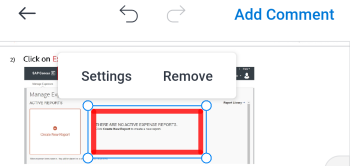

# Comentar en pruebas en [!DNL Android]

Puede revisar y resolver los comentarios existentes en una prueba y agregar nuevos comentarios y anotaciones al documento de prueba.

Su acceso a comentarios en pruebas es el mismo que en [!DNL Adobe Workfront]. Para obtener información sobre las capacidades de prueba, consulte [Perfiles de permisos de prueba en [!DNL Workfront Proof]](../../../workfront-proof/wp-acct-admin/account-settings/proof-perm-profiles-in-wp.md).

>[!NOTE]
>
>Si el propietario de la prueba ha bloqueado la prueba, no puede realizar comentarios al respecto. Para obtener más información, consulte [Bloqueo y desbloqueo de una prueba](../../../workfront-basics/mobile-apps/using-the-workfront-mobile-app/work-with-proofs-in-mobile-app.md#lock) en el artículo [Revise y tome decisiones sobre las pruebas en la variable [!DNL Adobe Workfront] aplicación móvil](../../../workfront-basics/mobile-apps/using-the-workfront-mobile-app/work-with-proofs-in-mobile-app.md).

## Revisar comentarios existentes en una prueba

Puede revisar los comentarios realizados en un documento de prueba. Los comentarios suelen tener dibujos asociados para señalar el área del documento a la que se refiere el comentario. Los planos pueden incluir flechas, líneas, rectángulos, resaltado y dibujos a mano alzada.

1. Abra la prueba del documento. Para obtener más información, consulte [Revise y tome decisiones sobre las pruebas en la variable [!DNL Adobe Workfront] aplicación móvil](../../../workfront-basics/mobile-apps/using-the-workfront-mobile-app/work-with-proofs-in-mobile-app.md).
1. Seleccione un icono de comentario en la página del documento  para abrir el comentario y los dibujos y archivos adjuntos asociados.

   Si el comentario tiene más de una respuesta, puede seleccionar **[!UICONTROL Ver respuestas]** para mostrar todas las respuestas, o deslice la hoja de comentarios hacia arriba y hacia abajo para mostrar más contenido.

1. Para ver un archivo adjunto en el comentario, seleccione la miniatura del comentario. Siga las indicaciones para descargar el archivo adjunto en el dispositivo.
1. Para responder al comentario, escriba su respuesta en el cuadro de texto debajo del comentario y seleccione la opción **[!UICONTROL Enviar]** icono .

### Usar la lista de comentarios

1. Para ver una lista de todos los comentarios en orden por número de página, seleccione el icono de comentario  en la parte superior derecha.

   El número de comentarios sin leer se indica en el icono de comentario.  Los comentarios no leídos en la lista están marcados con un punto azul. Los comentarios con archivos adjuntos tienen un icono de clip de papel ![[!UICONTROL Archivo adjunto] icono](assets/mobile-paper-clip-icon.png).

1. En la lista, seleccione un comentario individual para ver el comentario y sus dibujos asociados en la página del documento.
1. Seleccione la X para cerrar la lista de comentarios y volver a la prueba.

### Realice acciones sobre los comentarios en la vista de selección

>[!NOTE]
>
>Las opciones que tiene en la vista de selección **[!UICONTROL Más]** puede ser diferente en función de su [!DNL Workfront] administrador o [!DNL Workfront Proof] administrador configurado.

1. Para ver más opciones de comentarios, seleccione ![[!UICONTROL Lista de comentarios] icono](assets/mobile-listofcommentsicon-30x27.png) en la parte superior derecha de la lista de comentarios.

   Aparece una casilla de verificación junto a cada comentario.

   >[!NOTE]
   >
   >En la vista de selección, no se puede acceder a los comentarios del documento. Seleccione la flecha en la parte superior izquierda para volver a la lista de comentarios.

1. Para seleccionar un comentario individual, pulse la casilla de verificación.

   Para seleccionar todos los comentarios, seleccione la opción **[!UICONTROL Más]** en la parte superior derecha  y elija **[!UICONTROL Seleccionar todo]**.

1. Para resolver el comentario seleccionado, seleccione ![[!UICONTROL Resolver comentario] icono](assets/mobile-resolvecomment-icon-30x30.png) en la parte superior derecha.

   Solo puede resolver un comentario a la vez. El comentario está marcado con un icono verde para mostrar que se ha resuelto.

   El comentario original permanece en el documento. Una resolución de comentario aparece como una respuesta al comentario original: &quot;[!UICONTROL Este subproceso se ha resuelto mediante [name].]&quot;

   Puede deshacer la resolución seleccionando el comentario resuelto y el **[!UICONTROL Deshacer]** en la parte superior derecha.

1. Para marcar los comentarios seleccionados como leídos, seleccione la opción **[!UICONTROL Marcar como leído]** icono .

   Esta opción solo está disponible cuando tiene seleccionados comentarios sin leer.

1. Para eliminar los comentarios seleccionados, seleccione la opción **[!UICONTROL Más]** en la parte superior derecha  y elija **[!UICONTROL Eliminar]**. A continuación, seleccione **[!UICONTROL Eliminar]** en el mensaje de confirmación para eliminar permanentemente el comentario.
1. Seleccione la flecha en la parte superior izquierda para salir de la vista de selección y volver a la lista de comentarios.

## Comentar en una prueba

Puede asociar los comentarios de prueba a un área específica del documento. Utilice las herramientas de dibujo para seleccionar un área sobre la que comentar.

1. Abra la prueba del documento. Para obtener más información, consulte [Revise y tome decisiones sobre las pruebas en la variable [!DNL Adobe Workfront] aplicación móvil](../../../workfront-basics/mobile-apps/using-the-workfront-mobile-app/work-with-proofs-in-mobile-app.md).
1. Seleccione una herramienta de dibujo en la barra de herramientas de la parte inferior de la pantalla de prueba.

   

   Si no ve la herramienta que necesita, desplácese por la barra de herramientas a la derecha.

1. Select **[!UICONTROL Configuración]** junto al nombre de la herramienta para definir el color, la opacidad y el grosor. Seleccione el icono de estrella para que estas opciones sean la configuración predeterminada de la herramienta.

   

1. Dibuje la forma en el documento de prueba. Seleccione el **[!UICONTROL Deshacer]** icono  para deshacer el dibujo.
1. (Condicional) Seleccione la forma y elija **[!UICONTROL Configuración]** para editar la configuración de forma, o **[!UICONTROL Eliminar]** para eliminar la forma.

   

1. Select **[!UICONTROL Agregar comentario]**.
1. Escriba el comentario en el cuadro de texto.
1. Para etiquetar a un contacto en el comentario, escriba el símbolo @ o seleccione ![[!UICONTROL Contacto de etiqueta]](assets/mobile-tag-user-icon.png) para agregar el símbolo @, empiece a escribir el nombre del contacto que desea incluir y, a continuación, haga clic en el nombre cuando aparezca en la lista desplegable.

   El contacto recibe una notificación por correo electrónico cuando el comentario se añade a la prueba.

1. Para añadir un archivo adjunto al comentario, seleccione ![[!UICONTROL Archivo adjunto] icono](assets/mobile-paper-clip-icon.png). Choose **[!UICONTROL Seleccionar un documento]** o **[!UICONTROL Tomar una foto]** y siga las indicaciones para adjuntar el archivo o la foto al comentario.

   Haga clic en la X de la imagen en miniatura para eliminar el archivo adjunto.

1. Seleccione el **[!UICONTROL Enviar]** icono  para añadir el comentario y el dibujo a la prueba.
