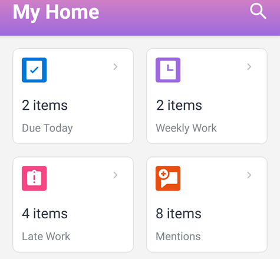

# Widgets del área [!UICONTROL Inicio]

Los widgets del área de inicio tanto para [!DNL iOS] como para [!DNL Android] le ayudan a encontrar rápidamente los elementos de trabajo.

**[!UICONTROL Vence hoy]:** muestra el número de elementos de trabajo que vencen hoy. Seleccione el widget para ver la lista de elementos.

**[!UICONTROL Trabajo semanal]:** muestra el número de elementos de trabajo de la semana en curso. Seleccione el widget para ver la lista de elementos.

**[!UICONTROL Trabajo atrasado]:** muestra el número de elementos de trabajo que están atrasados (han pasado su fecha planificada de finalización). Seleccione el widget para ver la lista de elementos.

**[!UICONTROL Menciones]:** muestra el número de menciones no leídas. Una mención es una notificación en la que se le etiqueta o notifica en la pestaña [!UICONTROL Actualizaciones] para un objeto de [!DNL Adobe Workfront]. Seleccione el widget para ver la lista de menciones.
