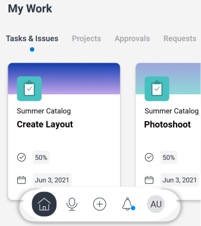
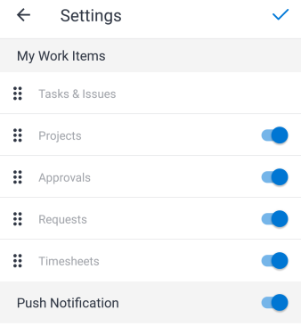

# Sección [!UICONTROL Mi trabajo] en la aplicación móvil

La sección [!UICONTROL Mi trabajo] del área de [!UICONTROL Inicio] muestra sus tareas, problemas, proyectos, aprobaciones, solicitudes y hojas de horas.

>[!NOTE]
>
>[!UICONTROL Mi trabajo] en la aplicación móvil es independiente de [!UICONTROL Mi trabajo] en la versión de escritorio de [!UICONTROL Adobe Workfront].

## Personalizar la sección [!UICONTROL Mi trabajo]

Puede elegir qué elementos de menú se mostrarán en [!UICONTROL Mi trabajo] y cambiar el orden de los elementos.

1. En el menú flotante, toque su foto o iniciales para acceder a su perfil.
1. Desplácese a la sección **[!UICONTROL Configuración]** y pulse **[!UICONTROL Configuración]**.
1. En la página **[!UICONTROL Configuración]**, seleccione y arrastre los elementos de menú para que estén en el orden correcto para el área [!UICONTROL Inicio].
1. Pulse el icono de alternancia azul para ocultar los elementos de menú que no desee mostrar. Pulse el icono de alternancia gris para volver a mostrar el elemento.

   >[!NOTE]
   >
   >El elemento de menú [!UICONTROL Tareas y problemas] siempre se muestra y no puede ocultarlo.

   
