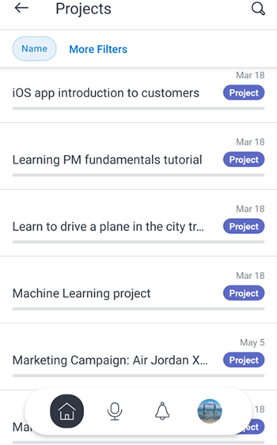

# [!DNL Adobe Workfront] para [!DNL Android]

La variable [!DNL Adobe Workfront] aplicación le permite acceder a su trabajo en cualquier [!DNL Android] dispositivo. Puede instalar y usar el [!DNL Workfront] aplicación móvil en teléfonos y tabletas en ejecución [!DNL Android] 5.0 o posterior.

Para obtener información sobre el inicio de sesión en la aplicación móvil, consulte la sección [Inicie sesión en la [!DNL Workfront] aplicación móvil](../../../workfront-basics/manage-your-account-and-profile/managing-your-workfront-account/log-in-to-workfront.md#log) en el artículo [Iniciar sesión en [!DNL Adobe Workfront]](../../../workfront-basics/manage-your-account-and-profile/managing-your-workfront-account/log-in-to-workfront.md).

## [!UICONTROL Página de inicio]

La variable [!UICONTROL Página principal] le permite trabajar directamente en las tareas, los problemas y las aprobaciones que se le hayan asignado. En el [!UICONTROL Página principal] de la aplicación, puede:

<table style="table-layout:auto"> 
 <col> 
 <col> 
 <tbody> 
  <tr> 
   <td> 
    <ul> 
     <li>Empezar a trabajar en tareas y problemas</li> 
     <li>Marcar tareas y problemas como [!UICONTROL Listo]</li> 
     <li>Reasignar tareas y problemas</li> 
     <li>Cambiar el [!UICONTROL Fecha de confirmación]</li> 
    </ul> </td> 
   <td> 
    <ul> 
     <li>Actualizar estados de problemas y tareas</li> 
     <li>Anuncio en el área Actualizaciones</li> 
     <li>Ver documentos</li> 
     <li>Adjuntar fotos</li> 
     <li> 
Crear una solicitud o una tarea rápida
 
Nota: Las tareas rápidas que se crean en casa son tareas personales, a menos que elija asignar un proyecto.
 </li> 
    </ul> </td> 
  </tr> 
 </tbody> 
</table>

Para obtener más información, consulte [[!UICONTROL Página principal] widgets de área](../../../workfront-basics/mobile-apps/using-the-workfront-mobile-app/home-area-widgets-mobile.md) y [[!UICONTROL Mi trabajo] en la aplicación móvil](../../../workfront-basics/mobile-apps/using-the-workfront-mobile-app/my-work-section-mobile.md).

## [!UICONTROL Tableros]

La variable [!UICONTROL Tableros] le permite acceder a su [!DNL Workfront] tableros.

Para obtener más información, consulte [[!DNL Adobe Workfront] [!UICONTROL Boards] para dispositivos móviles](/help/quicksilver/workfront-basics/mobile-apps/using-the-workfront-mobile-app/mobile-boards.md).

## [!UICONTROL Proyectos]

La variable [!UICONTROL Proyectos] le permite interactuar con sus proyectos y con los proyectos en los que es propietario y administrarlos. En el [!UICONTROL proyectos] de la aplicación, puede:

<table style="table-layout:auto"> 
 <col> 
 <col> 
 <tbody> 
  <tr> 
   <td> 
    <ul> 
     <li>Actualizar estado del proyecto</li> 
     <li>Ver detalles importantes del proyecto</li> 
     <li>Anuncio en el área [!UICONTROL Actualizaciones]</li> 
     <li>Conversión de tareas, problemas y solicitudes en proyectos</li> 
    </ul> </td> 
   <td> 
    <ul> 
     <li>Interaccione con tareas y problemas del proyecto</li> 
     <li>Ver documentos</li> 
     <li>Adjuntar fotos</li> 
     <li> 
Crear una tarea rápida
 
Nota: Las tareas creadas en un proyecto se asignan automáticamente al proyecto en el que se encuentra. 
 </li> 
    </ul> </td> 
  </tr> 
 </tbody> 
</table>

## [!UICONTROL Rutas de aprobación]

La variable [!UICONTROL Aprobaciones] permite ver y aprobar aprobaciones asignadas o delegadas a usted. En el [!UICONTROL aprobaciones] , puede aprobar:

<table style="table-layout:auto">
 <col>
 <col>
 <tbody>
  <tr>
   <td>
    <ul>
     <li>Trabajo (tareas y problemas)</li>
     <li>Documentos</li>
     <li>Pruebas </li>
    </ul> </td>
   <td>
    <ul>
     <li>Plantillas de horas</li>
     <li>Solicitudes de acceso</li>
    </ul> </td>
  </tr>
 </tbody>
</table>

Para obtener más información sobre las aprobaciones, consulte [Aprobaciones en el [!DNL Adobe Workfront] aplicación móvil](../../../workfront-basics/mobile-apps/using-the-workfront-mobile-app/approvals-in-mobile-app.md).

Para obtener información sobre la revisión y aprobación de pruebas, consulte [Revise y tome decisiones sobre las pruebas en la variable [!DNL Adobe Workfront] aplicación móvil](../../../workfront-basics/mobile-apps/using-the-workfront-mobile-app/work-with-proofs-in-mobile-app.md).

## [!UICONTROL Notificaciones]

La variable [!UICONTROL Notificaciones] le permite ver y responder a las notificaciones en la aplicación de su trabajo.

>[!NOTE]
>Los hipervínculos no están disponibles en las notificaciones de actualización a menos que todo el contenido de una nota sea un hipervínculo sin texto de visualización.

## [!UICONTROL Solicitudes]

La variable [!UICONTROL Solicitudes] permite ver los detalles sobre las solicitudes. En el [!UICONTROL Solicitudes] de la aplicación, puede:

<table style="table-layout:auto">
 <col>
 <col>
 <tbody>
  <tr>
   <td>
    <ul>
     <li>Reasignar la solicitud</li>
     <li>Actualizar el estado</li>
     <li>Ajustar la prioridad</li>
    </ul> </td>
   <td>
    <ul>
     <li>Anuncio en el área Actualizaciones</li>
     <li>Ver documentos</li>
     <li>Adjuntar fotos</li>
     <li>Guardar una solicitud como borrador</li>
    </ul> </td>
  </tr>
 </tbody>
</table>

## [!UICONTROL Plantillas de horas]

La variable [!UICONTROL partes de horas] le permite ver detalles sobre sus hojas de horas. En el área Hojas de hora de la aplicación, puede:

* Anuncie en la [!UICONTROL Actualizaciones] area
* Ajustar tipos de hora
* Cambiar la hora de registro
* Escribir comentarios en el parte de horas
* Cerrar la hoja de horas

## [!UICONTROL Favoritos]

Puede acceder a los elementos existentes desde la [!UICONTROL Favoritos] y agregar nuevos elementos al menú Favoritos.

## [!UICONTROL Contactos]

La variable [!UICONTROL Contactos] le permite ver la información de contacto de todos los usuarios de su empresa.

## [!UICONTROL Configuración]

La variable [!UICONTROL Configuración] le permite:

* Administrar la configuración
* Ver equipos asignados
* Configuración de las preferencias de seguridad
* Enviar comentarios
* Acceso al contenido de la Ayuda
* Cerrar sesión

## [!UICONTROL Asistente virtual]

El asistente virtual le permite realizar las siguientes tareas mediante el comando de voz:

* [!UICONTROL Mostrar]
* [!UICONTROL Eliminar]
* [!UICONTROL Buscar]
* [!UICONTROL Ayúdame con comandos]

Para obtener más información sobre el asistente virtual, consulte [Adobe [!DNL Workfront] asistente virtual de aplicación móvil](../../../workfront-basics/mobile-apps/using-the-workfront-mobile-app/wf-mobile-virtual-assistant.md).

## [!UICONTROL Fijadores]

La variable [!UICONTROL Fijar] permite acceder a comandos de asistente virtual guardados, así como a pines desde el explorador web.

Para obtener más información sobre el asistente virtual, consulte [Adobe [!DNL Workfront] asistente virtual de aplicación móvil](../../../workfront-basics/mobile-apps/using-the-workfront-mobile-app/wf-mobile-virtual-assistant.md).
