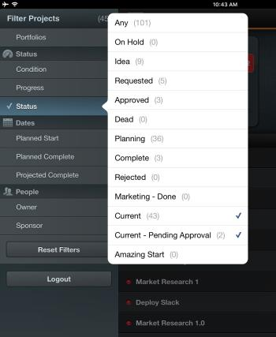

# Filtrar listas de proyectos en [!DNL Adobe Workfront View]

De manera predeterminada, [!DNL Adobe Workfront View] muestra la lista [!UICONTROL Todos los proyectos] en [!DNL Workfront], por lo que todos los proyectos para los que tiene acceso se muestran, independientemente de su estado.

Puede filtrar la lista de proyectos de [!DNL Workfront View] para que solo se muestren los proyectos que le interesen. Después de aplicar los filtros, la lista de proyectos permanece filtrada hasta la próxima vez que inicie sesión o hasta que se cambien.

## Requisitos de acceso

+++ Expanda para ver los requisitos de acceso para la funcionalidad en este artículo.

<table style="table-layout:auto"> 
 <col> 
 </col> 
 <col> 
 </col> 
 <tbody> 
  <tr> 
   <td role="rowheader"><strong>Paquete de Adobe Workfront</strong></td> 
   <td> 
Cualquiera
 </td> 
  </tr> 
  <tr> 
   <td role="rowheader"><strong>Licencia de Adobe Workfront</strong></td> 
   <td> 
   
Colaborador o superior

   
Revisión o superior
 </td> 
  </tr> 
 </tbody> 
</table>

Para obtener más información, consulte [Requisitos de acceso en la documentación de Workfront](/help/quicksilver/administration-and-setup/add-users/access-levels-and-object-permissions/access-level-requirements-in-documentation.md).

+++

## Filtrar la lista [!UICONTROL Proyectos] en [!UICONTROL Vista de Workfront]

1. Ir a la lista de proyectos en la aplicación móvil de vista de [!DNL Workfront].
1. Pulse el icono de lista en la parte superior izquierda de la lista.\
   Se muestra la lista de filtros disponibles.\
   

1. Seleccione entre los siguientes filtros:

   * [!UICONTROL Portafolio]: seleccione portafolios específicos cuyos proyectos desee mostrar.
   * [!UICONTROL Condición]: seleccione esta opción para mostrar solo los proyectos con una [!UICONTROL Condición] específica.
   * [!UICONTROL Progreso]: seleccione esta opción para mostrar solo los proyectos en un [!UICONTROL estado de progreso] específico.
   * Estado: seleccione esta opción para mostrar solamente los proyectos en [!UICONTROL estados] específicos.
   * [!UICONTROL Inicio planificado]: seleccione esta opción para mostrar solo los proyectos con la [!UICONTROL fecha de inicio planificada] en los siguientes lapsos de tiempo:

      * Últimos 3 meses
      * Últimos 2 meses
      * Mes pasado
      * Últimas dos semanas
   * [!UICONTROL Planificado para finalizar]: seleccione esta opción para mostrar solo los proyectos con la [!UICONTROL fecha planificada de finalización] en los siguientes lapsos de tiempo:

      * Dos semanas
      * Un mes
      * Dos meses
      * Tres meses
   * [!UICONTROL Proyecto completado]: seleccione esta opción para mostrar solo los proyectos con la [!UICONTROL fecha proyectada de finalización] en los siguientes lapsos de tiempo próximos:

      * Dos semanas
      * Un mes
      * Dos meses
      * Tres meses
   * [!UICONTROL Propietario]: seleccione esta opción para mostrar los proyectos asignados a propietarios específicos.
   * [!UICONTROL Patrocinador]: seleccione esta opción para mostrar los proyectos asignados a un [!UICONTROL Patrocinador] específico.

1. Pulse en cualquier lugar de la lista de proyectos para cerrar el icono de lista.
