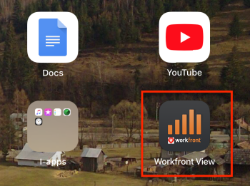

# Introducción a [!DNL Adobe Workfront View]

Puede realizar un seguimiento del progreso de sus proyectos cuando esté de viaje mediante la aplicación móvil [!DNL Adobe Workfront View].

[!DNL Workfront View] es una herramienta de creación de informes. No puede realizar cambios ni completar el trabajo con la aplicación [!DNL Workfront View]. Solo puede ver el estado de los proyectos. Concebido para que los gestores de proyectos o portafolios y otras partes interesadas en el proyecto se conecten a una interfaz de alto nivel para monitorizar sus proyectos.

Si tiene que completar el trabajo, debe usar la aplicación móvil [!DNL Workfront] que está disponible en los teléfonos [!DNL iOS] y [!DNL Android].

## Dispositivos compatibles y niveles de acceso

La aplicación [!DNL Workfront View] solo es compatible con [!DNL iPads].

Los usuarios con licencias [!UICONTROL Requestor] y [!UICONTROL External] no pueden acceder a [!DNL Workfront] con la aplicación móvil [!DNL Workfront View].

## Requisitos de acceso

+++ Expanda para ver los requisitos de acceso para la funcionalidad en este artículo.

<table style="table-layout:auto"> 
 <col> 
 </col> 
 <col> 
 </col> 
 <tbody> 
  <tr> 
   <td role="rowheader"><strong>Paquete de Adobe Workfront</strong></td> 
   <td> 
Cualquiera
 </td> 
  </tr> 
  <tr> 
   <td role="rowheader"><strong>Licencia de Adobe Workfront</strong></td> 
   <td> 
   
Colaborador o superior

   
Revisión o superior
 </td> 
  </tr> 
 </tbody> 
</table>

Para obtener más información, consulte [Requisitos de acceso en la documentación de Workfront](/help/quicksilver/administration-and-setup/add-users/access-levels-and-object-permissions/access-level-requirements-in-documentation.md).

+++

## Descargar la aplicación [!DNL Workfront View]

Debe tener una cuenta de [!DNL Apple Cloud] para poder instalar aplicaciones en un [!DNL iPad].

1. Vaya a App Store en su [!DNL iPad].
1. Busque **[!UICONTROL Vista de Workfront]** y, a continuación, pulse en ella cuando aparezca en la lista.
1. Pulse el icono [!UICONTROL descargar desde la nube] para instalar la aplicación y, a continuación, siga los pasos para completar la instalación.
1. Pulse **[!UICONTROL Abrir]** para abrir la aplicación.

## Inicie sesión en [!DNL Workfront View].

1. Vaya a la aplicación **[!DNL Workfront View]** en su [!DNL iPad].\
   

1. (Opcional) Pulse **[!UICONTROL Probar la demostración]** para ver una demostración breve de la aplicación.\
   La demostración muestra proyectos de ejemplo, no los proyectos del sistema [!DNL Workfront].\
   ![[!DNL workfront_view_demo].jpg](assets/workfront-view-demo-350x256.jpg)

1. Especifique su **[!UICONTROL [!DNL Workfront]nombre de usuario]**.
1. Especifique su **[!UICONTROL [!DNL Workfront]Contraseña]**.
1. Especifique la **[!UICONTROL [!DNL Workfront]URL]** de su empresa.

   La dirección URL debe tener este formato: `yourCompanyDomain.my.workfront.com`

1. Pulse **[!UICONTROL INICIAR SESIÓN]**.
