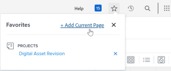

# Ver y administrar favoritos

El menú [!UICONTROL Favorites] le permite tener acceso a los elementos rápidamente. Los elementos permanecerán en el menú [!UICONTROL Favorites] hasta que los quite. Puede tener hasta 40 elementos en el menú Favoritos.

## Requisitos de acceso

Debe tener el siguiente acceso para realizar los pasos de este artículo:

<table style="table-layout:auto"> 
 <col> 
 </col> 
 <col> 
 </col> 
 <tbody> 
  <tr> 
   <td role="rowheader"><strong>[!DNL Adobe Workfront] plan*</strong></td> 
   <td> 
Cualquiera
 </td> 
  </tr> 
  <tr> 
   <td role="rowheader"><strong>[!DNL Adobe Workfront] licencia*</strong></td> 
   <td> 
[!UICONTROL Request] o superior
 </td> 
  </tr> 
 </tbody> 
</table>

&#42;Para saber qué plan o tipo de licencia tiene, póngase en contacto con su administrador de [!DNL Workfront].

## Ver un favorito

Para ver un elemento que haya añadido anteriormente como favorito:

1. Haga clic en el icono **[!UICONTROL Favoritos]**  en la esquina superior derecha de cualquier página de [!DNL Adobe Workfront].

1. En la lista [!UICONTROL Favorites], haga clic en el elemento que desea ver.

## Añadir un elemento como favorito

Puede añadir elementos recientes o la página actual al menú [!UICONTROL Favorites].

* [Añadir elementos recientes como favoritos](#add-recent-items-as-a-favorite)
* [Añadir el elemento actual como favorito](#add-the-current-item-as-a-favorite)

### Añadir elementos recientes como favoritos

1. Haga clic en el icono **[!UICONTROL Recents]** ![[!UICONTROL Recents]](assets/recents-icon-40x43.png) en la esquina superior derecha de cualquier página en la nueva experiencia de [!DNL Adobe Workfront].
1. Pase el puntero por encima del elemento más reciente que quiera guardar como favorito y luego haga clic en la estrella.

   El elemento más reciente aparece en el menú [!UICONTROL Favorites].

   Haga clic en la X de la parte superior derecha para cerrar la lista.

   

### Añadir el elemento actual como favorito

1. Vaya a la página que desee añadir como favorita.
1. Haga clic en el icono **[!DNL Favorites]**  en la esquina superior derecha de cualquier página de [!DNL Workfront] y, a continuación, haga clic en **[!UICONTROL Agregar página actual]**.

   

   Haga clic en la X de la parte superior derecha para cerrar la lista.

   O

   Haga clic en el icono **[!UICONTROL Favoritos]**  a la derecha del nombre del objeto.

   >[!NOTE]
   >
   >Si hace clic en el icono **[!UICONTROL Favorites]** de un objeto que ya añadió como favorito, el objeto se eliminará del menú [!UICONTROL Favorites].\
   >

## Quitar un elemento del menú [!UICONTROL Favorites]

1. Haga clic en el icono **[!UICONTROL Favoritos]**  en la esquina superior derecha de cualquier página de [!DNL Workfront].

1. Pase el puntero por encima del elemento que quiera eliminar como favorito y luego haga clic en la **X** que está al lado.

   O

   Si se encuentra en la página que desea quitar como favorita, haga clic en el icono **[!UICONTROL Favoritos]**  que está junto al nombre del objeto para quitarlo del menú Favoritos.
