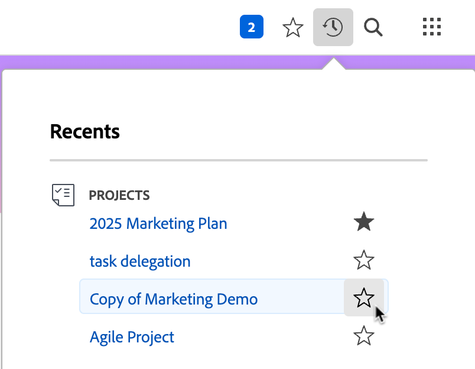
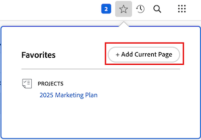
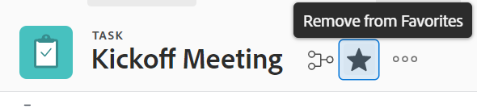

# Ver y administrar favoritos

<!-- Audited: 5/2025 -->

El menú [!UICONTROL Favorites] le permite tener acceso a los elementos rápidamente. Los elementos permanecerán en el menú [!UICONTROL Favorites] hasta que los quite. Puede tener hasta 40 elementos en el menú Favoritos.

## Requisitos de acceso

+++ Expanda para ver los requisitos de acceso para la funcionalidad en este artículo.

<table style="table-layout:auto"> 
 <col> 
 </col> 
 <col> 
 </col> 
 <tbody> 
  <tr> 
   <td role="rowheader">Paquete de Adobe Workfront</td> 
   <td> 
Cualquiera
 </td> 
  </tr> 
  <tr> 
   <td role="rowheader">Licencia de Adobe Workfront</td> 
   <td> 

      
Colaborador o superior

      
Solicitud o superior</td> 
  </tr> 
 </tbody> 
</table>

Para obtener más información sobre el contenido de esta tabla, consulte [Requisitos de acceso en la documentación de Workfront](/help/quicksilver/administration-and-setup/add-users/access-levels-and-object-permissions/access-level-requirements-in-documentation.md).

+++

## Ver un favorito

Para ver un elemento que haya añadido anteriormente como favorito:

1. Haga clic en el icono **[!UICONTROL Favoritos]**  en la esquina superior derecha de cualquier página de [!DNL Adobe Workfront].

1. En la lista **Favorites**, haga clic en el elemento que desea ver.

## Añadir un elemento como favorito

Puede añadir elementos recientes o la página actual al menú [!UICONTROL Favorites].

* [Añadir elementos recientes como favoritos](#add-recent-items-as-a-favorite)
* [Añadir el elemento actual como favorito](#add-the-current-item-as-a-favorite)

### Añadir elementos recientes como favoritos

1. Haga clic en el icono **[!UICONTROL Recientes]**  en la esquina superior derecha de cualquier página en la nueva experiencia [!DNL Adobe Workfront].
1. Haga clic en la estrella en línea con el elemento que desee guardar como favorito. El elemento más reciente aparece en el menú **Favorites**.

   

### Añadir el elemento actual como favorito

1. Vaya a la página que desee añadir como favorita.
1. Haga clic en el icono **[!DNL Favorites]**  en la esquina superior derecha de la página y, a continuación, haga clic en **[!UICONTROL Agregar página actual]**.

   

   >[!NOTE]
   >
   >Si hace clic en el icono **[!UICONTROL Favorites]** de un objeto que ya añadió como favorito, el objeto se eliminará del menú [!UICONTROL Favorites].\
   >

## Quitar un elemento del menú [!UICONTROL Favorites]

1. Haga clic en el icono **[!UICONTROL Favoritos]**  en la esquina superior derecha de cualquier página de [!DNL Workfront].

1. Pase el puntero por encima del elemento que quiera eliminar como favorito y luego haga clic en la **X** que está al lado.

   O

   Si se encuentra en la página que desea quitar como favorita, haga clic en el icono **[!UICONTROL Favoritos]**  junto al nombre del objeto para quitarlo del menú **Favoritos**.
