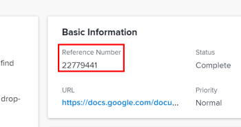

# Utilizar el número de referencia de objetos

En [!DNL Adobe Workfront], los elementos se identifican como objetos. Los objetos se corresponden con la base de datos y se utilizan para correlacionar datos con un elemento.

Workfront asigna automáticamente a cada uno de los siguientes objetos un número de referencia único cuando se crea el objeto:

* Proyectos
* Tareas
* Problemas
* Documentos

Los números de referencia son útiles para distinguir entre dos objetos similares (como tareas con el mismo nombre). Puede buscar números de referencia e incluirlos en informes.

>[!IMPORTANT]
>
>* [!DNL Workfront] asigna números de referencia continuamente entre todos los clientes y todos los objetos. Por ejemplo, al crear una tarea, [!DNL Workfront] podría asignarle un número de referencia de 00005. Si otro cliente crea un proyecto a continuación, su proyecto puede recibir el siguiente número de referencia disponible, por ejemplo, 00006. Si crea un problema a continuación, es posible que el problema reciba el número de referencia 00007, etc.
>* No se puede controlar la secuencia de números de referencia de ningún objeto de [!DNL Workfront]. La secuencia siempre se controla mediante nuestra base de datos.
>

## Ver el número de referencia de un objeto

Los números de referencia se muestran de forma predeterminada en el caso de tareas y problemas. También puede configurar fácilmente [!DNL Workfront] para que muestre los números de referencia de otros tipos de objetos.

* [Ver números de referencia de tareas y problemas](#view-reference-numbers-for-tasks-and-issues)
* [Ver números de referencia de otros objetos](#view-reference-numbers-for-other-objects)
* [Visualización de números de referencia en informes](#view-reference-numbers-in-reports)

### Ver números de referencia de tareas y problemas

Los números de referencia se muestran de forma predeterminada al ver una tarea o un problema.  Para ver el número de referencia, haga clic en **[!UICONTROL Detalles de la tarea]** o en **[!UICONTROL Detalles del problema]** en el panel izquierdo y, a continuación, busque la sección **[!UICONTROL Información básica]** en la Información general.

### Ver números de referencia de otros objetos

Para ver los números de referencia de los objetos, puede crear una vista personalizada o modificar una vista existente y agregar el campo [!UICONTROL Número de referencia] a una columna de la vista. Por ejemplo, puede modificar la vista [!UICONTROL Proyectos] para mostrar el número de referencia de todos sus proyectos.

Para obtener información acerca de cómo crear o modificar una vista, vea [Información general sobre vistas en [!DNL Adobe Workfront]](../../../reports-and-dashboards/reports/reporting-elements/views-overview.md).

### Visualización de números de referencia en informes

Para mostrar el número de referencia de los objetos de los informes, agregue la columna [!UICONTROL Número de referencia] al informe.

Para obtener información sobre cómo agregar una columna a un informe, consulte [Crear un informe personalizado](../../../reports-and-dashboards/reports/creating-and-managing-reports/create-custom-report.md).

## Buscar un objeto por número de referencia

[!DNL Workfront] le permite buscar un objeto por número de referencia.

Escriba el número de referencia de un objeto en el campo **[!UICONTROL Buscar]** y, a continuación, presione **[!UICONTROL Entrar]**.

Para obtener más información sobre la búsqueda en Workfront, consulte [Buscar [!DNL Adobe Workfront]](../../../workfront-basics/navigate-workfront/search/search-workfront.md).
