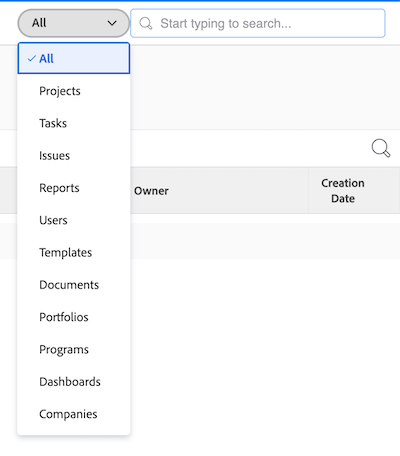
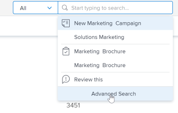

# Buscar [!DNL Adobe Workfront]

<!-- Audited: 5/2025 -->

Puede localizar fácilmente elementos en [!DNL Adobe Workfront] buscándolos cuando no pueda recordar su ubicación exacta.

Puede ver el cuadro [!UICONTROL Buscar] en la esquina superior derecha de cualquier página dentro de [!DNL Workfront].

Debe tener permisos para ver un objeto antes de poder encontrarlo en una búsqueda. Por este motivo, los resultados de la búsqueda varían de un usuario a otro.

## Requisitos de acceso

+++ Expanda esta sección para ver el acceso necesario para realizar los pasos de este artículo.

<table style="table-layout:auto"> 
 <col> 
 <col> 
 <tbody> 
  <tr> 
   <td role="rowheader">[!DNL Adobe Workfront] plan</td> 
   <td> 
Cualquiera
 </td> 
  </tr> 
  <tr> 
   <td role="rowheader">[!DNL Adobe Workfront] licencia</td> 
   <td> 
Nuevo: colaborador o superior

   
O

   
Actual: solicitud o superior 

</td> 
  </tr> 
  <tr> 
   <td role="rowheader">Configuraciones de nivel de acceso</td> 
   <td> 
Acceso de [!UICONTROL View] al tipo de objeto 
 
Nota: Si todavía no tiene acceso, pregunte al administrador de [!DNL Workfront] si ha establecido restricciones adicionales en su nivel de acceso. Para obtener información sobre cómo un administrador de [!DNL Workfront] puede modificar su nivel de acceso, consulte <a href="../../../administration-and-setup/add-users/configure-and-grant-access/create-modify-access-levels.md" class="MCXref xref">Crear o modificar niveles de acceso personalizados</a>.
</td> 
  </tr> 
  <tr> 
   <td role="rowheader">Permisos de objeto</td> 
   <td> 
Debe tener permisos para ver un objeto antes de poder encontrarlo en una búsqueda.
 
Para obtener información sobre cómo solicitar acceso adicional, consulte <a href="../../../workfront-basics/grant-and-request-access-to-objects/request-access.md" class="MCXref xref">Solicitar acceso a los objetos </a>.
 </td> 
  </tr> 
 </tbody> 
</table>

Para obtener más información sobre el contenido de esta tabla, consulte [Requisitos de acceso en la documentación de Workfront](/help/quicksilver/administration-and-setup/add-users/access-levels-and-object-permissions/access-level-requirements-in-documentation.md).

+++

## Comprender la búsqueda

### Objetos disponibles para la búsqueda

Puede buscar los siguientes objetos en Workfront:

* Proyectos
* Tareas
* Problemas
* Informes
* Usuarios
* Plantillas
* Documentos
* Portafolios
* Programas
* Paneles
* Compañías
* Notas

### Campos disponibles para la búsqueda

Los campos disponibles para la búsqueda se basan en el tipo de búsqueda: Básica o [!UICONTROL Búsqueda avanzada].

* **Búsqueda básica**: al buscar objetos en una Búsqueda básica, [!DNL Workfront] busca texto que pueda contener palabras clave en los campos siguientes:

   * Nombres de objeto
   * Descripciones
   * Campos de datos personalizados
   * Actualizaciones
   * Nombres de documentos (en búsquedas de documentos específicas y en una búsqueda básica)

  Para obtener más información acerca de la búsqueda básica en [!DNL Workfront], vea la siguiente sección en este artículo: [Búsqueda básica](#basic-search).

* **[!UICONTROL Búsqueda avanzada]**: en una [!UICONTROL Búsqueda avanzada], puede configurar filtros para buscar campos que no estén disponibles en la Búsqueda básica. Por lo tanto, [!UICONTROL Búsqueda avanzada] le permite buscar en cualquier campo del objeto.

  Para obtener más información acerca de [!UICONTROL Búsqueda avanzada], vea la siguiente sección en este artículo: [Búsqueda avanzada](#advanced-search).

>[!NOTE]
>
>Para realizar una [!UICONTROL Advanced Search], debe seleccionar la opción [!UICONTROL Advanced Search] al comenzar la búsqueda. No puede restringir una búsqueda básica a una [!UICONTROL búsqueda avanzada].

## Comprender las limitaciones de las búsquedas de [!DNL Workfront]

Tenga en cuenta las siguientes limitaciones al usar [!UICONTROL Search] en [!DNL Workfront]:

* Las búsquedas no distinguen entre mayúsculas y minúsculas.
* [!DNL Workfront] no corrige ni comprende errores tipográficos.
* La búsqueda en [!DNL Workfront] no admite caracteres comodín.
* La búsqueda de [!DNL Workfront] admite búsquedas parciales de palabras, pero no admite búsquedas de subcadenas.\
   Por ejemplo, la palabra clave de búsqueda “stand” devolverá resultados que incluyan la palabra “standard”, pero no los resultados que incluyan la palabra “understand”.

## Buscar varias palabras

Cuando se incluyen varias palabras en una búsqueda y solo se desea buscar objetos que coincidan con todas las palabras del cuadro de búsqueda, puede escribir las palabras en cualquier orden.

Por ejemplo, si busca &quot;Marking Demo&quot; (sin comillas), encontrará objetos con los nombres siguientes:

* Marketing Demo
* Demo Marketing
* January Market Analysis Demo

También encuentra objetos que podrían tener “Marketing” en el nombre y “Demo” en la descripción.

Sin embargo, puede hacer lo siguiente en el cuadro [!UICONTROL Search] para ajustar los resultados de búsqueda que aparecen:

<table style="table-layout:auto"> 
 <col> 
 <col> 
 <tbody> 
  <tr> 
   <td>Incluir comillas</td> 
   <td> 
La introducción de palabras en el orden correcto entre comillas dobles permite buscar solo los objetos que coinciden exactamente. Por ejemplo, si busca “Marketing Demo” (entre comillas), encontrará objetos con los nombres siguientes:
 
    <ul> 
     <li> Marketing Demo</li> 
     <li> January Marketing Demo</li> 
     <li>Marketing Demo Plan</li> 
    </ul> 
Sin embargo, esta búsqueda no encontró un objeto con el nombre “Demo Marketing”.
 </td> 
  </tr> 
  <tr> 
   <td>Incluir OR</td> 
   <td> 
La conexión de palabras mediante "OR" (sin comillas) permite buscar solo objetos que coincidan con al menos una de las palabras del cuadro [!UICONTROL Search]. Las palabras se pueden introducir en cualquier orden. Por ejemplo, si busca “Marketing OR Demo” (sin comillas), encontrará objetos con los nombres siguientes:
 
    <ul> 
     <li> Market Analysis Demo</li> 
     <li>January Market Analysis Demo</li> 
     <li>Demo</li> 
     <li>Market Analysis</li> 
    </ul> 
Nota: "OR" debe estar en mayúsculas. De lo contrario, se interpreta como otra palabra de la frase que está buscando.
 </td> 
  </tr> 
  <tr> 
   <td>Incluir AND</td> 
   <td> 
La conexión de palabras mediante "AND" (sin comillas) permite buscar solo objetos que coincidan con todas las palabras del cuadro [!UICONTROL Search]. Las palabras se pueden introducir en cualquier orden. Por ejemplo, si busca “Marketing AND Demo” (sin comillas), encontrará objetos con los nombres siguientes:
 
    <ul> 
     <li>Marketing Demo</li> 
     <li>Demo Marketing</li> 
     <li>January Market Analysis Demo</li> 
    </ul> 
Nota: "AND" debe estar en mayúsculas. De lo contrario, se interpreta como otra palabra de la frase que está buscando. Del mismo modo, si se incluye "&amp;" (sin comillas), solo se buscarán los objetos que incluyan el carácter &amp;.
 </td> 
  </tr> 
 </tbody> 
</table>

## Usar la búsqueda en [!DNL Workfront]

[!DNL Workfront] presenta dos tipos de búsquedas: Básicas y Avanzadas. Utilice la búsqueda básica si desea buscar palabras clave en campos de objeto comunes, como nombre o descripción. Use [!UICONTROL Búsqueda avanzada] si desea usar filtros para buscar otros campos de objeto.

* [Búsqueda básica](#basic-search)
* [Búsqueda avanzada](#advanced-search)

### Búsqueda básica

Una búsqueda básica le permite buscar palabras clave en todos los objetos del sistema o en un solo objeto a la vez (como proyectos). [!DNL Workfront] entonces busca esas palabras clave en algunos campos específicos. Puede restringir los resultados de búsqueda basándose en otros campos específicos de objetos seleccionados por [!DNL Workfront].

Para obtener una lista de los campos específicos buscados en la búsqueda básica, consulte la siguiente sección en este artículo: [Campos disponibles para la búsqueda](#fields-available-for-search).

>[!NOTE]
>
>Para realizar una [!UICONTROL Advanced Search], debe seleccionar la opción [!UICONTROL Advanced Search] al comenzar la búsqueda. No puede restringir una búsqueda básica a una [!UICONTROL búsqueda avanzada].

* [Realizar una búsqueda básica](#perform-a-basic-search)
* [Restringir una búsqueda básica](#refine-a-basic-search)

#### Realizar una búsqueda básica

Puede realizar una búsqueda básica de cualquiera de estas formas:

* En todos los objetos del sistema (búsqueda general).
* Solo en un objeto a la vez (búsqueda específica de objetos).

Para realizar una búsqueda básica:

1. Haga clic en la lupa  en la esquina superior derecha de la página.

1. (Opcional) Para buscar un objeto específico, haga clic en el menú desplegable **[!UICONTROL All]** y seleccione el objeto que desee buscar.

   

1. En el cuadro **[!UICONTROL Buscar]**, empiece a escribir la información que está buscando.
Para obtener información sobre los campos que se buscan en [!DNL Workfront], consulte la siguiente sección en este artículo: [Comprender la búsqueda](#understand-search).
   

   A medida que se empieza a escribir en la barra de búsqueda, [!DNL Workfront] hace recomendaciones basadas en el historial de visualización y resalta en azul la palabra clave que se busca.

1. Si el elemento que busca se muestra en el menú [!UICONTROL typeforward], haga clic en él.

   O

   Presione Intro (Mac) o [!UICONTROL Intro] (Windows) en el teclado para realizar una búsqueda exhaustiva. Esta búsqueda consulta toda la base de datos en lugar de los elementos vistos más recientemente y abre la página **Buscar**.

   Si ha realizado una búsqueda general, [!DNL Workfront] devuelve los resultados de cualquier objeto que coincida con el término de búsqueda en cualquiera de los campos buscados, tal como se describe en [Comprender la búsqueda](#understand-search). Los objetos que coinciden con la búsqueda se muestran en una lista.

   >[!NOTE]
   >
   >A veces, en la lista de elementos encontrados se muestran las variaciones de una palabra.\
   >Por ejemplo, si busca “comercialización”, se muestran objetos cuyo nombre contiene “comercialización” o “comercio”.

1. (Opcional) Si la búsqueda generó demasiados resultados, refine la búsqueda como se describe en [Refinar una búsqueda básica](#refine-a-basic-search).

#### Restringir una búsqueda básica

Después de realizar una búsqueda básica, puede restringir la búsqueda.

Utilice la barra de herramientas situada a la izquierda de los resultados de búsqueda para acotar la información que está buscando.

Para restringir una búsqueda:

1. (Condicional) Si ha realizado una búsqueda general, seleccione el objeto que estaba buscando en la lista de objetos de la parte superior izquierda de los resultados.
1. Busque los campos disponibles para los objetos mostrados en la búsqueda en la barra de herramientas situada a la izquierda de los resultados. Se muestran los valores de cada campo, ordenados por recuento (hasta 10 valores por cada campo).
1. Haga clic dentro de cualquiera de los campos disponibles para acortar la lista de resultados. Las selecciones que realice se resaltarán en azul y los valores de campo que no seleccione se ocultarán.
Después de seleccionar cada nuevo valor, los resultados a la derecha se actualizan dinámicamente.

   

1. (Opcional) Haga clic en los valores seleccionados para anular su selección y volver a mostrar todos los valores de cada campo.

### [!UICONTROL Advanced Search]

[!UICONTROL Búsqueda avanzada] le permite buscar utilizando campos y filtros que no están disponibles para la Búsqueda básica. Por ejemplo, puede buscar proyectos con una prioridad específica o un nombre de propietario de documentos.

>[!NOTE]
>
>Para realizar una [!UICONTROL Advanced Search], debe seleccionar la opción [!UICONTROL Advanced Search] al comenzar la búsqueda. No puede restringir una búsqueda básica a una [!UICONTROL búsqueda avanzada].

* [Usar [!UICONTROL Advanced Search]](#use-advanced-search)

#### Usar [!UICONTROL Advanced Search]

Puede usar [!UICONTROL Advanced Search] para filtrar la búsqueda según criterios específicos.\
Este tipo de búsqueda es útil cuando no puede recordar una palabra clave asociada a un objeto pero conoce información específica sobre ese objeto (por ejemplo: Prioridad del proyecto, Nombre del propietario del documento, etc.).

Para realizar una búsqueda avanzada:

1. En la esquina superior derecha de cualquier página de [!DNL Workfront], haga clic en el icono **[!UICONTROL Buscar]** . Se muestra el menú **Buscar**.

1. En la parte inferior del menú **Buscar**, haga clic en **[!UICONTROL Búsqueda avanzada]**. La página **Buscar** se abre con la ficha **Búsqueda avanzada** seleccionada de forma predeterminada.
   

1. Seleccione el tipo de objeto que está buscando. **[!UICONTROL Tareas]** está seleccionada de manera predeterminada.

   

1. (Opcional) Escriba una palabra clave en el campo de la parte superior de la lista.
1. (Opcional) Cambie **[!UICONTROL Filtrar los resultados]** por **Activado** para generar un filtro que restrinja la búsqueda. Haga clic en **Aplicar** cuando termine.

1. Haga clic en **[!UICONTROL Buscar]**. A la derecha de la barra de herramientas de **[!UICONTROL Advanced Search]**, se muestra una lista de elementos que coinciden con la búsqueda.
