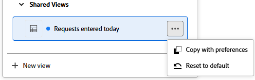
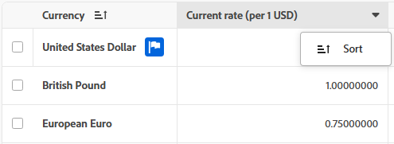
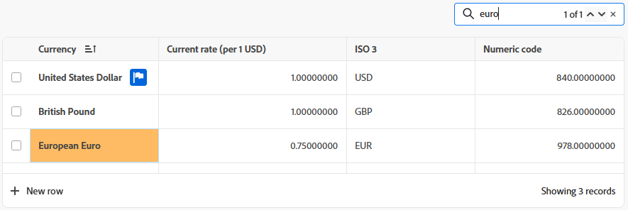

# Uso de listas mejoradas

Las listas mejoradas están disponibles en algunas áreas de Adobe Workfront. Estas listas utilizan un formato de tabla para mostrar los elementos de la lista, y tienen un aspecto diferente al de las listas estándar. También se mejora la administración de vistas, incluidos el filtrado, la agrupación, la administración de columnas y la búsqueda.

Para obtener información sobre las listas estándar, consulte [Introducción a las listas en Adobe Workfront](/help/quicksilver/workfront-basics/navigate-workfront/use-lists/view-items-in-a-list.md).

>[!NOTE]
>
>Cada lista mejorada puede configurarse de forma diferente para ayudarle a mostrar los datos que necesita. No todas las listas utilizarán todas las características descritas en este artículo, y algunas listas pueden tener características especializadas que sólo se aplican a esa lista.

## Requisitos de acceso

+++ Expanda para ver los requisitos de acceso para la funcionalidad en este artículo.

<table style="table-layout:auto">
 <col> 
 <col>
 <tbody> 
  <tr> 
   <td>Paquete de Adobe Workfront</td> 
   <td>
Cualquiera
</td> 
  </tr> 
  <tr> 
   <td>Licencia de Adobe Workfront</td> 
   <td>
   
Colaborador o superior

   
Solicitud o superior
</td>
  </tr>
 </tbody> 
</table>

Para obtener más información, consulte [Requisitos de acceso en la documentación de Workfront](/help/quicksilver/administration-and-setup/add-users/access-levels-and-object-permissions/access-level-requirements-in-documentation.md).

+++

## Objetos que utilizan listas mejoradas

A continuación se muestran algunos tipos de listas de objetos de Workfront que utilizan el formato de lista mejorado y algunas de las áreas en las que se muestran de forma predeterminada cuando tiene derechos para ver el objeto.

>[!NOTE]
>
>Esta lista no es completa. Cada una de estas listas de objetos también puede aparecer en un informe o en un panel de control. Por ejemplo, un informe de solicitud o un tablero que contenga un informe de solicitud también mostrará una lista de solicitudes.

| Lista de Workfront | Ubicación de la lista de objetos |
| --- | --- |
| Prioridades | <ul><li>Inicio > seleccione el icono Prioridades en el menú de la izquierda</li><li>Menú principal > Prioridades</li></ul> |
| Lista de solicitudes | <ul><li>Solicitudes (solo nueva experiencia)</li><li>Widget de Mis solicitudes en Inicio</li></ul> |
| Listas de estados, prioridades, gravedades y tasas de cambio en Configuración | <ul><li>Configuración > Preferencias de proyecto > Estados</li><li>Configuración > Preferencias del proyecto > Prioridades</li><li>Configuración > Preferencias del proyecto > Gravedades</li><li>Configuración > Preferencias del proyecto > Tasas de cambio</li></ul> |
| Lista de informes | Informes (**Use carpetas compartibles** debe estar activado) |
| Lista de funciones y tarifas del puesto en una tarjeta de tarifas | Configuración > Tarjetas de tarifas > seleccione una tarjeta de tarifas > Funciones del puesto y tarifas |
| Lista de traducciones | Configuración > Localización |
| Lista de instantáneas | Proyecto > Instantáneas |
| Lista de medios para facturación | Proyecto > Recurso de facturación |
| Nuevas asignaciones avanzadas en una tarea | Tarea > Asignaciones > Avanzadas |
| Documentos en el almacenamiento en la nube de Adobe | Proyecto, tarea, problema, portafolio, programa, plantilla, tarea de plantilla > Documentos |

## Agregar elementos a una lista mejorada

En función de la lista mejorada que esté viendo, realice una de las siguientes acciones:

1. Haga clic en el botón azul en la parte superior derecha de la lista. Esta opción abre un cuadro de diálogo en el que puede introducir información. Los datos se guardan como una nueva fila en la tabla.

   O

1. Haga clic en **Nueva fila** al final de la lista. Esta opción agrega una nueva fila a la tabla. Haga doble clic en una celda para introducir información en ella. Cada celda representa un campo para el elemento de la lista. Los campos deben existir antes de verlos en la lista.

   Las listas mejoradas admiten estos tipos de campos:

   * Texto
   * Número
   * Divisa
   * Fecha
   * Fecha y hora
   * Lista desplegable de selección única/múltiple
   * Escritura anticipada
   * Párrafo
   * Usuario asignado (uno o varios)
   * Selector de color

   >[!NOTE]
   >
   >Cada tipo de campo tiene sus propias opciones de edición. Algunos campos pueden ser de solo lectura.

## Editar elementos mediante la barra de acciones

Puede utilizar la barra de acciones de una lista mejorada para editar los elementos de la lista. No todas las barras de acciones incluyen las mismas opciones. Además, es posible que algunas listas no le permitan seleccionar elementos y que la barra de acciones no esté disponible.

1. Active la casilla de verificación situada junto a un elemento de una lista mejorada.

   La barra de acciones aparece en la parte inferior de la pantalla.

   >[!NOTE]
   >
   >En función de la lista que edite, puede seleccionar uno o varios elementos para utilizarlos en la barra de acciones.

1. Haga clic en una acción de la barra para editar los elementos. Estos son algunos ejemplos de acciones que puede elegir:

   * Ver
   * Editar
   * Eliminar
   * Copiar
   * Mover a la carpeta
   * Compartir

   Si no hay acciones disponibles para el elemento seleccionado, la barra de acciones muestra &quot;No hay acciones disponibles&quot;.

   

1. Pase el ratón sobre el campo principal de un elemento de la lista y luego haga clic en el **Más** icono de menú  para ver acciones adicionales. Algunas acciones pueden ser específicas de esa lista.

   >[!TIP]
   >
   >El campo principal se muestra en la primera columna de la lista.

   

## Personalizar columnas

En función de los objetos que visualice en una lista mejorada, puede ocultar, mostrar o reordenar las columnas de la lista.

1. Haga clic en **Columnas** sobre la lista.

   

1. Utilice las teclas de alternancia para mostrar u ocultar columnas de la lista.
1. Para reordenar las columnas, haga clic en el icono **Arrastrar**  y mueva una columna a la ubicación que desee. Al mover columnas, la lista cambia automáticamente.

   >[!NOTE]
   >
   >El campo principal es la primera columna de la lista. Se fija en la primera posición y no se puede cambiar su columna. Si el número de columnas es grande, el campo principal se bloquea a la izquierda y, cuando se desplaza horizontalmente, siempre lo ve.
   >
   >El icono junto al nombre de un campo muestra el tipo de campo, como el campo de texto o de fecha.

   Aparece un indicador en el botón **Columnas** cuando las columnas están ocultas. El indicador no aparece cuando se reordenan las columnas.

   

### Cambiar nombre de columnas

Algunas columnas permiten guardar un nombre personalizado para el título de la columna.

1. Pase el ratón sobre la columna, luego haga clic en la flecha hacia abajo y seleccione **Rename**.

   

1. En el cuadro de diálogo **Cambiar nombre**, escriba el nombre de la columna en el campo **Etiqueta personalizada** y haga clic en **Guardar**.

   El nuevo nombre de columna aparece en la lista.

### Agregar y quitar columnas con el Administrador de columnas

Puede usar **Administrador de columnas** en algunas listas mejoradas para agregar y quitar fácilmente columnas de la lista. Puede agregar o quitar campos personalizados y del sistema que ya existen en Workfront como columnas a una lista mejorada.

Para agregar y quitar columnas:

1. Haga clic en el icono + en la esquina superior derecha de la tabla para abrir el cuadro **Administrador de columnas**.
1. Busque un campo de objeto existente en la columna **Disponible** y, a continuación, haga clic en + a la derecha del nombre del campo para agregarlo a la columna **Seleccionado**.
1. Haga clic en - a la derecha de un campo en la columna **Seleccionado** para quitarlo de la lista.

   >[!NOTE]
   >
   >Algunos campos pueden ser fijos y no se pueden eliminar.

   <!-- Add info about Properties and KPIs when something gets released with those options -->

1. Haga clic en **Guardar**.

   

   La lista actualiza las columnas según las opciones que haya realizado.

### Cambiar el alto de fila en una vista

>[!NOTE]
>
>No todas las listas mejoradas tienen todos los elementos descritos en esta sección.

1. Haga clic en el icono **Alto de fila**  en una lista mejorada.

   Esto actualiza la longitud vertical de una fila. Elija entre las siguientes opciones:
   * Baja
   * Estándar. Esta es la opción predeterminada.
   * Media
   * Alta

## Actualizar elementos de lista mejorados

Los siguientes elementos son componentes de una lista mejorada:

* **Vista**: define las columnas, filtros y agrupaciones de la lista con ajustes preestablecidos
* **Filtros**: Limita la cantidad de información mostrada en la lista
* **Agrupaciones**: organice los elementos de la lista según campos comunes
* **Ordenar**: organiza los elementos de una lista según el orden que identifique para un campo determinado
* **Buscar**: Encuentra rápidamente un elemento usando una palabra clave de búsqueda

### Aplicación y creación de vistas

>[!NOTE]
>
>No todas las listas mejoradas tienen todos los elementos descritos en esta sección.

Para aplicar o crear una vista:

1. Haga clic en el menú desplegable **Vistas** y seleccione una vista existente para aplicarla a la lista

   O

   Haga clic en **Nueva vista** para crear una.

1. (Condicional) Para agregar una vista nueva, escriba un nombre para la vista y haga clic en **Crear**.
1. (Opcional) Oculte, muestre o reorganice las columnas. Para obtener más información, vea [Personalizar columnas en una lista mejorada](#customize-columns-in-an-enhanced-list).
1. (Opcional) Filtre la lista. Para obtener más información, vea [Filtrar elementos en una lista mejorada](#filter-items-in-an-enhanced-list).
1. (Opcional) Agrupe los elementos de la lista. Para obtener más información, consulte [Elementos de grupo en una lista mejorada](#group-items-in-an-enhanced-list).

   Los cambios en las vistas se guardan automáticamente. La próxima vez que aplique esta vista, la configuración de columna y filtro seguirá siendo la misma que la establecida.

### Compartir una vista

>[!NOTE]
>
>No todas las listas mejoradas tienen todos los elementos descritos en esta sección.

En el menú desplegable **Vistas**, es posible que vea tres categorías de vistas:

* **Vistas del sistema**: vistas que le asignó el administrador del sistema. No puede compartir las vistas de sistema.
* **Vistas compartidas**: Vistas que otros usuarios han compartido con usted.
* **Mis vistas**: vistas que ha creado y que puede compartir con otros usuarios. Puede compartir vistas con otros usuarios, equipos o grupos.

Al compartir una vista, se incluyen todos los elementos de la vista (columnas, filtros y agrupaciones).

Para compartir una vista:

1. En el menú desplegable **Vistas**, pasa el ratón sobre la vista de **Mis vistas** que quieras compartir, haz clic en el menú **Más**  y haz clic en **Compartir**.
1. En el cuadro de diálogo Compartir, escriba los nombres de los usuarios, equipos, grupos, empresas o roles con los que desea compartir la vista y, a continuación, selecciónelos en la lista cuando aparezcan.

   Puede conceder los siguientes permisos a los destinatarios:

   * **Vista**: los usuarios pueden aplicar la vista a la lista pero no compartirla.

     Cuando los usuarios de Acceso a la vista actualizan la vista, los cambios se guardan en las preferencias personales del usuario. Un punto azul en el nombre de la vista (en las **vistas compartidas** del usuario) muestra que se han aplicado actualizaciones personales a la vista.

   * **Administrar**: los usuarios pueden cambiar el nombre de la vista, compartirla o eliminarla, y editar sus elementos.

     Cuando los usuarios de Administración de acceso realizan cambios en la vista, todos los usuarios que tengan la vista compartida con ellos verán esas actualizaciones cuando la vista se aplique a la lista.

1. Haga clic en **Guardar**.

   Si comparte una vista con un usuario y, a continuación, quita ese acceso, la vista se eliminará de las **vistas compartidas** del usuario. Si el usuario tenía la vista compartida aplicada a la lista cuando se elimina su acceso, se aplica la vista predeterminada del sistema.

### Copiar una vista

>[!NOTE]
>
>No todas las listas mejoradas tienen todos los elementos descritos en esta sección.

Cuando se comparte con usted una vista para la que no tiene permiso de edición, puede copiarla y guardarla con un nombre nuevo. Primero debe realizar cambios en la vista para poder copiarla.

1. En el menú desplegable Vistas, pase el ratón sobre la vista de **Vistas compartidas** en la que modificó la configuración de y que desea copiar. Haga clic en el menú **Más**  y luego en **Copiar con preferencias**.

   Se crea una nueva vista automáticamente. El nombre de la vista copiada sigue el siguiente patrón: `Original view name (copy)`y se muestra en la sección de vistas **Mis vistas**.

   Usted es el propietario de esta vista y puede cambiarle el nombre, editarla, compartirla o eliminarla. Si el propietario de la vista original quita el acceso compartido a esa vista, seguirá teniendo acceso a la vista que creó copiando el original compartido.

   >[!NOTE]
   >
   >La opción **Copiar con preferencias** solo está disponible si ha realizado cambios en una vista que se compartió con usted.

### Restablecer una vista

>[!NOTE]
>
>No todas las listas mejoradas tienen todos los elementos descritos en esta sección.

Cuando se comparte con usted una vista para la que no tiene permiso de edición y la actualiza, puede restablecerla de nuevo a la vista original.

1. En el menú desplegable **Vistas**, pase el ratón sobre la vista de **Vistas compartidas** que quiera restablecer, haga clic en el menú **Más**  y luego haga clic en **Restablecer valores predeterminados**.

   Los elementos de vista (columnas, filtros y agrupaciones) se restablecen a su configuración original que se compartió con usted.

   >[!NOTE]
   >
   >La opción **Restablecer al valor predeterminado** solo está disponible si ha realizado cambios en una vista que se compartió con usted.

   

### Aplicar formato condicional en una vista

>[!NOTE]
>
>No todas las listas mejoradas tienen todos los elementos descritos en esta sección.

El formato condicional le ayuda a resaltar información importante en la vista en función de criterios comunes.

1. Haga clic en el icono **Formato de celdas** . Se abre el cuadro **Formato**.

1. Haga clic en **Agregar condición**.
1. En la línea **If**, seleccione un campo, elija un valor de campo y agregue un modificador. Los modificadores cambian según el tipo de campo elegido.

   >[!TIP]
   >
   >Solo los campos visibles en la lista mejorada están disponibles para el formato condicional.

1. (Opcional) En lugar de agregar un valor de campo, haga clic en el icono **Comparar con otro campo**  y elija un campo cuyo valor desee comparar con el valor del campo seleccionado. Por ejemplo, puede comparar los campos Asunto y Descripción en los elementos de solicitud.

   >[!TIP]
   >
   >Solo los campos visibles en la vista de lista están disponibles para el formato condicional. Los campos que compare deben ser del mismo tipo.

1. (Opcional) Haga clic en **Agregar condición** en la línea **If** para agregar más condiciones a la misma regla.

   >[!TIP]
   >
   >Puede agregar hasta 10 condiciones en una regla de condicionamiento y hasta 20 reglas para un campo.

1. Haga clic en el conector **Or** entre condiciones para cambiar a **And** e indicar que se deben cumplir varias condiciones al mismo tiempo. **Or** es el conector predeterminado.
1. En la línea **Format**, seleccione un campo para indicar a qué columna se dará formato.
1. (Opcional) Haga clic en el icono **círculo de color**  junto al campo seleccionado, para expandirlo y elegir otro color en el área **Relleno de celda** para cambiar el color del fondo de una celda o elegir un color del área **Color de texto** para cambiar el color del texto en una celda.
1. Haga clic en el icono **Formato de texto**  y seleccione una de las siguientes opciones para dar formato al texto en una celda:
   * Negrita
   * Cursiva

1. Active la opción **Aplicar a fila** para aplicar el formato a toda la fila del campo que cumpla las condiciones.

1. (Opcional) Haga clic en **Agregar condición** en el cuadro **Formato** para agregar otra regla para otro campo y, a continuación, repita los pasos anteriores.
1. (Opcional) Haga clic en **Borrar todo** para quitar todo el formato.
1. Haga clic fuera del cuadro **Formato** para cerrarlo.

   Esto le devuelve a la vista de lista.
El formato se aplica inmediatamente a la vista de lista.
Hay un punto azul al lado del icono **Formato de celdas** para indicar que la vista tiene un formato especial aplicado.

### Filtrar elementos en una lista mejorada

>[!NOTE]
>
>No todas las listas mejoradas tienen todos los elementos descritos en esta sección.

Los filtros le ayudan a reducir la cantidad de información que se muestra en la lista.

1. Haga clic en **Filtro** sobre la lista.
1. En el cuadro Filtro, haga clic en **Agregar condición**.
1. Seleccione un campo por el que filtrar.
1. Seleccione un modificador de filtro, como &quot;Tiene cualquiera de&quot;, &quot;No tiene ninguno de&quot;, &quot;Es anterior a&quot; o &quot;Es posterior a&quot;. Las opciones del modificador son diferentes según el tipo de campo por el que esté filtrando.
1. Seleccione el valor o los valores del campo. Según el tipo de campo por el que filtre, se le puede pedir que seleccione el elemento de una lista, lo busque o utilice un calendario para seleccionar un intervalo de fechas.

   

   El filtro se aplica automáticamente a la lista.

   >[!TIP]
   >
   >Para aplicar un filtro personalizado, seleccione una de las siguientes opciones para un valor de campo:
   >
   >* **Yo (usuario conectado)** para hacer referencia al usuario conectado en los campos que hacen referencia a los usuarios.
   >
   >* **Mis equipos** o **Mi equipo de inicio** para hacer referencia a sus equipos en campos que hacen referencia a equipos.
   >
   >* **Mis grupos** o **Mi grupo de inicio** para hacer referencia a sus grupos en campos que hacen referencia a grupos.
   >
   >* **Mi compañía** para hacer referencia a su compañía en campos que hacen referencia a compañías.
   > 
   >* **Mis roles** o **Mi rol principal** para hacer referencia a sus roles en los campos que hacen referencia a los roles.

1. Haga clic en **Agregar condición** para agregar otra condición al filtro.

   Puede unir varios filtros mediante un conector AND u OR.

1. Cuando se aplique el filtro, puede volver a abrir las opciones de **Filter** para cambiar las opciones de filtro o borrar todos los filtros.

   Aparece un indicador en el botón **Filter** cuando se aplica un filtro a la lista.

   

### Agrupar elementos en una lista mejorada

>[!NOTE]
>
>No todas las listas mejoradas tienen todos los elementos descritos en esta sección.

Las agrupaciones separan los objetos de la lista en áreas basadas en criterios específicos.

Workfront proporciona un número limitado de agrupaciones predefinidas y no puede modificarlas.

1. Haga clic en **Agrupación** sobre la lista.
1. Seleccione una agrupación para organizar la lista.

   

1. Haga clic en **Contraer todo** para mostrar la lista con todas las agrupaciones contraídas. La opción predeterminada es mostrar la lista con todas las agrupaciones expandidas.
1. Cuando se aplique la agrupación, puede volver a abrir las opciones de Grupo para contraer o expandir todas las agrupaciones a la vez, cambiar la agrupación para agruparla por un campo diferente o borrar todas las agrupaciones.

   

   Aparece un indicador en el botón **Agrupación** cuando se aplica una agrupación a la lista.

   

### Ordenar en una lista mejorada

>[!NOTE]
>
>No todas las listas mejoradas tienen todos los elementos descritos en esta sección.

Para ordenar columnas individuales:

1. Pase el ratón sobre la columna, luego haga clic en la flecha abajo y seleccione **Ordenar**.

   Un icono junto al nombre de una columna indica que la lista está ordenada por los valores de esa columna y la dirección de la ordenación.

   >[!NOTE]
   >
   >Es posible que algunas columnas no se puedan ordenar, según la lista.

   

1. (Opcional) Para ordenar su trabajo dentro de una agrupación, haga clic en **Agrupación**, vaya a la línea de la agrupación aplicada, haga clic en el menú desplegable del clasificador y seleccione un orden ascendente o descendente.

   

   >[!TIP]
   >
   >El orden de clasificación difiere según el tipo de campo por el que ordene.

### Búsqueda en una lista mejorada

>[!NOTE]
>
>No todas las listas mejoradas tienen todos los elementos descritos en esta sección.

1. Escriba la palabra clave por la que desee buscar en el cuadro Buscar de la esquina superior derecha de la lista. Los resultados se resaltan en la lista a medida que escribe.

   

   >[!NOTE]
   >
   >La búsqueda busca en todas las columnas de todos los elementos de la lista. Si la lista es larga, la búsqueda incluye elementos que es posible que tenga que desplazarse para ver. Cuando se filtra la lista, la búsqueda solo observa lo que se muestra actualmente.

