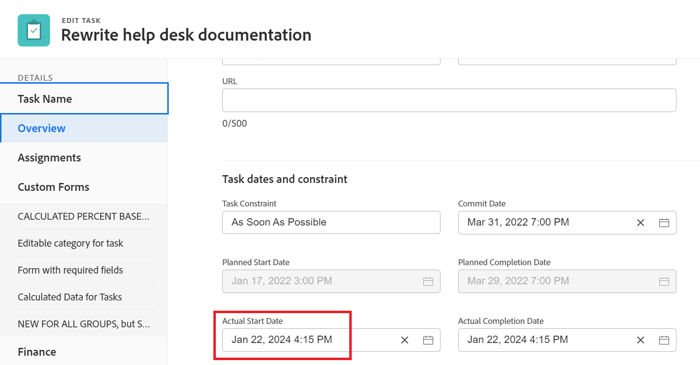

# Información general sobre las fechas del proyecto, tarea y problema en [!DNL Workfront]

<!-- Audited: 05/2024 -->

<!--

(NOTE: consider expanding on this article with ALL dates for PTIs - Hand off dates, Approval Dates, etc) 

-->

Este artículo proporciona definiciones de las fechas más comunes asociadas con proyectos, tareas y problemas en [!DNL Adobe Workfront]. Las imágenes incluidas aquí son ejemplos de dónde se muestran las fechas en Workfront y dónde no son exhaustivas. Hay otras áreas que muestran las fechas. Todas las fechas también están visibles en los informes y listas de proyectos, tareas y problemas.

Para obtener información sobre informes y listas, consulte los siguientes artículos:

* [Introducción a las listas en  [!DNL Adobe Workfront]](../../../workfront-basics/navigate-workfront/use-lists/view-items-in-a-list.md)
* [Introducción a los informes](../../../reports-and-dashboards/reports/reporting/get-started-reports-workfront.md)

Para obtener más información sobre los campos de proyecto, tarea y problema, consulte [Glosario de [!DNL Adobe Workfront] terminología](../../../workfront-basics/navigate-workfront/workfront-navigation/workfront-terminology-glossary.md).

## [!UICONTROL Fecha planificada de inicio]

La [!UICONTROL fecha planificada de inicio] es la fecha en la que se planea iniciar un proyecto, tarea o problema.

Según la [!UICONTROL Restricción de tarea], es posible que no pueda editar la [!UICONTROL Fecha planificada de inicio] de una tarea. Según el [!UICONTROL Modo de horario] del proyecto, es posible que no pueda editar la [!UICONTROL Fecha planificada de inicio] de un proyecto.

Para obtener más información, consulte [Información general sobre el proyecto [!UICONTROL Fecha planificada de inicio]](../../../manage-work/projects/planning-a-project/project-planned-start-date.md).

## [!UICONTROL Fecha planificada de finalización]

La [!UICONTROL fecha planificada de finalización] o la [!UICONTROL fecha de vencimiento el] es la fecha en la que se planea completar un proyecto, tarea o problema.

Según la [!UICONTROL Restricción de tarea], es posible que no pueda editar la [!UICONTROL Fecha planificada de finalización] de una tarea. Según el [!UICONTROL Modo de horario] del proyecto, es posible que no pueda editar la [!UICONTROL Fecha planificada de finalización] de un proyecto.

La [!UICONTROL fecha planificada de finalización] se muestra como la fecha de vencimiento en algunas áreas de [!DNL Workfront].

Para obtener más información, consulte los siguientes artículos:

* [Información general sobre la tarea [!UICONTROL Fecha planificada de finalización]](../../../manage-work/tasks/task-information/task-planned-completion-date.md)
* [Establezca el proyecto [!UICONTROL Fecha planificada de finalización]](../../../manage-work/projects/planning-a-project/project-planned-completion-date.md)
* [Información general sobre el problema [!UICONTROL Fecha planificada de finalización]](../../../manage-work/issues/issue-information/issue-planned-completion-date.md)

## [!UICONTROL Fecha de entrada]

La [!UICONTROL fecha de entrada] es la fecha en la que se creó un proyecto, tarea o problema en Workfront.

La [!UICONTROL fecha de entrada] no influye en la escala de tiempo de los proyectos, tareas o problemas, pero es importante para realizar un seguimiento y generar informes. [!DNL Workfront] genera automáticamente la [!UICONTROL fecha de entrada] cuando se crea el objeto y no se puede editar manualmente.

## [!UICONTROL Fecha real de inicio]

La [!UICONTROL fecha real de inicio] es la fecha en la que un usuario comienza a trabajar en un proyecto, tarea o problema. La [!UICONTROL fecha real de inicio] está vacía cuando se crea el proyecto, la tarea o el problema.

Puede indicar manualmente cuándo comenzó el trabajo en una tarea o un problema, o [!UICONTROL Fecha de inicio real] se rellena automáticamente cuando el estado de la tarea o el problema cambia de [!UICONTROL Nuevo] a [!UICONTROL En curso] o [!UICONTROL Completado]. La [!UICONTROL fecha real de inicio] de un proyecto coincide con la fecha en la que comienza la primera tarea del proyecto.

>[!TIP]
>
>Es posible que la [!UICONTROL fecha real de inicio] no coincida con la [!UICONTROL fecha planificada de inicio] de un proyecto, tarea o problema, ya que el usuario puede comenzar a trabajar más tarde o antes de la fecha planificada.

Para obtener más información, consulte [Información general sobre el proyecto [!UICONTROL Fecha real de inicio]](../../../manage-work/projects/planning-a-project/project-actual-start-date.md).

>[!NOTE]
>
>La tarea [!UICONTROL Debe comenzar el] o las restricciones de fechas fijas afectan a la [!UICONTROL fecha planificada de inicio] de una tarea, no a la [!UICONTROL fecha real de inicio]. Esto actualiza la [!UICONTROL Fecha planificada de inicio] a la fecha que especifique. La [!UICONTROL fecha real de inicio] se ha actualizado independientemente de la [!UICONTROL fecha planificada de inicio], tal como se ha descrito anteriormente.

## [!UICONTROL Fecha real de finalización]

La [!UICONTROL fecha real de finalización] es la fecha en la que un usuario realmente completa un proyecto, tarea o problema. La [!UICONTROL fecha real de finalización] está vacía cuando se crea el proyecto, la tarea o el problema.

Puede indicar manualmente cuándo se completa el trabajo en una tarea o un problema, o [!UICONTROL Fecha real de finalización] se rellena automáticamente cuando se produce cualquiera de las siguientes situaciones:

* El estado del proyecto, tarea o problema cambia a [!UICONTROL Completado], [!UICONTROL Cerrado] o [!UICONTROL Resuelto].
* El porcentaje completado de la tarea o del proyecto es del 100%.

La [!UICONTROL Fecha real de finalización] de un proyecto coincide con la fecha en que se completó la última tarea del proyecto.

>[!TIP]
>
>La [!UICONTROL Fecha real de finalización] puede no coincidir con la [!UICONTROL Fecha planificada de finalización].

Para obtener más información, vea [Información general sobre el proyecto [!UICONTROL Fecha real de finalización]](../../../manage-work/projects/planning-a-project/project-actual-completion-date.md).

## [!UICONTROL Fecha de confirmación]

La [!UICONTROL fecha de confirmación] es la fecha en la que un usuario asignado a una tarea o un problema se compromete a completar la tarea o el problema. Esto es diferente a la [!UICONTROL Fecha planificada de finalización], ya que es una estimación más realista de la fecha de finalización dada solamente por el usuario a cargo del trabajo. Para obtener más información, consulte [[!UICONTROL Resumen de la fecha de confirmación]](../../../manage-work/projects/updating-work-in-a-project/overview-of-commit-dates.md).

>[!NOTE]
>
>Cambiar la [!UICONTROL fecha de confirmación] afecta la [!UICONTROL fecha proyectada de finalización], pero no la [!UICONTROL fecha planificada de finalización] de una tarea o un problema. El administrador del proyecto puede usar los cambios que hace un usuario asignado en la [!UICONTROL Fecha de confirmación] para actualizar la [!UICONTROL Fecha planificada de finalización] de una tarea o un problema.

## [!UICONTROL Fecha proyectada de inicio]

La [!UICONTROL fecha proyectada de inicio] es una fecha en tiempo real de cuando comienza el proyecto, tarea o problema y tiene en cuenta todos los retrasos. Esta es una fecha de inicio del proyecto, tarea o problema más precisa que la [!UICONTROL fecha de inicio planificada]. La [!UICONTROL Fecha planificada de inicio] no tiene en cuenta los retrasos ni las fechas pasadas.

Cuando planifica un proyecto por primera vez, la [!UICONTROL Fecha planificada de inicio] y la [!UICONTROL Fecha proyectada de inicio] de las tareas y del proyecto son idénticos. Como pueden producirse retrasos o puede que las tareas se completen antes, la [!UICONTROL fecha proyectada de inicio] puede diferir de la [!UICONTROL fecha planificada de inicio].

Para una tarea, una [!UICONTROL Fecha proyectada de inicio] también puede diferir de su [!UICONTROL Fecha planificada de inicio] cuando una de sus predecesoras se está ejecutando detrás de la programación.

>[!TIP]
>
>Solo puede ver la [!UICONTROL Fecha proyectada de inicio] de un problema en una lista o informe.

Para obtener más información, consulte [Información general sobre el proyecto [!UICONTROL Fecha proyectada de inicio]](../../../manage-work/projects/planning-a-project/project-projected-start-date.md).

## [!UICONTROL Fecha proyectada de finalización]

La [!UICONTROL fecha proyectada de finalización] es un indicador calculado en tiempo real de cuándo se completará el proyecto, la tarea o el problema. Cuando el proyecto, tarea o problema se marca como Completado, la [!UICONTROL Fecha proyectada de finalización] cambia a la fecha de [!UICONTROL Fecha real de finalización].

Si todo va bien y según lo planeado, la [!UICONTROL fecha proyectada de finalización] debe coincidir con la [!UICONTROL fecha planificada de finalización]. De lo contrario, debido a los retrasos en las tareas predecesoras, la [!UICONTROL Fecha proyectada de finalización] podría diferir de la [!UICONTROL Fecha planificada de finalización].

Para obtener más información, vea [Información general sobre la [!UICONTROL fecha proyectada de finalización] para proyectos, tareas y problemas](../../../manage-work/projects/planning-a-project/project-projected-completion-date.md).

## [!UICONTROL Fecha de entrada de hora]

Cuando registra tiempo para proyectos, tareas y problemas para indicar cuánto tiempo real (en horas) dedica a trabajar en el proyecto, tarea o problema, el tiempo que registra se convierte en las [!UICONTROL Horas reales] del proyecto, tarea o problema.

La fecha para la cual se registra la hora es el campo [!UICONTROL Fecha de entrada de hora] en la entrada de hora. Algunas listas e informes de horas muestran Fecha de entrada de hora como Fecha.

>[!TIP]
>
>La [!UICONTROL fecha de entrada de hora] es diferente a la [!UICONTROL fecha de entrada], ya que no es la fecha en la que se creó el registro de horas, sino la fecha a la que desea asociar las horas.

Puede registrar y ver el tiempo en las siguientes áreas de Workfront:

* Registrar y ver el tiempo en las secciones [!UICONTROL proyecto], [!UICONTROL tarea] o [!UICONTROL actualizaciones de problemas], o en las secciones [!UICONTROL Horas]. Al registrar el tiempo en la sección [!UICONTROL Horas] , puede especificar manualmente la Fecha de entrada de hora y el usuario al que pertenecen las horas.

  

  Para obtener más información, consulte [Registrar tiempo](../../../timesheets/create-and-manage-timesheets/log-time.md).

  >[!TIP]
  >
  >Se recomienda registrar el tiempo en tareas y problemas de trabajo, en lugar de en tareas o proyectos principales. Tiempo registrado en las tareas de trabajo resumido en las tareas principales y el proyecto como [!UICONTROL Horas reales] para las tareas principales y el proyecto. Los problemas de tiempo ingresado se acumulan en el proyecto como [!UICONTROL Horas reales] para el proyecto.

* Registrar tiempo en el flujo de actualización de una tarea o problema.

  

* Ver las [!UICONTROL fechas de entrada de horas] en informes y listas de horas.

  
