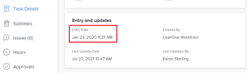

# Información general sobre las fechas del proyecto, la tarea y el problema en [!DNL Adobe Workfront]

<!--

(NOTE: consider expanding on this article with ALL dates for PTIs - Hand off dates, Approval Dates, etc) 

-->

Este artículo proporciona definiciones de las fechas más comunes asociadas con proyectos, tareas y problemas en [!DNL Adobe Workfront]. Las imágenes incluidas aquí son ejemplos de dónde se muestran las fechas en Workfront y dónde no son exhaustivas. Hay otras áreas que muestran las fechas. Todas las fechas también están visibles en los informes y listas de proyectos, tareas y problemas.

Para obtener información sobre informes y listas, consulte los siguientes artículos:

* [Introducción a las listas en [!DNL Adobe Workfront]](../../../workfront-basics/navigate-workfront/use-lists/view-items-in-a-list.md)
* [Introducción a los informes](../../../reports-and-dashboards/reports/reporting/get-started-reports-workfront.md)

Para obtener más información sobre los campos de proyecto, tarea y problema, consulte [Glosario de [!DNL Adobe Workfront] terminología](../../../workfront-basics/navigate-workfront/workfront-navigation/workfront-terminology-glossary.md).

## [!UICONTROL Fecha planificada de inicio]

El [!UICONTROL Fecha planificada de inicio] es la fecha en la que se planea el inicio de un proyecto, tarea o problema.

Según la variable [!UICONTROL Restricción de tarea], es posible que no pueda editar el [!UICONTROL Fecha planificada de inicio] de una tarea. Según la variable [!UICONTROL Modo de horario] del proyecto, es posible que no pueda editar el [!UICONTROL Fecha planificada de inicio] de un proyecto.

Para obtener más información, consulte [Información general del proyecto [!UICONTROL Fecha planificada de inicio]](../../../manage-work/projects/planning-a-project/project-planned-start-date.md).

## [!UICONTROL Fecha planificada de finalización]

El [!UICONTROL Fecha planificada de finalización] o el [!UICONTROL Vence el] fecha es la fecha en la que se planea completar un proyecto, tarea o problema.

Según la variable [!UICONTROL Restricción de tarea], es posible que no pueda editar el [!UICONTROL Fecha planificada de finalización] de una tarea. Según la variable [!UICONTROL Modo de horario] del proyecto, es posible que no pueda editar el [!UICONTROL Fecha planificada de finalización] de un proyecto.

El [!UICONTROL Fecha planificada de finalización] se muestra como Fecha de vencimiento en algunas áreas de [!DNL Workfront].

Para obtener más información, consulte los siguientes artículos:

* [Información general de la tarea [!UICONTROL Fecha planificada de finalización]](../../../manage-work/tasks/task-information/task-planned-completion-date.md)
* [Configuración del proyecto [!UICONTROL Fecha planificada de finalización]](../../../manage-work/projects/planning-a-project/project-planned-completion-date.md)
* [Información general del problema [!UICONTROL Fecha planificada de finalización]](../../../manage-work/issues/issue-information/issue-planned-completion-date.md)

## [!UICONTROL Fecha de entrada]

El [!UICONTROL Fecha de entrada] es la fecha en la que se creó un proyecto, una tarea o un problema en Workfront.

El [!UICONTROL Fecha de entrada] no influye en la cronología de los proyectos, tareas o problemas, pero es importante para realizar un seguimiento y generar informes. [!DNL Workfront] genera automáticamente el [!UICONTROL Fecha de entrada] cuando se crea el objeto y no se puede editar manualmente.

## [!UICONTROL Fecha real de inicio]

El [!UICONTROL Fecha real de inicio] es la fecha en la que un usuario comienza a trabajar en un proyecto, una tarea o un problema. El [!UICONTROL Fecha real de inicio] está vacío cuando se crea el proyecto, la tarea o el problema.

Puede indicar manualmente cuándo ha comenzado el trabajo en una tarea o un problema, o la variable [!UICONTROL Fecha real de inicio] se rellena automáticamente cuando el estado de la tarea o del problema cambia de [!UICONTROL Nuevo] hasta [!UICONTROL En curso] o [!UICONTROL Completar]. El [!UICONTROL Fecha real de inicio] de un proyecto coincide con la fecha en la que se inicia la primera tarea del proyecto.

>[!TIP]
>
>El [!UICONTROL Fecha real de inicio] puede no coincidir con un [!UICONTROL Fecha planificada de inicio] de un proyecto, tarea o problema porque el usuario puede comenzar a trabajar más tarde o antes de la fecha planificada.

Para obtener más información, consulte [Información general del proyecto [!UICONTROL Fecha real de inicio]](../../../manage-work/projects/planning-a-project/project-actual-start-date.md).

>[!NOTE]
>
>El [!UICONTROL Debe comenzar el] La tarea o las restricciones de Fechas fijas afectan a la [!UICONTROL Fecha planificada de inicio] de una tarea, no la [!UICONTROL Fecha real de inicio]. Esto actualiza el [!UICONTROL Fecha planificada de inicio] hasta la fecha que especifique. El [!UICONTROL Fecha real de inicio] se actualiza independientemente de [!UICONTROL Fecha planificada de inicio], tal como se ha descrito anteriormente.

## [!UICONTROL Fecha real de finalización]

El [!UICONTROL Fecha real de finalización] es la fecha en la que un usuario completa realmente un proyecto, una tarea o un problema. El [!UICONTROL Fecha real de finalización] está vacío cuando se crea el proyecto, la tarea o el problema.

Puede indicar manualmente cuándo se completa el trabajo en una tarea o un problema, o la variable [!UICONTROL Fecha real de finalización] se rellena automáticamente cuando se produce alguna de las siguientes acciones:

* El estado del proyecto, tarea o problema cambia a [!UICONTROL Completar], [!UICONTROL Cerrado], o [!UICONTROL Resuelto].
* El porcentaje completado de la tarea o del proyecto es del 100%.

El [!UICONTROL Fecha real de finalización] de un proyecto coincide con la fecha en la que se completa la primera tarea del proyecto.

>[!TIP]
>
>El [!UICONTROL Fecha real de finalización] puede que no coincida con el [!UICONTROL Fecha planificada de finalización].

Para obtener más información, consulte [Información general del proyecto [!UICONTROL Fecha real de finalización]](../../../manage-work/projects/planning-a-project/project-actual-completion-date.md).

## [!UICONTROL Fecha de confirmación]

El [!UICONTROL Fecha de confirmación] es la fecha en la que un usuario asignado a una tarea o un problema se compromete a completar la tarea o el problema. Esto es diferente a la [!UICONTROL Fecha planificada de finalización], ya que es una estimación más realista de la fecha de finalización dada únicamente por el usuario a cargo de la obra. Para obtener más información, consulte [[!UICONTROL Fecha de confirmación] descripción general](../../../manage-work/projects/updating-work-in-a-project/overview-of-commit-dates.md).

>[!NOTE]
>
>Cambio de la [!UICONTROL Fecha de confirmación] afecta a [!UICONTROL Fecha proyectada de finalización] pero no el [!UICONTROL Fecha planificada de finalización] de una tarea o un problema. El administrador del proyecto puede utilizar los cambios que realiza un usuario asignado en la [!UICONTROL Fecha de confirmación] para actualizar el [!UICONTROL Fecha planificada de finalización] de una tarea o un problema.

## [!UICONTROL Fecha proyectada de inicio]

El [!UICONTROL Fecha proyectada de inicio] es una fecha en tiempo real de cuándo se produjo el proyecto, la tarea o el problema y tiene en cuenta todos los retrasos. La fecha de inicio del proyecto, la tarea o el problema es más precisa que la del [!UICONTROL Fecha planificada de inicio]. El [!UICONTROL Fecha planificada de inicio] no tiene en cuenta los retrasos ni las fechas pasadas.

Cuando planifique un proyecto por primera vez, la variable [!UICONTROL Fecha planificada de inicio] y el [!UICONTROL Fecha proyectada de inicio] de las tareas y del proyecto son idénticos. Dado que pueden producirse retrasos o que las tareas pueden completarse antes, la variable [!UICONTROL Fecha proyectada de inicio] puede ser diferente a la [!UICONTROL Fecha planificada de inicio].

Para una tarea, un [!UICONTROL Fecha proyectada de inicio] también puede diferir de su [!UICONTROL Fecha planificada de inicio] cuando uno de sus predecesores se está ejecutando detrás de la programación.

>[!TIP]
>
>Puede ver el [!UICONTROL Fecha proyectada de inicio] de un problema solo en una lista o informe.

Para obtener más información, consulte [Información general del proyecto [!UICONTROL Fecha proyectada de inicio]](../../../manage-work/projects/planning-a-project/project-projected-start-date.md).

## P[!UICONTROL Fecha proyectada de finalización]

El [!UICONTROL Fecha proyectada de finalización] es un indicador calculado en tiempo real de cuándo se completará el proyecto, la tarea o el problema. Cuando el proyecto, tarea o problema se marca como Completado, la variable [!UICONTROL Fecha proyectada de finalización] cambios en la fecha del [!UICONTROL Fecha real de finalización].

Si todo va bien y según lo planificado, la [!UICONTROL Fecha proyectada de finalización] debe coincidir con el [!UICONTROL Fecha planificada de finalización]. De lo contrario, debido a los retrasos en las tareas predecesoras, la [!UICONTROL Fecha proyectada de finalización] podría diferir de la variable [!UICONTROL Fecha planificada de finalización].

Para obtener más información, consulte [Descripción general de [!UICONTROL Fecha proyectada de finalización] para proyectos, tareas y problemas](../../../manage-work/projects/planning-a-project/project-projected-completion-date.md).

## [!UICONTROL Fecha de entrada de hora]

Cuando registra tiempo para proyectos, tareas y problemas para indicar cuánto tiempo real (en horas) dedica a trabajar en el proyecto, tarea o problema, el tiempo que registra se convierte en el [!UICONTROL Horas reales] del proyecto, tarea o problema.

La fecha de registro de la hora es la [!UICONTROL Fecha de entrada de hora] en la entrada de horas.

>[!TIP]
>
>El [!UICONTROL Fecha de entrada de hora] es diferente a la [!UICONTROL Fecha de entrada] en el sentido de que no es la fecha en la que se creó el registro de horas, sino la fecha a la que desea asociar las horas.

Puede registrar el tiempo en [!UICONTROL proyecto], [!UICONTROL tarea], o [!UICONTROL Actualizaciones de problemas] o en la sección [!UICONTROL Horas] sección . Al registrar el tiempo en [!UICONTROL Horas] , puede especificar manualmente la fecha de entrada de hora y el usuario al que pertenecen las horas.

Para obtener más información, consulte [Registrar tiempo](../../../timesheets/create-and-manage-timesheets/log-time.md).

>[!TIP]
>
>Se recomienda registrar el tiempo en tareas y problemas de trabajo, en lugar de en tareas o proyectos principales. Tiempo registrado en las tareas de trabajo resumido en las tareas principales y el proyecto como [!UICONTROL Horas reales] para las tareas principales y el proyecto. Los problemas de tiempo iniciado se acumulan en el proyecto como [!UICONTROL Horas reales] para el proyecto.

Puede ver el [!UICONTROL Fechas de entrada de hora] en informes y listas de horas.

