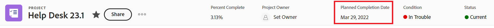

# Información general sobre las fechas del proyecto, tarea y problema en [!DNL Workfront]

<!-- Audited: 05/2024 -->

<!--consider expanding on this article with ALL dates for PTIs - Hand off dates, Approval Dates, etc-->

<!-- there are dates below that need definition - ask Product-->

Este artículo proporciona definiciones de las fechas más comunes asociadas con proyectos, tareas y problemas en [!DNL Adobe Workfront]. Las imágenes incluidas aquí son ejemplos de dónde se muestran las fechas en Workfront y dónde no son exhaustivas. Hay otras áreas que muestran las fechas. Todas las fechas también están visibles en los informes y listas de proyectos, tareas y problemas.

Para obtener información sobre informes y listas, consulte los siguientes artículos:

* [Introducción a las listas en  [!DNL Adobe Workfront]](../../../workfront-basics/navigate-workfront/use-lists/view-items-in-a-list.md)
* [Introducción a los informes](../../../reports-and-dashboards/reports/reporting/get-started-reports-workfront.md)

Para obtener más información sobre los campos de proyecto, tarea y problema, consulte [Glosario de [!DNL Adobe Workfront] terminología](../../../workfront-basics/navigate-workfront/workfront-navigation/workfront-terminology-glossary.md).

## [!UICONTROL Fecha real de inicio]

La [!UICONTROL fecha real de inicio] es la fecha en la que un usuario comienza a trabajar en un proyecto, tarea o problema. La [!UICONTROL fecha real de inicio] está vacía cuando se crea el proyecto, la tarea o el problema.

Puede indicar manualmente cuándo comenzó el trabajo en una tarea o un problema, o [!UICONTROL Fecha de inicio real] se rellena automáticamente cuando el estado de la tarea o el problema cambia de [!UICONTROL Nuevo] a [!UICONTROL En curso] o [!UICONTROL Completado]. La [!UICONTROL fecha real de inicio] de un proyecto coincide con la fecha en la que comienza la primera tarea del proyecto.

>[!TIP]
>
>Es posible que la [!UICONTROL fecha real de inicio] no coincida con la [!UICONTROL fecha planificada de inicio] de un proyecto, tarea o problema, ya que el usuario puede comenzar a trabajar más tarde o antes de la fecha planificada.

Para obtener más información, consulte [Información general sobre el proyecto [!UICONTROL Fecha real de inicio]](../../../manage-work/projects/planning-a-project/project-actual-start-date.md).

>[!NOTE]
>
>La tarea [!UICONTROL Debe comenzar el] o las restricciones de fechas fijas afectan a la [!UICONTROL fecha planificada de inicio] de una tarea, no a la [!UICONTROL fecha real de inicio]. Esto actualiza la [!UICONTROL Fecha planificada de inicio] a la fecha que especifique. La [!UICONTROL fecha real de inicio] se ha actualizado independientemente de la [!UICONTROL fecha planificada de inicio], tal como se ha descrito anteriormente.

## [!UICONTROL Fecha real de finalización]

La [!UICONTROL fecha real de finalización] es la fecha en la que un usuario realmente completa un proyecto, tarea o problema. La [!UICONTROL fecha real de finalización] está vacía cuando se crea el proyecto, la tarea o el problema.

Puede indicar manualmente cuándo se completa el trabajo en una tarea o un problema, o [!UICONTROL Fecha real de finalización] se rellena automáticamente cuando se produce cualquiera de las siguientes situaciones:

* El estado del proyecto, tarea o problema cambia a [!UICONTROL Completado], [!UICONTROL Cerrado] o [!UICONTROL Resuelto].
* El porcentaje completado de la tarea o del proyecto es del 100%.

La [!UICONTROL Fecha real de finalización] de un proyecto coincide con la fecha en que se completó la última tarea del proyecto.

>[!TIP]
>
>La [!UICONTROL Fecha real de finalización] puede no coincidir con la [!UICONTROL Fecha planificada de finalización].

Para obtener más información, vea [Información general sobre el proyecto [!UICONTROL Fecha real de finalización]](../../../manage-work/projects/planning-a-project/project-actual-completion-date.md).

## Fecha de finalización de ruta de aprobación

La fecha de finalización de la ruta de aprobación es la fecha en la que se concedió la aprobación de un proyecto, tarea o problema y se cambió el estado del elemento.

La fecha de finalización de la ruta de aprobación es visible en las listas de proyectos, tareas y problemas y en los informes.

## Fecha de inicio de ruta de aprobación

La fecha de inicio de la ruta de aprobación es la fecha en la que el estado del proyecto, tarea o problema cambió a Pendiente de aprobación y la solicitud de aprobación del proyecto se envió a los aprobadores.

La fecha de inicio de la ruta de aprobación es visible en las listas de proyectos, tareas y problemas y en los informes.

<!--## Auto Closure Date -->

## Fecha de finalización estimada

Este es un campo obsoleto para proyectos. Cualquier información que este campo pueda mostrar en una lista o informe está relacionada con una función que Workfront ha eliminado. Este campo no se puede actualizar.

El campo es visible en los informes y listas de proyectos.

## Fecha de inicio estimada

Este es un campo obsoleto para proyectos. Cualquier información que este campo pueda mostrar está relacionada con una función que Workfront ha eliminado. Este campo no se puede actualizar.

El campo es visible en los informes y listas de proyectos.

## [!UICONTROL Fecha de confirmación]

La [!UICONTROL fecha de confirmación] es la fecha en la que un usuario asignado a una tarea o un problema se compromete a completar la tarea o el problema. Esto es diferente a la [!UICONTROL Fecha planificada de finalización], ya que es una estimación más realista de la fecha de finalización dada solamente por el usuario a cargo del trabajo. Para obtener más información, consulte [[!UICONTROL Resumen de la fecha de confirmación]](../../../manage-work/projects/updating-work-in-a-project/overview-of-commit-dates.md).

>[!NOTE]
>
>Cambiar la [!UICONTROL fecha de confirmación] afecta la [!UICONTROL fecha proyectada de finalización], pero no la [!UICONTROL fecha planificada de finalización] de una tarea o un problema. El administrador del proyecto puede usar los cambios que hace un usuario asignado en la [!UICONTROL Fecha de confirmación] para actualizar la [!UICONTROL Fecha planificada de finalización] de una tarea o un problema.

<!--## Completion Pending Date-->

## Fecha de restricción

Si utiliza una delimitación de tarea vinculada a una fecha específica, esa fecha específica se convierte en la fecha de delimitación de la tarea.

Las siguientes delimitaciones de tareas actualizan el campo Fecha de delimitación:

* Debe iniciarse el
* Debe finalizarse el
* No iniciar después del
* No iniciar antes del

>[!TIP]
>
>Una tarea con una restricción de fechas fijas no tiene fecha de restricción.
>

La fecha de restricción está visible en una lista de tareas o en un informe.

## Fecha de entrada de problema convertido

La fecha en la que se creó el problema convertido en proyecto o en tarea.

La fecha de entrada de problema convertido es visible en las listas e informes de proyectos y tareas.

## Fecha de vencimiento

La fecha en la que se debe completar una tarea o un problema. La fecha de vencimiento de una tarea o problema es la misma fecha que la fecha planificada de finalización.

La fecha de vencimiento de la tarea y el problema se puede ver en las listas y los informes de tareas y problemas.

Para obtener más información, consulte la sección [Fecha planificada de finalización](#planned-completion-date) en este artículo.

## Se vence el

La fecha en la que el proyecto debe completarse. La fecha de vencimiento de un proyecto es la misma fecha que la fecha planificada de finalización del proyecto.

La fecha de vencimiento del proyecto está visible en las listas de proyectos y en los informes.

Para obtener más información, consulte la sección [Fecha planificada de finalización](#planned-completion-date) en este artículo.

## [!UICONTROL Fecha de entrada]

La [!UICONTROL fecha de entrada] es la fecha en la que se creó un proyecto, tarea o problema en [!DNL Workfront].

La [!UICONTROL fecha de entrada] no influye en la escala de tiempo de los proyectos, tareas o problemas, pero es importante para realizar un seguimiento y generar informes. [!DNL Workfront] genera automáticamente la [!UICONTROL fecha de entrada] cuando se crea el objeto y no se puede editar manualmente.

## Fecha de vencimiento estimada

La fecha de vencimiento estimada de la tarea y el proyecto muestran una fecha más realista de cuándo se debe completar el proyecto o la tarea.

Las fechas estimadas están más en línea con la realidad del proyecto y la tarea, ya que tienen en cuenta lo que influye en la finalización real del proyecto o la tarea. Las fechas de vencimiento estimadas son similares a las fechas de finalización proyectadas.

Para obtener más información, consulte [Información general sobre fechas proyectadas y estimadas](/help/quicksilver/manage-work/tasks/task-information/differentiate-projected-estimated-dates.md).

Las fechas de vencimiento estimadas de proyectos y tareas se pueden ver en las listas e informes de proyectos y tareas.

## Fecha estimada de inicio

La fecha estimada de inicio de la tarea y el proyecto muestran una fecha más realista de cuándo podría comenzar el proyecto o la tarea.

Las fechas estimadas están más en línea con la realidad del proyecto y la tarea, ya que tienen en cuenta lo que influye en el inicio real del proyecto o la tarea. Las fechas de inicio estimadas son similares a las fechas de inicio proyectadas.

Para obtener más información, consulte [Información general sobre fechas proyectadas y estimadas](/help/quicksilver/manage-work/tasks/task-information/differentiate-projected-estimated-dates.md).

Las fechas de inicio estimadas del proyecto y la tarea están visibles en las listas e informes de proyectos y tareas.

<!--## Exchange Rate Date-->

## Fecha de finalización fija

El solicitante o propietario del proyecto identifica la fecha de finalización fija de un proyecto al completar el caso empresarial. Es la fecha en la que recomiendan que el proyecto debe completarse.

Se trata de una estimación manual y no tiene en cuenta el progreso real de las tareas en el proyecto.

La fecha de finalización fija de un proyecto está visible en la sección de caso comercial del proyecto, así como en las listas de proyectos y los informes.

## Fecha de inicio fija

El solicitante o propietario del proyecto identifica la fecha de inicio fija de un proyecto al completar el caso empresarial. Es la fecha en la que recomiendan que se inicie el proyecto.

Se trata de una estimación manual y no tiene en cuenta el progreso real de las tareas en el proyecto.

La fecha de inicio fija de un proyecto se puede ver en la sección de caso comercial del proyecto, así como en las listas de proyectos y en los informes.

## Fecha de transferencia

La fecha en la que una tarea está disponible para trabajar. Esto significa que se han completado todas las restricciones, aprobaciones y dependencias y los usuarios pueden empezar a trabajar en la tarea.

La fecha de transferencia es un cálculo y no se puede establecer manualmente.

Para obtener más información sobre la fecha de entrega, consulte [Resumen de la fecha de entrega de la tarea](/help/quicksilver/manage-work/tasks/task-information/handoff-task-date.md).

La fecha de entrega de una tarea es visible en las listas de tareas y en los informes.

## Fecha de última actualización de finanzas

La fecha en la que se actualizó cualquier información financiera de un proyecto. Esto incluye la actualización de los campos financieros en la sección Finanzas o en la sección Caso comercial del proyecto.

La fecha de la última actualización de finanzas está visible en las listas de proyectos y en los informes.

## Fecha de última actualización

La fecha en la que se actualizó el proyecto, la tarea o el problema por última vez. Una actualización se considera cualquier cambio que pone en déclencheur un proyecto, una tarea o un problema para su guardado. Esto incluye cambios de estado, condición, cronología, finanzas o cualquier otro campo.

La fecha de última actualización está visible en las listas de proyectos, tareas y problemas y en los informes.

## [!UICONTROL Fecha de entrada de hora]

Cuando registra tiempo para proyectos, tareas y problemas para indicar cuánto tiempo real (en horas) dedica a trabajar en el proyecto, tarea o problema, el tiempo que registra se convierte en las [!UICONTROL Horas reales] del proyecto, tarea o problema.

La fecha para la cual se registra la hora es el campo [!UICONTROL Fecha de entrada de hora] en la entrada de hora.

La fecha de entrada de hora está visible en las listas de horas y en los informes.

>[!TIP]
>
>La [!UICONTROL fecha de entrada] de una hora es diferente a la [!UICONTROL fecha de entrada] de otro objeto de Workfront, ya que no es la fecha en la que se creó el registro de horas, sino la fecha con la que desea que se asocien las horas.
>
>Por ejemplo, puede registrar horas para una tarea el 5 de septiembre, pero asociarlas al 1 de septiembre. La fecha de entrada de la hora es el 1 de septiembre.

Para obtener información acerca de cómo registrar tiempo en Workfront, vea [Registrar tiempo](../../../timesheets/create-and-manage-timesheets/log-time.md).

>[!TIP]
>
>Se recomienda registrar el tiempo en tareas y problemas de trabajo, en lugar de en tareas o proyectos principales. Tiempo registrado en las tareas de trabajo resumido en las tareas principales y el proyecto como [!UICONTROL Horas reales] para las tareas principales y el proyecto. Los problemas de tiempo ingresado se acumulan en el proyecto como [!UICONTROL Horas reales] para el proyecto.

## [!UICONTROL Fecha planificada de finalización]

La [!UICONTROL fecha planificada de finalización] o la [!UICONTROL fecha de vencimiento el] es la fecha en la que se planea completar un proyecto, tarea o problema.

Según la [!UICONTROL Restricción de tarea], es posible que no pueda editar la [!UICONTROL Fecha planificada de finalización] de una tarea. Según el [!UICONTROL Modo de horario] del proyecto, es posible que no pueda editar la [!UICONTROL Fecha planificada de finalización] de un proyecto.

La [!UICONTROL fecha planificada de finalización] se muestra como la fecha de vencimiento en algunas áreas de [!DNL Workfront].

Para obtener más información, consulte los siguientes artículos:

* [Información general sobre la tarea [!UICONTROL Fecha planificada de finalización]](../../../manage-work/tasks/task-information/task-planned-completion-date.md)
* [Establezca el proyecto [!UICONTROL Fecha planificada de finalización]](../../../manage-work/projects/planning-a-project/project-planned-completion-date.md)
* [Información general sobre el problema [!UICONTROL Fecha planificada de finalización]](../../../manage-work/issues/issue-information/issue-planned-completion-date.md)

## Alineación de fechas planificada

Este es un indicador automático de que Workfront asigna proyectos, tareas y problemas para mostrar cuándo se completará un elemento en relación con su fecha planificada de finalización.

Los siguientes son valores posibles para el indicador Alineación de fechas planificada:

* Se terminará en la fecha planificada de finalización
* Se terminará antes de la fecha planificada de finalización
* Se terminará después de la fecha planificada de finalización

La alineación de fechas planificada es visible en las listas de proyectos, tareas y problemas y en los informes.

## [!UICONTROL Fecha planificada de inicio]

La [!UICONTROL fecha planificada de inicio] es la fecha en la que se planea iniciar un proyecto, tarea o problema.

Según la [!UICONTROL Restricción de tarea], es posible que no pueda editar la [!UICONTROL Fecha planificada de inicio] de una tarea. Según el [!UICONTROL Modo de horario] del proyecto, es posible que no pueda editar la [!UICONTROL Fecha planificada de inicio] de un proyecto.

Para obtener más información, consulte [Información general sobre el proyecto [!UICONTROL Fecha planificada de inicio]](../../../manage-work/projects/planning-a-project/project-planned-start-date.md).

## [!UICONTROL Fecha proyectada de finalización]

La [!UICONTROL fecha proyectada de finalización] es un indicador calculado en tiempo real de cuándo se completará el proyecto, la tarea o el problema. Cuando el proyecto, tarea o problema se marca como Completado, la [!UICONTROL Fecha proyectada de finalización] cambia a la fecha de [!UICONTROL Fecha real de finalización].

Si todo va bien y según lo planeado, la [!UICONTROL fecha proyectada de finalización] debe coincidir con la [!UICONTROL fecha planificada de finalización]. De lo contrario, debido a los retrasos en las tareas predecesoras, la [!UICONTROL Fecha proyectada de finalización] podría diferir de la [!UICONTROL Fecha planificada de finalización].

Para obtener más información, vea [Información general sobre la [!UICONTROL fecha proyectada de finalización] para proyectos, tareas y problemas](../../../manage-work/projects/planning-a-project/project-projected-completion-date.md).

## [!UICONTROL Fecha proyectada de inicio]

La [!UICONTROL fecha proyectada de inicio] es una fecha en tiempo real de cuando comienza el proyecto, tarea o problema y tiene en cuenta todos los retrasos. Esta es una fecha de inicio del proyecto, tarea o problema más precisa que la [!UICONTROL fecha de inicio planificada]. La [!UICONTROL Fecha planificada de inicio] no tiene en cuenta los retrasos ni las fechas pasadas.

Cuando planifica un proyecto por primera vez, la [!UICONTROL Fecha planificada de inicio] y la [!UICONTROL Fecha proyectada de inicio] de las tareas y del proyecto son idénticos. Como pueden producirse retrasos o puede que las tareas se completen antes, la [!UICONTROL fecha proyectada de inicio] puede diferir de la [!UICONTROL fecha planificada de inicio].

Para una tarea, una [!UICONTROL Fecha proyectada de inicio] también puede diferir de su [!UICONTROL Fecha planificada de inicio] cuando una de sus predecesoras se está ejecutando detrás de la programación.

>[!TIP]
>
>Solo puede ver la [!UICONTROL Fecha proyectada de inicio] de un problema en una lista o informe.

Para obtener más información, consulte [Información general sobre el proyecto [!UICONTROL Fecha proyectada de inicio]](../../../manage-work/projects/planning-a-project/project-projected-start-date.md).

<!--## Rejection Date-->

## Fecha de demora

Las tareas a veces pueden comenzar y completarse tarde sin afectar a la fecha de finalización del proyecto.

La fecha de Slack muestra la fecha exacta en la que una tarea podría afectar definitivamente a la fecha de finalización del proyecto.

Para obtener información sobre la fecha de Slack de una tarea, consulte [Resumen de la fecha de Slack de la tarea](/help/quicksilver/manage-work/tasks/task-information/task-slack-date.md).

Las fechas del Slack de tareas están visibles en las listas de tareas y en los informes.

## Comenzar el

La fecha en la que se planea iniciar el proyecto. La fecha de inicio de un proyecto es la misma fecha que la fecha de inicio planificada del proyecto.

Este campo está visible en las listas de proyectos y en los informes.

Para obtener más información, consulte la sección [Fecha planificada de inicio](#planned-start-date) en este artículo.

