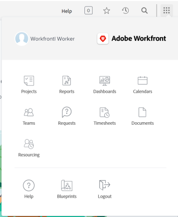

# Comprender la navegación para un [!UICONTROL Trabajo]-usuario de licencia

El [!UICONTROL Menú principal] cambios con el nivel de acceso que le ha asignado su [!DNL Adobe Workfront] administrador. De forma predeterminada, solo se le da acceso a las áreas que incluyen la funcionalidad permitida por su nivel de acceso. Para comprender los componentes del diseño predeterminado de cada nivel de acceso, consulte [Acerca del valor predeterminado [!DNL Adobe Workfront] layout](../../../administration-and-setup/customize-workfront/use-layout-templates/about-the-default-wf-layout.md).

## Comprender los valores predeterminados [!UICONTROL Menú principal] de un trabajador

As a [!UICONTROL Trabajador], su principal responsabilidad es completar el trabajo. Las áreas en la [!UICONTROL Menú principal] que son visibles para usted y le permiten hacerlo.

El diseño predeterminado de un entorno incluye las siguientes áreas [!UICONTROL Trabajador]:

* **[!UICONTROL Inicio]**: Las tareas y problemas asignados a usted se muestran aquí. Esta es la página de aterrizaje predeterminada de un trabajador; sin embargo, no aparece en la [!UICONTROL Menú principal] a menos que un administrador de Workfront lo añada a la plantilla de diseño  Para obtener más información, consulte [Introducción a [!UICONTROL Inicio]](../../../workfront-basics/using-home/using-the-home-area/get-started-with-home.md).

* **[!UICONTROL Proyectos]**: Los proyectos compartidos con usted se muestran aquí. Para obtener más información, consulte [Proyectos: índice de artículos](../../../manage-work/projects/projects-overview.md).

* **[!UICONTROL Informes]**: Aquí se muestran los informes que se han compartido con usted. Para obtener más información, consulte [Informes](../../../reports-and-dashboards/reports/reports-overview.md).

* **[!UICONTROL Paneles]**: Aquí se muestran los paneles que se comparten con usted. Para obtener más información, consulte [Paneles](../../../reports-and-dashboards/dashboards/dashboards-overview.md).

* **[!UICONTROL Calendarios]**: Aquí se muestran los calendarios compartidos con usted. Para obtener más información, consulte [Calendarios: índice de artículos](../../../reports-and-dashboards/reports/calendars/calendars.md).

* **[!UICONTROL Equipos]**: Las tareas y los problemas asignados a sus equipos se muestran en esta área. Como trabajador, usted es el único [!DNL Workfront] usuario que ve el [!UICONTROL Equipos] de forma predeterminada.

  Para obtener más información, consulte [Creación y administración de equipos](../../../people-teams-and-groups/create-and-manage-teams/create-and-mange-teams.md).

* **[!UICONTROL Solicitudes]**: puede enviar solicitudes y revisar las solicitudes que usted o los integrantes del equipo hayan enviado aquí. Para obtener más información, consulte [Solicitudes](../../../manage-work/requests/requests-overview.md).

* **[!UICONTROL Plantillas de horas]**: Puede acceder a sus plantillas de horas actuales, futuras o antiguas aquí. Para obtener más información, consulte [Plantillas de horas: índice de artículos](../../../timesheets/timesheets-all.md).

* **[!UICONTROL Documentos]**: puede cargar documentos o revisar los documentos compartidos con usted aquí. Para obtener más información, consulte [Documentos](../../../documents/documents-overview.md).

* **[!UICONTROL Recursos]**: puede ver la asignación de recursos en las herramientas de planificación de recursos y ver los conjuntos de recursos aquí. Para obtener más información, consulte [Administración de recursos](../../../resource-mgmt/manage-resources.md).

* **[!UICONTROL Analytics]**: Examine los datos del proyecto e identifique las tendencias con la planificación y la finalización. Esta área muestra información sobre los proyectos que puede ver. Para obtener más información, consulte [Resumen de análisis mejorado](../../../enhanced-analytics/enhanced-analytics-overview.md).

* **[!UICONTROL Tableros]**: trabaje con flexibilidad y colaboración con los integrantes del equipo mediante tableros compartidos que contengan columnas y tarjetas que reflejen el trabajo que desea realizar. Para obtener más información, consulte [Introducción a tableros: índice de artículos](../../../agile/get-started-with-boards/get-started-with-boards.md).

* **[!UICONTROL Modelos]**: revise los modelos existentes en el sistema y solicite que se instale uno, si la variable [!DNL Workfront] El administrador configuró la cola de solicitudes para los modelos. Para obtener más información, consulte [Información general de modelos](../../../administration-and-setup/blueprints/blueprints-overview.md).

## Personalizar los valores predeterminados [!UICONTROL Menú principal]

Su [!DNL Workfront] El administrador de puede modificar su [!DNL Workfront] diseño predeterminado al asignarle una plantilla de diseño. Para obtener más información sobre cómo trabajar con plantillas de diseño, consulte  [Personalización de [!UICONTROL Menú principal] uso de una plantilla de diseño](../../../administration-and-setup/customize-workfront/use-layout-templates/customize-main-menu.md).
