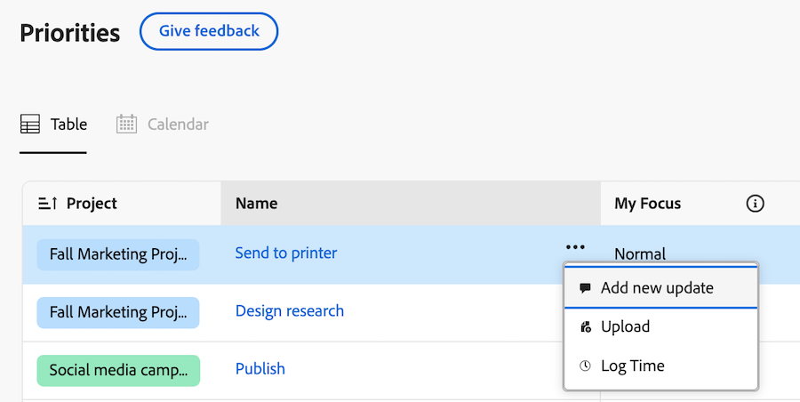
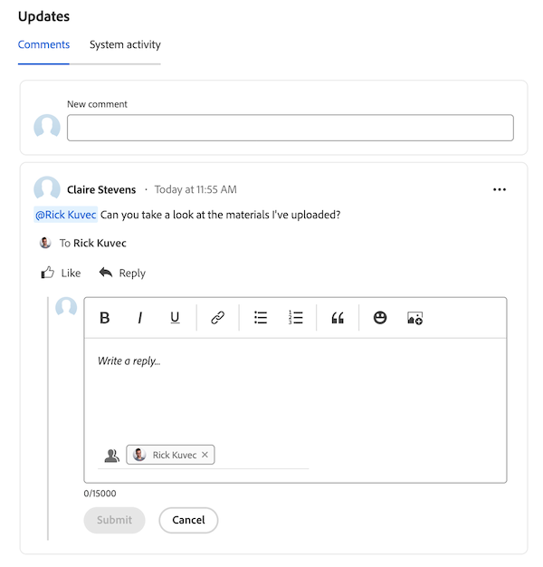

# Agregar y ver comentarios en Prioridades

Puede agregar una actualización a una tarea o un problema para comunicar a otros el progreso del elemento de trabajo.

Prioridades muestra los elementos de trabajo que tiene asignados. No puede ver los elementos de trabajo asignados a su equipo.

## Requisitos de acceso

+++ Expanda para ver los requisitos de acceso para la funcionalidad en este artículo.

Debe tener el siguiente acceso para realizar los pasos de este artículo:

<table style="table-layout:auto"> 
 <col> 
 </col> 
 <col> 
 </col> 
 <tbody> 
  <tr> 
   <td role="rowheader"><strong>Plan de Adobe Workfront</strong></td> 
   <td> 
Cualquiera
 </td> 
  </tr> 
  <tr> 
   <td role="rowheader"><strong>Licencia de Adobe Workfront*</strong></td> 
   <td> 
   
Actual: Solicitud o superior para problemas <!--and documents-->; Revisar o superior para todos los demás objetos

   
Nuevo: Colaborador o superior para problemas <!--and documents-->: Ligero o superior para todos los demás objetos
 
   </td> 
  </tr> 
  <tr> 
   <td role="rowheader"><strong>Configuraciones de nivel de acceso</strong></td> 
   <td> 
Acceso de visualización o edición para el objeto en el que se encuentra la actualización
</td> 
  </tr> 
  <tr> 
   <td role="rowheader"><strong>Permisos de objeto</strong></td> 
   <td> 
Acceso de visualización al objeto
</td> 
  </tr> 
 </tbody> 
</table>

*Para obtener más información, consulte [Requisitos de acceso en la documentación de Workfront](/help/quicksilver/administration-and-setup/add-users/access-levels-and-object-permissions/access-level-requirements-in-documentation.md).

+++

## Añadir un comentario rápido

Puede añadir un comentario desde la lista de trabajo:

{{step1-to-priorities}}

1. Busque el elemento de trabajo que desea actualizar.
1. Pase el ratón sobre el nombre y luego haga clic en **Agregar nueva actualización**.
   
   <!--new screen for prod -->
1. Empiece a escribir el comentario.
1. (Opcional) En el cuadro **Etiquetar personas o equipos**, empiece a escribir el nombre o el correo electrónico de un usuario o equipo que desee incluir en este comentario y, a continuación, selecciónelo cuando se muestre en la lista.
1. (Opcional) Utilice las opciones de la barra de herramientas Texto enriquecido para dar formato al texto, agregar emojis, vínculos o imágenes al comentario para mejorar el contenido.
1. Haga clic en **Enviar** para agregar el comentario al elemento de trabajo.

   >[!IMPORTANT]
   >
   >Solo puede editar su comentario en los 15 minutos siguientes al envío. Para editar un comentario, haga clic en el menú **Más** en la esquina superior derecha del comentario y luego haga clic en **Editar**.

Para obtener información más detallada sobre cómo agregar actualizaciones, consulte [Agregar una actualización a un elemento de trabajo](/help/quicksilver/workfront-basics/updating-work-items-and-viewing-updates/update-work.md).

## Ver y agregar comentarios y actualizaciones del sistema en un elemento de trabajo

Puede agregar comentarios y ver comentarios y actualizaciones del sistema en un elemento de trabajo individual:

{{step1-to-priorities}}

1. Haga clic en el nombre de un elemento de trabajo para abrir la página **Información general**.
1. Busque el área **Updates** en la esquina inferior derecha de la pantalla.
1. (Opcional) Use la ficha **Comentarios** para actualizar los comentarios de otros usuarios sobre el elemento de trabajo.
1. (Opcional) Use la ficha **Actividad del sistema** para ver la actividad del sistema relacionada con el elemento de trabajo.
1. (Opcional) Para agregar un comentario, vaya a la ficha **Comentario** y empiece a escribir en el cuadro Nuevo comentario. Haga clic en **Enviar** cuando haya terminado.
   

## Responder a un comentario

Puede responder a un comentario de un elemento de trabajo:

{{step1-to-priorities}}

1. Haga clic en el nombre de un elemento de trabajo para abrir la página **Información general**.
1. Busque el área **Updates** en la esquina inferior derecha de la pantalla.
1. En la ficha **Comentarios**, busque el comentario al que desee responder y, a continuación, haga clic en **Responder**.
1. (Condicional) Si desea responder para incluir el contenido de un mensaje en su respuesta, haga clic en el icono de menú **Más**  situado junto al cuerpo del mensaje y elija **Citar respuesta**.

1. Escriba su respuesta y haga clic en **Enviar**.

   >[!IMPORTANT]
   >
   >Solo puede editar su comentario en los 15 minutos siguientes al envío. Para editar un comentario, haga clic en el menú Más en la esquina superior derecha del comentario y, a continuación, haga clic en Editar.

   
