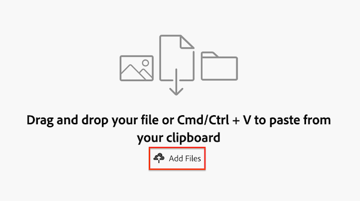

# Cargar documentos y crear pruebas en Prioridades

Puede cargar documentos y crear pruebas en Prioridades.

Prioridades muestra los elementos de trabajo que tiene asignados. No puede ver los elementos de trabajo asignados a su equipo.

## Requisitos de acceso

+++ Expanda para ver los requisitos de acceso para la funcionalidad en este artículo.

<table style="table-layout:auto"> 
 <col> 
 <col> 
 <tbody> 
  <tr> 
   <td role="rowheader">Paquete de Adobe Workfront</td> 
   <td> 
   
Cualquiera

   </td> 
  </tr> 
  <tr> 
   <td role="rowheader">Licencia de Adobe Workfront</td> 
   <td> 
   
Colaborador o superior para cargar documentos; Estándar para crear pruebas

   
Solicitud o superior para cargar documentos; Trabaje o superior para crear pruebas

   </td> 
  </tr> 
  <tr> 
   <td role="rowheader">Perfil de permiso de prueba </td> 
   <td>Administrador o superior</td> 
  </tr> 
  <tr> 
   <td role="rowheader">Configuraciones de nivel de acceso</td> 
   <td> 
Acceso de edición a documentos
 </td> 
  </tr> 
 </tbody> 
</table>

Para obtener más información sobre esta tabla, consulte [Requisitos de acceso en la documentación de Workfront](/help/quicksilver/administration-and-setup/add-users/access-levels-and-object-permissions/access-level-requirements-in-documentation.md).

+++

## Cargar un documento en un elemento de trabajo

Puede cargar un documento en un elemento de trabajo desde la lista de trabajo o desde la página Detalles del elemento de trabajo.

### Panel de resumen de Worklist

{{step1-to-priorities}}

1. En la lista de trabajo, pase el ratón sobre el nombre del trabajo y haga clic en **Icono de resumen** .
1. Asegúrese de que se encuentra en la ficha **Tarea** o **Problemas** del panel de resumen.
1. Haga clic en el icono **Cargar archivo** .
1. Arrastre y suelte el archivo o utilice Cmd/Ctrl + V para pegar elementos desde el portapapeles
o
Haga clic en **Agregar archivos** para examinar archivos o importarlos de un proveedor de Document Cloud.
   
1. (Opcional) Añada un comentario.
1. (Opcional) Añada más archivos.

   >[!NOTE]
   >
   >Los archivos adicionales se cargan como documentos independientes.
1. Haga clic en **Cargar**

### Detalles del elemento de trabajo

{{step1-to-priorities}}

1. En la lista de trabajos, haga clic en el nombre del elemento de trabajo.
1. Haga clic en la ficha **Documentos** en la parte superior de la pantalla.
1. Haga clic en **Cargar documento** en la esquina superior derecha y, a continuación, seleccione **Documento**.
1. Arrastre y suelte el archivo o utilice Cmd/Ctrl + V para pegar elementos desde el portapapeles
o
Haga clic en **Agregar archivos** para examinar archivos o importarlos de un proveedor de Document Cloud.
   
1. (Opcional) Añada un comentario.
1. (Opcional) Añada más archivos.

   >[!NOTE]
   >
   >Los archivos adicionales se cargan como documentos independientes.
1. Haga clic en **Cargar**

## Creación de una prueba sencilla o avanzada

Puede crear una prueba a partir de un documento desde la lista de trabajos o desde la página Detalles del elemento de trabajo.

### Panel de resumen de Worklist

{{step1-to-priorities}}

1. En la lista de trabajo, pase el ratón sobre el nombre del trabajo y haga clic en **Icono de resumen** .
1. Asegúrese de que se encuentra en la ficha **Tarea** o **Problemas** del panel de resumen.
1. Haga clic en el icono **Documentos**  en el carril derecho.
1. Haga clic en el icono **Cargar archivo**  y, a continuación, elija el archivo.

   >[!NOTE]
   >
   >Debe cargar el documento para poder crear la prueba.

1. Una vez que se cargue el archivo, selecciónelo en la sección **Documentos**.
1. Haga clic en **Crear revisión** en la esquina superior derecha del cuadro de detalles del archivo.
1. Seleccione una de las siguientes opciones:

   <table style="table-layout:auto"> 
    <col> 
    <col> 
    <tbody> 
     <tr> 
      <td role="rowheader"><b>Prueba sencilla</b></td> 
      <td>Esta opción crea una prueba sin flujo de trabajo adjunto y aplica la configuración de prueba predeterminada. Puede actualizar la configuración de prueba predeterminada o agregar un flujo de trabajo después de crear la prueba. Para obtener más información sobre la configuración de la prueba, consulte <a href="/help/quicksilver/review-and-approve-work/proofing/managing-proofs-within-workfront/edit-proof-settings.md" class="MCXref xref">Editar configuración de prueba</a>.</td> 
     </tr> 
     <tr> 
      <td role="rowheader"><b>Prueba avanzada</b></td> 
      <td> 
Esta opción le permite configurar un flujo de trabajo Básico o Avanzado y modificar la configuración de prueba de la prueba que cree. Para obtener más información, consulte 
 
       <ul> 
        <li>
<a href="/help/quicksilver/review-and-approve-work/proofing/creating-proofs-within-workfront/configure-basic-proof-workflow.md" class="MCXref xref">Crear una prueba avanzada con un flujo de trabajo básico</a> 
 </li> 
        <li> 
<a href="/help/quicksilver/review-and-approve-work/proofing/creating-proofs-within-workfront/create-automated-proof-workflow.md" class="MCXref xref">Crear una revisión avanzada con un flujo de trabajo automatizado</a>
</li> 
       </ul>
        </td> 
     </tr> 
    </tbody> 
   </table>

### Detalles del elemento de trabajo

{{step1-to-priorities}}

1. En la lista de trabajos, haga clic en el nombre del elemento de trabajo.
1. Haga clic en la ficha **Documentos** en la parte superior de la pantalla.
1. Haga clic en **Cargar documento** en la esquina superior derecha y, a continuación, seleccione **Revisión**.
1. Cree una prueba como se describe en
   [Crear una prueba avanzada con un flujo de trabajo básico](/help/quicksilver/review-and-approve-work/proofing/creating-proofs-within-workfront/configure-basic-proof-workflow.md)
   [Crear una prueba avanzada con un flujo de trabajo automatizado](/help/quicksilver/review-and-approve-work/proofing/creating-proofs-within-workfront/create-automated-proof-workflow.md)

<!--

## Open a proof

## Edit a document

Edit name

Add description

manage

Add new version, open proof, edit, download, move, share, remove
-->

## Filtrar y ordenar

Puede organizar el documento utilizando filtros y opciones de ordenación.

### Filtro

Puede filtrar documentos por

* Añadido por
* Tipo de archivo

### Ordenar

Puede ordenar los documentos por

* Fecha de incorporación
* Tipo de archivo
