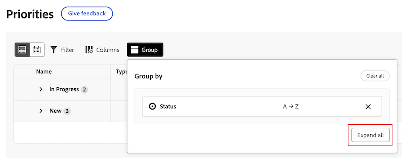

# Filtrar y agrupar su trabajo con Prioridades

Puede utilizar filtros para encontrar el trabajo que está buscando y, a continuación, aplicar una agrupación para mantenerlo organizado.

Prioridades muestra los elementos de trabajo que tiene asignados. No puede ver los elementos de trabajo asignados a su equipo en la Lista de trabajos de prioridades.

## Requisitos de acceso

+++ Expanda para ver los requisitos de acceso para la funcionalidad en este artículo.

Debe tener el siguiente acceso para realizar los pasos de este artículo:

<table style="table-layout:auto"> 
 <col> 
 </col> 
 <col> 
 </col> 
 <tbody> 
  <tr> 
   <td role="rowheader"><strong>Plan de Adobe Workfront</strong></td> 
   <td> 
Cualquiera
 </td> 
  </tr> 
  <tr> 
   <td role="rowheader"><strong>Licencia de Adobe Workfront*</strong></td> 
   <td> 
   
Actual: solicitud o superior

   
Nuevo: colaborador o superior
 
   </td> 
  </tr> 
  <tr> 
   <td role="rowheader"><strong>Configuraciones de nivel de acceso</strong></td> 
   <td> 
Acceso de visualización o edición para el objeto en el que se encuentra la actualización
</td> 
  </tr> 
  <tr> 
   <td role="rowheader"><strong>Permisos de objeto</strong></td> 
   <td> 
Acceso de visualización al objeto
</td> 
  </tr> 
 </tbody> 
</table>

*Para obtener más información, consulte [Requisitos de acceso en la documentación de Workfront](/help/quicksilver/administration-and-setup/add-users/access-levels-and-object-permissions/access-level-requirements-in-documentation.md).

+++

## Filtrado del trabajo con filtros estándar

Puede filtrar las tareas y los problemas que se le hayan asignado.

{{step1-to-priorities}}

1. Haga clic en **Filtros** en la parte superior izquierda de la lista de trabajos.
1. Haga clic en **Filtros estándar**.
1. Seleccione uno o varios filtros para reducir los elementos de trabajo.
   

+++Amplíe para ver información detallada sobre los filtros disponibles
<table>
  <tbody>
   <tr>
   <th>Filtro</th>
   <th>Descripción</th>
   </tr>
    <tr>
      <td>Trabajando en ello</td>
      <td>Muestra los elementos en los que está trabajando actualmente</td>
    </tr>
    <tr>
      <td>Listo para comenzar</td>
      <td>Muestra elementos con 
      <ul>
      <li>Sin predecesoras incompletas ni restricciones de tarea</li>
      
y

      <li>La fecha planificada de inicio es anterior o inferior a dos semanas</li>
      </ul>
      </td>
    </tr>
    <tr>
      <td>Sin preparar</td>
      <td>Muestra elementos que tienen
       <ul>
      <li>Predecesoras incompletas o delimitaciones de tareas que impiden trabajar en el elemento</li></ul>
      
o

      <ul>
      <li>La fecha planificada de inicio es dentro de más de dos semanas</li>
      </ul>
       </td>
    </tr>
    <tr>
      <td>Solicitud</td>
      <td>Muestra los problemas en los que no ha empezado a trabajar</td>
    </tr>
      <td>Listo</td>
      <td>Muestra el trabajo completado en las últimas dos semanas. Esta opción de filtro no incluye aprobaciones.</td>
    </tr>
    <tr>
    <td>Proyecto</td>
    <td>Muestra los proyectos que contienen tareas o problemas a los que se le ha asignado</td>
    </tr>
    <tr>
    <td>Fecha de vencimiento</td>
    <td>Muestra el trabajo por fecha planificada de finalización</td>
    </tr>
    <tr>
    <td>Estado</td>
    <td>Muestra tareas o problemas en estados nuevos, en curso y completos</td>
    </tr>
    <tr>
    <td>Mi enfoque</td>
    <td>Muestra tareas o problemas en que tienen niveles de enfoque asignados. El usuario individual asigna y administra los niveles de enfoque.</td>
    </tr>
  </tbody>
</table>

+++

1. (Opcional) Haga clic en **Volver al valor predeterminado** para restablecer su selección.

## Filtre su trabajo con filtros inteligentes

Utilice un lenguaje natural para filtrar rápidamente el trabajo.

>[!NOTE]
>
>Esta función solo está disponible para los clientes en la experiencia de Unified Adobe mediante el asistente de IA. Para obtener más información sobre el Asistente de IA, consulte [Descripción general del Asistente de IA](/help/quicksilver/workfront-basics/ai-assistant/ai-assistant-overview.md).

{{step1-to-priorities}}

1. Haga clic en **Filtros** en la parte superior izquierda de la lista de trabajos.
1. Haga clic en **Filtros inteligentes**.
1. Escriba cómo desea filtrar su trabajo.

   Puede escribir cosas como:

   * Mostrarme las tareas atrasadas
   * Mostrar mis prioridades principales
   * Mostrar trabajo a entregar hoy

## Agrupar su trabajo

{{step1-to-priorities}}

1. Haga clic en **Grupos** en la parte superior izquierda de la lista de trabajos.
1. Seleccione un grupo para organizar la lista de trabajos
   

+++Amplíe para ver información detallada sobre los grupos disponibles

| Grupo | Descripción |
|-----------|-------------|
| Proyecto | Agrupa los elementos por proyecto. |
| Mi enfoque | Agrupa los elementos según el nivel de enfoque que asigne. |
| Vence la semana | Agrupa los elementos según la semana de vencimiento. Las fechas de vencimiento están determinadas por la fecha planificada de finalización. |
| Estado | Agrupa los elementos según los siguientes estados: Nuevo, En curso y Completado.  Nota: no puede usar estados personalizados en Prioridades en este momento. |

+++

### Arrastrar y soltar elementos de trabajo al agrupar por Mi prioridad o Estado

Puede arrastrar y soltar elementos de trabajo individuales entre categorías al agruparlos por Mi prioridad o Estado.

1. Agrupa tu trabajo por **Estado** o **Mi prioridad**.
2. Pase el ratón sobre el elemento de trabajo para buscar el icono de mover y arrastrarlo a la categoría deseada.
   

## Ordenar el trabajo

### Ordenar en grupos

Para ordenar el trabajo dentro de un grupo, abra **Grupo** y haga clic en **Orden ascendente** o **Orden descendente**.

### Ordenar columnas

Para ordenar columnas individuales, vaya a la columna y haga clic en la flecha hacia abajo.

### Expandir o contraer todas las secciones del grupo

Para expandir o contraer todas las secciones del grupo, abra **Grupo** y haga clic en **Expandir todo** o **Contraer todo**.

