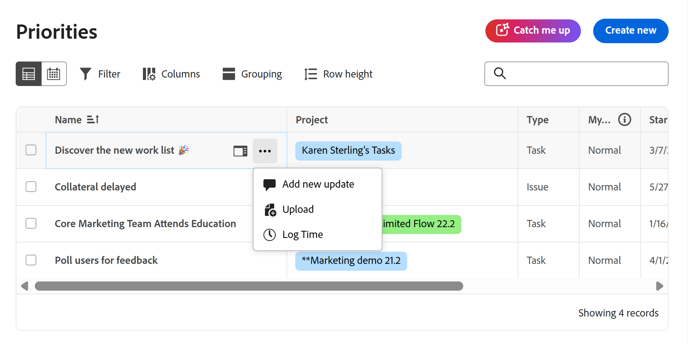

# Registrar el tiempo en Prioridades

Puede registrar el tiempo de los elementos de trabajo en Adobe Workfront para indicar la cantidad de horas que dedica a trabajar en ellos. El tiempo que registre se mostrará en la plantilla de horas.

Prioridades muestra los elementos de trabajo que tiene asignados. No puede ver los elementos de trabajo asignados a su equipo.

## Requisitos de acceso

+++ Expanda para ver los requisitos de acceso para la funcionalidad en este artículo.

Debe tener el siguiente acceso para realizar los pasos de este artículo y registrar las horas específicas del proyecto:

<table style="table-layout:auto"> 
 <col> 
 <col> 
 <tbody> 
  <tr> 
   <td role="rowheader">Paquete de Adobe Workfront</td> 
   <td> 
Cualquiera
 </td> 
  </tr> 
  <tr> 
   <td role="rowheader">Licencia de Adobe Workfront</td> 
   <td> 
Ligero o superior para registrar horas en una tarea o un problema

   
Trabajo o superior para registrar horas en una tarea o un problema
 </td> 
  </tr> 
  <tr> 
   <td role="rowheader">Configuraciones de nivel de acceso</td> 
   <td> 
Acceso de edición al tipo de elemento de trabajo para el que registra el tiempo 
 
Por ejemplo, necesita acceso de edición a problemas para registrar el tiempo de los problemas
 </td> 
  </tr> 
  <tr> 
   <td role="rowheader">Permisos de objeto</td> 
   <td> 
Permisos de aportación o superiores en el elemento de trabajo para el que registra el tiempo, incluidos los permisos para registrar horas
 </td> 
  </tr> 
 </tbody> 
</table>

Para obtener más información sobre el contenido de esta tabla, consulte [Requisitos de acceso en la documentación de Workfront](/help/quicksilver/administration-and-setup/add-users/access-levels-and-object-permissions/access-level-requirements-in-documentation.md).

+++

## Registrar tiempo en la lista de trabajos

Puede registrar tiempo directamente desde la lista de trabajo:

{{step1-to-priorities}}

1. Pase el ratón sobre el nombre y luego haga clic en el icono **Más** .
1. Seleccionar **Registrar tiempo**.
   
1. En el menú desplegable **Tipo de hora**, seleccione el tipo de hora adecuado. Los tipos de horas están disponibles según lo que se haya definido en los niveles de sistema, proyecto y usuario, tal como se describe en Definición de tipos de horas y disponibilidad.

1. (Condicional) Si el administrador de su grupo o Workfront ha habilitado la opción Asignar roles de trabajo a las entradas de hora manualmente, seleccione un rol en el menú desplegable. La función especificada cuando se le asigna al elemento de trabajo se muestra de forma predeterminada. Si no se le asigna una función en el objeto, la función principal se muestra como predeterminada. Si no tiene un rol principal asignado, se muestra Sin rol.

1. Escriba la hora que desee registrar y haga clic en **Registrar hora**.

   

## Registrar tiempo en un elemento de trabajo

Puede registrar el tiempo en un elemento de trabajo individual:

{{step1-to-priorities}}

1. Haga clic en el nombre de un elemento de trabajo para abrir la página **Información general**.
1. En la sección **Acciones rápidas**, haga clic en **Registrar tiempo**.
1. En el menú desplegable **Tipo de hora**, seleccione el tipo de hora adecuado. Los tipos de horas están disponibles según lo que se haya definido en los niveles de sistema, proyecto y usuario, tal como se describe en Definición de tipos de horas y disponibilidad.
1. (Condicional) Si el administrador de su grupo o Workfront ha habilitado la opción Asignar roles de trabajo a las entradas de hora manualmente, seleccione un rol en el menú desplegable. La función especificada cuando se le asigna al elemento de trabajo se muestra de forma predeterminada. Si no se le asigna una función en el objeto, la función principal se muestra como predeterminada. Si no tiene un rol principal asignado, se muestra Sin rol.

1. Escriba la hora que desee registrar y haga clic en **Registrar hora**.

   
