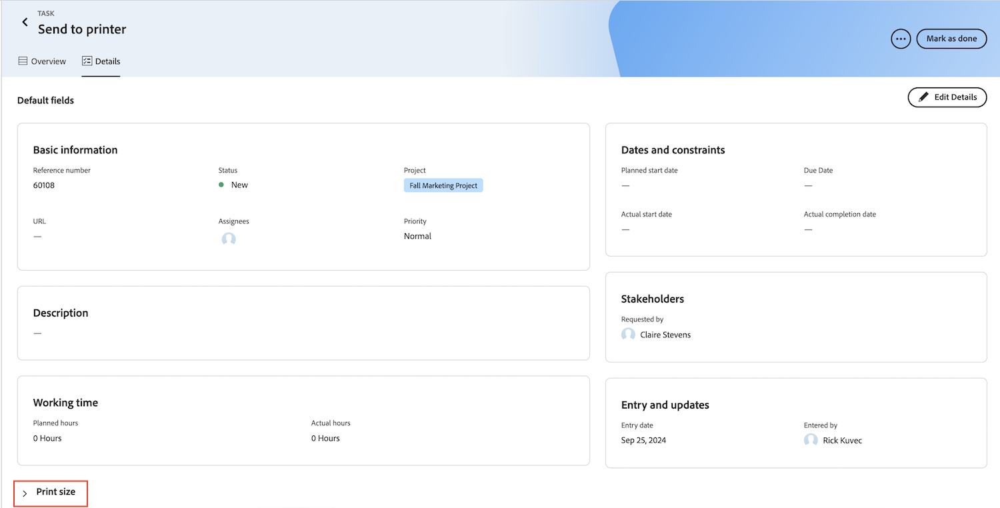

# Cambio de una página de inicio heredada a prioridades

Las prioridades estarán disponibles en la versión de vista previa el 3/10/2024

La página de inicio heredada se eliminará de Workfront el 17/10 con la versión del cuarto trimestre. Este artículo proporciona información sobre qué funcionalidad estará disponible en Prioridades, así como recomendaciones para los administradores de Workfront que trasladan usuarios a Prioridades.

Para obtener más información sobre la obsolescencia de la página principal heredada, consulte la [Guía de obsolescencia de la página principal heredada](/help/quicksilver/product-announcements/announcements/legacy-home-deprecation.md).

## Comprender lo que está cambiando de la página principal heredada a las prioridades

### Worklist

#### Organizar trabajo

La vista de tabla Prioridades muestra las tareas y problemas asignados a usted o a su equipo. Puede filtrar y agrupar su trabajo de la siguiente manera:

| **Filtro** | **Agrupación** |
|------------|-----------|
| - Trabajando en   - Listo para iniciar   - No listo   - Solicitado   - Listo   - Proyecto   - Fecha de vencimiento   - Estado | - Ninguno   - Vencimiento de semana   - Estado   - Proyecto |

**El filtro de inicio heredado y las opciones de agrupación no están disponibles en Prioridades**

Filtros

* Completado: ahora denominado Listo en Prioridades

Agrupaciones

* Fecha planificada de finalización - cambió el nombre a Fecha de vencimiento en Prioridades
* Inicio planificado
* Fecha de confirmación
* Mi prioridad

#### Delegar trabajo

Los usuarios no pueden delegar ni ver el trabajo delegado en Prioridades en este momento.

Los usuarios aún pueden delegar el trabajo desde la Nueva página de inicio en los siguientes widgets:

* Mi trabajo
* Mis tareas
* Mis problemas
* Esperando mis aprobaciones

Los usuarios pueden ver el trabajo delegado desde la nueva página de inicio en los siguientes widgets

* Widget de Mi trabajo con el filtro Delegado a mí
* Esperando mis aprobaciones usando el filtro de aprobaciones delegadas

#### Usar la vista de calendario

En este momento no hay disponible una vista de reemplazo de calendario, pero está en la hoja de ruta para Prioridades.

#### Crear una tarea personal

Los usuarios no pueden crear tareas personales ni elementos pendientes en Prioridades.

#### Agregar elementos a Mi prioridad

Los usuarios pueden priorizar el trabajo con la nueva columna Mi enfoque. La columna Mi enfoque es única para cada usuario y no afecta a los datos de tareas, problemas o productos.

Los usuarios pueden marcar el trabajo de alta prioridad con las siguientes opciones:

* Urgente
* Principal
* Secundario
* Normal (predeterminado)

#### Ver aprobaciones que he enviado

Los usuarios no pueden ver las aprobaciones que han enviado en Prioridades. Como solución alternativa, los usuarios pueden crear un informe de aprobación para ver esta información.

### Ver aprobaciones y solicitudes de equipo

Los usuarios no pueden interactuar con las aprobaciones y las solicitudes de equipo en Prioridades. Sin embargo, pueden administrar las solicitudes de aprobación y equipo en la nueva página de inicio mediante los siguientes widgets:

* En espera de mi aprobación
* Todas las aprobaciones
* Solicitudes de equipo

### Actualizar elementos de trabajo

#### Actualizar formularios personalizados

Los usuarios pueden actualizar los formularios personalizados dentro de la vista de tareas haciendo clic en el nombre de la tarea, navegando a la pestaña Detalles y desplazándose hasta la parte inferior de la página.

#### Uso del panel Resumen

Se muestra el panel Resumen para tareas y problemas. En el Resumen, los usuarios pueden

* Hora de registro
* Cargar un archivo
* Vaya a la pestaña Detalles en Prioridades
* Actualizar información de tareas y problemas

<!--Can admins customize this? It looks different from the task/issue summary in other areas. -->

#### Abrir el panel Resumen

En la ficha **Tabla**, haga clic en la celda de nombre del elemento de trabajo. Al hacer clic en el nombre del elemento de trabajo, se abre la página Detalles y no se abre el panel Resumen.

## Preparación para el desuso

* Comparta el artículo de [Introducción a Prioridades](/help/quicksilver/workfront-basics/priorities/get-started-with-priorities.md) con los usuarios finales.
* Las prioridades se habilitarán de manera predeterminada. Los administradores de Workfront pueden desactivar Prioridades en Configuración > Sistema > Preferencias.
* Los administradores de Workfront no pueden personalizar prioridades a través de la plantilla de diseño en este momento.

### Artículos de ayuda para usuarios finales

* [Introducción a Prioridades](/help/quicksilver/workfront-basics/priorities/get-started-with-priorities.md)