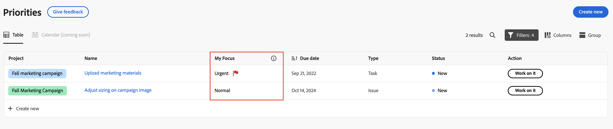

# Priorizar elementos de trabajo importantes

Puede usar la columna Mi enfoque para priorizar el trabajo. La columna Mi enfoque es un valor personal y no afecta la prioridad establecida en la tarea o el problema.

## Priorice su trabajo con la columna Mi enfoque

{{step1-to-priorities}}

1. Busque el elemento de trabajo en el que desea centrarse.
1. En la columna **Mi enfoque**, elija uno de los siguientes niveles de enfoque:

   | Enfoque | Descripción |
   |-----------|-------------|
   | **Urgente** | Urgente es un trabajo que requiere atención inmediata. |
   | **Principal** | La primaria es para el trabajo en el que planea centrarse esta semana. |
   | **Secundario** | Secundario es el trabajo al que planea pasar una vez que se hayan completado las tareas de enfoque principal. |
   | **Normal** | Normal es para el trabajo en el que no necesita estar enfocado todavía.  Normal es la opción predeterminada para todas las tareas y problemas. |

   

   >[!TIP]
   >
   >Puede Filtrar y agrupar su trabajo por sus niveles de enfoque.

