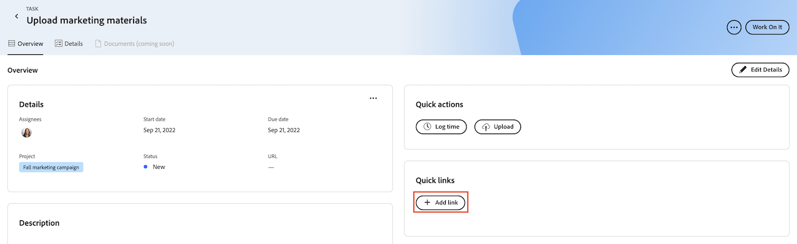

# Agregar y administrar vínculos rápidos en Prioridades

Puede guardar vínculos que visite con frecuencia en una tarea o problema y acceder a ellos desde la pestaña Información general en Prioridades.

Prioridades muestra los elementos de trabajo que tiene asignados. No puede ver los elementos de trabajo asignados a su equipo.

## Requisitos de acceso

+++ Expanda para ver los requisitos de acceso para la funcionalidad en este artículo.

Debe tener el siguiente acceso para realizar los pasos de este artículo:

<table style="table-layout:auto"> 
 <col> 
 </col> 
 <col> 
 </col> 
 <tbody> 
  <tr> 
   <td role="rowheader"><strong>Plan de Adobe Workfront</strong></td> 
   <td> 
Cualquiera
 </td> 
  </tr> 
  <tr> 
   <td role="rowheader"><strong>Licencia de Adobe Workfront*</strong></td> 
   <td> 
   
Actual: Solicitud o superior para problemas; Trabajo o superior para tareas

   
Nuevo: Colaborador o superior o problemas; Ligero o superior para tareas
 
   </td> 
  </tr> 
  <tr> 
   <td role="rowheader"><strong>Configuraciones de nivel de acceso</strong></td> 
   <td> 
Acceso de visualización o edición para el objeto en el que se encuentra la actualización
</td> 
  </tr> 
  <tr> 
   <td role="rowheader"><strong>Permisos de objeto</strong></td> 
   <td> 
Acceso de visualización al objeto
</td> 
  </tr> 
 </tbody> 
</table>

*Para obtener más información, consulte [Requisitos de acceso en la documentación de Workfront](/help/quicksilver/administration-and-setup/add-users/access-levels-and-object-permissions/access-level-requirements-in-documentation.md).

+++

## Añadir vínculos rápidos en Prioridades

{{step1-to-priorities}}

1. Haga clic en el nombre de un elemento de trabajo para abrir la página **Información general**.
1. En la sección **Vínculos rápidos**, haga clic en **Agregar vínculo**.
1. Pegue la dirección URL en el cuadro **Agregar vínculo**.
1. Haga clic en **Guardar**.
   

## Copiar un vínculo rápido al portapapeles

{{step1-to-priorities}}

1. Haga clic en el nombre de un elemento de trabajo para abrir la página **Información general**.
1. En la sección **Vínculos rápidos**, busque el vínculo que desea copiar.
1. Haga clic en el icono **Copiar**.
   

## Abrir un vínculo rápido

{{step1-to-priorities}}

1. Haga clic en el nombre de un elemento de trabajo para abrir la página **Información general**.
1. En la sección **Vínculos rápidos**, busque el vínculo que desea abrir.
1. Haga clic en el vínculo. El vínculo se abre en una nueva pestaña.
   

## Eliminar vínculos rápidos

{{step1-to-priorities}}

1. Haga clic en el nombre de un elemento de trabajo para abrir la página **Información general**.
1. Haga clic en **Editar detalles** en la esquina superior derecha de la pantalla.
   
1. Busque el vínculo que desea eliminar y, a continuación, haga clic en el icono **Eliminar** .
