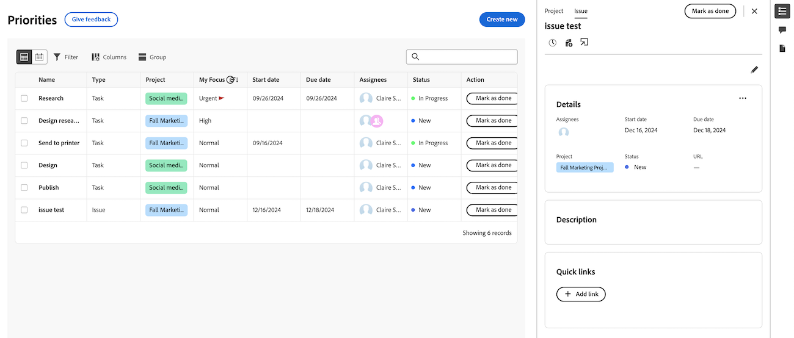

# Ver detalles del proyecto y del elemento de trabajo en Prioridades

Puede ver los detalles del proyecto, la tarea y el problema en la lista de trabajo de prioridades.

Prioridades muestra los elementos de trabajo que tiene asignados. No puede ver los elementos de trabajo asignados a su equipo.

>[!IMPORTANT]
>
>Los proyectos deben estar en estado Actual o un estado que equivalga al actual para mostrar los proyectos, así como sus tareas y problemas secundarios.

## Requisitos de acceso

+++ Expanda para ver los requisitos de acceso para la funcionalidad en este artículo.

Debe tener el siguiente acceso para realizar los pasos de este artículo:

<table style="table-layout:auto"> 
 <col> 
 </col> 
 <col> 
 </col> 
 <tbody> 
  <tr> 
   <td role="rowheader"><strong>Plan de Adobe Workfront</strong></td> 
   <td> 
Cualquiera
 </td> 
  </tr> 
  <tr> 
   <td role="rowheader"><strong>Licencia de Adobe Workfront*</strong></td> 
   <td> 
   
Actual: Revisor o superior

   
Nuevo: Light o superior
 
   </td> 
  </tr> 
  <tr> 
   <td role="rowheader"><strong>Configuraciones de nivel de acceso</strong></td> 
   <td> 
Acceso de visualización o edición para el objeto en el que se encuentra la actualización
</td> 
  </tr> 
  <tr> 
   <td role="rowheader"><strong>Permisos de objeto</strong></td> 
   <td> 
Acceso de visualización al objeto
</td> 
  </tr> 
 </tbody> 
</table>

*Para obtener más información, consulte [Requisitos de acceso en la documentación de Workfront](/help/quicksilver/administration-and-setup/add-users/access-levels-and-object-permissions/access-level-requirements-in-documentation.md).

+++

## Ver detalles en el panel lateral de la lista de trabajos

### Ver detalles del proyecto

{{step1-to-priorities}}

1. En la lista de trabajo, pase el ratón sobre el nombre del elemento de trabajo y haga clic en **Icono de resumen** .
1. Haga clic en **Proyecto** en la parte superior del panel Resumen. Aquí puede
   * Ver y editar los detalles y la descripción del proyecto
   * Ver y agregar comentarios en el proyecto
   * Hora de registro
   * Añadir un archivo
   * Ir directamente al proyecto

   

### Ver detalles de la tarea

{{step1-to-priorities}}

1. En la lista de trabajo, pase el ratón sobre el nombre del trabajo y haga clic en **Icono de resumen** .
1. La tarea está seleccionada de forma predeterminada. Aquí puede
   * Ver y editar los detalles y la descripción del proyecto y la tarea
   * Ver y agregar comentarios en el proyecto
   * Ver y agregar documentos
   * Crear una prueba
   * Hora de registro
   * Añadir un archivo
   * Adición de vínculos rápidos

   

### Ver detalles del problema

{{step1-to-priorities}}

1. En la lista de trabajo, pase el ratón sobre el nombre del trabajo y haga clic en **Icono de resumen** .

1. Problema seleccionado de forma predeterminada. Aquí puede
   * Ver y editar los detalles y la descripción del proyecto y del problema
   * Ver y agregar comentarios en el proyecto
   * Ver y agregar documentos
   * Crear una prueba
      * Hora de registro
      * Añadir un archivo
      * Adición de vínculos rápidos

   

## Ver detalles en la página Detalles

Puede ver actualizaciones en tiempo real en la página Detalles de una tarea o un problema. También puede ver si otros usuarios están viendo la página al mismo tiempo que usted con indicadores de presencia en tiempo real.

## Ver detalles del elemento de trabajo

{{step1-to-priorities}}

1. En la lista de trabajos, haga clic en el nombre del elemento de trabajo. En la página Detalles, puede

* Ver y editar los detalles y la descripción del proyecto
* Ver y agregar comentarios en el proyecto
* Ver y agregar documentos
* Crear una prueba
* Hora de registro
* Añadir un archivo
* Adición de vínculos rápidos

<!-- screenshot for prod-->