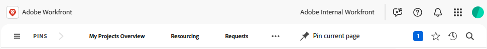

# Información general sobre la barra de navegación superior

<!--Audited: 01/2024-->

La barra de navegación superior, que aparece en la parte superior de la pantalla en [!DNL Adobe Workfront], le permite buscar y desplazarse fácilmente a otras áreas de la plataforma.

## Icono de [!UICONTROL Inicio]

El icono de **[!UICONTROL Inicio]** le lleva a la página [!UICONTROL Inicio], que es la página de destino predeterminada.

De forma predeterminada, el icono de Inicio abre el área de Inicio. Para obtener más información sobre Inicio, consulte [Usar el área [!UICONTROL Inicio]](../../workfront-basics/using-home/using-the-home-area/use-the-home-area.md).

El administrador de Workfront puede personalizar el icono de Inicio para abrir una página diferente, creando una plantilla de diseño y asignándosela a usted. Para obtener más información, consulte [Personalizar la página de destino con una plantilla de diseño](/help/quicksilver/administration-and-setup/customize-workfront/use-layout-templates/customize-landing-page.md).

## [!UICONTROL Menú principal]

<!--
>[!IMPORTANT]
>
>The Main Menu described on this page applies only to organizations that are not yet onboarded to [!DNL Adobe Experience Cloud].
>
> If your organization has been onboarded to [!DNL Adobe Experience Cloud], see [[!DNL Adobe Unified Experience] for [!DNL Workfront]](/help/quicksilver/workfront-basics/navigate-workfront/workfront-navigation/adobe-unified-experience.md).
-->

El icono de **[!UICONTROL Menú principal]**  abre el [!UICONTROL Menú principal], desde donde puede desplazarse a otra área de Workfront.

Las opciones disponibles en el [!UICONTROL Menú principal] dependen de lo siguiente:

* **Configuraciones de la plantilla de diseño**: para saber cómo un administrador de [!DNL Workfront] puede modificar el [!UICONTROL Menú principal] a partir de una plantilla de diseño, consulte [Personalizar el [!UICONTROL Menú principal] con una plantilla de diseño](../../administration-and-setup/customize-workfront/use-layout-templates/customize-main-menu.md).

* **Tipo de licencia**: Para conocer las configuraciones predeterminadas de diferentes tipos de licencia, consulta [Comprender la navegación de un usuario con licencia básica](../../workfront-basics/navigate-workfront/workfront-navigation/reviewer-global-navigation-bar.md) o [Comprender la navegación de un usuario con licencia de [!UICONTROL Trabajo]](../../workfront-basics/navigate-workfront/workfront-navigation/worker-global-navigation-bar.md).

Cada icono le lleva a un área diferente de Workfront.

Para obtener más información sobre cada área, consulte:

<table style="table-layout:auto"> 
 <col> 
 <col> 
 <tbody> 
  <tr> 
   <td> 
    <ul> 
     <li>[!UICONTROL Home]: <a href="../../workfront-basics/using-home/using-the-home-area/use-the-home-area.md" class="MCXref xref">Utilice el área de [!UICONTROL Home]</a></li> 
     <li>[!UICONTROL Portfolios]: <a href="../../manage-work/portfolios/portfolio-management-overview.md" class="MCXref xref">Administración de portafolios</a></li> 
     <li>[!UICONTROL Programs]: <a href="../../manage-work/portfolios/create-and-manage-programs/create-and-manage-programs.md" class="MCXref xref">Crear y administrar programas </a></li> 
     <li>[!UICONTROL Projects]: <a href="../../manage-work/projects/projects-overview.md" class="MCXref xref">Proyectos: índice de artículos</a></li> 
     <li>[!UICONTROL Reports]: <a href="../../reports-and-dashboards/reports/reports-overview.md" class="MCXref xref">Informes</a></li> 
     <li>[!UICONTROL Dashboards]: <a href="../../reports-and-dashboards/dashboards/dashboards-overview.md" class="MCXref xref">Paneles de control</a></li> 
     <li>[!UICONTROL Calendars]: <a href="../../reports-and-dashboards/reports/calendars/calendars.md" class="MCXref xref">Calendarios: índice de artículos</a></li> 
     <li>[!UICONTROL Resourcing]: <a href="../../resource-mgmt/resource-mgmt-overview/resource-management-overview.md" class="MCXref xref">Administración de recursos </a></li> 
     <li>[!UICONTROL Teams]: <a href="../../people-teams-and-groups/create-and-manage-teams/create-and-mange-teams.md" class="MCXref xref">Crear y administrar equipos</a></li> 
     <li>[!UICONTROL Users]: <a href="../../administration-and-setup/add-users/create-and-manage-users/create-and-manage-users.md" class="MCXref xref">Crear y administrar usuarios</a></li> 
    </ul> </td> 
   <td> 
    <ul> 
     <li>[!UICONTROL Requests]: <a href="../../manage-work/requests/create-requests/create-requests.md" class="MCXref xref">Crear solicitudes</a></li> 
     <li>[!UICONTROL Timesheets]: <a href="../../timesheets/timesheets-all.md" class="MCXref xref">Hojas de horas: índice de artículos</a></li> 
     <li>[!UICONTROL Documents]: <a href="../../documents/documents-overview.md" class="MCXref xref">Documentos</a></li> 
     <li>[!UICONTROL Templates]: <a href="../../manage-work/projects/create-and-manage-templates/create-manage-templates.md" class="MCXref xref">Crear y administrar plantillas de proyecto: índice de artículos</a></li> 
     <li>[!UICONTROL Tableros]: <a href="/help/quicksilver/agile/boards-overview.md">Información general de tableros</a></li>
     <li>[!UICONTROL Blueprints]: <a href="/help/quicksilver/administration-and-setup/blueprints/blueprints-overview.md">Información general de modelos</a></li>
     <li>[!UICONTROL Prioridades]: <a href="/help/quicksilver/workfront-basics/priorities/get-started-with-priorities.md">Introducción a Prioridades</a></li>
     <li>[!UICONTROL Goals]: <a href="../../workfront-goals/goal-management/wf-goals-overview.md" class="MCXref xref">[!DNL Adobe Workfront Goals] información general</a></li> 
     <li>[!UICONTROL Scenarios]: <a href="../../scenario-planner/scenario-planner-overview.md" class="MCXref xref">información general sobre el Planificador de escenarios</a></li> 
     <li>[!UICONTROL Proofing]: <a href="../../workfront-proof/workfront-proof.md" class="MCXref xref">[!DNL Workfront] Revisión: índice de artículos</a></li> 
    </ul> </td> 
  </tr> 
 </tbody> 
</table>

En la parte inferior del menú principal, puede acceder a lo siguiente:

<table style="table-layout:auto"> 
 <col> 
 <col> 
 <tbody> 
  <tr> 
   <td> 
[!UICONTROL Setup]
 </td> 
   <td> 
Al hacer clic en <b>[!UICONTROL Setup]</b>, se le dirigirá al área de [!UICONTROL Setup], donde podrá configurar diferentes aspectos de su cuenta de [!DNL Workfront]. Según su configuración de acceso, es posible que haya limitaciones en lo que puede configurar.
 
Para obtener más información sobre el área de [!UICONTROL Setup], consulte <a href="../../administration-and-setup/administration-and-setup.md" class="MCXref xref">Administración y configuración: índice de artículos</a>.
 </td> 
  </tr> 
  <tr> 
   <td> 
[!UICONTROL Help]
 </td> 
   <td> 
Al hacer clic en <b>[!UICONTROL Help]</b>, se le dirigirá a [!DNL Adobe Experience League], donde podrá acceder a los artículos de ayuda, buscar formación, enviar un ticket de asistencia al cliente, etc.
 
Para obtener más información sobre [!DNL Experience League] u otros métodos para obtener ayuda, consulte <a href="../../workfront-basics/tips-tricks-and-troubleshooting/guide-for-help-in-workfront.md" class="MCXref xref">Su guía rápida para encontrar ayuda en Adobe Workfront</a>.
 </td> 
  </tr>
  <!--
  <tr> 
   <td> 
[!UICONTROL Logout]
 </td> 
   <td>Clicking <b>[!UICONTROL Logout]</b> logs you out of [!DNL Workfront].</td> 
  </tr>
  -->
 </tbody> 
</table>

## Páginas ancladas

Puede anclar páginas que visite con frecuencia para que se muestren en la barra de navegación superior. Para obtener más información sobre las páginas ancladas, consulte [Anclar páginas para personalizar el espacio de trabajo](../../workfront-basics/the-new-workfront-experience/pin-pages.md).

<!--
## [!UICONTROL Help] menu

The **[!UICONTROL Help]** menu allows you to search for help with a specific task, find more information on using [!DNL Workfront], view content related to the page you are currently on, or submit feedback about your experience.

To learn more about the Help menu, see [Access [!DNL Adobe Workfront] help](../../workfront-basics/navigate-workfront/workfront-navigation/access-workfront-help.md).
-->

## Menú [!UICONTROL Notificaciones]

El cuadro numerado azul  en la esquina superior derecha de la pantalla abre una lista de notificaciones.

Puede acceder a lo siguiente desde el menú Notificaciones:

* **Notificaciones**: son alertas generadas por Workfront cuando se cumplen ciertas condiciones para comunicarle información que pueda requerir su atención.

* **Anuncios**: son anuncios enviados por el administrador de Workfront sobre temas importantes.

Para obtener más información sobre notificaciones y anuncios, consulte [Visualización y administración de notificaciones en la aplicación](../../workfront-basics/using-notifications/view-and-manage-in-app-notifications.md).

## Menú [!UICONTROL Favoritos]

El icono de **[!UICONTROL Favoritos]**  abre una lista de páginas del sistema que se han marcado como favoritas. Puede añadir la página en la que se encuentra actualmente desde este menú.

Para obtener más información sobre los favoritos, consulte [Ver y administrar favoritos](../../workfront-basics/navigate-workfront/recent-and-favorites/view-and-manage-favorites.md).

## Menú [!UICONTROL Recientes]

El icono de **[!UICONTROL Recientes]**  abre una lista de páginas que ha visitado recientemente.

Para obtener más información sobre los recientes, consulte [Ver elementos recientes](../../workfront-basics/navigate-workfront/recent-and-favorites/view-recent-items.md).

## Menú [!UICONTROL Buscar]

El icono de **[!UICONTROL Buscar]**  en la esquina superior derecha de [!DNL Workfront] le permite realizar una búsqueda básica, restringir la búsqueda a un objeto específico o usar [!UICONTROL Búsqueda avanzada] para buscar una palabra clave para un objeto específico y usar filtros para limitar la búsqueda a campos específicos.

Para obtener más información sobre la búsqueda, consulte [Buscar [!DNL Adobe Workfront]](../../workfront-basics/navigate-workfront/search/search-workfront.md).

