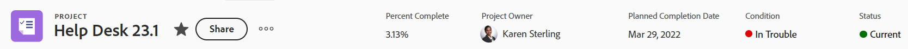

# Información general sobre encabezados de objeto

Puede ver de un vistazo información acerca de los objetos de [!DNL Adobe Workfront] cuando revise su encabezado.

Además del nombre del objeto, el encabezado puede incluir el propietario del objeto, el estado o el porcentaje completado.

[!DNL Workfront] da prioridad al nombre del objeto, asignándole el mayor espacio posible en el encabezado. Cuando el nombre de un objeto es demasiado largo, se trunca. Para mostrar el nombre completo de un objeto, puede pasar el ratón sobre él.

## Acceso al encabezado de un objeto

El acceso al encabezado de un objeto de [!DNL Workfront] es idéntico para todos los objetos que lo tienen.

Por ejemplo, para acceder al encabezado de un proyecto:

1. Vaya a un proyecto.\
   El encabezado se muestra en la parte superior de la página y contiene el nombre del proyecto.

   

<!--## [!UICONTROL Home] header overview 

The following headers are available in Home:

* Task: For more information on how you can use this header, see the [Task header overview](#task-header-overview) in this article.
* Issue: For more information on how you can use this header, see the [Issue header overview](#issue-header-overview) in this article.-->

## Encabezados personalizables

Su administrador de [!DNL Workfront] o de grupo puede personalizar el encabezado de proyectos, tareas y problemas mediante una plantilla de diseño.

Este artículo describe los encabezados predeterminados para todos los objetos, incluidos los proyectos y las tareas y los problemas.

Para obtener información acerca de cómo personalizar información en el encabezado de un objeto, vea [Personalizar encabezados de objeto mediante una plantilla de diseño](../../administration-and-setup/customize-workfront/use-layout-templates/customize-object-headers.md).

## Resumen del encabezado del proyecto

El encabezado del proyecto muestra la siguiente información de forma predeterminada:

<table style="table-layout:auto"> 
 <col> 
 <col> 
 <thead> 
  <tr> 
   <th>Información de encabezado</th> 
   <th>Notas</th> 
  </tr> 
 </thead> 
 <tbody> 
  <tr> 
   <td role="rowheader">Ruta de exploración con objetos principales</td> 
   <td>Si el proyecto está asociado a un programa o a un portafolio, se muestra en la ruta de exploración, en la esquina superior izquierda del encabezado. Al hacer clic en el nombre del objeto principal, se abre ese objeto principal.</td> 
  </tr> 
  <tr data-mc-conditions=""> 
   <td role="rowheader">Icono de objeto </td> 
   <td> 
El icono púrpura  de [!UICONTROL Project] aparece a la izquierda del nombre del proyecto.
 </td> 
  </tr> 
  <tr> 
   <td role="rowheader">Nombre del proyecto</td> 
   <td>Puede editar el nombre del proyecto en el encabezado.</td> 
  </tr> 
  <tr> 
   <td role="rowheader">Nombre del tipo de objeto</td> 
   <td> 
El texto "[!UICONTROL PROJECT]" aparece encima del nombre del proyecto en el encabezado.
 </td> 
  </tr> 
  <tr> 
   <td role="rowheader">El área de acciones del proyecto</td> 
   <td> 
Junto al nombre del proyecto, se muestra el área de acciones, que incluye la opción <b>Compartir</b>.
 
  
  </td> 
  </tr> 
  <tr> 
   <td role="rowheader">[!UICONTROL Porcentaje completado]</td> 
   <td>No puede editar el porcentaje completado del proyecto en el encabezado.</td> 
  </tr> 
  <tr> 
   <td role="rowheader">[!UICONTROL Propietario del proyecto]</td> 
   <td> 
Puede editar el [!UICONTROL Project Owner] en el encabezado.
 </td> 
  </tr> 
  <tr> 
   <td role="rowheader">[!UICONTROL Fecha planificada de finalización] </td> 
   <td> 
Puede editar la [!UICONTROL Fecha planificada de finalización] y la hora del proyecto en el encabezado si el proyecto está programado a partir de la [!UICONTROL Fecha de finalización]. Si el proyecto está programado a partir de la [!UICONTROL Fecha de inicio], esta información se actualiza desde las tareas del proyecto.
 </td> 
  </tr> 
  <tr> 
   <td role="rowheader">[!UICONTROL Condición] </td> 
   <td> 
Si establece el [!UICONTROL Condition Type] del proyecto en Manual, puede actualizar el proyecto [!UICONTROL Condition] en el encabezado.
</td> 
  </tr> 
  <tr> 
   <td role="rowheader">[!UICONTROL Estado]</td> 
   <td>Puede editar el proyecto [!UICONTROL Estado] en el encabezado.</td> 
  </tr> 
  <tr> 
   <td role="rowheader">El área de [!UICONTROL Approvals]</td> 
   <td> 
Cuando sea uno de los aprobadores, utilice los iconos siguientes para administrar las aprobaciones del proyecto:
 
  </img> [!UICONTROL Aprobar]
 
  </img> [!UICONTROL Rechazar]
 
  </img> [!UICONTROL Recall]
 
Si no es aprobador, haga clic en el icono [!UICONTROL Más]  para ver información sobre el paso de aprobación actual.
 
Para obtener más información sobre las aprobaciones, consulte <a href="../../review-and-approve-work/manage-approvals/approval-process-in-workfront.md" class="MCXref xref">Resumen del proceso de aprobación</a>.
 </td> 
  </tr> 
 </tbody> 
</table>

## Resumen del encabezado de tarea

El encabezado de la tarea incluye la siguiente información de forma predeterminada:

<table style="table-layout:auto"> 
 <col> 
 <col> 
 <thead> 
  <tr> 
   <th>Información de encabezado</th> 
   <th>Notas</th> 
  </tr> 
 </thead> 
 <tbody> 
  <tr> 
   <td role="rowheader">Ruta de exploración con objetos principales</td> 
   <td> 
Los objetos principales de la tarea se muestran en la ruta de exploración. Al hacer clic en el nombre del objeto principal, se abre ese objeto principal.
 
Para obtener más información, consulte <a href="../../workfront-basics/the-new-workfront-experience/breadcrumb-overview.md" class="MCXref xref">Información general sobre las rutas de exploración</a>.
 </td> 
  </tr> 
  <tr data-mc-conditions=""> 
   <td role="rowheader">Icono de objeto </td> 
   <td> 
El icono verde de [!UICONTROL Task]  se muestra a la izquierda del nombre de la tarea.
 </td> 
  </tr> 
  <tr> 
   <td role="rowheader">Nombre de la tarea</td> 
   <td>Puede editar el nombre de la tarea en el encabezado.</td> 
  </tr> 
  <tr> 
   <td role="rowheader">Nombre del tipo de objeto</td> 
   <td> 
El texto "[!UICONTROL TASK]" aparece encima del nombre de la tarea en el encabezado.
 </td> 
  </tr> 
  <tr> 
   <td role="rowheader">El área de acciones de la tarea</td> 
   <td> 
Junto al nombre de la tarea, se muestra el área de acciones, que incluye la opción <b>Compartir</b>.
 
  
 
Si aparece el icono Dependencia, puede hacer clic en él para ver las tareas predecesoras o sucesoras de la tarea.
 </td> 
  </tr> 
  <tr> 
   <td role="rowheader">[!UICONTROL Porcentaje completado]</td> 
   <td>Puede editar el porcentaje completado de la tarea en el encabezado.</td> 
  </tr> 
  <tr> 
   <td role="rowheader">[!UICONTROL Asignaciones]</td> 
   <td>Puede editar los usuarios asignados de una tarea desde el encabezado.</td> 
  </tr> 
  <tr> 
   <td role="rowheader"> 
Botón [!UICONTROL Trabajar en ello], [!UICONTROL Listo] o [!UICONTROL Iniciar tarea]
 </td> 
   <td> 
Si la tarea está asignada a usted, puede hacer clic en el botón [!UICONTROL Trabajar en ello]  o [!UICONTROL Iniciar tarea] para indicar que está trabajando en la tarea o en el botón [!UICONTROL Listo] para indicar que ha completado la tarea.
 
Para obtener información acerca de cómo reemplazar el botón [!UICONTROL Trabajar en ello] por un botón [!UICONTROL Iniciar tarea], vea <a href="../../people-teams-and-groups/create-and-manage-teams/work-on-it-button-to-start-button.md" class="MCXref xref">Reemplazar el botón [!UICONTROL Trabajar en ello] por un botón [!UICONTROL Iniciar]</a>.
 </td> 
  </tr> 
  <tr> 
   <td role="rowheader">[!UICONTROL Fecha planificada de finalización]</td> 
   <td> 
Puede editar la tarea [!UICONTROL Fecha planificada de finalización] y la hora en el encabezado.
 
Sugerencia: Observe que [!UICONTROL Commit Date] no está visible en el encabezado. Puede verlo en la página [!UICONTROL Detalles].
 </td> 
  </tr> 
  <tr> 
   <td role="rowheader">[!UICONTROL Estado]</td> 
   <td>Puede editar la tarea [!UICONTROL Estado] en el encabezado.</td> 
  </tr> 
  <tr> 
   <td role="rowheader">El área de [!UICONTROL Approvals]</td> 
   <td> 
Cuando sea uno de los aprobadores, utilice los iconos siguientes para administrar las aprobaciones de la tarea:
 
  </img> [!UICONTROL Aprobar]
 
  </img> [!UICONTROL Rechazar]
 
  </img> [!UICONTROL Recall]
 
Si no es aprobador, haga clic en el icono [!UICONTROL Más]  para ver información sobre el paso de aprobación actual.
 
Para obtener más información sobre las aprobaciones, consulte <a href="../../review-and-approve-work/manage-approvals/approval-process-in-workfront.md" class="MCXref xref">Resumen del proceso de aprobación</a>.
 </td> 
  </tr> 
 </tbody> 
</table>

## Resumen del encabezado del problema

El encabezado de problema incluye la siguiente información de forma predeterminada:

<table style="table-layout:auto"> 
 <col> 
 <col> 
 <thead> 
  <tr> 
   <th>Información de encabezado</th> 
   <th>Notas</th> 
  </tr> 
 </thead> 
 <tbody> 
  <tr> 
   <td role="rowheader">Ruta de exploración con objetos principales</td> 
   <td> 
Los objetos principales del problema se muestran en la ruta de exploración. Al hacer clic en el nombre del objeto principal, se abre ese objeto principal.
 
Para obtener más información, consulte <a href="../../workfront-basics/the-new-workfront-experience/breadcrumb-overview.md" class="MCXref xref">Información general sobre las rutas de exploración</a>.
 </td> 
  </tr> 
  <tr> 
   <td role="rowheader">Icono de objeto </td> 
   <td> 
El icono rosa [!UICONTROL Issue]  aparece a la izquierda del nombre del problema.
 </td> 
  </tr> 
  <tr> 
   <td role="rowheader">Nombre del problema</td> 
   <td>Puede editar el nombre del problema en el encabezado.</td> 
  </tr> 
  <tr> 
   <td role="rowheader">Nombre del tipo de objeto</td> 
   <td> 
El texto "[!UICONTROL ISSUE]" aparece encima del nombre del problema en el encabezado.
 </td> 
  </tr> 
  <tr> 
   <td role="rowheader">El área de acciones de la cuestión</td> 
   <td> 
Junto al nombre del problema, se muestra el área de acciones, que incluye la opción <b>Compartir</b>.
 
  
Si aparece el icono [!UICONTROL Dependency], puede hacer clic en él para ver las predecesoras o sucesoras del problema.
  </td> 
  </tr> 
  <tr> 
   <td role="rowheader">[!UICONTROL Porcentaje completado]</td> 
   <td> 
Puede editar el porcentaje completado del problema desde el encabezado.
 </td> 
  </tr> 
  <tr> 
   <td role="rowheader">[!UICONTROL Asignaciones]</td> 
   <td>Puede editar los usuarios asignados de un problema desde el encabezado.</td> 
  </tr> 
  <tr> 
   <td role="rowheader">Botón [!UICONTROL Trabajar en ello], [!UICONTROL Listo], o [!UICONTROL Iniciar problema]</td> 
   <td>Si el problema está asignado a usted, puede hacer clic en el botón [!UICONTROL Trabajar en ello]  o [!UICONTROL Iniciar problema] para indicar que está trabajando en el problema o en el botón [!UICONTROL Listo] para indicar que ha completado el problema.Para obtener información acerca de cómo reemplazar el botón [!UICONTROL Trabajar en ello] por un botón [!UICONTROL Iniciar tarea], vea <a href="../../people-teams-and-groups/create-and-manage-teams/work-on-it-button-to-start-button.md" class="MCXref xref">Reemplazar el botón [!UICONTROL Trabajar en ello] por un botón [!UICONTROL Iniciar]</a>.</td> 
  </tr> 
  <tr> 
   <td role="rowheader">[!UICONTROL Fecha planificada de finalización]</td> 
   <td> 
Puede editar el problema [!UICONTROL Fecha planificada de finalización] y la hora en el encabezado.
 
Sugerencia: Observe que [!UICONTROL Commit Date] no está visible en el encabezado. Puede verlo en la página [!UICONTROL Detalles].
 </td> 
  </tr> 
  <tr> 
   <td role="rowheader">[!UICONTROL Estado]</td> 
   <td>Puede editar el problema [!UICONTROL Status] en el encabezado.</td> 
  </tr> 
  <tr> 
   <td role="rowheader">El área de [!UICONTROL Approvals]</td> 
   <td> 
Cuando sea uno de los aprobadores, utilice los iconos siguientes para administrar las aprobaciones del problema:
 
  [!UICONTROL Aprobar]
 
  [!UICONTROL Rechazar]
 
  [!UICONTROL Recall]
 
Si no es aprobador, haga clic en el icono [!UICONTROL Más]  para ver información sobre el paso de aprobación actual.
 
Para obtener más información sobre las aprobaciones, consulte <a href="../../review-and-approve-work/manage-approvals/approval-process-in-workfront.md" class="MCXref xref">Resumen del proceso de aprobación</a>.
 </td> 
  </tr> 
 </tbody> 
</table>

## Resumen del encabezado del programa

El encabezado del programa muestra la siguiente información:

<table style="table-layout:auto"> 
 <col> 
 <col> 
 <thead> 
  <tr> 
   <th>Información de encabezado</th> 
   <th>Notas</th> 
  </tr> 
 </thead> 
 <tbody> 
  <tr> 
   <td role="rowheader">Ruta con el nombre del Portfolio</td> 
   <td> 
Puede obtener acceso al [!UICONTROL Portfolio] desde el encabezado del [!UICONTROL Programa]. Al hacer clic en el nombre del objeto principal, se abre ese objeto principal.
 
Para obtener más información, consulte <a href="../../workfront-basics/the-new-workfront-experience/breadcrumb-overview.md" class="MCXref xref">Información general sobre las rutas de exploración</a>.
 </td> 
  </tr> 
  <tr> 
   <td role="rowheader">Icono de objeto </td> 
   <td> 
El icono  naranja de [!UICONTROL Program] se muestra a la izquierda del nombre del programa.
 </td> 
  </tr> 
  <tr> 
   <td role="rowheader">Nombre del programa</td> 
   <td>Puede editar el nombre del programa en el encabezado.</td> 
  </tr> 
  <tr> 
   <td role="rowheader">Nombre del tipo de objeto</td> 
   <td> 
Si el programa está marcado como [!UICONTROL Active], el texto "[!UICONTROL PROGRAM]" aparece encima del nombre del programa en el encabezado.
 </td> 
  </tr> 
  <tr> 
   <td role="rowheader">Estado de activación</td> 
   <td> 
Si el programa está desactivado, aparece el texto "[!UICONTROL PROGRAM DEACTIVATED]" encima del nombre del programa en el encabezado.
 </td> 
  </tr> 
  <tr> 
   <td role="rowheader">Ámbito de actuación del programa</td> 
   <td> 
Junto al nombre del programa, se muestra el área de acciones, que incluye la opción <b>Compartir</b>.
 
  </td> 
  </tr> 
  <tr> 
   <td role="rowheader">[!UICONTROL Porcentaje completado]</td> 
   <td> 
No puede editar el [!UICONTROL Percent Complete] del programa en el encabezado. Esta información se actualiza desde los proyectos del programa.
 
Sugerencia: De forma predeterminada, el porcentaje completado del programa es una media de los valores de porcentaje completado de los proyectos en un [!UICONTROL Actual] o [!UICONTROL Estado aprobado] que pertenecen al programa.
 </td> 
  </tr> 
  <tr> 
   <td role="rowheader">[!UICONTROL Administrador de programas]</td> 
   <td> 
Puede editar el [!UICONTROL Program Manager] en el encabezado. Es igual que el propietario del programa [!UICONTROL].
 </td> 
  </tr> 
  <tr> 
   <td role="rowheader">[!UICONTROL Fecha planificada de finalización]</td> 
   <td>No puede editar el programa [!UICONTROL Fecha planificada de finalización] en el encabezado. Esta información se actualiza a partir de la [!UICONTROL Fecha planificada de finalización] de los proyectos del programa.</td> 
  </tr> 
  <tr> 
   <td role="rowheader">Condición de [!UICONTROL Active Projects]</td> 
   <td>Se trata de un cálculo del porcentaje de proyectos activos del programa que tienen la condición [!UICONTROL] establecida como [!UICONTROL en destino], [!UICONTROL en riesgo] o [!UICONTROL en problemas].</td> 
  </tr> 
 </tbody> 
</table>

## Introducción al encabezado del Portfolio {#portfolio-header-overview}

El encabezado del portafolio incluye la siguiente información:

<table style="table-layout:auto"> 
 <col> 
 <col> 
 <thead> 
  <tr> 
   <th>Información de encabezado</th> 
   <th>Notas</th> 
  </tr> 
 </thead> 
 <tbody> 
  <tr> 
   <td role="rowheader">Icono de objeto </td> 
   <td> 
El icono [!UICONTROL Portfolio] azul  se muestra a la izquierda del nombre del portafolio.
 </td> 
  </tr> 
  <tr> 
   <td role="rowheader">Nombre del portafolio</td> 
   <td>Puede editar el nombre del portafolio en el encabezado.</td> 
  </tr> 
  <tr> 
   <td role="rowheader">Nombre del tipo de objeto</td> 
   <td> 
Si el portafolio está marcado como activo, aparece el texto "[!UICONTROL PORTFOLIO]" encima del nombre del portafolio en el encabezado.
 </td> 
  </tr> 
  <tr> 
   <td role="rowheader">Estado de activación</td> 
   <td> 
Si el portafolio está desactivado, aparece el texto "[!UICONTROL PORTFOLIO DESACTIVADO]" encima del nombre del portafolio en el encabezado.
 </td> 
  </tr> 
  <tr> 
   <td role="rowheader">El área de acciones del portafolio</td> 
   <td> 
Junto al nombre del portafolio, aparece el área de [!UICONTROL actions].
 
  
</td> 
  </tr> 
  <tr> 
   <td role="rowheader">[!UICONTROL Administrador de Portfolio]</td> 
   <td>Puede editar el [!UICONTROL Portfolio Manager] en el encabezado. Es igual que el [!UICONTROL Propietario del Portfolio].</td> 
  </tr> 
  <tr> 
   <td role="rowheader">[!UICONTROL On Time]</td> 
   <td>Este es un cálculo del porcentaje de proyectos en el portafolio que están actualmente a tiempo.</td> 
  </tr> 
  <tr> 
   <td role="rowheader">[!UICONTROL Según Presupuesto]</td> 
   <td>Se trata de un cálculo del porcentaje de proyectos del portafolio que se encuentran actualmente dentro del presupuesto.</td> 
  </tr> 
  <tr> 
   <td role="rowheader">[!UICONTROL alineado]</td> 
   <td>Este es un cálculo del porcentaje de proyectos en el portafolio que están alineados con el portafolio.</td> 
  </tr> 
  <tr> 
   <td role="rowheader">[!UICONTROL ROI]</td> 
   <td>Este es el cálculo de [!UICONTROL Retorno de la inversión] para todos los proyectos del portafolio.</td> 
  </tr> 
  <tr> 
   <td role="rowheader">[!UICONTROL Valor neto]</td> 
   <td>Este es el cálculo del valor neto de [!UICONTROL] para todos los proyectos del portafolio.</td> 
  </tr> 
 </tbody> 
</table>

## Resumen del encabezado de plantilla {#template-header-overview}

El encabezado de la plantilla muestra la siguiente información:

<table style="table-layout:auto"> 
 <col> 
 <col> 
 <thead> 
  <tr> 
   <th>Información de encabezado</th> 
   <th>Notas</th> 
  </tr> 
 </thead> 
 <tbody> 
  <tr> 
   <td role="rowheader">Icono de objeto </td> 
   <td> 
El icono  verde de [!UICONTROL Template] se muestra a la izquierda del nombre de la plantilla.
 </td> 
  </tr> 
  <tr> 
   <td role="rowheader">Nombre de la plantilla</td> 
   <td>Puede editar el nombre de la plantilla en el encabezado.</td> 
  </tr> 
  <tr> 
   <td role="rowheader">Nombre del tipo de objeto</td> 
   <td> 
Si la plantilla está marcada como activa, aparece el texto "[!UICONTROL TEMPLATE]" encima del nombre de la plantilla en el encabezado.
 </td> 
  </tr> 
  <tr> 
   <td role="rowheader">Estado de activación</td> 
   <td> 
Si la plantilla está desactivada, aparece el texto "[!UICONTROL TEMPLATE DEACTIVATED]" encima del nombre de la plantilla en el encabezado.
 </td> 
  </tr> 
  <tr> 
   <td role="rowheader">El área de acciones de la plantilla</td> 
   <td> 
Junto al nombre de la plantilla, se muestra el área de acciones.
 
  
 </td> 
  </tr> 
  <tr> 
   <td role="rowheader">[!UICONTROL Propietario de plantilla]</td> 
   <td>Puede editar el campo [!UICONTROL Template Owner] en el encabezado.</td> 
  </tr> 
  <tr> 
   <td role="rowheader">[!UICONTROL Duración]</td> 
   <td>La duración de la plantilla. No puede editar este campo en el encabezado.</td> 
  </tr> 
 </tbody> 
</table>

## Resumen del encabezado Tarea de plantilla

El encabezado de tarea de plantilla muestra la siguiente información:

<table style="table-layout:auto"> 
 <col> 
 <col> 
 <thead> 
  <tr> 
   <th>Información de encabezado</th> 
   <th>Notas</th> 
  </tr> 
 </thead> 
 <tbody> 
  <tr> 
   <td role="rowheader">Ruta de exploración a objetos principales</td> 
   <td> 
Los objetos principales de la tarea de plantilla se muestran en la ruta de exploración. Al hacer clic en el nombre de un objeto principal, se abre ese objeto principal.
 
Para obtener más información, consulte <a href="../../workfront-basics/the-new-workfront-experience/breadcrumb-overview.md" class="MCXref xref">Información general sobre las rutas de exploración</a>.
 </td> 
  </tr> 
  <tr> 
   <td role="rowheader">Icono de objeto </td> 
   <td> 
El icono verde de [!UICONTROL Task]  se muestra a la izquierda del nombre de la tarea de plantilla.
 </td> 
  </tr> 
  <tr> 
   <td role="rowheader">Nombre de la tarea de plantilla</td> 
   <td>Puede editar el nombre de la tarea de plantilla en el encabezado.</td> 
  </tr> 
  <tr> 
   <td role="rowheader">Nombre del tipo de objeto</td> 
   <td> 
El texto "[!UICONTROL TEMPLATE TASK]" aparece encima del nombre de la tarea de plantilla en el encabezado.
 </td> 
  </tr> 
  <tr> 
   <td role="rowheader">El área de acciones de la tarea de plantilla</td> 
   <td> 
Junto al nombre de la tarea de plantilla, se muestra el área de acciones.
 
  
 </td> 
  </tr> 
  <tr> 
   <td role="rowheader">[!UICONTROL Asignaciones]</td> 
   <td>Puede editar las [!UICONTROL Asignaciones] de la tarea de plantilla en el encabezado.</td> 
  </tr> 
  <tr> 
   <td role="rowheader">[!UICONTROL Día de finalización]</td> 
   <td>Es el día de la duración de la plantilla en el que se debe completar la tarea de la plantilla.</td> 
  </tr> 
 </tbody> 
</table>

## Resumen del encabezado de Registro de facturación

La cabecera del registro de facturación muestra la siguiente información:

<table style="table-layout:auto"> 
 <col> 
 <col> 
 <thead> 
  <tr> 
   <th>Información de encabezado</th> 
   <th>Notas</th> 
  </tr> 
 </thead> 
 <tbody> 
  <tr> 
   <td role="rowheader">Ruta de exploración a objetos principales</td> 
   <td> 
Los objetos principales del registro de facturación se muestran en la ruta de exploración. Al hacer clic en el nombre de un objeto principal, se abre ese objeto principal.
 
Para obtener más información, consulte <a href="../../workfront-basics/the-new-workfront-experience/breadcrumb-overview.md" class="MCXref xref">Información general sobre las rutas de exploración</a>.
 </td> 
  </tr> 
  <tr> 
   <td role="rowheader">Icono de objeto </td> 
   <td> 
El icono azul [!UICONTROL Registro de facturación]  se muestra a la izquierda del nombre del registro de facturación.
 </td> 
  </tr> 
  <tr> 
   <td role="rowheader">Nombre del registro de facturación</td> 
   <td>Puede editar el nombre del registro de facturación en el encabezado.</td> 
  </tr> 
  <tr> 
   <td role="rowheader">Nombre del tipo de objeto</td> 
   <td> 
El texto "[!UICONTROL REGISTRO DE FACTURACIÓN]" se muestra encima del nombre del registro de facturación en el encabezado.
 </td> 
  </tr> 
  <tr> 
   <td role="rowheader">El menú Más del registro de facturación</td> 
   <td> 
Junto al nombre del registro de facturación, aparece el menú [!UICONTROL Más] , que le permite seleccionar las siguientes opciones:
 
    <ul> 
     <li> 
[!UICONTROL Editar]
 </li> 
     <li> 
 Eliminar 
 </li> 
    </ul>
    
<b>NOTA</b>

    
El menú Más no se muestra para los registros de facturación con un estado de Facturado. No puede editar ni eliminar registros facturados.

     </td> 
  </tr> 
  <tr> 
   <td role="rowheader">[!UICONTROL Total de registro de facturación]</td> 
   <td>Es el importe total del registro de facturación. No puede editar este campo.</td> 
  </tr> 
  <tr> 
   <td role="rowheader">[!UICONTROL Fecha de facturación]</td> 
   <td>Es la fecha en la que se creó el registro de facturación, a menos que se haya cambiado manualmente al crearlo. Puede editar la [!UICONTROL Fecha de facturación] en el encabezado.</td> 
  </tr> 
  <tr> 
   <td role="rowheader">[!UICONTROL Estado]</td> 
   <td> 
Cuando el registro de facturación tiene el estado [!UICONTROL Facturado], ya no puede editarlo.
 
Puede editar el Estado del registro de facturación en el encabezado.
 </td> 
  </tr> 
 </tbody> 
</table>

## Introducción al encabezado de usuario

El encabezado de usuario muestra la siguiente información:

<table style="table-layout:auto"> 
 <col> 
 <col> 
 <thead> 
  <tr> 
   <th>Información de encabezado</th> 
   <th>Notas</th> 
  </tr> 
 </thead> 
 <tbody> 
  <tr> 
   <td role="rowheader">Imagen del perfil del usuario</td> 
   <td>No se puede actualizar la imagen de perfil en el encabezado.</td> 
  </tr> 
  <tr> 
   <td role="rowheader">Nombre del usuario y título</td> 
   <td> 
 El título del usuario se muestra en mayúsculas encima del nombre. No se puede editar el nombre del usuario en el encabezado.
 </td> 
  </tr> <!--
   <tr> 
    <td role="rowheader">Name of the object type</td> 
    <td> 
The name of the object type does not display.
 </td> 
   </tr>
  --> 
  <tr> 
   <td role="rowheader">Estado de activación</td> 
   <td> 
Si se ha desactivado el usuario, todo el texto y la imagen del perfil del encabezado aparecen atenuados.
 </td> 
  </tr> 
  <tr> 
   <td role="rowheader">El área de acciones del usuario</td> 
   <td> 
Junto al nombre del usuario, se muestra el área de acciones.
 
  
</td> 
  </tr> 
  <tr> 
   <td role="rowheader">Dirección de correo electrónico</td> 
   <td>No puede editar la dirección de correo electrónico en el encabezado. Normalmente, también es el nombre de usuario.</td> 
  </tr> 
  <tr> 
   <td role="rowheader">Número de teléfono</td> 
   <td>No puede editar el número de teléfono en el encabezado.</td> 
  </tr> 
  <tr> 
   <td role="rowheader">Equipos</td> 
   <td> 
Puede ver los equipos a los que pertenece el usuario. Pase el ratón sobre un avatar del equipo para ver su nombre. No se pueden editar los equipos en el encabezado.
 </td> 
  </tr> 
 </tbody> 
</table>

## Información general del encabezado de equipo

El encabezado de equipo muestra la siguiente información:

<table style="table-layout:auto"> 
 <col> 
 <col> 
 <thead> 
  <tr> 
   <th>Información de encabezado</th> 
   <th>Notas</th> 
  </tr> 
 </thead> 
 <tbody> 
  <tr> 
   <td role="rowheader">Icono de objeto </td> 
   <td> 
El icono púrpura  de [!UICONTROL Team] aparece a la izquierda del nombre del equipo.
 </td> 
  </tr> 
  <tr> 
   <td role="rowheader">Nombre del equipo</td> 
   <td>Puede editar el nombre del equipo en el encabezado.</td> 
  </tr> 
  <tr> 
   <td role="rowheader">Nombre del tipo de objeto</td> 
   <td> 
El texto "[!UICONTROL TEAM]" aparece encima del nombre del equipo en el encabezado.
 </td> 
  </tr> 
  <tr> 
   <td role="rowheader">El área de acciones del equipo</td> 
   <td> 
Junto al nombre del equipo, se muestra el área de acciones.
 
  
</td> 
  </tr> 
  <tr> 
   <td role="rowheader">Fotos de perfil de miembros del equipo</td> 
   <td>Las fotos de perfil de los miembros del equipo. Pase el ratón sobre una imagen para ver el nombre del usuario.</td> 
  </tr> 
  <tr> 
   <td role="rowheader">Descripción</td> 
   <td>Esta es una breve descripción de los miembros del equipo. No se puede editar la descripción del equipo en el encabezado.</td> 
  </tr> 
 </tbody> 
</table>

## Resumen del encabezado de iteración

El encabezado de iteración muestra la siguiente información:

<table style="table-layout:auto"> 
 <col> 
 <col> 
 <thead> 
  <tr> 
   <th>Información de encabezado</th> 
   <th>Notas</th> 
  </tr> 
 </thead> 
 <tbody> 
  <tr> 
   <td role="rowheader">Icono de objeto </td> 
   <td> 
El icono [!UICONTROL Iteration] naranja  se muestra a la izquierda del nombre de la iteración.
 </td> 
  </tr> 
  <tr> 
   <td role="rowheader">Nombre de la iteración</td> 
   <td>Puede editar el nombre de la iteración en el encabezado.</td> 
  </tr> 
  <tr> 
   <td role="rowheader">Nombre del tipo de objeto</td> 
   <td> 
El texto "[!UICONTROL ITERATION]" se muestra encima del nombre de la iteración en el encabezado.
 </td> 
  </tr> 
  <tr> 
   <td role="rowheader">El área de acciones de la iteración</td> 
   <td> 
Junto al nombre de la iteración, se muestra el área de acciones.
 
 
  <tr> 
   <td role="rowheader">Propietario</td> 
   <td>Este es el [!UICONTROL Owner] de la iteración. No puede editar el [!UICONTROL Owner] en el encabezado.</td> 
  </tr> 
  <tr> 
   <td role="rowheader">[!UICONTROL Cronología]</td> 
   <td>[!UICONTROL Timeline] muestra las fechas de inicio y finalización de la iteración. No se puede editar la [!UICONTROL Timeline] en el encabezado.</td> 
  </tr> 
  <tr> 
   <td role="rowheader">[!UICONTROL Equipo]</td> 
   <td>No se puede editar el equipo de la iteración en el encabezado. Al hacer clic en el nombre del equipo, se abre la página de equipo.</td> 
  </tr> 
 </tbody> 
</table>

## Introducción al encabezado de grupo

El encabezado de grupo muestra la siguiente información:

<table style="table-layout:auto"> 
 <col> 
 <col> 
 <thead> 
  <tr> 
   <th>Información de encabezado</th> 
   <th>Notas</th> 
  </tr> 
 </thead> 
 <tbody> 
  <tr> 
   <td role="rowheader">Icono de objeto </td> 
   <td> 
El icono [!UICONTROL Group] naranja  se muestra a la izquierda del nombre del grupo.
 </td> 
  </tr> 
  <tr> 
   <td role="rowheader">Nombre del grupo</td> 
   <td>Puede editar el nombre del grupo en el encabezado.</td> 
  </tr> 
  <tr> 
   <td role="rowheader">Nombre del tipo de objeto</td> 
   <td> 
El texto "[!UICONTROL GROUP]" aparece encima del nombre del grupo en el encabezado.
 </td> 
  </tr> 
  <tr> 
   <td role="rowheader">Área de [!UICONTROL actions] del grupo</td> 
   <td> 
Junto al nombre del grupo, aparece el menú  de [!UICONTROL Más], que le permite seleccionar las siguientes opciones:
 
    <ul> 
     <li> 
[!UICONTROL Editar]
 </li> 
     <li> 
[!UICONTROL Copy]
 </li> 
     <li> 
[!UICONTROL Eliminar]
 </li> 
    </ul> </td> 
  </tr> 
  <tr> 
   <td role="rowheader">[!UICONTROL coordinador empresarial]</td> 
   <td>Puede editar [!UICONTROL Business Leader] en el encabezado.</td> 
  </tr> 
  <tr> 
   <td role="rowheader">[!UICONTROL Licencias en uso] </td> 
   <td> 
El cuadro [!UICONTROL Licencias en uso] muestra el número de usuarios con licencias de [!UICONTROL Plan] y [!UICONTROL Trabajo] del grupo y sus subgrupos. Puede hacer clic en los números para ver esta información para los 5 tipos de licencia.
 
Para obtener más información, consulte <a href="../../administration-and-setup/manage-groups/create-and-manage-groups/view-number-licenses-allocated-used-group.md" class="MCXref xref">Ver el número de licencias asignadas y utilizadas en un grupo en la nueva experiencia [!DNL Adobe Workfront]</a>.
 </td> 
  </tr> 
  <tr> 
   <td role="rowheader">Administradores de [!UICONTROL Group]</td> 
   <td>Puede editar los Administradores de grupo en el encabezado.</td> 
  </tr> 
 </tbody> 
</table>

## Información general del encabezado del documento

El encabezado del documento muestra la siguiente información:

<table style="table-layout:auto"> 
 <col> 
 <col> 
 <thead> 
  <tr> 
   <th>Información de encabezado</th> 
   <th>Notas</th> 
  </tr> 
 </thead> 
 <tbody> 
  <tr> 
   <td role="rowheader">Ruta de exploración con objetos principales</td> 
   <td> 
Los objetos principales del documento se muestran en la ruta de exploración. Al hacer clic en el nombre de un objeto principal, se abre ese objeto principal.
 
Para obtener más información, consulte <a href="../../workfront-basics/the-new-workfront-experience/breadcrumb-overview.md" class="MCXref xref">Información general sobre las rutas de exploración</a>.
 </td> 
  </tr> 
  <tr> 
   <td role="rowheader">Icono de objeto </td> 
   <td> 
El icono [!UICONTROL Document] azul  se muestra a la izquierda del nombre del documento.
 </td> 
  </tr> 
  <tr> 
   <td role="rowheader">Nombre del documento</td> 
   <td>Puede editar el nombre del documento en el encabezado.</td> 
  </tr> 
  <tr> 
   <td role="rowheader">Nombre del tipo de objeto</td> 
   <td> 
El texto "[!UICONTROL DOCUMENT]" aparece encima del nombre del documento en el encabezado.
 </td> 
  </tr> 
  <tr> 
   <td role="rowheader">El área de acciones del documento</td> 
   <td> 
Junto al nombre del documento, se muestra el área de acciones.
 
  
</td> 
  </tr> 
  <tr> 
   <td role="rowheader">El área de aprobación de [!UICONTROL Decision]</td> 
   <td> El área de [!UICONTROL Decisions] se muestra en la esquina superior derecha del encabezado del documento. Esta área difiere según la fase de aprobación y si es aprobador, revisor o ninguno de los dos. <ul><li> 
Si es aprobador, puede utilizar los iconos siguientes para gestionar las aprobaciones del documento:
 
  [!UICONTROL Aprobar]
 
  [!UICONTROL Recall]
 
  [!UICONTROL Rechazar]
 
Para obtener más información sobre las decisiones de aprobación, consulte <a href="../../review-and-approve-work/manage-approvals/approving-work.md" class="MCXref xref">Aprobación de trabajo</a>.</li><li>
Si es revisor, puede hacer clic en el botón Completar mi revisión para indicar que ha revisado el documento.

Para obtener más información sobre cómo revisar un documento, vea <a href="../../review-and-approve-work/document-reviews-and-approvals/review-and-approve-documents/review-a-document.md" class="MCXref xref">Revisar un documento</a>.
</li><li>De lo contrario, esta área muestra el estado actual de revisión y aprobación del documento.</li><ul>
 </td> 
  </tr> 
 </tbody> 
</table>

## Información general sobre encabezado de empresa {#company-header-overview}

El encabezado de empresa muestra la siguiente información:

<table style="table-layout:auto"> 
 <col> 
 <col> 
 <thead> 
  <tr> 
   <th>Información de encabezado</th> 
   <th>Notas</th> 
  </tr> 
 </thead> 
 <tbody> 
  <tr> 
   <td role="rowheader">Icono de objeto </td> 
   <td> 
El icono azul [!UICONTROL Company]  se muestra a la izquierda del nombre de la compañía.
 </td> 
  </tr> 
  <tr> 
   <td role="rowheader">Nombre de la empresa</td> 
   <td>Puede editar el nombre de la empresa en el encabezado.</td> 
  </tr> 
  <tr> 
   <td role="rowheader">Nombre del tipo de objeto</td> 
   <td> 
El texto "[!UICONTROL COMPANY]" aparece encima del nombre de la empresa en el encabezado.
 </td> 
  </tr> 
  <tr> 
   <td role="rowheader">El menú Más de la empresa</td> 
   <td> 
Junto al nombre de la empresa, aparece el menú [!UICONTROL Más] , que le permite seleccionar las siguientes opciones:
 
    <ul> 
     <li> 
[!UICONTROL Editar]
 </li> 
     <li> 
[!UICONTROL Eliminar compañía]
 </li> 
    </ul> </td> 
  </tr> 
 </tbody> 
</table>

## Resumen del encabezado del plan

Los planes son los objetos de [!DNL Workfront Scenario Planner]. Para obtener información acerca de [!DNL Scenario Planner], vea [La [!DNL Scenario Planner] descripción general](../../scenario-planner/scenario-planner-overview.md).

La cabecera del plan muestra la siguiente información:

<table style="table-layout:auto"> 
 <col> 
 <col> 
 <thead> 
  <tr> 
   <th>Información de encabezado</th> 
   <th>Notas</th> 
  </tr> 
 </thead> 
 <tbody> 
  <tr> 
   <td role="rowheader">Volver a los planes</td> 
   <td>Al hacer clic en este vínculo, accederá a la lista [!UICONTROL Plans].</td> 
  </tr> 
  <tr> 
   <td role="rowheader">Icono de objeto </td> 
   <td> 
El icono azul  de [!UICONTROL Plan] se muestra a la izquierda del nombre del plan.
 </td> 
  </tr> 
  <tr> 
   <td role="rowheader">Nombre del plan</td> 
   <td>Puede editar el nombre del plan en la cabecera.</td> 
  </tr> 
  <tr> 
   <td role="rowheader">Nombre del tipo de objeto</td> 
   <td> 
El texto "[!UICONTROL PLAN]" aparece encima del nombre del plan en el encabezado.
 </td> 
  </tr> 
  <tr> 
   <td role="rowheader">El área de acciones del plan</td> 
   <td> 
Junto al nombre del plan, se muestra el área de acciones.
 
  
</td> 
  </tr> 
  <tr> 
   <td role="rowheader">Acciones adicionales del plan</td> 
   <td> 
Debajo del área de nombre y acciones del plan, puede completar las siguientes acciones:
 
    <ul> 
     <li> 
<strong>[!UICONTROL Mostrar conflictos]</strong>: al hacer clic en esta opción, se muestran u ocultan conflictos en las iniciativas.
 </li> 
     <li> 
<strong>[!UICONTROL Comparar escenarios]</strong>: al hacer clic en este vínculo, se muestra una comparación en paralelo de los escenarios que ha creado.
 </li> 
     <li> 
<strong>[!UICONTROL Selección de escenario]</strong>: en este menú desplegable, puede copiar un escenario o seleccionar para ver un escenario diferente.
 </li> 
    </ul> </td> 
  </tr> 
  <tr> 
   <td role="rowheader">Información de rol</td> 
   <td>En el cuadro [!UICONTROL Función del puesto], puede ver cuántas funciones del puesto están disponibles para el plan en comparación con cuántas son necesarias. Al hacer clic en la casilla, puede ajustar las funciones del puesto disponibles.</td> 
  </tr> 
  <tr> 
   <td role="rowheader">Información de [!UICONTROL Financial]</td> 
   <td>En el cuadro [!UICONTROL Financial], puede ver el presupuesto, el costo y el porcentaje de utilización del plan. Al hacer clic en la casilla, puede ajustar la cantidad del presupuesto y determinar si los costes de las personas están incluidos en el plan.</td> 
  </tr> 
  <tr> 
   <td role="rowheader">[!UICONTROL Valor neto]</td> 
   <td>En el cuadro [!UICONTROL Valor neto], puede ver el valor neto del plan basado en el presupuesto y los costos especificados para el plan.</td> 
  </tr> 
  <tr> 
   <td role="rowheader">Información de [!UICONTROL compartido con]</td> 
   <td>Los usuarios que tienen acceso para ver o administrar el plan se muestran en la esquina superior derecha del encabezado. Al pasar el ratón por encima de las imágenes de perfil, se muestran sus nombres.</td> 
  </tr> 
  <tr> 
   <td role="rowheader">[!UICONTROL Ir a Publish]</td> 
   <td>Al hacer clic en [!UICONTROL Ir a Publish], puede crear o actualizar un proyecto vinculado a una iniciativa en el escenario que está viendo.</td> 
  </tr> 
 </tbody> 
</table>

## Resumen del encabezado de meta

Puede crear objetivos estratégicos cuando su empresa tenga acceso a los objetivos de Workfront. Para obtener más información acerca de [!DNL Workfront Goals], vea [Introducción a  [!DNL Adobe Workfront Goals]](../../workfront-goals/goal-management/getting-started-with-wf-goals.md).

El encabezado de objetivo muestra la siguiente información:

<table style="table-layout:auto"> 
 <col> 
 <col> 
 <thead> 
  <tr> 
   <th>Información de encabezado</th> 
   <th>Notas</th> 
  </tr> 
 </thead> 
 <tbody> 
  <tr> 
   <td role="rowheader">Icono de objeto </td> 
   <td> 
El icono púrpura  de [!UICONTROL Goal] se muestra a la izquierda del nombre de la meta.
 </td> 
  </tr> 
  <tr> 
   <td role="rowheader">Nombre de la meta</td> 
   <td>Puede editar el nombre de la meta en el encabezado.</td> 
  </tr> 
  <tr> 
   <td role="rowheader">Nombre del tipo de objeto</td> 
   <td> 
El texto "[!UICONTROL GOAL]" se muestra encima del nombre del objetivo en el encabezado.
 </td> 
  </tr> 
  <tr> 
   <td role="rowheader">El menú Más del objetivo</td> 
   <td> 
Junto al nombre de la meta, aparece el menú Más .
 

   Puede realizar las siguientes acciones desde el menú Más de un objetivo:
   <ul><li>[!UICONTROL Editar]</li>
   <li>[!UICONTROL Copiar meta]</li>
   <li>[!UICONTROL Eliminar meta]</li>
   <li>[!UICONTROL Compartir]</li>
   <li>[!UICONTROL Activar] o [!UICONTROL Desactivar]</li>
   <li>[!UICONTROL Cerrar] o [!UICONTROL Volver a abrir]</li>
   </td> 
  </tr> 
  <tr> 
   <td role="rowheader">[!UICONTROL Progreso]</td> 
   <td>El porcentaje del objetivo de progreso, que indica qué parte del objetivo se ha completado. No se puede actualizar el progreso de la meta. Workfront lo calcula en función del progreso de cada indicador de progreso en la meta.</td> 
  </tr> 
  <tr> 
   <td role="rowheader">[!UICONTROL Propietario]</td> 
   <td>Este es el propietario de la meta. Puede actualizar manualmente el propietario de la meta. Los usuarios, equipos, grupos o su organización pueden ser propietarios de objetivos.</td> 
  </tr> 
  <tr> 
   <td role="rowheader">[!UICONTROL Periodo]</td> 
   <td>El lapso de tiempo durante el cual se debe completar la meta. </td> 
  </tr> 
  <tr> 
   <td role="rowheader">[!UICONTROL Condición]</td> 
   <td>La condición de objetivo indica si la meta está en el objetivo para completarse a tiempo o si está rezagada </td> 
  </tr> 
  <tr> 
   <td role="rowheader">[!UICONTROL Estado]</td> 
   <td>Indica si la meta está activa, nueva o cerrada. No se puede actualizar el estado del objetivo manualmente. Para obtener más información, consulte <a href="../../workfront-goals/goal-management/goal-status-overview.md" class="MCXref xref">Resumen del estado de la meta en [!DNL Adobe Workfront Goals]</a></td> 
  </tr> 
 </tbody> 
</table>