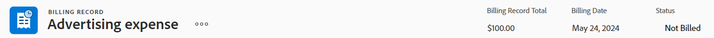
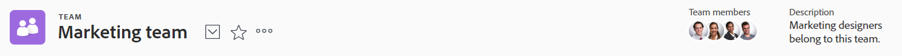

# Resumen de los encabezados de objeto

Puede ver información de un vistazo sobre los objetos de [!DNL Adobe Workfront] cuando revise su encabezado.

Además del nombre del objeto, el encabezado puede incluir el propietario del objeto, el estado o el porcentaje completado.

[!DNL Workfront] da prioridad al nombre del objeto, asignándole el mayor espacio posible en el encabezado. Cuando el nombre de un objeto es demasiado largo, se trunca. Para mostrar el nombre completo de un objeto, puede situarse sobre él.

## Acceso al encabezado de un objeto

Acceso al encabezado de un objeto en [!DNL Workfront] es idéntico para todos los objetos que lo tienen.

Por ejemplo, para acceder al encabezado de un proyecto:

1. Vaya a un proyecto.\
   El encabezado se muestra en la parte superior de la página y contiene el nombre del proyecto.

   

## [!UICONTROL Página principal] información general del encabezado

Los siguientes encabezados están disponibles en Inicio:

* Tarea: Para obtener más información sobre cómo utilizar este encabezado, consulte la [Resumen del encabezado de la tarea](#task-header-overview) en este artículo.
* Problema: Para obtener más información sobre cómo utilizar este encabezado, consulte la [Resumen del encabezado del problema](#issue-header-overview) en este artículo.

## Encabezados personalizables

Su [!DNL Workfront]  o el administrador del grupo puede personalizar el encabezado de los proyectos, las tareas y los problemas mediante una plantilla de diseño.

En este artículo se describen los encabezados predeterminados de todos los objetos, incluidos los proyectos, las tareas y los problemas.

Para obtener información sobre la personalización de información en el encabezado de un objeto, consulte [Personalización de encabezados de objeto mediante una plantilla de diseño](../../administration-and-setup/customize-workfront/use-layout-templates/customize-object-headers.md).

## Resumen del encabezado del proyecto

El encabezado del proyecto muestra la siguiente información de forma predeterminada:

<table style="table-layout:auto"> 
 <col> 
 <col> 
 <thead> 
  <tr> 
   <th>Información del encabezado</th> 
   <th>Notas</th> 
  </tr> 
 </thead> 
 <tbody> 
  <tr> 
   <td role="rowheader">Ruta de navegación con objetos principales</td> 
   <td>Si el proyecto está asociado con un programa o un portafolio, se muestran en la ruta de exploración en la esquina superior izquierda del encabezado. Al hacer clic en el nombre del objeto principal, se abre ese objeto principal.</td> 
  </tr> 
  <tr data-mc-conditions=""> 
   <td role="rowheader">Icono de objeto </td> 
   <td> 
Icono morado [!UICONTROL Project]  se muestra a la izquierda del nombre del proyecto.
 </td> 
  </tr> 
  <tr> 
   <td role="rowheader">Nombre del proyecto</td> 
   <td>Puede editar el nombre del proyecto en el encabezado.</td> 
  </tr> 
  <tr> 
   <td role="rowheader">Nombre del tipo de objeto</td> 
   <td> 
El texto "[!UICONTROL PROJECT]" aparece encima del nombre del proyecto en el encabezado.
 </td> 
  </tr> 
  <tr> 
   <td role="rowheader">El área de acciones de la tarea</td> 
   <td> 
Junto al nombre del proyecto, se muestra el área de acciones.
 
  
  </td> 
  </tr> 
  <tr> 
   <td role="rowheader">[!UICONTROL Porcentaje completado]</td> 
   <td>No se puede editar el porcentaje completado del proyecto en el encabezado.</td> 
  </tr> 
  <tr> 
   <td role="rowheader">[!UICONTROL Propietario del proyecto]</td> 
   <td> 
Puede editar el [!UICONTROL Project Owner] en el encabezado.
 </td> 
  </tr> 
  <tr> 
   <td role="rowheader">[!UICONTROL Fecha de finalización prevista] </td> 
   <td> 
Puede editar el proyecto [!UICONTROL Fecha de finalización planeada] y la hora en el encabezado si el proyecto está programado desde [!UICONTROL Fecha de finalización]. Si el proyecto está programado desde [!UICONTROL Start Date], esta información se actualiza a partir de las tareas del proyecto.
 </td> 
  </tr> 
  <tr> 
   <td role="rowheader">[!UICONTROL Condition] </td> 
   <td> 
Cuando establece el [!UICONTROL Condition Type] del proyecto en Manual, puede actualizar el proyecto [!UICONTROL Condition] en el encabezado.
</td> 
  </tr> 
  <tr> 
   <td role="rowheader">[!UICONTROL Status]</td> 
   <td>Puede editar el proyecto [!UICONTROL Status] en el encabezado.</td> 
  </tr> 
  <tr> 
   <td role="rowheader">El área [!UICONTROL Approvals]</td> 
   <td> 
Cuando sea uno de los aprobadores, utilice los iconos siguientes para administrar las aprobaciones del proyecto:
 
  </img> [!UICONTROL Aprobar]
 
  </img> [!UICONTROL Rechazar]
 
  </img> [!UICONTROL Recall]
 
Si no es aprobador, haga clic en el icono [!UICONTROL Más]  para ver información sobre el paso de aprobación actual.
 
Para obtener más información sobre las aprobaciones, consulte <a href="../../review-and-approve-work/manage-approvals/approval-process-in-workfront.md" class="MCXref xref">Información general del proceso de aprobación</a>.
 </td> 
  </tr> 
 </tbody> 
</table>

## Resumen del encabezado de la tarea

El encabezado de la tarea incluye la siguiente información de forma predeterminada:

<table style="table-layout:auto"> 
 <col> 
 <col> 
 <thead> 
  <tr> 
   <th>Información del encabezado</th> 
   <th>Notas</th> 
  </tr> 
 </thead> 
 <tbody> 
  <tr> 
   <td role="rowheader">Ruta de navegación con objetos principales</td> 
   <td> 
Los objetos principales de la tarea se muestran en la ruta de exploración. Al hacer clic en el nombre del objeto principal, se abre ese objeto principal.
 
Para obtener más información, consulte <a href="../../workfront-basics/the-new-workfront-experience/breadcrumb-overview.md" class="MCXref xref">Información general sobre rutas de exploración</a>.
 </td> 
  </tr> 
  <tr data-mc-conditions=""> 
   <td role="rowheader">Icono de objeto </td> 
   <td> 
El icono verde [!UICONTROL Task]  se muestra a la izquierda del nombre de la tarea.
 </td> 
  </tr> 
  <tr> 
   <td role="rowheader">Nombre de la tarea</td> 
   <td>Puede editar el nombre de la tarea en el encabezado.</td> 
  </tr> 
  <tr> 
   <td role="rowheader">Nombre del tipo de objeto</td> 
   <td> 
El texto "[!UICONTROL TASK]" aparece encima del nombre de la tarea en el encabezado.
 </td> 
  </tr> 
  <tr> 
   <td role="rowheader">El área de acciones de la tarea</td> 
   <td> 
Junto al nombre de la tarea, se muestra el área [!UICONTROL actions] .
 
  
 
Si aparece el icono Dependencia , puede hacer clic en el icono para ver las predecesoras o sucesoras de la tarea.
 </td> 
  </tr> 
  <tr> 
   <td role="rowheader">[!UICONTROL Porcentaje completado]</td> 
   <td>Puede editar el porcentaje de tarea completado en el encabezado.</td> 
  </tr> 
  <tr> 
   <td role="rowheader">[!UICONTROL Asignaciones]</td> 
   <td>Puede editar las asignaciones de una tarea desde el encabezado.</td> 
  </tr> 
  <tr> 
   <td role="rowheader"> 
Botón [!UICONTROL Work on It], [!UICONTROL Done] o [!UICONTROL Start Task]
 </td> 
   <td> 
Si la tarea está asignada, puede hacer clic en [!UICONTROL Work on It] o [!UICONTROL Start Task] para indicar que está trabajando en la tarea o el botón [!UICONTROL Listo] para indicar que ha completado la tarea.
 
Para obtener información sobre cómo reemplazar el botón [!UICONTROL Work On It] por un botón [!UICONTROL Start Task], consulte <a href="../../people-teams-and-groups/create-and-manage-teams/work-on-it-button-to-start-button.md" class="MCXref xref">Sustituya el botón [!UICONTROL Work On It] por un botón [!UICONTROL Start]</a>.
 </td> 
  </tr> 
  <tr> 
   <td role="rowheader">[!UICONTROL Fecha de finalización prevista]</td> 
   <td> 
Puede editar la tarea [!UICONTROL Fecha de finalización planeada] y hora en el encabezado.
 
Sugerencia: Observe que [!UICONTROL Fecha de confirmación] no está visible en el encabezado. Puede verlo en la página [!UICONTROL Details].
 </td> 
  </tr> 
  <tr> 
   <td role="rowheader">[!UICONTROL Status]</td> 
   <td>Puede editar la tarea [!UICONTROL Status] en el encabezado.</td> 
  </tr> 
  <tr> 
   <td role="rowheader">El área [!UICONTROL Approvals]</td> 
   <td> 
Cuando sea uno de los aprobadores, utilice los iconos siguientes para administrar las aprobaciones de la tarea:
 
  </img> [!UICONTROL Aprobar]
 
  </img> [!UICONTROL Rechazar]
 
  </img> [!UICONTROL Recall]
 
Si no es aprobador, haga clic en el icono [!UICONTROL Más]  para ver información sobre el paso de aprobación actual.
 
Para obtener más información sobre las aprobaciones, consulte <a href="../../review-and-approve-work/manage-approvals/approval-process-in-workfront.md" class="MCXref xref">Información general del proceso de aprobación</a>.
 </td> 
  </tr> 
 </tbody> 
</table>

## Resumen del encabezado del problema

El encabezado del problema incluye la siguiente información de forma predeterminada:

<table style="table-layout:auto"> 
 <col> 
 <col> 
 <thead> 
  <tr> 
   <th>Información del encabezado</th> 
   <th>Notas</th> 
  </tr> 
 </thead> 
 <tbody> 
  <tr> 
   <td role="rowheader">Ruta de navegación con objetos principales</td> 
   <td> 
Los objetos principales del problema se muestran en la ruta de exploración. Al hacer clic en el nombre del objeto principal, se abre ese objeto principal.
 
Para obtener más información, consulte <a href="../../workfront-basics/the-new-workfront-experience/breadcrumb-overview.md" class="MCXref xref">Información general sobre rutas de exploración</a>.
 </td> 
  </tr> 
  <tr> 
   <td role="rowheader">Icono de objeto </td> 
   <td> 
Icono rosa [!UICONTROL Problema]  se muestra a la izquierda del nombre del problema.
 </td> 
  </tr> 
  <tr> 
   <td role="rowheader">Nombre del problema</td> 
   <td>Puede editar el nombre del problema en el encabezado.</td> 
  </tr> 
  <tr> 
   <td role="rowheader">Nombre del tipo de objeto</td> 
   <td> 
El texto "[!UICONTROL ISSUE]" aparece encima del nombre del problema en el encabezado.
 </td> 
  </tr> 
  <tr> 
   <td role="rowheader">El área de acciones de la cuestión</td> 
   <td> 
Junto al nombre del problema, se muestra el área [!UICONTROL actions] .
 
  
 
Si aparece el icono [!UICONTROL Dependency] , puede hacer clic en el icono para ver si el problema se ha producido con algún predecesor o sucesor.
  </td> 
  </tr> 
  <tr> 
   <td role="rowheader">[!UICONTROL Porcentaje completado]</td> 
   <td> 
Puede editar el porcentaje completado del problema desde el encabezado.
 </td> 
  </tr> 
  <tr> 
   <td role="rowheader">[!UICONTROL Asignaciones]</td> 
   <td>Puede editar las asignaciones de un problema desde el encabezado.</td> 
  </tr> 
  <tr> 
   <td role="rowheader">[!UICONTROL Work on It], [!UICONTROL Done], o botón [!UICONTROL Start Issue]</td> 
   <td>Si el problema está asignado, puede hacer clic en [!UICONTROL Work on It] o [!UICONTROL Iniciar problema] para indicar que está trabajando en el problema, o bien el botón [!UICONTROL Listo] para indicar que ha completado el problema.Para obtener información sobre cómo reemplazar el botón [!UICONTROL Work On It] por un botón [!UICONTROL Start Task], consulte <a href="../../people-teams-and-groups/create-and-manage-teams/work-on-it-button-to-start-button.md" class="MCXref xref">Sustituya el botón [!UICONTROL Work On It] por un botón [!UICONTROL Start]</a>.</td> 
  </tr> 
  <tr> 
   <td role="rowheader">[!UICONTROL Fecha de finalización prevista]</td> 
   <td> 
Puede editar el número [!UICONTROL Fecha de finalización planeada] y hora en el encabezado.
 
Sugerencia: Observe que [!UICONTROL Fecha de confirmación] no está visible en el encabezado. Puede verlo en la página [!UICONTROL Details].
 </td> 
  </tr> 
  <tr> 
   <td role="rowheader">[!UICONTROL Status]</td> 
   <td>Puede editar el problema [!UICONTROL Status] en el encabezado.</td> 
  </tr> 
  <tr> 
   <td role="rowheader">El área [!UICONTROL Approvals]</td> 
   <td> 
Cuando sea uno de los aprobadores, utilice los iconos siguientes para administrar las aprobaciones del problema:
 
  [!UICONTROL Aprobar]
 
  [!UICONTROL Rechazar]
 
  [!UICONTROL Recall]
 
Si no es aprobador, haga clic en el icono [!UICONTROL Más]  para ver información sobre el paso de aprobación actual.
 
Para obtener más información sobre las aprobaciones, consulte <a href="../../review-and-approve-work/manage-approvals/approval-process-in-workfront.md" class="MCXref xref">Información general del proceso de aprobación</a>.
 </td> 
  </tr> 
 </tbody> 
</table>

## Información general sobre el encabezado del programa

El encabezado del programa muestra la siguiente información:

<table style="table-layout:auto"> 
 <col> 
 <col> 
 <thead> 
  <tr> 
   <th>Información del encabezado</th> 
   <th>Notas</th> 
  </tr> 
 </thead> 
 <tbody> 
  <tr> 
   <td role="rowheader">Ruta de navegación con el nombre del Portfolio</td> 
   <td> 
Puede acceder al [!UICONTROL Portfolio] desde el encabezado del [!UICONTROL Program]. Al hacer clic en el nombre del objeto principal, se abre ese objeto principal.
 
Para obtener más información, consulte <a href="../../workfront-basics/the-new-workfront-experience/breadcrumb-overview.md" class="MCXref xref">Información general sobre rutas de exploración</a>.
 </td> 
  </tr> 
  <tr> 
   <td role="rowheader">Icono de objeto </td> 
   <td> 
El icono naranja [!UICONTROL Program]  se muestra a la izquierda del nombre del programa.
 </td> 
  </tr> 
  <tr> 
   <td role="rowheader">Nombre del programa</td> 
   <td>Puede editar el nombre del programa en el encabezado.</td> 
  </tr> 
  <tr> 
   <td role="rowheader">Nombre del tipo de objeto</td> 
   <td> 
Si el programa está marcado como [!UICONTROL Activo], en el encabezado aparece el texto "[!UICONTROL PROGRAM]" encima del nombre del programa.
 </td> 
  </tr> 
  <tr> 
   <td role="rowheader">Estado de activación</td> 
   <td> 
Si el programa está desactivado, en el encabezado aparece el texto "[!UICONTROL PROGRAM DESACTIVADO]" encima del nombre del programa.
 </td> 
  </tr> 
  <tr> 
   <td role="rowheader">El ámbito de actuación del programa</td> 
   <td> 
Junto al nombre del programa, se muestra el área [!UICONTROL actions] .
 
  
 </td> 
  </tr> 
  <tr> 
   <td role="rowheader">[!UICONTROL Porcentaje completado]</td> 
   <td> 
No se puede editar el [!UICONTROL Percent Complete] del programa en el encabezado. Esta información se actualiza a partir de los proyectos del programa.
 
Sugerencia: De forma predeterminada, el porcentaje completado del programa es una media de los valores de porcentaje completado de los proyectos de un [!UICONTROL Current] o [!UICONTROL Approved Status] que pertenecen al programa.
 </td> 
  </tr> 
  <tr> 
   <td role="rowheader">[!UICONTROL Program Manager]</td> 
   <td> 
Puede editar el [!UICONTROL Program Manager] en el encabezado. Es lo mismo que el [!UICONTROL Program Owner].
 </td> 
  </tr> 
  <tr> 
   <td role="rowheader">[!UICONTROL Fecha de finalización prevista]</td> 
   <td>No se puede editar el programa [!UICONTROL Fecha de finalización planeada] en el encabezado. Esta información se actualiza a partir de la [!UICONTROL Fecha de finalización prevista] de los proyectos del programa.</td> 
  </tr> 
  <tr> 
   <td role="rowheader">[!UICONTROL Condición de proyectos activos]</td> 
   <td>Se trata de un cálculo del porcentaje de proyectos activos del programa que tienen la [!UICONTROL Condition] establecida como [!UICONTROL On Target], [!UICONTROL At Risk] o [!UICONTROL In Trouble].</td> 
  </tr> 
 </tbody> 
</table>

## información general sobre el encabezado del Portfolio {#portfolio-header-overview}

El encabezado del portafolio incluye la siguiente información:

<table style="table-layout:auto"> 
 <col> 
 <col> 
 <thead> 
  <tr> 
   <th>Información del encabezado</th> 
   <th>Notas</th> 
  </tr> 
 </thead> 
 <tbody> 
  <tr> 
   <td role="rowheader">Icono de objeto </td> 
   <td> 
Icono azul [!UICONTROL Portfolio] se muestra a la izquierda del nombre del portafolio.
 </td> 
  </tr> 
  <tr> 
   <td role="rowheader">Nombre del portafolio</td> 
   <td>Puede editar el nombre del portafolio en el encabezado.</td> 
  </tr> 
  <tr> 
   <td role="rowheader">Nombre del tipo de objeto</td> 
   <td> 
Si el portafolio está marcado como activo, el texto "[!UICONTROL PORTFOLIO]" aparece encima del nombre del portafolio en el encabezado.
 </td> 
  </tr> 
  <tr> 
   <td role="rowheader">Estado de activación</td> 
   <td> 
Si el portafolio está desactivado, en el encabezado aparece el texto "[!UICONTROL PORTFOLIO DESACTIVADO]" encima del nombre del portafolio.
 </td> 
  </tr> 
  <tr> 
   <td role="rowheader">El área [!UICONTROL actions] del portafolio</td> 
   <td> 
Junto al nombre del portafolio, se muestra el área [!UICONTROL actions] .
 
  
</td> 
  </tr> 
  <tr> 
   <td role="rowheader">[!UICONTROL Administrador de Portfolio]</td> 
   <td>Puede editar el [!UICONTROL Administrador de Portfolio] en el encabezado. Es lo mismo que el [!UICONTROL Portfolio Owner].</td> 
  </tr> 
  <tr> 
   <td role="rowheader">[!UICONTROL On Time]</td> 
   <td>Se trata de un cálculo del porcentaje de proyectos de la cartera que se encuentran actualmente a tiempo.</td> 
  </tr> 
  <tr> 
   <td role="rowheader">[!UICONTROL En El Presupuesto]</td> 
   <td>Se trata de un cálculo del porcentaje de proyectos de la cartera que están actualmente en presupuesto.</td> 
  </tr> 
  <tr> 
   <td role="rowheader">[!UICONTROL Alineado]</td> 
   <td>Se trata de un cálculo del porcentaje de proyectos del portafolio que se alinean con el portafolio.</td> 
  </tr> 
  <tr> 
   <td role="rowheader">[!UICONTROL ROI]</td> 
   <td>Este es el cálculo del [!UICONTROL Retorno de la inversión] para todos los proyectos del portafolio.</td> 
  </tr> 
  <tr> 
   <td role="rowheader">[!UICONTROL Valor neto]</td> 
   <td>Este es el cálculo del [!UICONTROL Net Value] para todos los proyectos del portafolio.</td> 
  </tr> 
 </tbody> 
</table>

## Información general sobre el encabezado de la plantilla {#template-header-overview}

El encabezado de la plantilla muestra la siguiente información:

<table style="table-layout:auto"> 
 <col> 
 <col> 
 <thead> 
  <tr> 
   <th>Información del encabezado</th> 
   <th>Notas</th> 
  </tr> 
 </thead> 
 <tbody> 
  <tr> 
   <td role="rowheader">Icono de objeto </td> 
   <td> 
El icono verde [!UICONTROL Template] se muestra a la izquierda del nombre de la plantilla.
 </td> 
  </tr> 
  <tr> 
   <td role="rowheader">Nombre de la plantilla</td> 
   <td>Puede editar el nombre de la plantilla en el encabezado.</td> 
  </tr> 
  <tr> 
   <td role="rowheader">Nombre del tipo de objeto</td> 
   <td> 
Si la plantilla está marcada como activa, el texto "[!UICONTROL TEMPLATE]" aparece encima del nombre de la plantilla en el encabezado.
 </td> 
  </tr> 
  <tr> 
   <td role="rowheader">Estado de activación</td> 
   <td> 
Si la plantilla está desactivada, el texto "[!UICONTROL PLANTILLA DESACTIVADA]" aparece encima del nombre de la plantilla en el encabezado.
 </td> 
  </tr> 
  <tr> 
   <td role="rowheader">El área de acciones de la plantilla</td> 
   <td> 
Al lado del nombre de la plantilla, se muestra el área de acciones .
 
  
 </td> 
  </tr> 
  <tr> 
   <td role="rowheader">[!UICONTROL Template Owner]</td> 
   <td>Puede editar el campo [!UICONTROL Template Owner] en el encabezado.</td> 
  </tr> 
  <tr> 
   <td role="rowheader">[!UICONTROL Duración]</td> 
   <td>Duración de la plantilla. No se puede editar este campo en el encabezado.</td> 
  </tr> 
 </tbody> 
</table>

## Descripción general del encabezado de la tarea de plantilla

El encabezado de la tarea de plantilla muestra la siguiente información:

<table style="table-layout:auto"> 
 <col> 
 <col> 
 <thead> 
  <tr> 
   <th>Información del encabezado</th> 
   <th>Notas</th> 
  </tr> 
 </thead> 
 <tbody> 
  <tr> 
   <td role="rowheader">Ruta de navegación a objetos principales</td> 
   <td> 
Los objetos principales de la tarea de plantilla se muestran en la ruta de exploración. Al hacer clic en el nombre de un objeto principal, se abre ese objeto principal.
 
Para obtener más información, consulte <a href="../../workfront-basics/the-new-workfront-experience/breadcrumb-overview.md" class="MCXref xref">Información general sobre rutas de exploración</a>.
 </td> 
  </tr> 
  <tr> 
   <td role="rowheader">Icono de objeto </td> 
   <td> 
El icono verde [!UICONTROL Task] se muestra a la izquierda del nombre de la tarea de plantilla.
 </td> 
  </tr> 
  <tr> 
   <td role="rowheader">Nombre de la tarea de plantilla</td> 
   <td>Puede editar el nombre de la tarea de plantilla en el encabezado.</td> 
  </tr> 
  <tr> 
   <td role="rowheader">Nombre del tipo de objeto</td> 
   <td> 
El texto "[!UICONTROL TEMPLATE TASK]" aparece encima del nombre de la tarea de plantilla en el encabezado.
 </td> 
  </tr> 
  <tr> 
   <td role="rowheader">El área de acciones de la tarea de plantilla</td> 
   <td> 
Al lado del nombre de la tarea de plantilla, se muestra el área de acciones .
 
  
 </td> 
  </tr> 
  <tr> 
   <td role="rowheader">[!UICONTROL Asignaciones]</td> 
   <td>Puede editar las [!UICONTROL Assigned] de la tarea de plantilla en el encabezado.</td> 
  </tr> 
  <tr> 
   <td role="rowheader">[!UICONTROL Día de finalización]</td> 
   <td>Este es el día de la duración de la plantilla en el que debería completarse la tarea de plantilla.</td> 
  </tr> 
 </tbody> 
</table>

## Resumen del encabezado Registro de facturación

El encabezado del registro de facturación muestra la siguiente información:

<table style="table-layout:auto"> 
 <col> 
 <col> 
 <thead> 
  <tr> 
   <th>Información del encabezado</th> 
   <th>Notas</th> 
  </tr> 
 </thead> 
 <tbody> 
  <tr> 
   <td role="rowheader">Ruta de navegación a objetos principales</td> 
   <td> 
Los objetos principales del registro de facturación se muestran en la ruta de exploración. Al hacer clic en el nombre de un objeto principal, se abre ese objeto principal.
 
Para obtener más información, consulte <a href="../../workfront-basics/the-new-workfront-experience/breadcrumb-overview.md" class="MCXref xref">Información general sobre rutas de exploración</a>.
 </td> 
  </tr> 
  <tr> 
   <td role="rowheader">Icono de objeto </td> 
   <td> 
El icono azul [!UICONTROL Registro de facturación]  se muestra a la izquierda del nombre del registro de facturación.
 </td> 
  </tr> 
  <tr> 
   <td role="rowheader">Nombre del registro de facturación</td> 
   <td>Puede editar el nombre del registro de facturación en el encabezado.</td> 
  </tr> 
  <tr> 
   <td role="rowheader">Nombre del tipo de objeto</td> 
   <td> 
El texto "[!UICONTROL REGISTRO DE FACTURACIÓN]" aparece encima del nombre del registro de facturación en el encabezado.
 </td> 
  </tr> 
  <tr> 
   <td role="rowheader">El área de acciones del registro de facturación</td> 
   <td> 
Junto al nombre del registro de facturación, el menú [!UICONTROL Más]  , que le permite seleccionar las siguientes opciones:
 
    <ul> 
     <li> 
[!UICONTROL Editar]
 </li> 
     <li> 
 
 </li> 
    </ul> </td> 
  </tr> 
  <tr> 
   <td role="rowheader">[!UICONTROL Registro de facturación total]</td> 
   <td>Es la cantidad total del registro de facturación. No se puede editar este campo.</td> 
  </tr> 
  <tr> 
   <td role="rowheader">[!UICONTROL Fecha de facturación]</td> 
   <td>Esta es la fecha en la que se creó el registro de facturación, a menos que se haya modificado manualmente al crear el registro de facturación. Puede editar el [!UICONTROL Billing Date] en el encabezado.</td> 
  </tr> 
  <tr> 
   <td role="rowheader">[!UICONTROL Status]</td> 
   <td> 
Cuando el registro de facturación tiene el estado [!UICONTROL Facturado], ya no puede editarlo.
 
Puede editar el estado del registro de facturación en el encabezado.
 </td> 
  </tr> 
 </tbody> 
</table>

## Información general sobre el encabezado de usuario

El encabezado del usuario muestra la siguiente información:

<table style="table-layout:auto"> 
 <col> 
 <col> 
 <thead> 
  <tr> 
   <th>Información del encabezado</th> 
   <th>Notas</th> 
  </tr> 
 </thead> 
 <tbody> 
  <tr> 
   <td role="rowheader">Imagen de perfil del usuario</td> 
   <td>No se puede actualizar la imagen de perfil en el encabezado.</td> 
  </tr> 
  <tr> 
   <td role="rowheader">Nombre del usuario y título</td> 
   <td> 
 El título del usuario se muestra en todas las mayúsculas sobre su nombre. No se puede editar el nombre del usuario en el encabezado.
 </td> 
  </tr> <!--
   <tr> 
    <td role="rowheader">Name of the object type</td> 
    <td> 
The name of the object type does not display.
 </td> 
   </tr>
  --> 
  <tr> 
   <td role="rowheader">Estado de activación</td> 
   <td> 
Si el usuario ha sido desactivado, todo el texto y la imagen de perfil del encabezado se verá atenuados.
 </td> 
  </tr> 
  <tr> 
   <td role="rowheader">El área de acciones del usuario</td> 
   <td> 
Al lado del nombre del usuario, se muestra el área de acciones.
 
  
</td> 
  </tr> 
  <tr> 
   <td role="rowheader">Dirección de correo electrónico</td> 
   <td>No se puede editar la dirección de correo electrónico en el encabezado. Normalmente también es el nombre de usuario.</td> 
  </tr> 
  <tr> 
   <td role="rowheader">Número de teléfono</td> 
   <td>No se puede editar el número de teléfono en el encabezado.</td> 
  </tr> 
  <tr> 
   <td role="rowheader">Equipos</td> 
   <td> 
Puede ver los equipos a los que pertenece el usuario. Pase el ratón sobre un avatar del equipo para mostrar el nombre del equipo. No puede editar los equipos en el encabezado.
 </td> 
  </tr> 
 </tbody> 
</table>

## Resumen del encabezado del equipo

El encabezado del equipo muestra la siguiente información:

<table style="table-layout:auto"> 
 <col> 
 <col> 
 <thead> 
  <tr> 
   <th>Información del encabezado</th> 
   <th>Notas</th> 
  </tr> 
 </thead> 
 <tbody> 
  <tr> 
   <td role="rowheader">Icono de objeto </td> 
   <td> 
Icono morado [!UICONTROL Team]  se muestra a la izquierda del nombre del equipo.
 </td> 
  </tr> 
  <tr> 
   <td role="rowheader">Nombre del equipo</td> 
   <td>Puede editar el nombre del equipo en el encabezado.</td> 
  </tr> 
  <tr> 
   <td role="rowheader">Nombre del tipo de objeto</td> 
   <td> 
El texto "[!UICONTROL TEAM]" aparece sobre el nombre del equipo en el encabezado.
 </td> 
  </tr> 
  <tr> 
   <td role="rowheader">El área de acciones del equipo</td> 
   <td> 
Junto al nombre del equipo, se muestra el área [!UICONTROL actions] .
 
  
</td> 
  </tr> 
  <tr> 
   <td role="rowheader">Imágenes de perfil de miembro del equipo</td> 
   <td>Las fotos de perfil de los integrantes del equipo. Pase el ratón sobre una imagen para ver el nombre del usuario.</td> 
  </tr> 
  <tr> 
   <td role="rowheader">Descripción</td> 
   <td>Esta es una breve descripción de los miembros del equipo. No puede editar la descripción del equipo en el encabezado.</td> 
  </tr> 
 </tbody> 
</table>

## Descripción general del encabezado de iteración

El encabezado de iteración muestra la siguiente información:

<table style="table-layout:auto"> 
 <col> 
 <col> 
 <thead> 
  <tr> 
   <th>Información del encabezado</th> 
   <th>Notas</th> 
  </tr> 
 </thead> 
 <tbody> 
  <tr> 
   <td role="rowheader">Icono de objeto </td> 
   <td> 
El icono naranja [!UICONTROL Iteration]  se muestra a la izquierda del nombre de la iteración.
 </td> 
  </tr> 
  <tr> 
   <td role="rowheader">Nombre de la iteración</td> 
   <td>Puede editar el nombre de la iteración en el encabezado.</td> 
  </tr> 
  <tr> 
   <td role="rowheader">Nombre del tipo de objeto</td> 
   <td> 
El texto "[!UICONTROL ITERATION]" aparece encima del nombre de la iteración en el encabezado.
 </td> 
  </tr> 
  <tr> 
   <td role="rowheader">El área de acciones de la iteración</td> 
   <td> 
En la esquina superior derecha del encabezado, se muestra el área de acciones.
 
  
</td> 
  </tr> 
  <tr> 
   <td role="rowheader">Propietario</td> 
   <td>Este es el [!UICONTROL Owner] de la iteración. No se puede editar el [!UICONTROL Owner] en el encabezado.</td> 
  </tr> 
  <tr> 
   <td role="rowheader">[!UICONTROL Cronología]</td> 
   <td>La [!UICONTROL Cronología] muestra las fechas de inicio y finalización de la iteración. No se puede editar la [!UICONTROL Cronología] en el encabezado.</td> 
  </tr> 
  <tr> 
   <td role="rowheader">[!UICONTROL Team]</td> 
   <td>No se puede editar el equipo de la iteración en el encabezado. Si hace clic en el nombre del equipo, se le dirigirá a la página del equipo.</td> 
  </tr> 
 </tbody> 
</table>

## Resumen del encabezado del grupo

El encabezado del grupo muestra la siguiente información:

<table style="table-layout:auto"> 
 <col> 
 <col> 
 <thead> 
  <tr> 
   <th>Información del encabezado</th> 
   <th>Notas</th> 
  </tr> 
 </thead> 
 <tbody> 
  <tr> 
   <td role="rowheader">Icono de objeto </td> 
   <td> 
El icono naranja [!UICONTROL Group]  se muestra a la izquierda del nombre del grupo.
 </td> 
  </tr> 
  <tr> 
   <td role="rowheader">Nombre del grupo</td> 
   <td>Puede editar el nombre del grupo en el encabezado.</td> 
  </tr> 
  <tr> 
   <td role="rowheader">Nombre del tipo de objeto</td> 
   <td> 
El texto "[!UICONTROL GROUP]" aparece sobre el nombre del grupo en el encabezado.
 </td> 
  </tr> 
  <tr> 
   <td role="rowheader">El área [!UICONTROL actions] del grupo</td> 
   <td> 
Junto al nombre del grupo, se muestra el menú [!UICONTROL Más]  , que le permite seleccionar las siguientes opciones:
 
    <ul> 
     <li> 
[!UICONTROL Editar]
 </li> 
     <li> 
[!UICONTROL Copy]
 </li> 
     <li> 
[!UICONTROL Eliminar]
 </li> 
    </ul> </td> 
  </tr> 
  <tr> 
   <td role="rowheader">[!UICONTROL Business Leader]</td> 
   <td>Puede editar el [!UICONTROL Business Leader] en el encabezado.</td> 
  </tr> 
  <tr> 
   <td role="rowheader">[!UICONTROL Licencias en uso] </td> 
   <td> 
El cuadro [!UICONTROL Licencias en uso] muestra el número de usuarios de licencias de [!UICONTROL Plan] y [!UICONTROL Work] en el grupo y sus subgrupos. Puede hacer clic en los números para ver esta información para los 5 tipos de licencia.
 
Para obtener más información, consulte <a href="../../administration-and-setup/manage-groups/create-and-manage-groups/view-number-licenses-allocated-used-group.md" class="MCXref xref">Ver el número de licencias asignadas y utilizadas en un grupo en la nueva [!DNL Adobe Workfront] experiencia</a>.
 </td> 
  </tr> 
  <tr> 
   <td role="rowheader">[!UICONTROL Group Administradores]</td> 
   <td>Puede editar los Administradores de grupo en el encabezado.</td> 
  </tr> 
 </tbody> 
</table>

## Resumen del encabezado del documento

El encabezado del documento muestra la siguiente información:

<table style="table-layout:auto"> 
 <col> 
 <col> 
 <thead> 
  <tr> 
   <th>Información del encabezado</th> 
   <th>Notas</th> 
  </tr> 
 </thead> 
 <tbody> 
  <tr> 
   <td role="rowheader">Ruta de navegación con objetos principales</td> 
   <td> 
Los objetos principales del documento se muestran en la ruta de exploración. Al hacer clic en el nombre de un objeto principal, se abre ese objeto principal.
 
Para obtener más información, consulte <a href="../../workfront-basics/the-new-workfront-experience/breadcrumb-overview.md" class="MCXref xref">Información general sobre rutas de exploración</a>.
 </td> 
  </tr> 
  <tr> 
   <td role="rowheader">Icono de objeto </td> 
   <td> 
El icono azul [!UICONTROL Document]  se muestra a la izquierda del nombre del documento.
 </td> 
  </tr> 
  <tr> 
   <td role="rowheader">Nombre del documento</td> 
   <td>Puede editar el nombre del documento en el encabezado.</td> 
  </tr> 
  <tr> 
   <td role="rowheader">Nombre del tipo de objeto</td> 
   <td> 
El texto "[!UICONTROL DOCUMENT]" aparece sobre el nombre del documento en el encabezado.
 </td> 
  </tr> 
  <tr> 
   <td role="rowheader">El área de acciones del documento</td> 
   <td> 
Al lado del nombre del documento, se muestra el área de acciones.
 
  
</td> 
  </tr> 
  <tr> 
   <td role="rowheader">Área de aprobación [!UICONTROL Decisión]</td> 
   <td> 
Cuando el documento se encuentra en un paso de aprobación, el área [!UICONTROL decisions] aparece en la esquina superior derecha del encabezado del documento.
 
Utilice los iconos siguientes para administrar las aprobaciones del documento:
 
  [!UICONTROL Aprobar]
 
  [!UICONTROL Recall]
 
  [!UICONTROL Rechazar]
 
Para obtener más información sobre las decisiones de aprobación, consulte <a href="../../review-and-approve-work/manage-approvals/approving-work.md" class="MCXref xref">Aprobación del trabajo </a>.
 </td> 
  </tr> 
 </tbody> 
</table>

## Resumen del encabezado de la empresa {#company-header-overview}

El encabezado de la empresa muestra la siguiente información:

<table style="table-layout:auto"> 
 <col> 
 <col> 
 <thead> 
  <tr> 
   <th>Información del encabezado</th> 
   <th>Notas</th> 
  </tr> 
 </thead> 
 <tbody> 
  <tr> 
   <td role="rowheader">Icono de objeto </td> 
   <td> 
El icono azul [!UICONTROL Company]  se muestra a la izquierda del nombre de la empresa.
 </td> 
  </tr> 
  <tr> 
   <td role="rowheader">Nombre de la empresa</td> 
   <td>Puede editar el nombre de la empresa en el encabezado.</td> 
  </tr> 
  <tr> 
   <td role="rowheader">Nombre del tipo de objeto</td> 
   <td> 
El texto "[!UICONTROL COMPANY]" aparece sobre el nombre de la empresa en el encabezado.
 </td> 
  </tr> 
  <tr> 
   <td role="rowheader">El área de acciones de la empresa</td> 
   <td> 
Junto al nombre de la empresa, el menú [!UICONTROL Más]  , que le permite seleccionar las siguientes opciones:
 
    <ul> 
     <li> 
[!UICONTROL Editar]
 </li> 
     <li> 
[!UICONTROL Eliminar compañía]
 </li> 
    </ul> </td> 
  </tr> 
 </tbody> 
</table>

## Resumen del encabezado del plan

Los planes son los objetos del [!DNL Workfront Scenario Planner]. Para obtener información sobre la variable [!DNL Scenario Planner], consulte [La variable [!DNL Scenario Planner] información general](../../scenario-planner/scenario-planner-overview.md).

El encabezado del plan muestra la siguiente información:

<table style="table-layout:auto"> 
 <col> 
 <col> 
 <thead> 
  <tr> 
   <th>Información del encabezado</th> 
   <th>Notas</th> 
  </tr> 
 </thead> 
 <tbody> 
  <tr> 
   <td role="rowheader">Volver a los planes</td> 
   <td>Al hacer clic en este vínculo, accederá a la lista [!UICONTROL Plans].</td> 
  </tr> 
  <tr> 
   <td role="rowheader">Icono de objeto </td> 
   <td> 
Icono azul [!UICONTROL Plan] se muestra a la izquierda del nombre del plan.
 </td> 
  </tr> 
  <tr> 
   <td role="rowheader">Nombre del plan</td> 
   <td>Puede editar el nombre del plan en el encabezado.</td> 
  </tr> 
  <tr> 
   <td role="rowheader">Nombre del tipo de objeto</td> 
   <td> 
El texto "[!UICONTROL PLAN]" aparece encima del nombre del plan en el encabezado.
 </td> 
  </tr> 
  <tr> 
   <td role="rowheader">El área de acciones del plan</td> 
   <td> 
Junto al nombre del plan, se muestra el área de acciones.
 
  
</td> 
  </tr> 
  <tr> 
   <td role="rowheader">Acciones adicionales del plan</td> 
   <td> 
Debajo del nombre del plan y del área de acciones, puede completar las siguientes acciones:
 
    <ul> 
     <li> 
<strong>[!UICONTROL Mostrar conflictos]</strong>: Al hacer clic en este botón de alternancia, se muestran u ocultan los conflictos en las iniciativas.
 </li> 
     <li> 
<strong>[!UICONTROL Comparar escenarios]</strong>: Al hacer clic en este vínculo, se muestra una comparación paralela de los escenarios que ha creado.
 </li> 
     <li> 
<strong>[!UICONTROL Scene selection]</strong>: En este menú desplegable, puede copiar un escenario o seleccionar para ver otro escenario.
 </li> 
    </ul> </td> 
  </tr> 
  <tr> 
   <td role="rowheader">Información sobre la función del trabajo</td> 
   <td>En el cuadro [!UICONTROL Job Role], puede ver cuántas funciones de trabajo están disponibles para el plan en comparación con cuántas se necesitan. Al hacer clic en la casilla , puede ajustar las funciones de trabajo disponibles.</td> 
  </tr> 
  <tr> 
   <td role="rowheader">Información de [!UICONTROL Financial]</td> 
   <td>En el cuadro [!UICONTROL Financial], puede ver el presupuesto, el coste y el porcentaje de utilización del plan. Al hacer clic en el cuadro, puede ajustar la cantidad del presupuesto y determinar si los costos de las personas están incluidos en el plan.</td> 
  </tr> 
  <tr> 
   <td role="rowheader">[!UICONTROL Valor neto]</td> 
   <td>En el cuadro [!UICONTROL Valor neto], puede ver el valor neto del plan en función del presupuesto y los costes especificados para el plan.</td> 
  </tr> 
  <tr> 
   <td role="rowheader">Información de [!UICONTROL compartido con]</td> 
   <td>Los usuarios que tienen acceso para ver o administrar el plan se muestran en la esquina superior derecha del encabezado. Al pasar el ratón por encima de las imágenes de su perfil, aparecerán sus nombres.</td> 
  </tr> 
  <tr> 
   <td role="rowheader">[!UICONTROL Ir a publicación]</td> 
   <td>Al hacer clic en [!UICONTROL Ir a publicación], puede crear o actualizar un proyecto vinculado a una iniciativa en el escenario que está viendo.</td> 
  </tr> 
 </tbody> 
</table>

## Información general sobre el encabezado del objetivo

Puede crear objetivos estratégicos cuando su empresa tenga acceso a los objetivos de Workfront. Para obtener más información, consulte [!DNL Workfront Goals], consulte [Introducción a [!DNL Adobe Workfront Goals]](../../workfront-goals/goal-management/getting-started-with-wf-goals.md).

El encabezado de objetivo muestra la siguiente información:

<table style="table-layout:auto"> 
 <col> 
 <col> 
 <thead> 
  <tr> 
   <th>Información del encabezado</th> 
   <th>Notas</th> 
  </tr> 
 </thead> 
 <tbody> 
  <tr> 
   <td role="rowheader">Icono de objeto </td> 
   <td> 
Icono morado [!UICONTROL Goal]  se muestra a la izquierda del nombre del objetivo.
 </td> 
  </tr> 
  <tr> 
   <td role="rowheader">Nombre del objetivo</td> 
   <td>Puede editar el nombre del objetivo en el encabezado.</td> 
  </tr> 
  <tr> 
   <td role="rowheader">Nombre del tipo de objeto</td> 
   <td> 
El texto "[!UICONTROL GOAL]" aparece encima del nombre del objetivo en el encabezado.
 </td> 
  </tr> 
  <tr> 
   <td role="rowheader">El área de acciones del objetivo</td> 
   <td> 
Junto al nombre del objetivo, se muestra el área de acciones.
 
  

   Puede realizar las siguientes acciones desde el área de acciones del objetivo:
   <ul><li>[!UICONTROL Editar]</li>
   <li>[!UICONTROL Copy objetivo]</li>
   <li>[!UICONTROL Eliminar objetivo]</li>
   <li>[!UICONTROL Compartir]</li>
   <li>[!UICONTROL Activar] o [!UICONTROL Desactivar]</li>
   <li>[!UICONTROL Cerrar] o [!UICONTROL Volver a abrir]</li>
   </td> 
  </tr> 
  <tr> 
   <td role="rowheader">[!UICONTROL Progreso]</td> 
   <td>El porcentaje del objetivo de progreso, que indica cuánto del objetivo se ha completado. No se puede actualizar el progreso del objetivo. Workfront lo calcula en función del progreso de cada indicador de progreso en el objetivo.</td> 
  </tr> 
  <tr> 
   <td role="rowheader">[!UICONTROL Propietario]</td> 
   <td>Este es el propietario del objetivo. Puede actualizar manualmente el propietario del objetivo. Los usuarios, equipos, grupos o su organización pueden ser propietarios de objetivos.</td> 
  </tr> 
  <tr> 
   <td role="rowheader">[!UICONTROL Period]</td> 
   <td>El lapso de tiempo durante el cual se debe completar el objetivo. </td> 
  </tr> 
  <tr> 
   <td role="rowheader">[!UICONTROL Condition]</td> 
   <td>La condición de objetivo indica si el objetivo está en la meta de completarse a tiempo o si está rezagado </td> 
  </tr> 
  <tr> 
   <td role="rowheader">[!UICONTROL Status]</td> 
   <td>Indica si el objetivo está activo, nuevo o cerrado. No puede actualizar manualmente el estado de objetivo. Para obtener más información, consulte <a href="../../workfront-goals/goal-management/goal-status-overview.md" class="MCXref xref">Información general sobre el estado del objetivo en [!DNL Adobe Workfront Goals]</a></td> 
  </tr> 
 </tbody> 
</table>