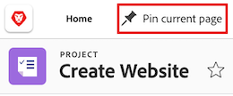
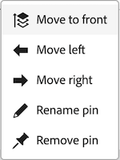

# Anclar páginas para personalizar el espacio de trabajo

<!-- Audited: 4/2025 -->

Puede anclar su trabajo más importante en [!DNL Adobe Workfront] para obtener una mayor visibilidad, una mejor organización y un acceso más rápido. Siempre se puede acceder a las páginas ancladas desde la parte superior de cualquier página de Workfront.

Es posible que se le asigne una plantilla de diseño que ya tenga páginas ancladas (como se describe en [Personalizar páginas ancladas con una plantilla de diseño](../../administration-and-setup/customize-workfront/use-layout-templates/customize-pinned-pages.md)). No se puede cambiar el nombre de estos anclajes predefinidos ni quitarlos. Todas las páginas ancladas se muestran a la derecha de los anclajes predefinidos.

## Requisitos de acceso

+++ Expanda para ver los requisitos de acceso para la funcionalidad en este artículo.

Debe tener el siguiente acceso para realizar los pasos de este artículo:

<table style="table-layout:auto"> 
 <col> 
 </col> 
 <col> 
 </col> 
 <tbody> 
  <tr> 
   <td role="rowheader"><strong>[!DNL Adobe Workfront] plan</strong></td> 
   <td> 
Cualquiera
 </td> 
  </tr> 
  <tr> 
   <td role="rowheader"><strong>[!DNL Adobe Workfront] licencia</strong></td> 
   <td> 
Nuevo: colaborador
 
   
O

     
Actual: Solicitud

   </td> 
  </tr> 
 </tbody> 
</table>

Para obtener más información sobre el contenido de esta tabla, consulte [Requisitos de acceso en la documentación de Workfront](/help/quicksilver/administration-and-setup/add-users/access-levels-and-object-permissions/access-level-requirements-in-documentation.md).

+++

## Anclar una página

1. Desplácese hasta la página que desee anclar. Puede ser cualquier elemento de trabajo, como un proyecto, una tarea, una cola de solicitudes, etc.

1. En la esquina superior izquierda de la página, haga clic en **[!UICONTROL Anclar página actual]**. Ahora se podrá acceder a la página anclada desde la parte superior de cualquier página de [!DNL Workfront].

   

## Acceder a una página anclada

1. En la parte superior de cualquier página, haga clic en la página anclada que desee ver.

   >[!TIP]
   >
   >Pase el puntero por encima de una página anclada para ver el nombre completo y la descripción.

   O

   Si tiene muchas páginas ancladas, haga clic en el icono **[!UICONTROL Más]**  para ver otras páginas ancladas.

   

   Se mostrará la página anclada.

## Cambiar el nombre de una página anclada

1. Pase el ratón sobre la página anclada en la barra de navegación superior.
1. Haga clic en el icono **Más**  que aparece junto al nombre del pin y seleccione **[!UICONTROL Cambiar nombre de pin]**.

   

1. Escriba el nuevo nombre de anclaje y haga clic en **Guardar**.

   

## Reordenar páginas ancladas

Puede reorganizar el orden en que aparecen las páginas ancladas.

1. Pase el ratón sobre la página anclada que quiera mover y luego haga clic en el icono **Más** .
1. Elige **Mover a la izquierda** o **Mover a la derecha** para mover tu pin.
1. (Opcional) Elija **Mover al frente** para mover el pin a la posición más a la izquierda de la barra de pin.

   

   Los cambios se guardarán automáticamente y se recordarán la próxima vez que acceda a Workfront.

## Quitar una página anclada

1. Haga clic en el icono **Más**  que está junto al anclaje que desea eliminar.
1. Haga clic en **Quitar anclaje**. La página dejará de estar accesible desde la parte superior de cualquier página de [!DNL Workfront].

   

