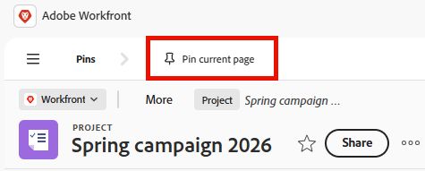
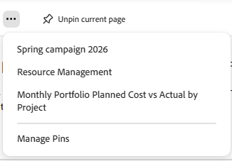
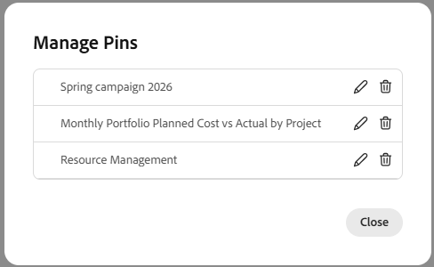
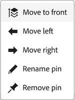
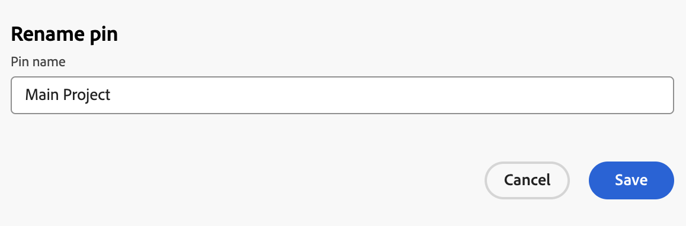

# Anclar páginas para personalizar el espacio de trabajo

<!-- Audited: 4/2025 -->

Puede anclar su trabajo más importante en [!DNL Adobe Workfront] para obtener una mayor visibilidad, una mejor organización y un acceso más rápido. Siempre se puede acceder a las páginas ancladas desde la parte superior de cualquier página de Workfront.

Es posible que se le asigne una plantilla de diseño que ya tenga páginas ancladas (como se describe en [Personalizar páginas ancladas con una plantilla de diseño](../../administration-and-setup/customize-workfront/use-layout-templates/customize-pinned-pages.md)). No se puede cambiar el nombre de estos anclajes predefinidos ni quitarlos. Todas las páginas ancladas se muestran a la derecha de los anclajes predefinidos.

## Requisitos de acceso

+++ Expanda para ver los requisitos de acceso para la funcionalidad en este artículo.

<table style="table-layout:auto"> 
 <col> 
 </col> 
 <col> 
 </col> 
 <tbody> 
  <tr> 
   <td role="rowheader"><strong>[!DNL Adobe Workfront] paquete</strong></td> 
   <td> 
Cualquiera
 </td> 
  </tr> 
  <tr> 
   <td role="rowheader"><strong>[!DNL Adobe Workfront] licencia</strong></td> 
   <td> 
Colaborador
 
     
Solicitud

   </td> 
  </tr> 
 </tbody> 
</table>

Para obtener más información, consulte [Requisitos de acceso en la documentación de Workfront](/help/quicksilver/administration-and-setup/add-users/access-levels-and-object-permissions/access-level-requirements-in-documentation.md).

+++

## Anclar una página

1. Desplácese hasta la página que desee anclar. Puede ser cualquier elemento de trabajo, como un proyecto, una tarea, una cola de solicitudes, etc.

1. En la esquina superior izquierda de la página, haga clic en **[!UICONTROL Anclar página actual]**. Ahora se podrá acceder a la página anclada desde la parte superior de cualquier página de [!DNL Workfront].

   

## Acceder a una página anclada

1. En la parte superior de cualquier página, haga clic en la página anclada que desee ver.

   >[!TIP]
   >
   >Pase el puntero por encima de una página anclada para ver el nombre completo y la descripción.

   O

   Si tiene muchas páginas ancladas, haga clic en el icono **[!UICONTROL Más]**  para ver otras páginas ancladas.

   

   Se mostrará la página anclada.

## Administrar anclajes

Puede cambiar el nombre, reordenar y quitar páginas ancladas en un solo lugar.

1. Haga clic en el icono **[!UICONTROL Más]**  en la fila de anclajes y seleccione **Administrar anclajes**.
1. En el cuadro **Administrar anclajes**, realice una o más de las siguientes acciones:

   * Haga clic en el icono **Editar** para cambiar el nombre de una página anclada. Escriba el nuevo nombre y haga clic en el icono de marca de verificación para confirmar.
   * Arrastre y suelte las páginas ancladas en el orden en que desee que aparezcan.
   * Haga clic en el icono **Eliminar** para eliminar una página anclada de la lista.

   

1. Haga clic en **Cerrar** cuando haya terminado de editar anclajes.

<!--
## Rename a pinned page

1. Hover over the pinned page in the top navigation.
1. Click the **More** icon  that appears next to the pin name and select **[!UICONTROL Rename pin]**.

   

1. Type the new pin name, then click **Save**.

   

## Reorder pinned pages

You can rearrange the order that pinned pages appear.

1. Hover over the pinned page you want to move, then click the **More** icon .
1. Choose **Move left** or **Move right** to move your pin. 
1. (Optional) Choose **Move to front** to move your pin to the far-left position of the pin bar. 

   

   Your changes automatically save and are remembered the next time you access Workfront.

## Remove a pinned page

1. Click the **More** icon  next to the pin you want to remove.
1. Click **Remove pin**. The page is no longer accessible from the top of any page in [!DNL Workfront].

   
-->

