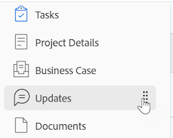

# Navegación izquierda en [!DNL Adobe Workfront]

La mayoría de las áreas y objetos de WF utilizan un panel de navegación sencillo en el lado izquierdo de la pantalla. Las siguientes son las ventajas de la navegación desde el panel izquierdo:

* Permite una mejor gestión del espacio de pantalla.
* Su [!DNL Workfront] el administrador puede ocultar cualquier sección del panel izquierdo excepto los detalles del objeto mediante plantillas de diseño.

   Para obtener información sobre el uso de plantillas de diseño, consulte el artículo [Creación y administración de plantillas de diseño](../../administration-and-setup/customize-workfront/use-layout-templates/create-and-manage-layout-templates.md).

* Puede cambiar fácilmente el orden de las secciones en la navegación izquierda sin abrir pantallas adicionales arrastrándolas y soltándolas en el orden que desee.

   Para obtener más información, consulte la siguiente sección en este artículo: [Uso del panel de navegación izquierdo](#use-the-left-navigation-panel).

* Puede personalizar el panel izquierdo añadiendo un panel.

## Requisitos de acceso

Debe tener el siguiente acceso para realizar los pasos de este artículo:

<table style="table-layout:auto"> 
 <col> 
 </col> 
 <col> 
 </col> 
 <tbody> 
  <tr> 
   <td role="rowheader"><strong>[!DNL Adobe Workfront] plan*</strong></td> 
   <td> 
Cualquiera
 </td> 
  </tr> 
  <tr> 
   <td role="rowheader"><strong>[!DNL Adobe Workfront] licencia*</strong></td> 
   <td> 
[!UICONTROL Request] o superior
 </td> 
  </tr> 
 </tbody> 
</table>

&#42;Para averiguar qué plan o tipo de licencia tiene, póngase en contacto con su [!DNL Workfront] administrador.

## Secciones predeterminadas en el panel de navegación izquierdo

Puede acceder a más información sobre objetos o áreas desde el panel izquierdo para varios objetos o áreas en Adobe Workfront.

Según el objeto o el área a la que haya navegado, las secciones que aparecen en el panel izquierdo son diferentes.

El panel izquierdo está disponible para los siguientes objetos:

* Proyecto
* Tarea
* Problema
* Portafolio
* Programar
* Plantilla
* Tarea de plantilla
* Iteración
* Usuario
* Equipo
* Grupo
* Meta

>[!IMPORTANT]
>
>Si el panel izquierdo muestra sólo una sección de forma predeterminada, como **[!UICONTROL Todos los proyectos]** en el **[!UICONTROL Proyectos]** área—a [!DNL Workfront] El administrador debe agregar al menos una sección personalizada a esta área al crear una plantilla de diseño y asignarle a esa plantilla antes de que se muestre el panel izquierdo en esa área.\
>Para obtener información acerca de cómo [!DNL Workfront] El administrador personaliza el panel izquierdo en una plantilla de diseño. Consulte [Personalización del panel izquierdo con una plantilla de diseño](../../administration-and-setup/customize-workfront/use-layout-templates/customize-left-panel.md).

El panel izquierdo está disponible para las siguientes áreas:

* [Secciones predeterminadas en la [!UICONTROL Paneles] área](#default-sections-in-the-dashboards-area)
* [Secciones predeterminadas en la [!UICONTROL Solicitudes] área](#default-sections-in-the-requests-area)
* [Secciones predeterminadas en la [!UICONTROL Recursos] área](#default-sections-in-the-resourcing-area)
* [Secciones predeterminadas en la [!UICONTROL Proyectos] área](#default-sections-in-the-projects-area)
* [Secciones predeterminadas en la [!UICONTROL Plantillas de horas] área](#default-sections-in-the-timesheets-area)
* [Secciones predeterminadas en la [!DNL Goals] área](#default-sections-in-the-goals-area)

### Secciones predeterminadas en la [!UICONTROL Paneles] área

Las siguientes secciones se muestran en el panel izquierdo para **[!UICONTROL Paneles]** área:

<table style="table-layout:auto">
    <tr>
        <td><strong>[!UICONTROL Mis paneles]</strong></td>
        <td>Muestra los paneles que ha creado.</td>
    </tr>
    <tr>
        <td><strong>[!UICONTROL Tableros compartidos]</strong></td>
        <td>Muestra los tableros que han creado otros usuarios y que se han compartido con usted.</td>
    </tr>
    <tr>
        <td><strong>[!UICONTROL Todos los paneles]</strong></td>
        <td>Muestra los tableros que usted u otros usuarios han creado y para los que tiene permisos de al menos Ver.</td>
    </tr>
</table>

Para aprender a utilizar el panel izquierdo en el área de Paneles, consulte la sección [Uso del panel de navegación izquierdo](#use-the-left-navigation-panel) en este artículo.

### Secciones predeterminadas en la [!UICONTROL Solicitudes] área

<table style="table-layout:auto">
    <tr>
        <td><strong>[!UICONTROL Enviado]</strong></td>
        <td>Muestra las solicitudes que usted u otros usuarios han enviado y para las que tiene permisos de al menos Ver. Utilice los filtros de la esquina superior derecha de la lista de solicitudes para ver las solicitudes que otros usuarios han enviado y usted tiene acceso a la vista.</td>
    </tr>
    <tr>
        <td><strong>[!UICONTROL Borradores]</strong></td>
        <td>Muestra las solicitudes que ha iniciado pero aún no las ha enviado. [!DNL Workfront] guarda automáticamente cualquier nueva solicitud en la carpeta Borradores, después de seleccionar el tema de la cola.</td>
    </tr>
</table>

Para aprender a utilizar el panel izquierdo de [!UICONTROL Solicitudes] , consulte la sección [Uso del panel de navegación izquierdo](#use-the-left-navigation-panel) en este artículo.

### Secciones predeterminadas en la [!UICONTROL Recursos] área

Las siguientes secciones se muestran en el panel izquierdo para **[!UICONTROL Recursos]** área:

<table style="table-layout:auto"> 
 <col> 
 <col> 
 <tbody> 
  <tr> 
   <td role="rowheader"><strong>Planificador</strong></td> 
   <td>Muestra el Planificador de recursos. Utilice esta área para planificar los recursos en varios proyectos. Para obtener información sobre el uso del Planificador de recursos, consulte <a href="../../resource-mgmt/resource-planning/get-started-resource-planning.md" class="MCXref xref">Introducción a la planificación de recursos</a>.</td> 
  </tr> 
  <tr> 
   <td role="rowheader"><strong>[!UICONTROL Distribuidor de cargas de trabajo]</strong></td> 
   <td>Muestra el Distribuidor de cargas de trabajo. Utilice esta área para asignar trabajo real a los recursos.  
   Para obtener información sobre el uso de los recursos de programación, consulte <a href="../../resource-mgmt/workload-balancer/assign-work-in-workload-balancer.md" class="MCXref xref">Información general sobre la asignación de trabajo en el Distribuidor de cargas de trabajo</a>.</td> 
  </tr> 
  <tr> 
   <td role="rowheader"><strong>Utilización</strong></td> 
   <td>Muestra el Informe de utilización. Para obtener información sobre cómo leer el Informe de utilización, consulte <a href="../../reports-and-dashboards/reports/using-built-in-reports/resource-utilization-report.md" class="MCXref xref">Descripción general del informe Utilización de los recursos</a>.</td> 
  </tr> 
  <tr> 
   <td role="rowheader"><strong>Conjuntos de recursos</strong></td> 
   <td>Muestra todos los conjuntos de recursos de Workfront. Para obtener información sobre conjuntos de recursos, consulte <a href="../../resource-mgmt/resource-planning/resource-pools/work-with-resource-pools.md" class="MCXref xref"> Resumen de conjuntos de recursos </a>.</td>
  </tr> 
 </tbody> 
</table>

Para aprender a utilizar el panel izquierdo de [!UICONTROL Recursos] , consulte la sección [Uso del panel de navegación izquierdo](#use-the-left-navigation-panel) en este artículo.

### Secciones predeterminadas en la [!UICONTROL Proyectos] área

Las siguientes secciones se muestran en el panel izquierdo para **[!UICONTROL Proyectos]** área:

<table style="table-layout:auto">
    <tr>
        <td><strong>[!UICONTROL Todos los proyectos]</strong></td>
        <td>Muestra todos los proyectos a los que tiene acceso para ver. Utilice el menú desplegable [!UICONTROL Filtro] para cambiar los proyectos que desea ver</td>
    </tr>
    <tr>
        <td><strong>[!UICONTROL Secciones personalizadas]</strong></td>
        <td>Puede ver todas las secciones personalizadas que [!DNL Workfront] El administrador ha agregado al panel izquierdo del área de [!UICONTROL Proyectos] de la plantilla de diseño. Las secciones personalizadas tienen nombres que se han personalizado para su entorno.</td>
    </tr>
</table>

Para aprender a utilizar el panel izquierdo de [!UICONTROL Proyectos] , consulte la sección [Uso del panel de navegación izquierdo](#use-the-left-navigation-panel) en este artículo.

### Secciones predeterminadas en la [!UICONTROL Plantillas de horas] área

Las siguientes secciones se muestran en el panel izquierdo para **[!UICONTROL Plantillas de horas]** área:

<table style="table-layout:auto">
    <tr>
        <td><strong>[!UICONTROL Mis hojas de horas]</strong></td>
        <td>Muestra todas las hojas de horas activas de forma predeterminada. Para mostrar las plantillas de horas enviadas o cerradas, seleccione [!UICONTROL Enviado] o [!UICONTROL Todo] en el menú desplegable [!UICONTROL Filtro].</td>
    </tr>
    <tr>
        <td><strong>Hojas de horas de [!UICONTROL I Approve]</strong></td>
        <td>Muestra de forma predeterminada las hojas de horas que se han enviado para su aprobación. Para mostrar las hojas de horas activas o todas las hojas de horas donde usted sea el aprobador, seleccione [!UICONTROL Active] o Aplicación en el menú desplegable Filtro.</td>
    </tr>
    <tr>
        <td><strong>[!UICONTROL Todas las hojas de horas]</strong></td>
        <td>Muestra todas las hojas de horas que tiene acceso para ver, en función de los filtros seleccionados en el área de filtro de la izquierda.</td>
    </tr>
</table>

Para aprender a utilizar el panel izquierdo de [!UICONTROL Plantillas de horas] , consulte la sección [Uso del panel de navegación izquierdo](#use-the-left-navigation-panel) en este artículo.

### Secciones predeterminadas en la [!DNL Goals] área

>[!NOTE]
>
>El acceso a los objetivos requiere una licencia adicional. Para obtener información acerca de [!DNL Workfront Goals], consulte [[!DNL Adobe Workfront Goals] descripción general](../../workfront-goals/goal-management/wf-goals-overview.md).

Las siguientes secciones se muestran en el panel izquierdo para **[!UICONTROL Metas]** área:

<table style="table-layout:auto">
    <tr>
        <td><strong>[!UICONTROL Lista de metas]</strong></td>
        <td>Muestra todas las metas que tiene acceso para ver. Para obtener más información, consulte <a href="../../workfront-goals/goal-review-and-workfront-goals-sections/manage-goals-in-goal-list.md">Administrar metas en la [!UICONTROL Lista de metas] de [!DNL Adobe Workfront Goals]</a>.</td>
    </tr>
    <tr>
        <td><strong>[!UICONTROL Gráficos]</strong></td>
        <td>Muestra el rendimiento de sus objetivos en gráficos. Para obtener más información, consulte <a href="../../workfront-goals/goal-review-and-workfront-goals-sections/review-goal-graphs.md">Revise los gráficos para comprender las tendencias del progreso del objetivo en [!DNL Adobe Workfront] Metas</a>.</td>
    </tr>
    <tr>
        <td><strong>[!UICONTROL Alineación de metas]</strong></td>
        <td>Muestra la alineación de los objetivos entre sí en una jerarquía. Para obtener más información, consulte <a href="../../workfront-goals/goal-alignment/goal-alignment-overview.md">Información general sobre la alineación de objetivos en [!DNL Adobe Workfront Goals]</a>.</td>
    </tr>
    </table>

<!--
   Drafted - removed from UI 
   <table>
    <tr>
        <td><strong>[!UICONTROL Pulse]</strong></td>
        <td>Displays a quick overview of all active goals and their progress. For more information, see <a href="../../workfront-goals/goal-review-and-workfront-goals-sections/review-goals-in-pulse.md">Review goals in the [!UICONTROL [!DNL Adobe Workfront Goals] Pulse] section</a>.
        
This section has been removed from the Preview environment.

        </td>
    </tr>
    <tr>
        <td><strong>[!UICONTROL Check-in]</strong></td>
        <td>Displays a quick overview of your active goals and their progress. For more information, see <a href="../../workfront-goals/goal-review-and-workfront-goals-sections/check-in-goals.md">Update goal progress in [!DNL Adobe Workfront Goals]</a>.
        
This section has been removed from the Preview environment.

        </td>
    </tr>
</table>
-->
Para aprender a utilizar el panel izquierdo de [!UICONTROL Metas] , consulte la sección [Uso del panel de navegación izquierdo](#use-the-left-navigation-panel) en este artículo.

## Uso del panel de navegación izquierdo

Buscar y editar información en el panel izquierdo es similar para estos objetos. Las opciones disponibles en el panel izquierdo son diferentes según el objeto al que acceda.

Para saber qué secciones están disponibles para áreas específicas, consulte [[!UICONTROL Secciones predeterminadas] en el panel de navegación izquierdo](#default-sections-in-the-left-navigation-panel).

1. Haga clic en **[!UICONTROL Menú principal]** icono A continuación, haga clic en el nombre de un objeto para acceder a él.

   Se muestra la página del objeto.

1. (Condicional) Si seleccionó un área que contiene una lista de objetos, como **[!UICONTROL Proyectos]** o **[!UICONTROL Portfolio]**: debe hacer lo siguiente para acceder a la navegación del panel izquierdo:

   1. Haga clic en un objeto de la lista.
   1. (Opcional) En el panel de navegación izquierdo, puede seleccionar otro objeto, como **[!UICONTROL Tareas]** o **[!UICONTROL Problemas]** dentro de un proyecto: en el panel izquierdo para acceder a una lista de objetos y, a continuación, haga clic en el nombre del objeto específico.\

      Se muestra la página del objeto.

1. En la página del objeto, haga clic en cualquiera de las secciones del panel izquierdo para ver o editar la información de esa sección.

   Debe tener permisos para editar el objeto antes de poder editar la información.

   

1. (Opcional) Haga clic en **[!UICONTROL Mostrar más]** en la parte inferior del panel izquierdo para mostrar más secciones.

   >[!NOTE]
   >
   >Esta opción no está disponible si todas las secciones se muestran en el panel izquierdo de forma predeterminada.

1. (Opcional) Para añadir un vínculo rápido de panel, haga clic en **[!UICONTROL Agregar panel]** en la parte inferior del panel izquierdo, haga lo siguiente:

   1. Escriba un nombre para el tablero en **[!UICONTROL Nombre de vínculo rápido]** field.
   1. Empiece a escribir el nombre de un tablero existente en la **[!UICONTROL Elegir un tablero]** y, a continuación, haga clic en el panel cuando se muestre en la lista.

      >[!TIP]
      >
      >Debe generar el tablero antes de que aparezca en la lista.

   1. Clic **[!UICONTROL Añadir]**.

      El vínculo del panel aparece en la parte inferior del panel izquierdo.

1. (Opcional) Para cambiar el orden de una sección en el panel izquierdo, haga clic en **[!UICONTROL Arrastrar]** icono  a la derecha de una sección y arrástrela arriba o abajo.

   

1. (Opcional) Para cerrar el panel izquierdo, haga clic en **[!UICONTROL Contraer]** icono .

   >[!NOTE]
   >
   >Cuando contraiga el panel izquierdo, [!DNL Workfront] conserva su preferencia incluso cuando navega a otro sitio [!DNL Workfront] objeto. Para expandir de nuevo el panel izquierdo, haga clic en **[!UICONTROL Expandir]** icono .
