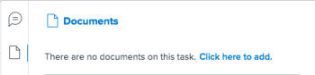

# [!UICONTROL Resumen] información general

Puede usar la variable [!UICONTROL Resumen] para revisar y actualizar la información del elemento de trabajo directamente desde una lista de tareas problemas, documentos o desde otras áreas de [!DNL Adobe Workfront] que muestran tareas y problemas.

La tabla siguiente muestra las áreas en las que puede ubicar y utilizar el [!UICONTROL Resumen] panel:

<table style="table-layout:auto"> 
 <col data-mc-conditions=""> 
 <tbody> 
  <tr> 
   <td>Tareas</td> 
  </tr> 
  <tr> 
   <td> 
Listas de tareas dentro de un
 
    <ul> 
     <li>Proyecto</li> 
     <li>Subtarea</li> 
    </ul> </td> 
  </tr> 
  <tr> 
   <td>Tareas en las áreas de trabajo [!UICONTROL No asignado] y [!UICONTROL Asignado] del [!DNL Workload Balancer]</td> 
  </tr> 
  <tr data-mc-conditions=""> 
   <td>Problemas</td> 
  </tr> 
  <tr data-mc-conditions=""> 
   <td> 
Listas de problemas dentro de un
 
    <ul> 
     <li>Proyecto</li> 
     <li>Tarea</li> 
     <li>Subtarea</li> 
    </ul> </td> 
  </tr> 
  <tr data-mc-conditions=""> 
   <td>Problemas en el área [!UICONTROL Trabajo asignado] de [!DNL Workload Balancer]</td> 
  </tr> 
  <tr data-mc-conditions=""> 
   <td>Problemas en la sección [!UICONTROL Enviado] del área [!UICONTROL Solicitudes]</td> 
  </tr> 
  <tr data-mc-conditions=""> 
   <td>Documentos</td> 
  </tr> 
  <tr data-mc-conditions=""> 
   <td>Área [!UICONTROL Documents]</td> 
  </tr> 
  <tr data-mc-conditions=""> 
   <td>sección [!UICONTROL Documents] de cualquier objeto (proyecto, tarea, problema, programa, portafolio, plantilla, tarea de plantilla, usuario)</td> 
  </tr> 
 </tbody> 
</table>

<!--

Workfront administrators can customize the Summary in the Layout Template. For more information, see <a href="../../administration-and-setup/customize-workfront/use-layout-templates/create-and-manage-layout-templates.md" class="MCXref xref">Create and manage layout templates</a>.

-->

Este artículo describe cómo acceder y usar el [!UICONTROL Resumen] para tareas y problemas en listas.

Para obtener información sobre cómo acceder a la variable [!UICONTROL Resumen] en el [!DNL Workload Balancer], consulte [Actualizar elementos de trabajo en [!DNL Workload Balancer] usando la variable [!UICONTROL Resumen]](../../resource-mgmt/workload-balancer/update-items-in-summary-panel-in-workload-balancer.md).

Para obtener información sobre cómo acceder a la variable [!UICONTROL Resumen] para documentos, consulte [[!UICONTROL Resumen] información general sobre documentos](../../documents/managing-documents/summary-for-documents.md).

## Requisitos de acceso

Debe tener el siguiente acceso para realizar los pasos de este artículo:

<table style="table-layout:auto"> 
 <col> 
 <col> 
 <tbody> 
  <tr> 
   <td role="rowheader"><strong>[!DNL Adobe Workfront] plan*</strong></td> 
   <td> 
Cualquiera
 </td> 
  </tr> 
  <tr> 
   <td role="rowheader"><strong>[!DNL Adobe Workfront] licencia*</strong></td> 
   <td> 
[!UICONTROL Request] o superior
 </td> 
  </tr> 
  <tr> 
   <td role="rowheader"><strong>Configuraciones de nivel de acceso*</strong></td> 
   <td> 
[!UICONTROL View] o acceso superior a Tareas, problemas, documentos
 
[!UICONTROL View] o acceso superior a cualquier objeto para el que desee ver los documentos' [!UICONTROL Summary]
 
Nota: Si todavía no tiene acceso, pregunte a su [!DNL Workfront] administrador si establecen restricciones adicionales en su nivel de acceso. Para obtener información sobre cómo se [!DNL Workfront] administrador puede modificar el nivel de acceso, consulte <a href="../../administration-and-setup/add-users/configure-and-grant-access/create-modify-access-levels.md" class="MCXref xref">Crear o modificar niveles de acceso personalizados</a>.
 </td> 
  </tr> 
  <tr> 
   <td role="rowheader"><strong>Permisos de objeto</strong></td> 
   <td> 
Permisos de [!UICONTROL View] o permisos superiores para una tarea, un problema o un documento
 
Para obtener información sobre la solicitud de acceso adicional, consulte <a href="../../workfront-basics/grant-and-request-access-to-objects/request-access.md" class="MCXref xref">Solicitar acceso a objetos </a>.
 </td> 
  </tr> 
 </tbody> 
</table>

&#42;Para saber qué plan, tipo de licencia o acceso tiene, póngase en contacto con su [!DNL Workfront] administrador.

## Consulte la [!UICONTROL Resumen] en una lista de tareas o problemas

1. Vaya a una tarea o problema y seleccione un elemento de la lista.
1. Haga clic en el **[!UICONTROL Resumen]** icono 

   o

   Haga clic en el **[!UICONTROL Abrir resumen]** icono  en el [!UICONTROL Enviado] de la sección [!UICONTROL Solicitudes] .

   Después de abrir el Resumen, permanece abierto mientras hace clic o selecciona otras tareas o problemas y permanece abierto hasta que lo cierra manualmente.

   >[!TIP]
   >
   >Solo se puede seleccionar una tarea o un problema a la vez para ver sus detalles en el [!UICONTROL Resumen] panel.

   

1. (Opcional) Para cerrar el [!UICONTROL Resumen] realice una de las siguientes acciones:

   * En una lista de tareas o problemas, haga clic en el botón **[!UICONTROL Abrir resumen]** icono 

      O

      Haga clic en el **X** en la esquina superior derecha de la [!UICONTROL Resumen] panel.

   * En el [!UICONTROL Enviado] de la sección [!UICONTROL Solicitudes] , haga clic en el **[!UICONTROL Cerrar resumen]** icono 

      O

      Haga clic en el **X** en la esquina superior derecha del panel Resumen.

## [!UICONTROL Porcentaje completado]

Utilice la barra de progreso situada en la parte superior del [!UICONTROL Resumen] para actualizar el porcentaje completado de la tarea o el problema que ha seleccionado. Escriba un número o arrastre la barra al porcentaje correcto.

## [!UICONTROL Actualizaciones]

Utilice la variable [!UICONTROL Actualizaciones] de la sección [!UICONTROL Resumen] para ver actualizaciones recientes y realizar actualizaciones sobre la tarea o el problema que ha seleccionado. Haga clic en **[!UICONTROL Ver todo]** para ir directamente a la [!UICONTROL Actualizaciones] en la tarea.

## [!UICONTROL Documentos]

Utilice la variable [!UICONTROL Documentos] de la sección [!UICONTROL Resumen] para ver los documentos adjuntos a la tarea o al problema que ha seleccionado. Haga clic en la miniatura para abrir una vista previa del documento. Para ir directamente a la [!UICONTROL Documentos] en la tarea o problema, haga clic en la pestaña **[!UICONTROL Documentos]** título.

## [!UICONTROL Detalles]

Utilice la variable [!UICONTROL Detalles] de la sección [!UICONTROL Resumen] para ver detalles de elementos de trabajo de alto nivel, realizar asignaciones o agregar fechas de inicio. Haga clic en **[!UICONTROL Ver todo]** para ir directamente a la [!UICONTROL Detalles] en la tarea o problema.

>[!NOTE]
>
>Los campos que aparecen en esta sección son los mismos que aparecen en el panel derecho de Inicio. Puede personalizar estos campos [Personalizar [!UICONTROL Página principal] y [!UICONTROL Resumen] uso de una plantilla de diseño](../../administration-and-setup/customize-workfront/use-layout-templates/customize-home-summary-layout-template.md).

## [!UICONTROL Subtareas]

Esta sección solo está disponible para tareas. Utilice la variable [!UICONTROL Subtareas] de la sección [!UICONTROL Resumen] para ver [!UICONTROL Nuevo], [!UICONTROL En curso]y [!UICONTROL Cerrado] subtareas de la tarea seleccionada. Haga clic en el **[!UICONTROL Estado]** menú desplegable para cambiar entre estados. Para ir directamente a la [!UICONTROL Subtareas] en la tarea, haga clic en la pestaña **[!UICONTROL Subtareas]**&#x200B; título.

Si no ha añadido ninguna subtarea a la tarea, haga clic en **[!UICONTROL Añada uno aquí]** para ir directamente a la [!UICONTROL Subtareas] en la tarea.

## [!UICONTROL Horas]

Utilice la variable [!UICONTROL Horas] de la sección [!UICONTROL Resumen] para registrar horas en la tarea o el problema que ha seleccionado. Haga clic en **[!UICONTROL Tiempo de registro]** e introduzca sus horas. Para ir directamente a la pestaña Horas de la tarea o el problema, haga clic en el botón **[!UICONTROL Horas]** título.

El recuento de horas en la variable [!UICONTROL Resumen] muestra las horas de registro. Otros usuarios tendrán totales de horas diferentes en la variable [!UICONTROL Resumen] según la hora en la que inicien sesión en la tarea.

Si no hay planificado [!UICONTROL horas] en la tarea o problema y ha registrado la hora, la barra de horas aparece en rojo.

## Rutas de aprobación

Utilice la variable [!UICONTROL Aprobaciones] de la sección [!UICONTROL Resumen] para ver las aprobaciones adjuntas a la tarea o al problema que ha seleccionado. Si no ha añadido ninguna aprobación, seleccione una aprobación existente en el menú desplegable o haga clic en **[!UICONTROL Crear un proceso de aprobación de un solo uso]** para ir directamente a la [!UICONTROL Aprobaciones] en la tarea o problema.

Para ir directamente a la [!UICONTROL Aprobaciones] en la tarea o problema, haga clic en la pestaña **[!UICONTROL Aprobaciones]** título.

