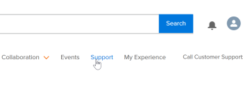

# Póngase en contacto con el servicio de atención al cliente

<!--Audited: 12/2023-->

<!--

(We need to keep this as a standalone article. It is linked in multiple articles and FAQs.)

-->

Como cliente de [!DNL Adobe Workfront], puede ponerse en contacto con el equipo de atención al cliente de [!DNL Workfront] por teléfono o enviando un ticket en línea.

>[!NOTE]
>
>Para problemas críticos, póngase en contacto con la atención al cliente de [!DNL Workfront] por teléfono.

## Requisitos de acceso

+++ Expanda para ver los requisitos de acceso para la funcionalidad en este artículo.

Debe tener el siguiente acceso para realizar los pasos de este artículo:

<table style="table-layout:auto"> 
 <col> 
 <col> 
 <tbody> 
  <tr> 
   <td role="rowheader">Plan de Adobe Workfront</td> 
   <td>Cualquiera</td> 
  </tr> 
  <tr> 
  <tr> 
   <td role="rowheader">Licencia de Adobe Workfront</td> 
   <td>
Nuevo: estándar

       
O

       
Actual: plan
</td>
  </tr> 
  </tr> 
  <tr> 
   <td role="rowheader">Configuraciones de nivel de acceso</td> 
   <td>Debe ser administrador del sistema.</td>
  </tr> 
 </tbody> 
</table>

Para obtener más información sobre el contenido de esta tabla, consulte [Requisitos de acceso en la documentación de Workfront](/help/quicksilver/administration-and-setup/add-users/access-levels-and-object-permissions/access-level-requirements-in-documentation.md).

+++

## Teléfono

Puede ponerse en contacto con [!DNL Workfront Customer Support] los 7 días de la semana, las 24 horas del día, a través de los números siguientes:

* EE.UU.: 866-329-5273
* EMEA: +44 800 169 0454
* Australia: +61 180 035 8683

<!--Old numbers - before 2/10/2025:

* US: 844-306-HELP(4357)
* EMEA: +44 1256 274200
* Australia: +61 1800 849259

-->

## Web

Puede enviar un ticket de asistencia técnica desde el portal de autoservicio de [!DNL Experience League].

>[!IMPORTANT]
>
>Solo los contactos de asistencia autorizados (o los usuarios con derechos de asistencia) pueden enviar tickets de asistencia en línea.

1. En el sitio web [[!DNL Experience League]](https://experienceleague.adobe.com), haga clic en **[!UICONTROL Asistencia técnica]** en la parte superior de la página.

   

   Se abre la página [!UICONTROL Asistencia].

   Desde la página de inicio de [!UICONTROL Asistencia], puede navegar a sus casos de asistencia abiertos, registrar un caso nuevo, ver los artículos de [!UICONTROL Asistencia] principales o acceder a fuentes de formación adicionales.

<!--1. To submit a case, select the option **[!UICONTROL Open a support case]**, then click **[!UICONTROL Sign] In**.-->

1. Haga clic en **[!UICONTROL Abrir vale]** en la barra lateral izquierda.
Se abre la página de [!UICONTROL creación de caso], en la que puede escribir el nombre del producto ([!DNL Adobe Workfront], [!DNL Adobe Workfront Fusion], etc.), el título del caso y la descripción del caso.

   >[!TIP]
   >
   >Sea lo más descriptivo posible al describir el problema que tiene para ayudarnos a acelerar el proceso de resolución de problemas.

1. Cumplimente la información de los siguientes campos para proporcionarnos detalles más específicos:

   * **[!UICONTROL Prioridad del caso]** ([!UICONTROL Baja], [!UICONTROL Media], [!UICONTROL Alta], [!UICONTROL Crítica])
   * **[!UICONTROL Producto del caso]** ([!UICONTROL DAM], [!DNL Fusion], [!DNL Goals], etc.)
   * **[!UICONTROL Entorno]** ([!UICONTROL Producción], [!UICONTROL Vista previa], [!UICONTROL Zona protegida], etc.)
   * **[!UICONTROL Área geográfica del cliente]** (América, EMEA, APAC)

1. Cargue los archivos correspondientes, luego haga clic en **[!UICONTROL Enviar caso]**.

   El caso se envía y se muestra la página [!UICONTROL Mis casos].

   <!--
   
   -->

Si tiene alguna pregunta o problema al enviar una solicitud, llame al equipo de asistencia al cliente.

## Ver y administrar sus casos de asistencia

1. Vaya a la página **[!UICONTROL Mis casos]**. Esta página se abre cuando envía un caso o puede abrirla haciendo clic en **[!UICONTROL Mis casos]** en el panel de navegación izquierdo.

1. (Opcional) Utilice las opciones de la parte superior de la página para filtrar por **Producto (solución [!DNL Experience Cloud])** o caso **[!UICONTROL Estado]** ([!UICONTROL Abierto] o Cerrado). También puede utilizar el cuadro de [!UICONTROL búsqueda] para buscar cualquier palabra clave que pertenezca a sus casos de asistencia técnica.

1. (Opcional) Para ver más detalles sobre un caso, haga clic en **Número de caso** para acceder a él.

   Se abre la vista de caso.

1. (Opcional) En la vista de caso, revise los últimos comentarios con el propietario del caso asignado y añada cualquier archivo adjunto o respuesta adicional.

1. (Opcional) Para escalar el caso, haga clic en **[!UICONTROL Escalar a administración]** en la parte derecha de la página bajo **[!UICONTROL Detalle del caso]**.

1. (Opcional) Para cerrar el caso, haga clic en el botón **[!UICONTROL Cerrar caso]**.

<!--drafted: I took the information above from this blog post by Jon Chen (on September 13, 2022): https://experienceleaguecommunities.adobe.com/t5/workfront-blogs/how-to-submit-a-support-ticket-on-experience-league/ba-p/461737)

- this is the information that was there before - pointing to WorkfrontOne: 

If you are logged in as an Authorized Support Contact, you can contact Workfront Customer Support through the Workfront One site and create a case, formally called a ticket.

1. Log in to [**one.workfront.com**](https://one.workfront.com/) as an Authorized Support Contact.
1. On the **Home** page, click **Support**.

   

   The Customer Support page displays.

   >[!NOTE]
   >
   >If you don't see the Support option on the Home page, you are not an Authorized Support Contact. Your Workfront administrator can contact Workfront Customer Support and request you be added an Authorized Support Contact. If you are the only Workfront administrator for your organization, contact the Workfront Support team by phone.

1. Complete the fields in the **Create a Support Case** form. All fields are required.  

   <table style="table-layout:auto">
    <tr>
        <td><strong>Subject</strong></td>
        <td>Type a brief question or explanation of the issue you are experiencing.</td>
    </tr>
    <tr>
        <td><strong>Description</strong></td>
        <td>Type a detailed description of the issue. Include as much information as possible.</td>
    </tr>
    <tr>
        <td><strong>Priority</strong></td>
        <td> </td>
    </tr>
    <tr>
        <td><strong>Case Product</strong></td>
        <td>Select the product in which you are experiencing the issue. If the issue is not related to a specific product, select None.</td>
    </tr>
    <tr>
        <td><strong>Product Area</strong></td>
        <td>Select the area of the product that best relates to the issue. If the related area is not listed in the drop-down menu, select Not Listed.</td>
    </tr>
    <tr>
        <td><strong>Environment</strong></td>
        <td>Select the environment in which the issue occurs. If you are seeing the issue in both the Production and Sandbox environments, please select Production.</td>
    </tr>
    <tr>
        <td><strong>Customer Region</strong></td>
        <td> </td>
    </tr>
   </table>

1. (Optional) Attach a file, such as an image or video file.

   1. At the bottom of the form, click **Upload File**.
   1. Click **Upload File**, then browse for and select the desired file.

      

   1. Click **Done** to upload the file to the case.

1. Click **Submit** to submit the case to Workfront Customer Support.

-->

