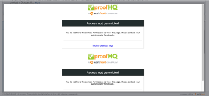

# Resolución de problemas de permisos de [!UICONTROL [!DNL Workfront] Proof Manager]

A continuación se muestran los perfiles de permiso disponibles en [!DNL Adobe Workfront] para los usuarios de revisión:

* [!UICONTROL Administrador]
* [!UICONTROL Supervisor]
* [!UICONTROL Gerente]

<!--For detailed information about these options and how to configure them, see .-->

Al conceder permisos como [!UICONTROL Gerente] a un usuario, está disponible la siguiente información para solucionar problemas:

* **PROBLEMA:** los usuarios con permisos como [!UICONTROL Gerente] no pueden ver las pruebas creadas por otros usuarios. Alternativamente, verán la pantalla [!UICONTROL Acceso denegado].

  

  **SOLUCIÓN:** los usuarios con permisos como [!UICONTROL Gerente] deben añadirse explícitamente a las pruebas. Las pruebas siempre se deben crear a través de la ventana [!UICONTROL Opciones de revisión avanzadas] y los usuarios siempre se deben añadir a través de esta opción.

* **PROBLEMA:** los usuarios con permisos como [!UICONTROL Gerenter] no pueden añadir versiones de prueba a las pruebas creadas por otros usuarios (podrían potencialmente enviar una prueba en el conjunto de documentos, pero las versiones NO se conectarían al conjunto original creado por otro usuario).\
   **SOLUCIÓN:** los usuarios con permisos como [!UICONTROL Gerente] pueden enviar las versiones a la prueba de otro usuario solamente si el usuario con permisos como [!UICONTROL Gerente] cumple ambos de los supuestos siguientes:

   * Se han añadido explícitamente a las pruebas
   * Se han establecido como [!UICONTROL Autores] (función de prueba) en las pruebas

* **PROBLEMA:** los usuarios con permisos como [!UICONTROL Gerente] no pueden editar los comentarios de otros usuarios sobre una prueba que no es de su propiedad o que no han creado.\
   **SOLUCIÓN:** si los usuarios con permisos como [!UICONTROL Gerente] no son propietarios de las pruebas, pero deberían poder editar los comentarios, añádalos como [!UICONTROL Autores] (o [!UICONTROL Moderadores]).\
   Estos tres tipos de permisos están disponibles en [!DNL Workfront] para las licencias de tipo [!UICONTROL Planificador], [!UICONTROL Trabajador], [!UICONTROL Solicitante], [!UICONTROL Revisor]. El administrador del sistema o el administrador de usuarios de [!DNL Workfront] pueden editar los perfiles de los usuarios y ajustar los permisos de [!DNL Workfront Proof] desde allí.
