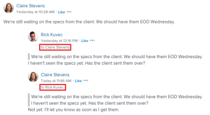

# Etiquetar a otros en las actualizaciones

<!--Audited: April, 2024-->

<!--
>[!IMPORTANT]
>
>We are currently redesigning the commenting experience in Adobe Workfront.
>
>Depending on what objects you access the commenting experience for, you might see the following functionality for the Updates section:
>* The new experience
>* The legacy experience
>* The new and the legacy experience
>
>For more information about the new commenting experience and its availability, see [New commenting experience](../../product-announcements/betas/new-commenting-experience-beta/unified-commenting-experience.md). 
>
> The legacy commenting experience has been removed from projects, tasks, issues, and documents in the Preview environment. 
>
>The new commenting experience is available only for the Updates section of Workfront objects, and it is not available when you access updates from the following areas:
>
> * Home
> * Summary panel in lists
> * Summary panel in timesheets 
> * Summary panel in the Workload Balancer
>
>The new commenting experience is available in the Summary panel in lists, timesheets, and the Workload Balancer in the Preview environment and in the Production environment for customers who have opted for the fast release process.  
-->

Puede etiquetar a los usuarios al realizar una actualización de un objeto si desea llamar su atención sobre un objeto que podrían no seguir de otra manera.

En lugar de incluir a esos usuarios en el objeto asignándolos a él o haciendo que se suscriban a él, puede etiquetarlos en la actualización para compartirla con ellos. Los usuarios etiquetados reciben una notificación de Workfront sobre la actualización que introduce. Según su configuración de notificación, también reciben un correo electrónico sobre la actualización que introduzca.

## Consideraciones sobre el etiquetado de usuarios en actualizaciones

* Los usuarios etiquetados en las actualizaciones deben habilitar una notificación personal en su perfil para que reciban la notificación por correo electrónico. Para obtener más información, consulte [Modificar sus propias notificaciones por correo electrónico](../../workfront-basics/using-notifications/activate-or-deactivate-your-own-event-notifications.md).

  Para obtener información sobre cómo agregar actualizaciones a objetos de Workfront, consulte [Actualizar trabajo](../../workfront-basics/updating-work-items-and-viewing-updates/update-work.md).

* Cuando un problema se convierte en un proyecto o tarea, las actualizaciones se copian en el nuevo proyecto o tarea, pero los usuarios etiquetados no. Para continuar la conversación, debe volver a etiquetar a los participantes.

## Requisitos de acceso

Debe tener el siguiente acceso para realizar los pasos de este artículo:

<table style="table-layout:auto">
 <col> 
 <col> 
 <tbody> 
  <tr> 
   <td role="rowheader"><strong>plan de Adobe Workfront</strong></td> 
   <td> 
Cualquiera
 </td> 
  </tr> 
  <tr> 
   <td role="rowheader"><strong>Licencia de Adobe Workfront*</strong></td> 
   <td> 
Nuevo: Colaborador o superior para problemas y documentos; claro o superior para el resto de objetos

   
Actual: Solicitud o superior para problemas y documentos; Revisar o superior para todos los demás objetos
 </td> 
  </tr> 
  <tr> 
   <td role="rowheader"><strong>Configuración del nivel de acceso</strong></td> 
   <td> 
Permite ver o acceder a los objetos en los que se desea publicar la respuesta.
 </td> 
  </tr> 
  <tr> 
   <td role="rowheader"><strong>Permiso de objeto</strong></td> 
   <td> 
Ver o permisos superiores a los objetos donde desea publicar la respuesta
 </td> 
  </tr> 
 </tbody> 
</table>

*Para saber qué plan, tipo de licencia o acceso tiene, póngase en contacto con su administrador de Workfront. Para obtener más información, consulte [Requisitos de acceso para la documentación de Workfront](/help/quicksilver/administration-and-setup/add-users/access-levels-and-object-permissions/access-level-requirements-in-documentation.md).

## Etiquetar a otros en las actualizaciones

Puede etiquetar a otros en las actualizaciones de las siguientes maneras:

* **Automáticamente**: Cuando un usuario inicia un hilo de conversación, añade un comentario o añade una respuesta, se etiquetan automáticamente y se añaden al área de Etiquetar personas o equipos del cuadro de comentarios.
* **Manualmente**: Cuando agrega manualmente un usuario al área de Etiquetar personas del cuadro de comentarios.

También puede quitar usuarios etiquetados por error cuando edite o responda a un comentario.

1. Comience a actualizar un elemento de trabajo como se describe en [Actualizar trabajo](../../workfront-basics/updating-work-items-and-viewing-updates/update-work.md). Como propietario del comentario, se le etiqueta automáticamente y se le agrega al área Etiquetar personas o equipos del cuadro de comentarios.

   >[!TIP]
   >
   >El propietario del comentario no puede ver su propio nombre en el área Etiquetar personas o equipos del cuadro de comentarios.

1. En el **Etiquetar personas o equipos** , empiece a escribir el nombre del usuario o equipo que desea incluir y, a continuación, haga clic en el nombre cuando aparezca en la lista desplegable.

   O

   Escriba el símbolo @ en la **Escribir un comentario** , empiece a escribir el nombre del usuario o equipo que desee incluir en la actualización y, a continuación, haga clic en el nombre cuando aparezca en la lista desplegable.

   >[!TIP]
   > 
   >Para identificar al usuario correcto cuando hay usuarios con nombres similares o idénticos, observe el avatar, la función principal del usuario o su dirección de correo electrónico.
   > 
   >Los usuarios deben estar asociados con al menos una función del trabajo para verla a medida que los etiqueta en una actualización.
   > 
   >Debe tener activada la configuración Ver información de contacto en su nivel de acceso para que los usuarios vean los correos electrónicos de los usuarios. Para obtener más información, consulte [Concesión de acceso a los usuarios](../../administration-and-setup/add-users/configure-and-grant-access/grant-access-other-users.md).

   

1. (Opcional) Para que la actualización sea privada, habilite **Privado para mi compañía** en la esquina inferior derecha del cuadro actualizar. Esto hace que la actualización sea visible solo para los usuarios de la compañía. El **Privado para mi compañía** Esta opción solo está disponible cuando se especifica una Compañía en el perfil de Workfront.

   >[!NOTE]
   >
   >* Esta opción solo se muestra cuando el usuario está asociado a una Empresa.
   >* Los usuarios etiquetados fuera de la empresa podrían seguir recibiendo una notificación en la aplicación o un correo electrónico, aunque no vean los comentarios privados en la pestaña Actualizaciones. Se recomienda no etiquetar a los usuarios externos en una actualización si no desea compartir la información con ellos.

1. (Opcional) Para agregar varios usuarios y equipos, repita el paso 2. <!--insure this stays accurate-->

   >[!NOTE]
   >
   >Todos los usuarios y miembros del equipo enumerados en el campo &quot;Etiquetar personas o equipos&quot; reciben una notificación en la aplicación para la actualización y pueden recibir un correo electrónico, según la configuración de su notificación por correo electrónico. Los usuarios que se etiquetan a sí mismos en un comentario o respuesta reciben una notificación por ese comentario o respuesta y pueden ver su nombre en la lista como miembro del hilo durante el resto del hilo, pero no reciben otra notificación a menos que se vuelvan a etiquetar a sí mismos. Para obtener más información, consulte [Modificar sus propias notificaciones por correo electrónico](../../workfront-basics/using-notifications/activate-or-deactivate-your-own-event-notifications.md) y [Configurar notificaciones de eventos para todos los usuarios del sistema](../../administration-and-setup/manage-workfront/emails/configure-event-notifications-for-everyone-in-the-system.md).

1. Clic **Enviar**.\
   A los usuarios incluidos en la actualización se les concede automáticamente el permiso Ver al objeto y pueden ver y responder a las actualizaciones realizadas en el objeto.

   Los nombres de las entidades etiquetadas se muestran junto a sus avatares, con un máximo de dos entidades. Si se etiquetan más de dos entidades, se muestra el nombre de la primera, además de una serie de entidades adicionales.

   

   Cuando se le etiqueta en el texto del comentario, su nombre se resalta en esos comentarios.

   Para obtener información sobre la funcionalidad adicional disponible al actualizar un elemento de trabajo, consulte [Actualizar trabajo](../../workfront-basics/updating-work-items-and-viewing-updates/update-work.md).

1. (Opcional) Haga clic en **Más** menú  en la esquina superior derecha del comentario y haga clic en **Editar**. Elimine cualquiera de los usuarios etiquetados y haga clic en **Enviar**.

   >[!IMPORTANT]
   >
   >Solo puede editar un comentario 15 minutos después de haberlo introducido. Solo puede editar los comentarios que ha añadido.

<!--
   >[!TIP]
   >
   >When using the legacy commenting experience to add comments and replies, comment owners that were not specifically tagged cannot be manually removed by people who use the new commenting experience.
-->

<!--
### Tag others on updates in the legacy Updates section

You can manually tag users in the legacy Updates section. 

1. Begin updating a work item, as described in [Update work](../../workfront-basics/updating-work-items-and-viewing-updates/update-work.md).
1. In the **Notify** field, begin typing the name of the user or team you want to include, then click the name when it appears in the drop-down list.

   Or

   Type the @ symbol in the **Start a new update** area, begin typing the name of the user or team you want to include on the update, then click the name when it appears in the drop-down list.

   >[!TIP]
   >
   >To identify the correct user when there are users with similar or identical names, notice the avatar, the user's Primary Role, or their email address. 
   >
   >Users must be associated with at least one job role to view it as you tag them in an update. 
   >
   >You must have the View Contact Info setting enabled in your access level for Users to view users' emails. For information, see [Grant access to users](../../administration-and-setup/add-users/configure-and-grant-access/grant-access-other-users.md).

   

1. (Optional) To make the update private, enable **Private to my company** in the lower-right corner of the update box. This makes the update visible just to users in your company. The **Private to my company** option is available only when a Company is specified in your Workfront profile. 

   >[!NOTE]
   >
   >Tagged users outside the company could still receive an in-app notification or email, even though they will not see the private comments on the Updates tab. We recommend not to tag external users on an update if you do not want to share the information with them.  

1. (Optional) To add multiple users and teams, repeat step 2.

   >[!NOTE]
   >
   >All users and team members listed in the Notify field receive an in-app notification for the update and might receive an email, depending on the configuration of their email notification settings. Users who tag themselves in a comment or reply receive a notification for that comment or reply and can see their name in the Notify field for the remainder of the thread, but they do not receive another notification unless they tag themselves again. For more information, see [Modify your own email notifications](../../workfront-basics/using-notifications/activate-or-deactivate-your-own-event-notifications.md) and [Configure event notifications for everyone in the system](../../administration-and-setup/manage-workfront/emails/configure-event-notifications-for-everyone-in-the-system.md).

1. Click **Update**.  
   Users included in the update are automatically granted View permission to the object and can view and respond to updates made to the object.

   You can see who has been tagged in each reply at the top of the update thread. These users, along with any users subscribed to the object, receive a notification whenever an update or reply is made on the object.

   
-->

Para obtener información sobre la funcionalidad adicional disponible al actualizar un elemento de trabajo, consulte [Actualizar trabajo](../../workfront-basics/updating-work-items-and-viewing-updates/update-work.md).

