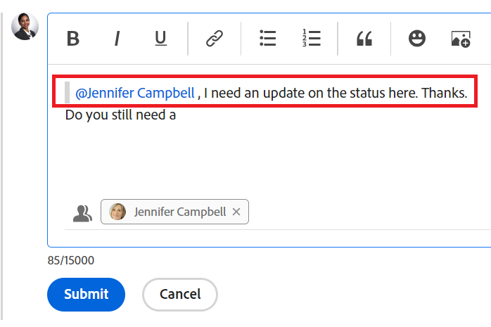

# Actualizar trabajo

<!-- Audited: 1/2024 -->

<!--take "legacy" and "new commenting" references out when we remove the legacy - Jan 2024???-->

La información resaltada en esta página hace referencia a funcionalidades que aún no están disponibles de forma general. Solo está disponible en el entorno de vista previa para todos los clientes. 

Para obtener más información sobre la programación actual de versiones, consulte [Información general sobre la versión del primer trimestre de 2024](../../product-announcements/product-releases/24-q1-release-activity/24-q1-release-overview.md).

<!--
After the monthly releases to Production, the same features are also available in the Production environment for customers who enabled fast releases.   
For information about fast releases, see [Enable or disable fast releases for your organization](../../administration-and-setup/set-up-workfront/configure-system-defaults/enable-fast-release-process.md)  
-->

>[!IMPORTANT]
>
>Actualmente estamos rediseñando la experiencia de comentarios en Adobe Workfront.
>
>Según los objetos para los que acceda a la experiencia de comentarios, es posible que vea la siguiente funcionalidad para la sección Actualizaciones:
>* La nueva experiencia
>* La experiencia heredada
>* La nueva experiencia y la experiencia heredada
>
>Para obtener más información sobre la nueva experiencia de comentarios y su disponibilidad, consulte [Nueva experiencia de comentarios](../../product-announcements/betas/new-commenting-experience-beta/unified-commenting-experience.md).
>
>La nueva experiencia de comentarios solo está disponible para la sección Actualizaciones de los objetos de Workfront y no está disponible al acceder a las actualizaciones desde las áreas siguientes:
>
> * Inicio
> * Panel de resumen en listas
> * Panel de resumen en plantillas de horas
> * Panel de resumen en el Distribuidor de cargas de trabajo

<!-- with October 26 release: add somewhere this, and decide where we need to keep information about the legacy commenting. Should we create an article about iterations comments like we have for goals and cards?!:

>[!NOTE]
>
>Iterations display the legacy commenting experience.-->

<!--old message, before Auhust 17: 

>[!NOTE]
>
>We are currently redesigning the commenting experience in Adobe Workfront.
>
>For more information about the new commenting experience, see [New commenting experience](../../product-announcements/betas/new-commenting-experience-beta/unified-commenting-experience.md). 
>
>You can access the new experience for the following objects:
> * Issues, projects, tasks, and documents.
>
>     This is available when you enable the commenting Beta experience.
>
>     This functionality is available only for the Updates section, and it is not available for the following areas:
>
>     * Home
>     * Summary panel in lists
>     * Summary panel in timesheets
>
> * Goals, cards in the Boards area
>
>   The new commenting experience is the only experience for goals and cards. You must have an additional license to access Workfront Goals. For more information, see [Requirements to use Workfront Goals](../../workfront-goals/goal-management/access-needed-for-wf-goals.md). 
>
>     You can add and view updates to cards in the Boards area when you enable the Comments and System Activity sections on a card. For more information, see [Add an ad hoc card to a board](../../agile/get-started-with-boards/add-card-to-board.md).
-->

## Consideraciones acerca de la actualización del trabajo

* Puede agregar comentarios a la mayoría de los objetos de Adobe Workfront en la sección Actualizaciones. Para obtener más información sobre los objetos que muestran la sección Actualizaciones, consulte [Información general de la sección Actualizaciones](../updating-work-items-and-viewing-updates/updates-tab-overview.md).

* Puede agregar comentarios a objetos de Workfront desde otras aplicaciones integradas con Workfront o desde la aplicación móvil de Workfront.

  No todas las aplicaciones integradas con Workfront pueden agregar comentarios a objetos de Workfront.

  No todas las funciones disponibles en la sección Actualizaciones de un objeto de Workfront están disponibles en otras aplicaciones al acceder a objetos de Workfront desde la aplicación. Por ejemplo, es posible que las funciones de texto enriquecido o hacer que un comentario sea privado para la compañía de otra persona no estén disponibles cuando se agregan comentarios a un objeto de Workfront desde una aplicación de terceros.

* Puede comunicar el progreso de un objeto de Workfront (proyecto, tarea o problema) mientras realiza comentarios sobre el objeto. Los usuarios asignados o suscritos al objeto pueden recibir una notificación sobre la actualización. Cualquier persona con acceso de tipo Ver en el objeto puede ver la actualización.

* Puede etiquetar a los usuarios para que presten atención a la actualización. Los usuarios etiquetados reciben una notificación en la aplicación y un correo electrónico sobre su actualización.

  >[!TIP]
  >
  >   En la nueva experiencia de comentarios, los propietarios de comentarios se etiquetan automáticamente. Para obtener más información, consulte [Etiquetar a otros en las actualizaciones](../../workfront-basics/updating-work-items-and-viewing-updates/tag-others-on-updates.md).
  <!--take the "in the new commenting experience" out when this is the only experience-->

* Puede agregar un comentario a un objeto que pueda ver, o bien puede iniciar sesión como Workfront o administrador de grupo y agregar un comentario en nombre de otro usuario. Para obtener más información, consulte [Iniciar sesión como otro usuario](../../administration-and-setup/add-users/create-and-manage-users/log-in-as-another-user.md).

* Puede agregar una actualización a proyectos, tareas y problemas desde las siguientes áreas de Workfront:

   * Desde un objeto de Workfront, en la sección Actualizaciones
   * Desde el área de Inicio (para tareas y problemas)
   * Desde el panel Resumen en una lista de objetos, una plantilla de horas o desde el Distribuidor de cargas de trabajo (para tareas y problemas)

En la información de esta página se describe cómo se pueden realizar comentarios sobre los objetos de Workfront y cómo se actualizan los proyectos, las tareas y los problemas al agregarles comentarios.

<!--take this out (below) when we remove legacy out of the application-->

Para obtener información sobre cómo comentar los objetivos, consulte [Administrar comentarios sobre metas en Adobe Workfront Goals](../../workfront-goals/goal-management/manage-goal-comments.md). Debe tener una licencia adicional para acceder a los objetivos de Workfront.

Para obtener información sobre cómo comentar tarjetas en el área Tableros, consulte [Añadir una tarjeta ad hoc a un tablero](../../agile/get-started-with-boards/add-card-to-board.md).

## Requisitos de acceso

Debe tener el siguiente acceso para realizar los pasos de este artículo:

<table style="table-layout:auto"> 
 <col> 
 </col> 
 <col> 
 </col> 
 <tbody> 
  <tr> 
   <td role="rowheader"><strong>plan de Adobe Workfront</strong></td> 
   <td> 
Cualquiera
 </td> 
  </tr> 
  <tr> 
   <td role="rowheader"><strong>Licencia de Adobe Workfront</strong></td> 
   <td> 
   
Actual: Solicitud o superior para problemas y documentos; Revisar o superior para todos los demás objetos

   
Nuevo: Colaborador o superior para problemas y documentos: Ligero o superior para todos los demás objetos
 
   </td> 
  </tr> 
  <tr> 
   <td role="rowheader"><strong>Configuraciones de nivel de acceso</strong></td> 
   <td> 
Acceso de visualización o edición para el objeto en el que se encuentra la actualización
</td> 
  </tr> 
  <tr> 
   <td role="rowheader"><strong>Permisos de objeto</strong></td> 
   <td> 
Ver acceso al objeto
</td> 
  </tr> 
 </tbody> 
</table>

Para obtener más información sobre esta tabla, consulte [Requisitos de acceso en la documentación de Workfront](/help/quicksilver/administration-and-setup/add-users/access-levels-and-object-permissions/access-level-requirements-in-documentation.md).

## Agregar una actualización a un elemento de trabajo

La adición de una actualización a un elemento de trabajo varía en función de la versión de la sección Actualizaciones que utilice.

Puede añadir actualizaciones a los siguientes objetos:

* Proyectos
* Tareas
* Problemas
* Programas
* Portafolios
* Plantillas
* Tareas de plantilla
* Usuarios
* Hojas de horas
* Equipos
* Metas
* Tarjetas en el área de Tableros
* Iteraciones

### Agregar una actualización a un elemento de trabajo en la sección Actualizaciones heredadas

>[!IMPORTANT]
>
>La información de esta página describe cómo actualizar proyectos, tareas y problemas.

1. Vaya al elemento de trabajo para el que desea proporcionar una actualización (como un proyecto, tarea o problema).
1. Haga clic en **Actualizaciones** sección.
1. (Condicional) Si está activada, haga clic en el botón **Nuevos comentarios** en la esquina superior derecha de la sección Actualizaciones para desactivarla y activar la experiencia de comentarios heredada.
1. Clic **Iniciar una nueva actualización,** a continuación, escriba la actualización.
1. (Opcional) Utilice las opciones de la barra de herramientas Texto enriquecido para dar formato al texto, agregar emojis, vínculos o imágenes a la actualización para mejorar el contenido. Para obtener más información, consulte la [Usar texto enriquecido en una actualización de Workfront](#use-rich-text-in-a-workfront-update) de este artículo.
1. (Opcional) Actualice cualquiera de la siguiente información sobre el elemento de trabajo:

   <table style="table-layout:auto"> 
    <col> 
    <col> 
    <tbody> 
     <tr> 
      <td role="rowheader"><strong>Notificar</strong></td> 
      <td>Identifique a los usuarios a los que se debe notificar la actualización. Los usuarios asignados o suscritos al objeto reciben automáticamente una notificación cuando se realiza una actualización. 
Para obtener información sobre cómo incluir a otros en una actualización, consulte <a href="../../workfront-basics/updating-work-items-and-viewing-updates/tag-others-on-updates.md" class="MCXref xref">Etiquetar a otros en las actualizaciones</a>.
</td> 
     </tr> 
     <tr> 
      <td role="rowheader"><strong>Fecha de confirmación</strong></td> 
      <td>En el selector de fechas, seleccione la fecha en la que se compromete a completar el elemento de trabajo. Para obtener información sobre la fecha de confirmación, consulte <a href="../../manage-work/projects/updating-work-in-a-project/overview-of-commit-dates.md" class="MCXref xref">Resumen de fecha de confirmación</a>.</td> 
     </tr> 
     <tr> 
      <td role="rowheader"><strong>Condición</strong></td> 
      <td>Seleccione una nueva condición para la tarea o el problema. Para obtener información sobre cómo seleccionar una condición, consulte <a href="../../manage-work/projects/updating-work-in-a-project/update-condition-for-tasks-and-issues.md" class="MCXref xref">Actualizar condición para tareas y problemas</a>.</td> 
     </tr> 
     <tr> 
      <td role="rowheader"><strong>Estado</strong></td> 
      <td>Haga clic en la flecha situada junto al estado actual y, a continuación, seleccione el estado deseado en el menú desplegable. Para obtener información sobre cómo establecer un estado, consulte <a href="../../manage-work/projects/updating-work-in-a-project/update-task-status.md" class="MCXref xref">Actualizar estado de la tarea</a>.
La actualización del estado de un elemento de trabajo no cambia automáticamente el estado de un proyecto. Según la configuración del proyecto, puede realizar actualizaciones del estado del proyecto por separado. Para obtener más información sobre los distintos tipos de actualización de proyectos, consulte <a href="../../manage-work/projects/manage-projects/select-project-update-type.md" class="MCXref xref">Seleccione el tipo de actualización del proyecto </a>.

<b>NOTA</b>

   No puede cambiar el estado de un elemento de trabajo mientras esté en estado de Aprobación pendiente.
</td>
   </tr> 
     <tr> 
      <td role="rowheader"><strong>Barra de finalización</strong></td> 
      <td>(Solo disponible en tareas) Indique el porcentaje de trabajo completado desplazando la barra de progreso al porcentaje deseado. También puede hacer doble clic en la barra de finalización e introducir el porcentaje completado.</td> 
     </tr> 
     <tr> 
      <td role="rowheader"><strong>Privado para mi compañía</strong></td> 
      <td> 
Deshabilite esta opción para evitar que los usuarios externos a su compañía tengan acceso para ver esta actualización.
 
      
<b>NOTA</b>

      
Esta opción solo se muestra cuando el usuario está asociado a una Empresa.

      
Esta opción no está disponible en todas las áreas desde las que se pueden agregar actualizaciones. Por ejemplo, esto no está disponible en aplicaciones de terceros desde las que se pueden agregar actualizaciones. 

      </td> 
     </tr> 
    </tbody> 
   </table>

1. Clic **Actualizar** para agregar la actualización al objeto Workfront.

   >[!NOTE]
   >
   >Una pequeña ventana emergente aparecerá durante siete segundos después de hacer clic en **Actualizar**, lo que le permite deshacer la actualización y volver al panel de edición antes de que se publique la actualización. La actualización se publica si descarta la ventana emergente de deshacer, espera a que desaparezca o se aleja de la página.
   >
   >Si el administrador de Workfront selecciona la opción &quot;No permitir nunca que los usuarios eliminen comentarios&quot; en su nivel de acceso, no podrá deshacer un comentario. Para obtener más información, consulte [Crear y modificar niveles de acceso personalizados](../../administration-and-setup/add-users/configure-and-grant-access/create-modify-access-levels.md).

1. Para responder a una actualización, consulte [Responder a las actualizaciones](../../workfront-basics/updating-work-items-and-viewing-updates/reply-to-updates.md).

### Agregar una actualización a un elemento de trabajo mediante la nueva experiencia de comentarios

1. Busque el objeto que desea actualizar (proyecto, tarea o problema) y, a continuación, haga clic en su nombre para abrir la página del objeto.
1. Clic  **Actualizaciones** en el panel izquierdo.
1. (Condicional) Si la variable **Nuevos comentarios** está desactivada, haga clic en para activarla.

   Esto habilita la nueva experiencia de comentarios. El **Comentarios** está seleccionada de forma predeterminada.
1. Comience a escribir un comentario en **Nuevo comentario** cuadro.

   

   >[!TIP]
   >
   >Si sale de la sección Actualizaciones antes de terminar de escribir y enviar un comentario, el comentario en la página se mantiene en modo de borrador incluso después de cerrar la sesión y volver a iniciarla. Todas las imágenes que se agreguen al comentario también se guardarán en el borrador. Los borradores se guardan durante 7 días después de los cuales se descartan y no se pueden recuperar. Los comentarios redactados solo son visibles para el usuario que los escribe.

1. (Opcional) Para deshacer o rehacer un cambio, utilice las siguientes teclas de método abreviado:
   * CTRL + Z (⌘ + z para Mac) para deshacer un cambio
   * CTRL + Y (⌘ + y para Mac) para rehacer un cambio
1. (Opcional) En el **Etiquetar personas o equipos** , empiece a escribir el nombre o el correo electrónico de un usuario o equipo que desee incluir en este comentario y, a continuación, selecciónelo cuando se muestre en la lista.
1. (Opcional) Utilice las opciones de la barra de herramientas Texto enriquecido para dar formato al texto, agregar emojis, vínculos o imágenes a la actualización para mejorar el contenido. Para obtener más información, consulte la [Usar texto enriquecido en una actualización de Workfront](#use-rich-text-in-a-workfront-update) de este artículo.

   >[!TIP]
   >
   >Si otro usuario envía un comentario al mismo elemento que está actualizando, existe una línea roja con un indicador &quot;Nuevo&quot; para informarle de los comentarios más recientes.
   >
   >El indicador solo se muestra después de que se haya enviado el comentario sobre el elemento y no cuando el comentario aún está compuesto.
   >
   >El indicador &quot;Nuevo&quot; solo se muestra cuando el usuario que ha introducido una nueva actualización, así como el usuario que está introduciendo una actualización, están utilizando la nueva experiencia de comentarios.
   >

1. Clic **Enviar** para agregar la actualización al objeto Workfront.
1. (Opcional) Para editar un comentario, haga clic en **Más** menú  en la esquina superior derecha del comentario y haga clic en **Editar**.

   >[!IMPORTANT]
   >
   >Solo puede editar su comentario en los 15 minutos siguientes al envío.

1. Edite la información del comentario, añada o elimine imágenes, o bien elimine cualquiera de los usuarios etiquetados. Se agrega un indicador &quot;Editado&quot; a la izquierda de la marca de fecha que se muestra cuando se introdujo el comentario.

   >[!TIP]
   >
   >Los comentarios del año actual no muestran el año en el sello de fecha. Al pasar el ratón por encima de una marca de tiempo, se muestra la fecha completa, incluido el año.

   

   >[!TIP]
   >
   >* Se genera un correo electrónico para notificar a los usuarios de su actualización solo cuando envía la actualización original. No se genera ningún correo electrónico después de editar la actualización.
   >* La marca de fecha que aparece junto al comentario es la fecha del comentario original, no la fecha de la última edición.
   >* Cuando agrega un comentario en nombre de otro usuario (cuando inicia sesión como otro usuario como Workfront o administrador de grupo), no puede editar el comentario si ha iniciado sesión como el otro usuario. Solo puede editar el comentario después de cerrar la sesión como usuario y volver a iniciarla como usuario.

1. (Opcional) Haga clic en **Responder** o empiece a escribir un comentario en la **Añadir respuesta...** , para responder a un comentario existente, siga los pasos 4-8 anteriores. <!--(**************insure this stays accurate***********)--> Para obtener información sobre cómo responder a una actualización, consulte [Responder a las actualizaciones](../../workfront-basics/updating-work-items-and-viewing-updates/reply-to-updates.md).

1. (Condicional y opcional) Si otros usuarios han agregado comentarios que se muestran fuera del área visible en la sección Actualizaciones mientras agregaba los comentarios, haga clic en **Ver** dentro del azul **titular de nuevos comentarios** en la parte inferior de la pantalla para mostrar estos comentarios.

   

   Los comentarios adicionales se muestran en la parte inferior de la pantalla.

   >[!NOTE]
   >
   >   El indicador &quot;nuevos comentarios&quot; y el botón &quot;Ver&quot; solo se muestran cuando los usuarios que han introducido las nuevas actualizaciones, así como el usuario que está viendo la sección Actualizaciones, están utilizando la nueva experiencia de comentarios.

1. (Opcional) Haga clic en **Like** icono. El icono se actualiza con el número de me gusta.
1. (Condicional y opcional) Si ha incluido más personas en el comentario, haga clic en el número de miembros incluidos en la actualización para mostrar una lista de entidades con las que se comparte el comentario que ha escrito.

   

   >[!TIP]
   >
   >Los nombres de las dos primeras entidades etiquetadas se muestran junto a sus avatares. Si se etiquetan más de dos entidades, solo se mostrará el nombre de la primera y el número de entidades adicionales.

1. (Opcional) Haga clic en **Actividad del sistema** para ver las actualizaciones registradas por el sistema. Cuando se actualiza el objeto o cualquiera de sus elementos secundarios, Workfront genera una nota sobre esa actualización y la muestra en la pestaña Actividad del sistema.

   Para obtener más información, consulte [Información general de la sección Actualizaciones](../updating-work-items-and-viewing-updates/updates-tab-overview.md)

   >[!TIP]
   >
   >No puede agregar un comentario a una actualización del sistema.

## Usar texto enriquecido en una actualización de Workfront{#use-rich-text-in-a-workfront-update}

<!--October 2023: remove this top note when we get to parity with the current version, OR change the note to mention that some options are ONLY available in the Beta version and not the current one.-->

>[!NOTE]
>
>La siguiente información describe el uso de texto enriquecido en la nueva experiencia de comentarios, a menos que se especifique lo contrario.

Puede mejorar las actualizaciones mediante Texto enriquecido o agregándole varios elementos, como emojis, vínculos o imágenes.

1. Vaya a la **Actualizaciones** de un objeto Workfront y empiece a escribir un comentario.
1. (Opcional) Para agregar formato de texto enriquecido a la actualización, utilice cualquier atributo de la variable **Texto enriquecido** barra de herramientas mientras escribe.

   

   <!--October 2023: the individual icons in the toolbar will need replacing-->

   | **Atributo** | **Botón Barra** | **Teclas de método abreviado de Mac** | **Teclas de método abreviado de Windows** |
   |---|---|---|---|
   | Negrita |  | ⌘ + b | Ctrl + B |
   | Cursiva |  | ⌘ + i | Ctrl + I |
   | Subrayado |  | ⌘ + u | Ctrl + U |
   | Hipervínculo |  |  Para abrir el cuadro Agregar vínculos: ⌘+K   Para pegar un vínculo sobre el texto seleccionado: ⌘+V  |  Para abrir el cuadro Agregar vínculos: Ctrl + K   Para pegar un vínculo sobre el texto seleccionado: Ctrl+V  |
   | Lista con viñetas |  | ⌘ + Mayús + 8 | Ctrl + Mayús + 8 |
   | Lista numerada |  | ⌘ + Mayús + 7 | Ctrl + Mayús + 7 |
   | Cita en bloqueo |  | ⌘ + Mayús + 9 |  Ctrl + Mayús + 9   Esto no está disponible en la nueva experiencia de comentarios.   |

   <!--remove the last row when we remove legacy from the system-->

   Para detener el formato del texto, anule la selección del atributo en la **Texto enriquecido** barra de herramientas.

   <!-- in the table above: take "Create Links" verbiage from the hyperlink when the old commenting is removed and the commenting beta is the only way to comment - with October 2023-->

   >[!NOTE]
   >
   >* El formato también se muestra en cualquier notificación por correo electrónico que reciban los usuarios y que contenga la actualización.
   >* El formato de texto enriquecido aplicado a una actualización en un correo electrónico no se muestra en la actualización cuando se ve en la pestaña Actualizaciones.
   >* Si su organización utiliza Workfront con Internet Explorer, cualquier texto con formato pegado en una actualización perderá su formato de texto enriquecido y se mostrará como texto sin formato. Puede cambiar el formato del texto mediante los atributos de la barra de herramientas Texto enriquecido.
   >* El formato de texto enriquecido no está disponible para las actualizaciones realizadas en el área Plantillas de horas ni para los objetos Nota y Última condición visualizados en un informe.

1. (Opcional y condicional) Si desea incluir texto de actualizaciones anteriores o de otras fuentes y distinguirlo de su propia actualización, puede marcarlo como Comilla de bloque. Haga clic en **Cita en bloque** icono  y escriba el texto que desee citar. El texto citado se muestra marcado con una línea gris vertical. Haga clic en **Cita en bloque** para volver al formato normal. Esto no está disponible en la nueva experiencia de comentarios.

   <!--remove this picture below and the bullet above when we remove legacy-->

   

1. (Opcional) Haga clic en **emoji** icono  para añadir emojis a tu actualización.

   >[!NOTE]
   >
   >* Workfront no reemplaza los emoticonos de puntuación como :) por emojis.
   >* Los emojis no están disponibles para los objetos Nota y Última condición que se vieron en un informe.
   >* La función emoji de Workfront utiliza caracteres Unicode y, como tal, solo se muestra en navegadores y sistemas operativos que admiten puntos de código Unicode. Es posible que los usuarios con una versión de plataforma, explorador o sistema operativo diferente a la tuya no tengan acceso a los mismos emojis.
   >* Un emoji no admitido se representa mediante una caja negra o blanca.
   >* Windows 7 solo admite emojis en blanco y negro.
   >* Los emojis que se aplican a una actualización realizada por correo electrónico no se muestran en la actualización cuando se ven en el área de Actualizaciones.

1. (Opcional) Para agregar un vínculo URL a fuentes de información adicionales:

   1. Haga clic en la actualización en la que desee insertar un vínculo.
   1. En el **Texto enriquecido** , haga clic en **Hipervínculo** icono .

   1. En el **Crear vínculo** cuadro que aparece, debajo de **URL**, escriba o pegue la dirección URL del origen al que desea vincular.

   1. En **Texto para mostrar**, escriba o pegue el texto del vínculo.
   1. Haga clic en **Guardar**.

1. (Opcional) Para adjuntar una imagen a la actualización, realice una de las siguientes acciones:

   * Guarde la imagen en el equipo y arrástrela y suéltela en el área Nuevo comentario.
     Esto no está disponible en el entorno de producción para la nueva experiencia de comentarios. Arrastrar y soltar una imagen en un comentario está disponible en la experiencia de comentarios heredada en Producción. 

   * Copie una captura de pantalla del equipo y péguela en el comentario 
   * Haga clic en **Añadir imagen** icono  y busque la imagen en el equipo.

   >[!NOTE]
   >
   >* El administrador de Workfront debe habilitar la adición de imágenes en la sección Actualizar preferencias de fuentes del área de Interfaz de Workfront para que pueda ver los iconos Imagen o Agregar datos adjuntos. Para obtener más información, consulte [Configurar preferencias para actualizaciones de usuarios](../../administration-and-setup/set-up-workfront/system-tracked-update-feeds/configure-preferences-user-updates.md).
   >* El tamaño máximo de archivo de imagen es de 7 MB. Los tipos de archivo de imagen admitidos son .jpg, .gif y .png.
   >* Se puede acceder a las imágenes desde la sección Actualizaciones de un objeto y también están disponibles en el área Documentos del menú principal.
   >* Puede pegar la imagen haciendo clic con el botón derecho en el nuevo comentario o presionando CTRL + V para Windows (o CMD + V para Mac) en el teclado.
   >* Puede enviar una actualización con una imagen y sin texto.
   >* Cuando elimina un comentario que contiene una imagen, existen los siguientes escenarios en función de la experiencia que elija:
   >
   >     * En la experiencia de comentarios heredada, la imagen permanece en el área Documentos, pero ya no está visible en la sección Actualizaciones.
   >     * En la nueva experiencia de comentarios, la imagen se elimina de la sección Actualizaciones y del área Documentos. La imagen también se elimina del área Documentos cuando edita un comentario y elimina la imagen.
   >* Cuando alguien elimina una imagen adjunta a un comentario del área Documentos, también se elimina del comentario.

   <!--remove the statement above about legacy, when we remove the legacy environment.-->

1. (Opcional) Para ver una imagen en la actualización existente, realice una de las siguientes acciones:

   * Haga clic en **Previsualizar** icono  en la miniatura de la imagen para abrir la imagen a tamaño completo en una nueva pestaña del explorador.
   * Haga clic en **Descargar** icono  en la miniatura para descargar la imagen.

1. Clic **Enviar** para agregar su comentario.

## Buscar una actualización

>[!NOTE]
>
>Esta funcionalidad solo está disponible para la pestaña Comentarios en la nueva experiencia de comentario. Esto no está disponible para la pestaña Actividad del sistema de la sección Actualizaciones.

Puede buscar un comentario o una respuesta en la sección Actualizaciones de un objeto.

1. Vaya a la **Actualizaciones** de un objeto.
1. Empiece a escribir una palabra clave <!--or a user's name --> en el **Buscar** en la esquina superior derecha de la ventana **Comentarios** pestaña.

   <!--Add this tip when it'll be possible: You can search for users who have been tagged or for comment owners.-->

   

   La palabra clave <!--or user--> Si ha buscado, se resaltará y los comentarios que lo contengan se mostrarán en la parte superior de la sección Actualizaciones.

   Workfront busca en todo el flujo de actualización del objeto, fuera de los comentarios visibles en la pantalla.

1. Haga clic en **x** en el campo de búsqueda para borrar los resultados de la búsqueda y volver a todos los comentarios.

<!-- when we release search to production, check above and make sure you don't have to add that the users tagged/ owners are also searchable-->

## Copiar información de actualización

Existen varias formas de copiar una actualización. Después de copiar un vínculo, puede compartirlo con otras personas para dirigirlas a la actualización.

La copia de una actualización varía en función de la experiencia de comentario que utilice.

### Copiar una actualización en la nueva experiencia de comentarios

Para obtener información sobre las funciones disponibles para la nueva experiencia de comentarios y los objetos, consulte [Nueva experiencia de comentarios](../../product-announcements/betas/new-commenting-experience-beta/unified-commenting-experience.md).

<!--when we remove and deprecate the legacy stream, add screen shots in the sections below- October 2023-->

Para copiar información de un comentario existente, siga uno de estos procedimientos:

* [Copiar vínculo](#copy-link)
* [Copiar el texto del cuerpo](#copy-body-text)
* [Cita respuesta](#quote-reply-1)

#### Copiar vínculo

La opción Copiar vínculo copia el comentario o el vínculo de subproceso en el portapapeles para que pueda compartir el comentario o todo el subproceso con otros usuarios.

1. Vaya a la actualización cuyo vínculo desee copiar.

1. Haga clic en **Más** y haga clic en **Copiar vínculo**.

1. Pegue el vínculo copiado en el paso anterior en un correo electrónico u otra aplicación para compartirlo con otros usuarios. El vínculo compartido abre el comentario desde el que compartió el vínculo.

   >[!TIP]
   >
   >Cuando comparte el vínculo de una conversación sobre un objeto secundario desde un objeto de mayor clasificación, el vínculo abre el subproceso en el área Actualizaciones del objeto de mayor clasificación.
   >
   >Por ejemplo, si copia el vínculo de un comentario de tarea desde el área de Actualizaciones del proyecto, el comentario abre la página del proyecto.

#### Copiar el texto del cuerpo

La opción Copiar texto del cuerpo copia el texto de una actualización específica en el portapapeles.

1. Vaya a la actualización o respuesta que desee copiar.
1. Haga clic en **Más** y haga clic en **Copiar el texto del cuerpo**.

#### Cita respuesta

La opción Respuesta de oferta copia el comentario original en una nueva respuesta como una cita de bloque.

1. Vaya a la actualización o respuesta que desee copiar.
1. Haga clic en **Más** y haga clic en **Cita respuesta**.

   Se abre un nuevo cuadro de comentarios y la respuesta citada se incluye en el nuevo comentario y se marca como una cita de bloque.

   

   <!--ensure the screen shot above is correct - missing he block quote icon in rich text -->

1. Siga añadiendo la actualización y haga clic en **Enviar** para añadir el comentario.

### Copiar una actualización en la experiencia de comentarios heredada

<!--remove legacy when removed from the UI-->

* [Copiar la actualización](#copy-the-update)
* [Copiar el vínculo del hilo](#copy-the-thread-link)
* [Copiar el vínculo de actualización](#copy-the-update-link)
* [Citar respuesta](#quote-reply)

  >[!TIP]
  >
  >Cuando copia y comparte el vínculo de una conversación sobre un objeto secundario desde un objeto de mayor clasificación, el vínculo abre el subproceso en el área Actualizaciones del objeto secundario.
  >
  >Por ejemplo, si copia el vínculo de un comentario de tarea desde el área de Actualizaciones del proyecto, el comentario abre la página de la tarea.

#### Copiar la actualización {#copy-the-update}

Esta opción copia el texto de una actualización específica en el portapapeles.

1. Vaya a la actualización o respuesta que desee copiar.
1. Haga clic en **Más** y haga clic en **Copiar el texto del cuerpo**.

   

#### Copiar el vínculo del hilo {#copy-the-thread-link}

Esta opción copia el enlace del hilo completo en el portapapeles para que pueda compartir el hilo con otros usuarios.

1. Vaya al hilo de actualización que desee copiar.

1. Haga clic en **Más** y haga clic en **Copiar vínculo del hilo**.

   

1. Pegue el vínculo copiado en el paso anterior en un correo electrónico u otra aplicación para compartirlo con otros usuarios. El vínculo compartido abre el comentario desde el que compartió el vínculo.

#### Copiar el vínculo de actualización {#copy-the-update-link}

Esta opción copia un vínculo de actualización específico en el portapapeles. Cuando comparte el vínculo de actualización, el usuario que lo sigue ve un borde alrededor de la actualización.

1. Vaya a la actualización o respuesta que desee copiar.
1. Haga clic en **Más** junto a la actualización individual y haga clic en **Copiar vínculo de actualización**.

   

1. Pegue el vínculo copiado en el paso anterior en un correo electrónico u otra aplicación para compartirlo con otros usuarios. El vínculo compartido abre el comentario desde el que compartió el vínculo.

#### Citar respuesta

La opción Citar respuesta copia el comentario original en una nueva respuesta como una cita de bloque.

1. Vaya a la actualización o respuesta que desee copiar.
1. Haga clic en **Más** y haga clic en **Citar respuesta**.

   Se abre un nuevo cuadro de comentarios y la respuesta citada se incluye en el nuevo comentario y se marca como una cita de bloque.

1. Siga añadiendo la actualización y haga clic en **Responder** para añadir el comentario.

## Eliminar una actualización o respuesta

En función del acceso que le proporcione su administrador de Workfront, es posible que pueda eliminar las actualizaciones que haya añadido en la pestaña Actualizaciones de un objeto. Para obtener más información, consulte [Crear o modificar niveles de acceso personalizados](../../administration-and-setup/add-users/configure-and-grant-access/create-modify-access-levels.md#creating-a-new-access-from-scratch) en el artículo [Crear o modificar niveles de acceso personalizados](../../administration-and-setup/add-users/configure-and-grant-access/create-modify-access-levels.md).

Ningún usuario de Workfront (incluido el administrador de Workfront) puede eliminar las actualizaciones realizadas por otro usuario. Sin embargo, si el nivel de acceso de un usuario le permite eliminar sus propias actualizaciones, el administrador de Workfront puede iniciar sesión como ese usuario y eliminar las actualizaciones que haya realizado. Para obtener más información, consulte [Crear o modificar niveles de acceso personalizados](../../administration-and-setup/add-users/configure-and-grant-access/create-modify-access-levels.md#creating-a-new-access-from-scratch) y [Iniciar sesión como otro usuario](../../administration-and-setup/add-users/create-and-manage-users/log-in-as-another-user.md).

1. Vaya a la actualización o respuesta que desee eliminar.
1. Haga clic en **Más** junto a la actualización o respuesta que desee eliminar y, a continuación, haga clic en **Eliminar**. <!--October 2023 - replace screen shot here-->

   

1. En el mensaje que aparece, haga clic en **Eliminar**.

   >[!NOTE]
   >
   >Al eliminar una actualización con una imagen adjunta, se eliminan el comentario y la imagen. Para obtener más información, consulte la [Usar texto enriquecido en una actualización de Workfront](#use-rich-text-in-a-workfront-update) de este artículo.

   Cuando el comentario que elimina tiene respuestas asociadas a él, existe una indicación de que el comentario se eliminó con el nombre del usuario que lo eliminó.

   

   Los comentarios eliminados se eliminan inmediatamente de Workfront. Un usuario que utiliza la sección Actualizaciones ve un comentario que otro usuario elimina en tiempo real.

   <!--when we remove the beta, take out the first part of the sentence above about only when commenting in beta experience. Leave the rest though-->

<!--this is no longer needed - adding timesheet comments is just like adding comments to any other object now

## Add an update on a Timesheet

1. Go to a Timesheet on which you want to make an update.
1. Click the Timesheet to open it.
1. At the bottom of the Timesheet, click **Include a comment**.
1. In the box that displays at the bottom of the Timesheet, type an update.

   

1. (Conditional) To save your update without submitting the Timesheet for approval, click **Save for Later**.

   Or

   To save your update and submit the Timesheet for approval, click **Submit for Approval**.

   Or

   If your Timesheet is not set up with an approver, click **Save and Close Timesheet** to save your update.

-->

## Habilitar o deshabilitar actualizaciones del sistema

<!--update this section when we remove legacy, to just point to the article in green below and rename this section as "Review system activity updates" or something-->

<!--October 2023: when the new stream goes to all objects production, consider updating this article also, to say there is no System Activity tab to be disabled for objects anymore: help\quicksilver\administration-and-setup\set-up-workfront\system-tracked-update-feeds\system-tracked-update-feeds.md-->

>[!NOTE]
>
>No es posible desactivar las actualizaciones del sistema al utilizar la nueva experiencia de comentarios.
>La información de esta sección hace referencia únicamente a la funcionalidad disponible en la sección Actualizaciones heredadas. &lt;!—eliminar esta sección cuando eliminamos el heredado del sistema->
>Para obtener más información sobre las actualizaciones del sistema en la nueva experiencia de comentarios, consulte [Información general de la sección Actualizaciones](../updating-work-items-and-viewing-updates/updates-tab-overview.md).

La sección Actualizaciones de un objeto de Workfront muestra dos tipos de información:

* **Actualizaciones de usuarios:** Las actualizaciones de usuario son comentarios que usted y otros usuarios del sistema escriben. <!--October 2023 - new screen shot -->

  

* **Actualizaciones del sistema:** El sistema actualiza el registro eliminando recursos, añadiendo o eliminando versiones, adjuntando o eliminando una solicitud de aprobación, así como cualquier edición o cambio realizado en los documentos del objeto. <!--October 2023 - new screen shot -->

  

  Según la licencia de Workfront, las actualizaciones del sistema podrían habilitarse de forma predeterminada. Los administradores de Workfront pueden determinar qué se rastrea en las actualizaciones del sistema, como se explica en [Actualizaciones rastreadas por el sistema](../../administration-and-setup/set-up-workfront/system-tracked-update-feeds/system-tracked-update-feeds.md). También puede filtrar las actualizaciones o actividades del sistema para ver solo las actualizaciones de los usuarios de todos los objetos.

  Los objetos siguientes no tienen actualizaciones generadas por el sistema:

   * Equipo
   * Plantilla
   * Tarea de plantilla

Para habilitar o deshabilitar las actualizaciones del sistema:

1. Haga clic en **Actualizaciones** sobre un objeto.
1. Clic **Mostrar actualizaciones del sistema** para deslizar el interruptor a la izquierda (desactivado) o a la derecha (activado).

   

   Esta opción es persistente en todos los objetos de Workfront y permanece en la posición seleccionada, incluso si cierra sesión en Workfront.

   >[!TIP]
   >
   >   Los objetos que no registran actualizaciones del sistema no tienen la opción Mostrar actualizaciones del sistema en el área de Actualizaciones.

   <!--when Anna adds the new updates stream to ALL objects, she will remove the System Activity tab from the objects that don't record system updates - add another line to the TIP above to say: The System Activity tab is not available for objects that don't record system-generated updates.*************** OR: maybe make this part of the statement where we list which objects these are, above???  -->

