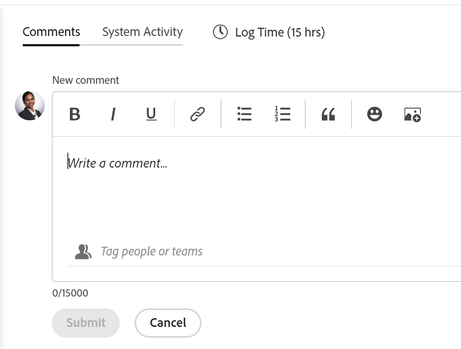

# Actualizar trabajo

<!--take "Beta" references out when we remove the beta-->

La información resaltada en esta página hace referencia a funcionalidades que aún no están disponibles de forma general. Solo está disponible para todos los clientes en el entorno de vista previa.

>[!NOTE]
>
>Actualmente estamos rediseñando la experiencia de comentarios en Adobe Workfront.
>
>Para obtener más información sobre la nueva experiencia de comentarios, consulte [Nueva experiencia de comentarios](../../product-announcements/betas/new-commenting-experience-beta/unified-commenting-experience.md).
>
>Puede acceder a la nueva experiencia para los siguientes objetos:
> * Problemas, proyectos, tareas y documentos.
>
>     Esta opción está disponible al habilitar la experiencia de comentarios beta.
>
>     Esta funcionalidad solo está disponible para la sección Actualizaciones y no para las áreas siguientes:
>
>     * Página de inicio
>     * Panel de resumen en listas
>     * Panel de resumen en plantillas de horas
>
> * Metas, tarjetas en el área Tableros
>
>   La nueva experiencia de comentar es la única experiencia para los goles y las cartas. Debe tener una licencia adicional para acceder a los objetivos de Workfront. Para obtener más información, consulte [Requisitos para utilizar Workfront Goals](../../workfront-goals/goal-management/access-needed-for-wf-goals.md).
>
>     Puede agregar y ver actualizaciones a las tarjetas en el área de Tableros al habilitar las secciones Comentarios y Actividad del sistema en una tarjeta. Para obtener más información, consulte [Añadir una tarjeta ad hoc a un tablero](../../agile/get-started-with-boards/add-card-to-board.md).

## Consideraciones acerca de la actualización del trabajo

* Puede agregar comentarios a la mayoría de los objetos de Adobe Workfront en la sección Actualizaciones. Para obtener más información sobre los objetos que muestran la sección Actualizaciones, consulte [Información general de la sección Actualizaciones](../updating-work-items-and-viewing-updates/updates-tab-overview.md).

* Puede agregar una actualización a un objeto de Workfront (proyecto, tarea o problema) para comunicar el progreso del objeto, a medida que comenta sobre el objeto. Los usuarios asignados o suscritos al objeto pueden ver la actualización.

* Puede etiquetar a los usuarios para que presten atención a la actualización. Los usuarios etiquetados reciben una notificación en la aplicación y un correo electrónico sobre su actualización.

  >[!TIP]
  >
  >   En la nueva experiencia de comentarios, los propietarios de comentarios se etiquetan automáticamente. Para obtener más información, consulte [Etiquetar a otros en las actualizaciones](../../workfront-basics/updating-work-items-and-viewing-updates/tag-others-on-updates.md).
  <!--take the "in the new commenting experience" out when this is the only experience-->

* Puede agregar un comentario a un objeto que pueda ver, o bien puede iniciar sesión como Workfront o administrador de grupo y agregar un comentario en nombre de otro usuario. Para obtener más información, consulte [Iniciar sesión como otro usuario](../../administration-and-setup/add-users/create-and-manage-users/log-in-as-another-user.md).

* Puede agregar una actualización a proyectos, tareas y problemas desde las siguientes áreas de Workfront:

   * Desde un objeto de Workfront, en la sección Actualizaciones
   * Desde el área de Inicio (para tareas y problemas)
   * Desde el panel Resumen en una lista de objetos (para tareas y problemas)
   * En la hoja de horas (para tareas y problemas)

En la información de esta página se describe cómo puede realizar comentarios sobre los objetos de Workfront y cómo actualizar proyectos, tareas y problemas.

Para obtener información sobre cómo comentar los objetivos, consulte [Administrar comentarios sobre metas en Adobe Workfront Goals](../../workfront-goals/goal-management/manage-goal-comments.md). Debe tener una licencia adicional para acceder a los objetivos de Workfront.

Para obtener información sobre cómo comentar tarjetas en el área Tableros, consulte [Añadir una tarjeta ad hoc a un tablero](../../agile/get-started-with-boards/add-card-to-board.md).

## Requisitos de acceso

<!--
drafted for P&P release:
<table style="table-layout:auto"> 
 <col> 
 </col> 
 <col> 
 </col> 
 <tbody> 
  <tr> 
   <td role="rowheader"><strong>Adobe Workfront plan*</strong></td> 
   <td> 
Any
 </td> 
  </tr> 
  <tr> 
   <td role="rowheader"><strong>Adobe Workfront license*</strong></td> 
   <td> 
Current license: Contributor or higher for issues and documents: Light or higher for all other objects
 
   Or
   
Legacy  license: Request or higher for issues and documents; Review or higher for all other objects

   </td> 
  </tr> 
  <tr> 
   <td role="rowheader"><strong>Access level configurations*</strong></td> 
   <td> 
View or Edit access for the object the update is on
 
<b>NOTE</b>
   
   If you still don't have access, ask your Workfront administrator if they set additional restrictions in your access level. For information on how a Workfront administrator can modify your access level, see <a href="../../administration-and-setup/add-users/configure-and-grant-access/create-modify-access-levels.md" class="MCXref xref">Create or modify custom access levels</a>.
 </td> 
  </tr> 
  <tr> 
   <td role="rowheader"><strong>Object permissions</strong></td> 
   <td> 
View access to the object
 
For information on requesting additional access, see <a href="../../workfront-basics/grant-and-request-access-to-objects/request-access.md" class="MCXref xref">Request access to objects </a>.
 </td> 
  </tr> 
 </tbody> 
</table>
-->
Debe tener el siguiente acceso para realizar los pasos de este artículo:

<table style="table-layout:auto"> 
 <col> 
 </col> 
 <col> 
 </col> 
 <tbody> 
  <tr> 
   <td role="rowheader"><strong>plan Adobe Workfront*</strong></td> 
   <td> 
Cualquiera
 </td> 
  </tr> 
  <tr> 
   <td role="rowheader"><strong>Licencia de Adobe Workfront*</strong></td> 
   <td> 
Solicitud o superior para problemas y documentos; Revisar o superior para todos los demás objetos
 </td> 
  </tr> 
  <tr> 
   <td role="rowheader"><strong>Configuraciones de nivel de acceso*</strong></td> 
   <td> 
Acceso de visualización o edición para el objeto en el que se encuentra la actualización
 
<b>NOTA</b>

Si sigue sin tener acceso, pregunte al administrador de Workfront si ha establecido restricciones adicionales en su nivel de acceso. Para obtener información sobre cómo un administrador de Workfront puede modificar su nivel de acceso, consulte <a href="../../administration-and-setup/add-users/configure-and-grant-access/create-modify-access-levels.md" class="MCXref xref">Crear o modificar niveles de acceso personalizados</a>.
 </td>
</tr> 
  <tr> 
   <td role="rowheader"><strong>Permisos de objeto</strong></td> 
   <td> 
Ver acceso al objeto
 
Para obtener información sobre cómo solicitar acceso adicional, consulte <a href="../../workfront-basics/grant-and-request-access-to-objects/request-access.md" class="MCXref xref">Solicitud de acceso a objetos </a>.
 </td> 
  </tr> 
 </tbody> 
</table>

&#42;Para saber qué plan, tipo de licencia o acceso tiene, póngase en contacto con su administrador de Workfront.

## Agregar una actualización a un elemento de trabajo

<!--drafted for the commenting experience - change the NOTE at the top of the following section with every new release to other objects -->

La adición de una actualización a un elemento de trabajo difiere según la versión de la sección Actualizaciones y el objeto que elija.

### Agregar una actualización a un elemento de trabajo en la sección Actualizaciones actuales

>[!NOTE]
>
>La siguiente funcionalidad está disponible para todos los objetos, excepto para los objetivos y las tarjetas. Debe tener una licencia adicional para acceder a los objetivos de Workfront. Para obtener información sobre cómo comentar los objetivos, consulte [Administrar comentarios sobre metas en Adobe Workfront Goals](../../workfront-goals/goal-management/manage-goal-comments.md).
>
>Puede agregar y ver actualizaciones a las tarjetas en las áreas de Tablero cuando habilite las secciones Comentarios y Actividad del sistema en una tarjeta. Para obtener más información, consulte [Añadir una tarjeta ad hoc a un tablero](../../agile/get-started-with-boards/add-card-to-board.md).

1. Vaya al elemento de trabajo para el que desea proporcionar una actualización (como un proyecto, tarea o problema).
1. Haga clic en **Actualizaciones** sección.
1. Clic **Iniciar una nueva actualización,** a continuación, escriba la actualización.
1. (Opcional) Utilice texto enriquecido o agregue emojis, vínculos o imágenes a la actualización para mejorar el contenido. Para obtener más información, consulte la [Usar texto enriquecido en una actualización de Workfront](#use-rich-text-in-a-workfront-update) de este artículo
1. (Opcional) Actualice cualquiera de la siguiente información sobre el elemento de trabajo:

   <table style="table-layout:auto"> 
    <col> 
    <col> 
    <tbody> 
     <tr> 
      <td role="rowheader"><strong>Notificar</strong></td> 
      <td>Identifique a los usuarios a los que se debe notificar la actualización. Los usuarios asignados o suscritos al objeto reciben automáticamente una notificación cuando se realiza una actualización. 
Para obtener información sobre cómo incluir a otros en una actualización, consulte <a href="../../workfront-basics/updating-work-items-and-viewing-updates/tag-others-on-updates.md" class="MCXref xref">Etiquetar a otros en las actualizaciones</a>.
</td> 
     </tr> 
     <tr> 
      <td role="rowheader"><strong>Fecha de confirmación</strong></td> 
      <td>En el selector de fechas, seleccione la fecha en la que se compromete a completar el elemento de trabajo. Para obtener información sobre la fecha de confirmación, consulte <a href="../../manage-work/projects/updating-work-in-a-project/overview-of-commit-dates.md" class="MCXref xref">Resumen de fecha de confirmación</a>.</td> 
     </tr> 
     <tr> 
      <td role="rowheader"><strong>Condición</strong></td> 
      <td>Seleccione una nueva condición para la tarea o el problema. Para obtener información sobre cómo seleccionar una condición, consulte <a href="../../manage-work/projects/updating-work-in-a-project/update-condition-for-tasks-and-issues.md" class="MCXref xref">Actualizar condición para tareas y problemas</a>.</td> 
     </tr> 
     <tr> 
      <td role="rowheader"><strong>Estado</strong></td> 
      <td>Haga clic en la flecha situada junto al estado actual y, a continuación, seleccione el estado deseado en el menú desplegable. Para obtener información sobre cómo establecer un estado, consulte <a href="../../manage-work/projects/updating-work-in-a-project/update-task-status.md" class="MCXref xref">Actualizar estado de la tarea</a>.
La actualización del estado de un elemento de trabajo no cambia automáticamente el estado de un proyecto. Según la configuración del proyecto, es posible que deba realizar actualizaciones del estado del proyecto por separado. Para obtener más información sobre los distintos tipos de actualización de proyectos, consulte <a href="../../manage-work/projects/manage-projects/select-project-update-type.md" class="MCXref xref">Seleccione el tipo de actualización del proyecto </a>.

<b>NOTA</b>

   No puede cambiar el estado de un elemento de trabajo mientras esté en estado de Aprobación pendiente.
</td>
   </tr> 
     <tr> 
      <td role="rowheader"><strong>Barra de finalización</strong></td> 
      <td>(Solo disponible en tareas) Indique el porcentaje de trabajo completado desplazando la barra de progreso al porcentaje deseado. También puede hacer doble clic en la barra de finalización e introducir el porcentaje completado.</td> 
     </tr> 
     <tr> 
      <td role="rowheader"><strong>Privado para mi compañía</strong></td> 
      <td> 
Deshabilite esta opción para evitar que los usuarios externos a su compañía tengan acceso para ver esta actualización.
 
      
<b>NOTA</b>

      
Esta opción solo se muestra cuando el usuario está asociado a una Empresa.

      </td> 
     </tr> 
    </tbody> 
   </table>

1. Clic **Actualizar** para agregar la actualización al objeto Workfront.

   >[!NOTE]
   >
   >Una pequeña ventana emergente aparecerá durante siete segundos después de hacer clic en **Actualizar**, lo que le permite deshacer la actualización y volver al panel de edición antes de que se publique la actualización. La actualización se publicará si cierra la ventana emergente de deshacer, espera a que desaparezca o sale de la página.
   >
   >Si el administrador de Workfront selecciona la opción &quot;No permitir nunca que los usuarios eliminen comentarios&quot; en su nivel de acceso, no podrá deshacer un comentario. Para obtener más información, consulte [Crear y modificar niveles de acceso personalizados](../../administration-and-setup/add-users/configure-and-grant-access/create-modify-access-levels.md).

1. Para responder a una actualización, consulte [Responder a las actualizaciones](../../workfront-basics/updating-work-items-and-viewing-updates/reply-to-updates.md).

### Añadir una actualización a un elemento de trabajo mediante la experiencia beta de comentarios

Para obtener información sobre las funciones disponibles para la nueva experiencia de comentarios y los objetos, consulte [Nueva experiencia de comentarios](../../product-announcements/betas/new-commenting-experience-beta/unified-commenting-experience.md).

1. Busque el objeto que desea actualizar y, a continuación, haga clic en su nombre para abrir la página del objeto.
1. Clic  **Actualizaciones** en el panel izquierdo.
1. Habilite la **Comentando beta** en la esquina superior derecha del área de Actualizaciones y haga clic en **Aceptar** sobre el acuerdo Beta. Esto cambia el área de Actualizaciones a la experiencia de comentarios beta.
El **Comentarios** está seleccionada de forma predeterminada.
1. Comience a escribir un comentario en **Nuevo comentario** cuadro.

   

   >[!TIP]
   >
   >Si sale de la sección Actualizaciones antes de terminar de escribir y enviar un comentario, el comentario en la página se mantiene en modo de borrador incluso después de cerrar la sesión y volver a iniciarla. Todas las imágenes que se agreguen al comentario también se guardarán en el borrador. Los borradores se guardan durante 7 días después de los cuales se descartan y no se pueden recuperar. Los comentarios redactados solo son visibles para el usuario que los escribe.

1. (Opcional) Para deshacer o rehacer un cambio, utilice las siguientes teclas de método abreviado:
   * CTRL + Z (⌘ + z para Mac) para deshacer un cambio
   * CTRL + Y (⌘ + y para Mac) para rehacer un cambio
1. (Opcional) En el **Etiquetar personas o equipos** , empiece a escribir el nombre o el correo electrónico de un usuario o equipo que desee incluir en este comentario y, a continuación, selecciónelo cuando se muestre en la lista.
1. (Opcional) Para agregar formato de texto enriquecido a la actualización, utilice cualquiera de las siguientes opciones de la **Texto enriquecido** barra de herramientas para mejorar el texto:

   * Negrita
   * Cursiva
   * Subrayado
   * Enlace
   * Lista con viñetas
   * Lista numerada
   * Agregar archivo adjunto <!--(mark this parenthesis as draft: ************ this might be renamed to "Add image")-->

   Para obtener más información, consulte la [Usar texto enriquecido en una actualización de Workfront](#use-rich-text-in-a-workfront-update) de este artículo. <!--remove this list, above, when we get to parity for Rich Text-->

   >[!TIP]
   >
   >Si otro usuario envía un comentario al mismo elemento que está actualizando, habrá una línea roja con un indicador &quot;Nuevo&quot; para informarle de los comentarios más recientes.
   >
   >El indicador solo se muestra después de que el comentario se haya enviado sobre el elemento, y no cuando el comentario aún está compuesto.
   >
   >El indicador &quot;Nuevo&quot; solo se muestra cuando el usuario que ha introducido una nueva actualización, así como el usuario que está introduciendo una actualización, están utilizando la nueva experiencia de comentarios.
   >

1. Clic **Enviar** para agregar la actualización al objeto Workfront.
1. (Opcional) Para editar un comentario, haga clic en **Más** menú  a la derecha del icono Like y, a continuación, haga clic en **Editar**.
1. Edite la información del comentario, añada o elimine imágenes, o bien elimine cualquiera de los usuarios etiquetados.
Puede editar su comentario en un plazo de 15 días desde el envío. Se agrega un indicador &quot;Editado&quot; a la izquierda de la marca de fecha que se muestra cuando se actualizó el comentario.

   

   >[!TIP]
   >
   >* Se genera un correo electrónico para notificar a los usuarios de su actualización solo cuando envía la actualización original. No se genera ningún correo electrónico después de editar la actualización.
   >* La marca de fecha que aparece junto al comentario es la fecha del comentario original, no la fecha de la última edición.

1. (Opcional) Haga clic en **Responder** para responder a un comentario existente, siga los pasos 4-7 anteriores. <!--(**************insure this stays accurate***********)-->. Para obtener información sobre cómo responder a una actualización, consulte [Responder a las actualizaciones](../../workfront-basics/updating-work-items-and-viewing-updates/reply-to-updates.md).
1. (Condicional y opcional) Si otros usuarios han agregado comentarios que se muestran fuera del área visible en la sección Actualizaciones, haga clic en **Ver** dentro del azul **titular de nuevos comentarios** en la parte inferior de la pantalla para mostrar estos comentarios.

   

   Los comentarios adicionales se muestran en la parte inferior de la pantalla.

   >[!NOTE]
   >
   >   El indicador &quot;nuevos comentarios&quot; y el botón &quot;Ver&quot; solo se muestran cuando los usuarios que han introducido las nuevas actualizaciones, así como el usuario que está viendo la sección Actualizaciones, están utilizando la nueva experiencia de comentarios.

1. (Opcional) Haga clic en **Like** icono. El icono se actualiza con el número de me gusta.
1. (Condicional y Opcional) Si ha incluido más personas en el comentario, haga clic en el número de miembros incluidos en la actualización para mostrar una lista de entidades con las que se comparte el comentario que ha introducido.

   
1. (Opcional) Haga clic en **Actividad del sistema** para ver las actualizaciones registradas por el sistema. Cuando se actualiza el objeto o cualquiera de sus elementos secundarios, Workfront genera una nota sobre esa actualización y la muestra en la pestaña Actividad del sistema.

   Para obtener más información, consulte [Información general de la sección Actualizaciones](../updating-work-items-and-viewing-updates/updates-tab-overview.md)

   >[!TIP]
   >
   >No puede agregar un comentario a una actualización del sistema.

## Usar texto enriquecido en una actualización de Workfront{#use-rich-text-in-a-workfront-update}

<!--remove this top note when we get to parity with the current version, OR change the note to mention that some options are ONLY available in the Beta version and not the current one.-->

>[!NOTE]
>
>Es posible que algunas de las opciones de la barra de herramientas Texto enriquecido no estén disponibles para la experiencia Comentando en versión beta.

Puede mejorar las actualizaciones mediante Texto enriquecido o agregándole varios elementos, como emojis, vínculos o imágenes.

1. Vaya al área de Actualizaciones y empiece a escribir un comentario.
1. (Opcional) Para agregar formato de texto enriquecido a la actualización, utilice cualquier atributo de la variable **Texto enriquecido** barra de herramientas mientras escribe.

   | **Atributo** | **Botón Barra** | **Teclas de método abreviado de Mac** | **Teclas de método abreviado de Windows** |
   |---|---|---|---|
   | Negrita |  | ⌘ + b | Ctrl + B |
   | Cursiva |  | ⌘ + i | Ctrl + I |
   | Subrayado |  | ⌘ + u | Ctrl + U |
   | Hipervínculo |  |  Para abrir el cuadro Crear vínculos o Agregar vínculos: ⌘+K   En la experiencia beta de comentarios, para pegar un vínculo sobre el texto seleccionado: ⌘+V  |  Para abrir el cuadro Crear vínculos o Agregar vínculos: Ctrl + K   En la experiencia beta de comentarios, para pegar un vínculo sobre el texto seleccionado: Ctrl+V  |
   | Lista con viñetas |  | ⌘ + Mayús + 8 | Ctrl + Mayús + 8 |
   | Lista numerada |  | ⌘ + Mayús + 7 | Ctrl + Mayús + 7 |
   | Cita en bloqueo |  | ⌘ + Mayús + 9 | Ctrl + Mayús + 9 |

   Para detener el formato del texto, anule la selección del atributo en la **Texto enriquecido** barra de herramientas.

   <!-- in the table above: take "Create Links" verbiage from the hyperlink when the old commenting is removed and the commenting beta is the only way to comment-->

   >[!NOTE]
   >
   >* El formato también se muestra en cualquier notificación por correo electrónico que reciban los usuarios y que contenga la actualización.
   >* El formato de texto enriquecido aplicado a una actualización en un correo electrónico no se muestra en la actualización cuando se ve en la pestaña Actualizaciones.
   >* Si su organización utiliza Workfront con Internet Explorer, cualquier texto con formato pegado en una actualización perderá su formato de texto enriquecido y se mostrará como texto sin formato. Puede cambiar el formato del texto mediante los atributos de la barra de herramientas Texto enriquecido.
   >* El formato de texto enriquecido no está disponible para las actualizaciones realizadas en el área Plantillas de horas ni para los objetos Nota y Última condición visualizados en un informe.

1. (Opcional) Si desea incluir texto de actualizaciones anteriores o de otras fuentes y distinguirlo de su propia actualización, puede marcarlo como una cita en bloque. Haga clic en **Cita en bloque** icono  y escriba el texto que desee citar. El texto citado se muestra marcado con una línea gris vertical. Haga clic en **Cita en bloque** para volver al formato normal.

   

1. (Opcional) Añada emojis a la actualización.

   >[!NOTE]
   >
   >* Workfront no reemplaza los emoticonos de puntuación como :) por emojis.
   >* Los emojis no están disponibles para las actualizaciones realizadas en el área Plantillas de horas ni para los objetos Nota y Última condición que se visualizan en un informe.
   >* La función emoji de Workfront utiliza caracteres Unicode y, como tal, solo se muestra en navegadores y sistemas operativos que admiten puntos de código Unicode. Es posible que los usuarios con una versión de plataforma, explorador o sistema operativo diferente a la tuya no tengan acceso a los mismos emojis.
   >* Un emoji no admitido se representa mediante una caja negra o blanca.
   >* Windows 7 solo admite emojis en blanco y negro.
   >* Los emojis que se aplican a una actualización realizada por correo electrónico no se muestran en la actualización cuando se ven en el área de Actualizaciones.

1. (Opcional) Para agregar un vínculo URL a fuentes de información adicionales:

   1. Haga clic en la actualización en la que desee insertar un vínculo.
   1. En el **Texto enriquecido** , haga clic en **Hipervínculo** icono .

   1. En el **Crear vínculo** cuadro que aparece, debajo de **URL**, escriba o pegue la dirección URL del origen al que desea vincular.

   1. En **Texto para mostrar**, escriba o pegue el texto del vínculo.
   1. Haga clic en **Guardar**.

1. (Opcional) Para adjuntar una imagen a la actualización, realice una de las siguientes acciones, según el entorno que utilice:

   * Haga clic en **Imagen** icono  y busque la imagen en el equipo o arrástrela al área de actualización cuando utilice la experiencia de actualización actual

   O

   Haga clic en **Agregar archivo adjunto** icono  y busque la imagen en el equipo, al usar la experiencia de comentarios beta. <!--the name of the icon and the icon for it might change-->

   >[!NOTE]
   >
   >* El administrador de Workfront debe habilitar la adición de imágenes en la sección Actualizar preferencias de fuentes del área de Interfaz de Workfront para que pueda ver los iconos Imagen o Agregar datos adjuntos. Para obtener más información, consulte [Configurar preferencias para actualizaciones de usuarios](../../administration-and-setup/set-up-workfront/system-tracked-update-feeds/configure-preferences-user-updates.md).
   >* El tamaño máximo de archivo de imagen es de 7 MB. Los tipos de archivo de imagen admitidos son .jpg, .gif y .png.
   >* Se puede acceder a las imágenes desde la sección Actualizaciones de un objeto y también están disponibles en el área Documentos.
   >* Puede enviar una actualización con una imagen y sin texto.
   >* Cuando elimina un comentario que contiene una imagen, existen los siguientes escenarios en función de la experiencia que elija:
   >
   >     * En la experiencia actual de comentarios, la imagen permanece en el área de Documentos, pero ya no está visible en la sección de Actualizaciones.
   >     * En la nueva experiencia de comentarios, la imagen se elimina de la sección Actualizaciones y del área Documentos. La imagen también se elimina del área Documentos cuando edita un comentario y elimina la imagen.
   >* Cuando alguien elimina una imagen adjunta a un comentario del área Documentos, también se elimina del comentario.

1. Clic **Actualizar**  o **Enviar**, al utilizar la experiencia de comentarios beta.

## Copiar información de actualización

Existen varias formas de copiar una actualización. Después de copiar un vínculo, puede compartirlo con otras personas para dirigirlas a la actualización.

La copia de una actualización varía en función de la experiencia de comentario que utilice.

### Copiar una actualización en la experiencia actual de comentarios

* [Copiar la actualización](#copy-the-update)
* [Copiar el vínculo del hilo](#copy-the-thread-link)
* [Copiar el vínculo de actualización](#copy-the-update-link)

#### Copiar la actualización {#copy-the-update}

Esta opción copia el texto de una actualización específica en el portapapeles.

1. Vaya a la actualización o respuesta que desee copiar.
1. Haga clic en **Más** y haga clic en **Copiar el texto del cuerpo**.

   

#### Copiar el vínculo del hilo {#copy-the-thread-link}

Esta opción copia el enlace del hilo completo en el portapapeles para que pueda compartir el hilo con otros usuarios.

1. Vaya al hilo de actualización que desee copiar.

1. Haga clic en **Más** y haga clic en **Copiar vínculo del hilo**.

   

#### Copiar el vínculo de actualización {#copy-the-update-link}

Esta opción copia un vínculo de actualización específico en el portapapeles. Cuando comparte el vínculo de actualización, el usuario que lo sigue ve un borde alrededor de la actualización.

1. Vaya a la actualización o respuesta que desee copiar.
1. Haga clic en **Más** junto a la actualización individual y haga clic en **Copiar vínculo de actualización**.

   

### Copiar una actualización en la nueva experiencia de comentarios

Para obtener información sobre las funciones disponibles para la nueva experiencia de comentarios y los objetos, consulte [Nueva experiencia de comentarios](../../product-announcements/betas/new-commenting-experience-beta/unified-commenting-experience.md).

<!--when we remove and deprecate the legacy stream, add screen shots in the sections below-->

* [Copiar vínculo](#copy-link)
* [Copiar el texto del cuerpo](#copy-body-text)

#### Copiar vínculo

Esta opción copia el comentario o el vínculo de subproceso en el portapapeles para que pueda compartir el comentario o todo el subproceso con otros usuarios.

1. Vaya a la actualización cuyo vínculo desee copiar.

1. Haga clic en **Más** y haga clic en **Copiar vínculo**.

#### Copiar el texto del cuerpo

Esta opción copia el texto de una actualización específica en el portapapeles.

1. Vaya a la actualización o respuesta que desee copiar.
1. Haga clic en **Más** y haga clic en **Copiar el texto del cuerpo**.

## Eliminar una actualización o respuesta

En función del acceso que le proporcione su administrador de Workfront, es posible que pueda eliminar las actualizaciones que haya añadido en la pestaña Actualizaciones de un objeto. Para obtener más información, consulte [Crear o modificar niveles de acceso personalizados](../../administration-and-setup/add-users/configure-and-grant-access/create-modify-access-levels.md#creating-a-new-access-from-scratch) en el artículo [Crear o modificar niveles de acceso personalizados](../../administration-and-setup/add-users/configure-and-grant-access/create-modify-access-levels.md).

Ningún usuario de Workfront (incluido el administrador de Workfront) puede eliminar las actualizaciones realizadas por otro usuario. Sin embargo, si el nivel de acceso de un usuario le permite eliminar sus propias actualizaciones, el administrador de Workfront puede iniciar sesión como ese usuario y eliminar las actualizaciones que haya realizado. Para obtener más información, consulte [Crear o modificar niveles de acceso personalizados](../../administration-and-setup/add-users/configure-and-grant-access/create-modify-access-levels.md#creating-a-new-access-from-scratch) y [Iniciar sesión como otro usuario](../../administration-and-setup/add-users/create-and-manage-users/log-in-as-another-user.md).

1. Vaya a la actualización o respuesta que desee eliminar.
1. Haga clic en **Más** junto a la actualización o respuesta que desee eliminar y, a continuación, haga clic en **Eliminar**.

   

1. En el mensaje que aparece, haga clic en **Confirmar** o haga clic en **Eliminar**, al utilizar la experiencia de comentarios beta.

   >[!NOTE]
   >
   >Al eliminar una actualización con una imagen adjunta, se eliminan el comentario y la imagen. Para obtener más información, consulte la [Uso de texto enriquecido en una actualización de Workfront](#use-rich-text-in-a-workfront-update) de este artículo.

   Cuando el comentario que elimina tiene respuestas asociadas a él, existe una indicación de que el comentario se eliminó con el nombre del usuario que lo eliminó.

   

   Al utilizar la experiencia de comentarios beta, los comentarios eliminados se eliminan inmediatamente de Workfront. Un usuario que utiliza la sección Actualizaciones ve un comentario que otro usuario elimina en tiempo real.

   <!--when we remove the beta, take out the first part of the sentence above about only when commenting in beta experience. Leave the rest though-->

## Añadir una actualización en una plantilla de horas

1. Vaya a la hoja de horas en la que desee realizar una actualización.
1. Haga clic en Hoja de horas para abrirla.
1. En la parte inferior de la hoja de horas, haga clic en **Incluir un comentario**.
1. En el cuadro que aparece en la parte inferior de la Hoja de horas, escriba una actualización.

   

1. (Condicional) Para guardar la actualización sin enviar la plantilla de horas para su aprobación, haga clic en **Guardar para más tarde**.

   O

   Para guardar la actualización y enviar la plantilla de horas para su aprobación, haga clic en **Enviar para aprobación**.

   O

   Si la plantilla de horas no está configurada con un aprobador, haga clic en **Guardar y cerrar hoja de horas** para guardar la actualización.

## Habilitar o deshabilitar actualizaciones del sistema

<!--remove the preview tag with 23.2 production, but keep the note till we remove Beta and it becomed the only exprience: -->

>[!NOTE]
>
>No es posible desactivar las actualizaciones del sistema al utilizar la experiencia de comentarios beta.
>La información de esta sección hace referencia únicamente a la funcionalidad disponible en la sección Actualizaciones actuales.
>Para obtener más información sobre actualizaciones del sistema en la versión beta, consulte [Información general de la sección Actualizaciones](../updating-work-items-and-viewing-updates/updates-tab-overview.md).

La sección Actualizaciones de un objeto de Workfront muestra dos tipos de información:

* **Actualizaciones de usuarios:** Las actualizaciones de usuario son comentarios que usted y otros usuarios del sistema escriben.

  

* **Actualizaciones del sistema:** El sistema actualiza el registro eliminando recursos, añadiendo o eliminando versiones, adjuntando o eliminando una solicitud de aprobación, así como cualquier edición o cambio realizado en los documentos del objeto.

  

Según la licencia de Workfront, las actualizaciones del sistema podrían habilitarse de forma predeterminada. Los administradores de Workfront pueden determinar qué se rastrea en las actualizaciones del sistema, como se explica en [Actualizaciones rastreadas por el sistema](../../administration-and-setup/set-up-workfront/system-tracked-update-feeds/system-tracked-update-feeds.md). También puede filtrar las actualizaciones del sistema o las actividades para ver solo las actualizaciones del usuario de todos los objetos.

Para obtener más información sobre la diferencia entre las actualizaciones de usuarios y del sistema, consulte [Actualizaciones rastreadas por el sistema](../../administration-and-setup/set-up-workfront/system-tracked-update-feeds/system-tracked-update-feeds.md).

Para habilitar o deshabilitar las actualizaciones del sistema:

1. Haga clic en **Actualizaciones** sobre un objeto.
1. Clic **Mostrar actualizaciones del sistema** para deslizar el interruptor a la izquierda (desactivado) o a la derecha (activado).

   

   Esta opción es persistente en todos los objetos de Workfront y permanece en la posición seleccionada, incluso si cierra sesión en Workfront.

