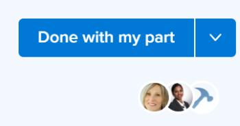

# Información general sobre el botón Trabajar en ello y Listo

Cuando se le asigna una tarea o un problema, puede utilizar un botón contextual que cambie los nombres y las funciones según su implicación en el elemento de trabajo.

Con el botón contextual para aceptar o completar elementos de trabajo, puede permitir que Adobe Workfront actualice varios campos de los elementos sin tener que actualizarlos manualmente.

Los botones Trabajar en ello y Listo están visibles para los usuarios que tienen:

* Una licencia estándar (nueva) o una licencia de planificación o de trabajo (actual)
* Acceso de edición limitado o superior en la tarea o el problema

>[!NOTE]
>
>El botón Listo aparece como Marcar como listo en todas las áreas de Workfront.

## Nombres del botón Trabajar en ello y Listo

Según el área de Workfront desde la que acceda a la tarea o al problema, el botón Trabajar en ello o Listo puede cambiar los nombres, tal como se describe en los siguientes casos:

* Cuando se le asigna por primera vez la tarea o el problema y el estado es Nuevo, el botón se muestra como Trabajar en ello.

  

  >[!TIP]
  >
  >Puede reemplazar el botón Trabajar en ello por el botón Inicio. Para obtener información sobre cómo reemplazar el botón Trabajar en ello por el botón Inicio, consulte [Reemplazar el botón Trabajar en ello por el botón Inicio](../../people-teams-and-groups/create-and-manage-teams/work-on-it-button-to-start-button.md).

* Después de hacer clic en Aceptar para Trabajar en ello, el botón cambia a Marcar como hecho. Para obtener información sobre dónde puede obtener acceso al botón Trabajar en ello, consulte la sección [Buscar el botón Trabajar en ello y Listo](#locate-the-work-on-it-and-done-button) en este artículo.

  

<!--If you are not the only one assigned to the task or issue and you are accessing your work item from the My Work widget in the Home area, the button changes to Done with my part.

  -->

## Busque el botón Trabajar en ello y Listo {#locate-the-work-on-it-and-done-button}

Puede localizar el botón Trabajar en ello y Listo en las siguientes áreas de Workfront:

* El área de inicio del widget Mi trabajo

  Para obtener información sobre cómo marcar un elemento como Listo en el área de Inicio, consulte [Marcar un elemento como Listo en el área de Inicio](../../workfront-basics/using-home/using-the-home-area/mark-item-done-in-home.md).

* En el encabezado de la tarea o el problema

  Para obtener información acerca de los encabezados de objeto, consulte [Nuevos encabezados de objeto](../../workfront-basics/the-new-workfront-experience/new-object-headers.md).

* En el panel Resumen de tareas o problemas

  Para obtener información sobre el uso del panel Resumen, consulte [Información general del resumen](../../workfront-basics/the-new-workfront-experience/summary-overview.md).

## Información general sobre los campos que se actualizan automáticamente al hacer clic en los botones Trabajar en ello o Listo

La ventaja de utilizar los botones Trabajar en ello y Listo es que puede permitir que Workfront actualice automáticamente la información sobre el elemento de trabajo que tiene asignado.

* [Botón Trabajar en ello](#work-on-it-button)
* [Botón Inicio](#start-button)
* [Botón Listo](#the-done-button)

### Botón Trabajar en ello {#work-on-it-button}

Al hacer clic en Trabajar en ello, también se actualizan los siguientes elementos:

* Actualizaciones del estado de la asignación de Solicitado a En Proceso

  >[!TIP]
  >
  >El campo Estado de la asignación solo es visible en informes y listas. Para obtener información acerca del campo Estado de la asignación, consulte el [Glosario de terminología de Adobe Workfront](../../workfront-basics/navigate-workfront/workfront-navigation/workfront-terminology-glossary.md).

* Fecha de confirmación

  Para obtener información sobre la fecha de confirmación, consulte [Información general sobre la fecha de confirmación](../../manage-work/projects/updating-work-in-a-project/overview-of-commit-dates.md).

### Botón Inicio {#start-button}

Si tiene acceso para editar equipos, puede reemplazar el botón Trabajar en ello con el botón Iniciar de un equipo. Cuando los usuarios que tienen ese equipo como equipo de inicio hacen clic en el botón Inicio en los elementos a los que están asignados, los campos adicionales de sus elementos de trabajo se actualizan automáticamente. Para obtener información sobre cómo reemplazar el botón Trabajar en ello por un botón de Inicio, consulte [Reemplazar el botón Trabajar en ello por el botón Inicio](../../people-teams-and-groups/create-and-manage-teams/work-on-it-button-to-start-button.md).

Además de los campos que se actualizan al hacer clic en el botón Trabajar en ello, los siguientes campos se actualizan automáticamente en una tarea o problema al hacer clic en el botón Iniciar:

* Estado
* Fecha real de inicio

  Para obtener información sobre la fecha real de inicio, consulte [Información general sobre la fecha de inicio real del proyecto](../../manage-work/projects/planning-a-project/project-actual-start-date.md).

* Fecha real de finalización si el botón Inicio está asociado con un estado que equivale a Completado o Cerrado.

  Para obtener información acerca de la fecha de finalización real, consulte [Información general sobre la fecha de finalización real del proyecto](../../manage-work/projects/planning-a-project/project-actual-completion-date.md).

>[!NOTE]
>
>Al hacer clic en el botón Deshacer, el elemento de trabajo vuelve al estado original y se elimina la Fecha de inicio real.
>
>El botón Deshacer no está disponible en las siguientes áreas:
>
>* Solicitudes de equipo
>* Encabezado de tarea
>

### Botón Listo {#the-done-button}

Si tiene acceso para editar equipos, puede configurar el botón Listo para que un equipo actualice los estados de la tarea o del problema cuando marque un elemento como completado. Cuando los usuarios con ese equipo como equipo de inicio hacen clic en el botón Marcar como completado en sus elementos, los siguientes campos se actualizan automáticamente en una tarea o problema:

* Estado
* El estado de asignación se actualiza de Trabajando a Listo
* Fecha real de finalización

Para obtener información sobre la configuración del botón Listo para un equipo, consulte los siguientes artículos:

* [Configurar el botón Listo para las tareas](../../people-teams-and-groups/create-and-manage-teams/configure-the-done-button-for-tasks.md)
* [Configurar el botón Listo para problemas](../../people-teams-and-groups/create-and-manage-teams/configure-the-done-button-for-issues.md)
