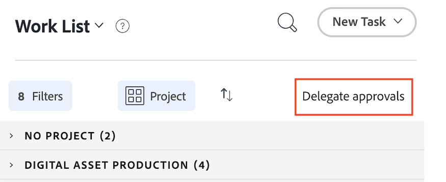

# Cambio de una página de inicio heredada a una nueva

La página de inicio heredada se eliminará de Workfront el 17/10 con la versión del cuarto trimestre. Este artículo proporciona información sobre las funcionalidades disponibles en el nuevo inicio, así como recomendaciones para los administradores de Workfront que mueven usuarios a la experiencia Nuevo inicio.

Para obtener más información sobre la obsolescencia de la página principal heredada, consulte la [Guía de obsolescencia de la página principal heredada](/help/quicksilver/product-announcements/announcements/legacy-home-deprecation.md).

## Comprender lo que está cambiando de la página principal heredada a la nueva

### Lista de trabajos

#### Organizar el trabajo con el widget Mi trabajo

El widget Mi trabajo se creó en forma de widget para reflejar la lista de trabajo de Inicio heredada lo más fielmente posible. Los usuarios pueden agrupar y filtrar su Lista de trabajos en el widget Mi trabajo con filtros y agrupaciones similares:

| **Filtro** | **Agrupación** |
|------------|-----------|
| - Trabajando en   - Listo para iniciar   - No listo   - Solicitado   - Delegado   - Completado | - Proyecto   - Estado   - Fecha de vencimiento   - Nada |

**Las agrupaciones de inicio heredadas no están disponibles en la nueva página de inicio**

* Fecha planificada de finalización - Se ha cambiado el nombre a Fecha de vencimiento en la nueva página de inicio
* Inicio planificado
* Fecha de confirmación
* Mi prioridad

| **Página principal heredada** | **Nueva página de inicio** |
|------------|-----------|
|  |  |

#### Delegar trabajo

Los usuarios aún pueden delegar el trabajo desde la Nueva página de inicio en los siguientes widgets:

* Mi trabajo
* Mis tareas
* Mis problemas
* Esperando mis aprobaciones

Los usuarios pueden encontrar el trabajo delegado a ellos en los siguientes widgets:

* Widget de Mi trabajo con el filtro Delegado a mí
* Esperando mis aprobaciones usando el filtro de aprobaciones delegadas

| **Página principal heredada** | **Nueva página de inicio** |
|------------|-----------|
|  |  |

#### Usar la vista de calendario

La vista de calendario ya no está disponible en la nueva página de inicio; sin embargo, el reemplazo de calendario está en la hoja de ruta para las prioridades.

#### Crear una tarea personal

Los usuarios ya no pueden crear una tarea personal del mismo modo que lo hicieron en la página de inicio heredada. En su lugar, los usuarios pueden crear elementos pendientes.

#### Ver aprobaciones que he enviado

Los usuarios no pueden ver las aprobaciones que han enviado a su nueva página de inicio. Si los usuarios de su organización necesitan esta funcionalidad, puede crear un informe de aprobaciones como solución alternativa o votar o publicar un comentario aquí en las siguientes publicaciones de la comunidad:

* [Agregar el widget &quot;Aprobaciones enviadas&quot; a la nueva página de inicio](https://experienceleaguecommunities.adobe.com/t5/workfront-ideas/add-quot-approvals-i-submitted-quot-widget-to-new-home/idc-p/704664#M25269)
* [Agregar &quot;Aprobaciones enviadas&quot; a la nueva página de inicio](https://experienceleaguecommunities.adobe.com/t5/workfront-ideas/add-quot-approvals-i-submitted-quot-widget-to-new-home/idc-p/704664#M25269)

#### Agregar elementos a Mi prioridad

Los usuarios ya no tienen acceso a la función Mi prioridad en la nueva página de inicio. Presentamos una nueva columna Mi enfoque con Prioridades que la reemplazará.

Los usuarios pueden utilizar el widget Tableros para rastrear elementos de alta prioridad si lo desean.

### Actualizar elementos de trabajo

En el inicio heredado, los usuarios pueden utilizar el panel derecho para actualizar su trabajo. En la nueva página de inicio, los usuarios ahora utilizan el panel Resumen para actualizar el trabajo. Este es el mismo panel de resumen disponible en Proyectos, Tareas, Problemas y Documentos.

#### Uso del panel Resumen

En el Resumen, los usuarios pueden

* Actualizar el porcentaje completado
* Añadir una actualización
* Vaya al área Documentos para cargar un documento
* Ver detalles del elemento de trabajo y actualizar campos personalizados
Los administradores de Workfront pueden personalizar los campos que aparecen en Resumen en la plantilla Diseño. Para obtener más información, consulte [Personalizar inicio y resumen con una plantilla de diseño](/help/quicksilver/administration-and-setup/customize-workfront/use-layout-templates/customize-home-summary-layout-template.md).
* Cambiar el estado del elemento de trabajo
* Ver subtareas
* Hora de registro
* Ver procesos de aprobación adjuntos
* Cargar archivos: Esta funcionalidad es nueva

| **Página principal heredada** | **Nueva página de inicio** |
|------------|-----------|
|  |  |

#### Abrir el panel de resumen

Los usuarios pueden abrir el Panel de resumen pasando el puntero sobre el elemento de trabajo y luego haciendo clic en el icono **Resumen** .

Para obtener información adicional sobre cómo usar el Panel de resumen, consulte [Resumen general](/help/quicksilver/workfront-basics/the-new-workfront-experience/summary-overview.md).

#### Uso de acciones rápidas

Además del panel de resumen, los usuarios también pueden utilizar acciones rápidas para

* Hora de registro
* Añadir una actualización
* Actualizar un formulario personalizado
* Cargar un archivo

Para localizar el menú de acciones rápidas, pase el ratón sobre el elemento de trabajo. La lista de acciones rápidas se muestra cerca del botón **Trabajar en ello** o **Listo**.

### Ver aprobaciones y solicitudes de equipo

Los usuarios aún pueden administrar aprobaciones y solicitudes de equipo en la nueva página de inicio mediante los siguientes widgets:

* En espera de mi aprobación
* Todas las aprobaciones
* Solicitudes de equipo

Para obtener información acerca de cómo agregar widgets a su nueva página de inicio, vea [Agregar, editar o quitar widgets en la nueva página de inicio](/help/quicksilver/workfront-basics/using-home/new-home/add-edit-remove-widgets-in-new-home.md).

## Más información sobre los widgets disponibles

Los widgets son la base del nuevo inicio. Al agregar widgets a la página de inicio, los usuarios pueden elegir el tipo de información que se muestra para satisfacer mejor sus necesidades laborales. Algunos widgets solo están disponibles para tipos de licencia específicos, ya que los objetos que rastrean solo están disponibles para esas licencias.

Los administradores de Workfront pueden personalizar qué widgets están disponibles en el nuevo inicio mediante una plantilla de diseño. Para obtener más información, consulte [Personalizar la nueva página de inicio con una plantilla de diseño](/help/quicksilver/administration-and-setup/customize-workfront/use-layout-templates/customize-new-home-layout-template.md).

+++ Amplíe para ver una lista detallada de los widgets disponibles
A continuación se muestran los 11 widgets disponibles actualmente para elegir, así como un resumen de la información que muestran:

* **Mi trabajo**\
   Muestra todas las tareas, problemas y solicitudes asignados en un solo lugar. Puede hacer clic en el botón Trabajar en ello para comenzar a trabajar en un elemento o en el botón Listo para marcarlo como completado. También puede actualizar información (estado, condición, porcentaje completado) acerca de tareas y problemas, registrar tiempo y agregar actualizaciones desde el widget Mi trabajo.

* **Tableros**\
    Muestra los tableros que ha creado o que se le ha invitado a utilizar. También puede crear un nuevo tablero basado en las siguientes plantillas: Tablero básico, Tablero Kanban, Tablero retrospectivo, Tablero dinámico.

* **Mis proyectos**\
    Muestra _proyectos de su propiedad_ o _proyectos en los que se encuentra_ en una lista. Puede utilizar filtros, vistas o agrupaciones existentes para personalizar la lista, o puede crear un proyecto directamente desde el widget.

* **Mis tareas**\
    Muestra las tareas asignadas a usted en una lista. Puede utilizar filtros, vistas o agrupaciones existentes para personalizar la lista, o puede crear una tarea directamente desde el widget. También puede delegar sus tareas mientras está fuera de la oficina.

* **Mis problemas**\
    Muestra los problemas asignados a usted en una lista. Puede utilizar filtros, vistas o agrupaciones existentes para personalizar la lista, o puede crear un problema directamente desde el widget. Este widget solo incluye problemas cuyos proyectos asociados están configurados en Actual y no incluye proyectos completados. También puede delegar los problemas mientras está fuera de la oficina.

* **Mis solicitudes**\
    Muestra todas las solicitudes enviadas, un filtro para mostrar solo las solicitudes abiertas y un botón que abre el panel de resumen de una solicitud.

* **Solicitudes de equipo**\
    Muestra todas las solicitudes pendientes de los equipos en los que se encuentra, ordenadas por equipos, así como botones para asignar directamente una solicitud a alguien o para trabajar en ella usted mismo.

* **Esperando mi aprobación**\
    Muestra todas las aprobaciones pendientes asignadas o delegadas, un botón para delegar aprobaciones y botones para tomar decisiones de aprobación directamente dentro del widget.

* **Todas las aprobaciones**\
        Muestra dos gráficos con información sobre el tiempo medio de aprobación y las decisiones, así como vistas de lista de aprobaciones pendientes y vencidas. Esta característica forma parte de una versión por fases y actualmente sólo está disponible para clientes específicos.

* **Menciones**\
    Muestra los hilos de comentarios recientes de Workfront, de forma similar a la página Mis actualizaciones. Puede utilizar el botón de respuesta para crear una respuesta dentro del widget. Este widget también muestra los comentarios realizados sobre las tareas y los problemas que se le han asignado, que ha asignado a otro usuario, que es el propietario, que es el contacto principal de o que ha creado, siempre y cuando la tarea o el problema se hayan actualizado en los últimos 30 días.

* **Tareas pendientes**\
    Este widget único le permite agregar elementos a una lista de comprobación personal que puede editar libremente. Las tareas pendientes se rastrean como tareas en su proyecto personal y permanecen hasta dos semanas después de su finalización.

  >[!NOTE]
  >
  >Debe tener permiso para crear tareas pendientes en el widget Tareas pendientes y solo aparecerán en el widget las tareas personales introducidas por el usuario actual.

+++

  

### Ver widgets disponibles para cada tipo de licencia

De forma predeterminada, la página de inicio se rellena con algunos widgets específicos basados en el tipo de licencia. Las siguientes tablas describen qué widgets ven los usuarios de cada tipo de licencia cuando acceden por primera vez a la página de inicio nueva.

<table border="1" class="inlineTable">
    <tr>
        <td><b>Nuevo tipo de licencia</b></td>
        <td><b>Widgets predeterminados</b></td>
    </tr>
    <tr>
        <td>Estándar</td>
        <td>Mis proyectos, Mi trabajo, Menciones, Tareas pendientes</td>
    </tr>
    <tr>
        <td>Ligero</td>
        <td>Mi trabajo, esperando mi aprobación</td>
    </tr>
    <tr>
        <td>Colaborador</td>
        <td>Mis solicitudes, menciones, esperando mi aprobación, tableros</td>
    </tr>
    <tr>
        <td>Externo</td>
        <td>Esperando mi aprobación</td>
    </tr>
</table>

<table border="1" class="inlineTable">
    <tr>
        <td><b>Tipo de licencia actual</b></td>
        <td><b>Widgets predeterminados</b></td>
    </tr>
    <tr>
        <td>Plan</td>
        <td>Mis proyectos, menciones, tareas pendientes</td>
    </tr>
    <tr>
        <td>Trabajo</td>
        <td>Mi trabajo, menciones, tareas pendientes</td>
    </tr>
    <tr>
        <td>Revisar</td>
        <td>Mi trabajo, menciones</td>
    </tr>
    <tr>
        <td>Solicitud</td>
        <td>Mis proyectos, esperando mi aprobación</td>
    </tr>
    <tr>
        <td>Aportar</td>
        <td>Mi trabajo, menciones</td>
    </tr>
    <tr>
        <td>Externo</td>
        <td>Esperando mi aprobación</td>
    </tr>
</table>

## Preparación para el desuso

Para minimizar las interrupciones tanto para usted como para su organización, a continuación se ofrecen algunas recomendaciones que facilitarán la transición.

### Inicie la transición a la nueva página de inicio

Nuestra recomendación principal es comenzar la transición a una nueva página de inicio lo antes posible. Organizativamente, esto significa que el administrador debe personalizar las experiencias de los usuarios mediante plantillas de diseño (similares a la página principal heredada) para asegurarse de que cada usuario tenga lo que necesita.

Recomendamos a los administradores:

1. Crear un diseño de nueva página de inicio predeterminado con plantillas de diseño (o, opcionalmente, crear uno para cada usuario, equipo, grupo o rol que requiera un diseño único). Consulte [Personalizar la nueva página de inicio mediante una plantilla de diseño](/help/quicksilver/administration-and-setup/customize-workfront/use-layout-templates/customize-new-home-layout-template.md) para obtener más información.

1. Asigne las nuevas plantillas de diseño a un número reducido de usuarios de prueba, que pueden verificar que sus widgets y la configuración general satisfacen sus necesidades laborales.

1. Reasigne el resto de los usuarios al diseño Nueva página de inicio.

Hacerlo lo antes posible dará a sus usuarios tiempo para adaptarse a la nueva experiencia y personalizar sus páginas de inicio nuevas para adaptarlas mejor a sus necesidades individuales. Consulte [Quitar, agregar y reorganizar widgets en la nueva página de inicio](/help/quicksilver/workfront-basics/using-home/new-home/add-edit-remove-widgets-in-new-home.md) para obtener información sobre cómo un usuario puede personalizar los widgets en su propia página de inicio nueva.