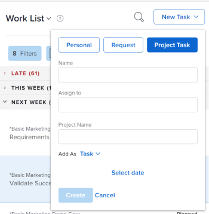

# Crear elementos de trabajo desde el área de Inicio

<!--

(NOTE: From Courtney: Need to rename)

-->

Puede crear elementos de trabajo desde el [!UICONTROL Inicio] área. Puede crear tareas personales, solicitar trabajo a otros usuarios o agregar tareas a proyectos específicos.

## Requisitos de acceso

Debe tener el siguiente acceso para realizar los pasos de este artículo:

<table style="table-layout:auto"> 
 <col> 
 <col> 
 <tbody> 
  <tr> 
   <td role="rowheader"><strong>[!DNL Adobe Workfront plan*]</strong></td> 
   <td> 
Cualquiera
 </td> 
  </tr> 
  <tr> 
   <td role="rowheader"><strong>[!DNL Adobe Workfront] licencia*</strong></td> 
   <td> 
[!UICONTROL Trabajo] o superior
 </td> 
  </tr> 
  <tr> 
   <td role="rowheader"><strong>Configuraciones de nivel de acceso*</strong></td> 
   <td> 
[!UICONTROL Worker]
 
<b>NOTA</b>
 
   
Si todavía no tiene acceso, pregunte a su [!DNL Workfront] administrador si establece restricciones adicionales en su nivel de acceso. Para obtener información sobre cómo [!DNL Workfront] El administrador puede modificar su nivel de acceso. Consulte <a href="../../../administration-and-setup/add-users/configure-and-grant-access/create-modify-access-levels.md" class="MCXref xref">Crear o modificar niveles de acceso personalizados</a>.
 </td> 
  </tr> 
  <tr> 
   <td role="rowheader"><strong>Permisos de objeto</strong></td> 
   <td> 
Acceso a [!UICONTROL Edit] o superior en tareas
 
Para obtener información sobre cómo solicitar acceso adicional, consulte <a href="../../../workfront-basics/grant-and-request-access-to-objects/request-access.md" class="MCXref xref">Solicitud de acceso a objetos </a>.
 </td> 
  </tr> 
 </tbody> 
</table>

&#42;Para saber qué plan, tipo de licencia o acceso tiene, póngase en contacto con su [!DNL Workfront] administrador.

## Crear una tarea personal

Puede crear una tarea personal que solo esté disponible para usted en el [!UICONTROL Inicio] área:

1. Haga clic en **[!UICONTROL Menú principal]**  en la esquina superior derecha, haga clic en **[!UICONTROL Inicio]**.
1. Clic **[!UICONTROL Nueva tarea]** > **[!UICONTROL Personal]**.

   

1. En el **[!UICONTROL Nombre]** , especifique un nombre para la tarea.
1. (Opcional) Haga clic en **[!UICONTROL Seleccionar fecha]**, luego seleccione la fecha en la que vence la tarea. Esto establece el [!UICONTROL Fecha planificada de finalización] para la tarea.\
   Puede cambiar el **[!UICONTROL Fecha planificada de finalización]** haciendo clic en la fecha en el panel derecho o editando el **[!UICONTROL Esto se completará antes de]** fecha directamente en la tarea.

1. Clic **[!UICONTROL Crear]** para guardar la tarea.\
   La tarea se le ha asignado y está disponible en el [!UICONTROL Inicio] área.

>[!NOTE]
>
>* Al crear una tarea personal, se almacena en un proyecto &quot;oculto&quot; en el que no se pueden realizar búsquedas [!UICONTROL Workfront]. El nombre del proyecto es &quot;&lt; Nombre de usuario >&#39;s Tasks&quot;. El &quot;Nombre de usuario&quot; es el nombre completo del usuario que creó la tarea. Solo puede acceder a este proyecto si hace clic en la tarea personal en la [!UICONTROL Inicio] , desde la ruta de exploración de la tarea, por ejemplo.
>
>* A diferencia de las tareas de proyecto normales, las tareas personales tienen un conjunto limitado de campos visibles en la interfaz de Workfront y no influyen en la cronología ni en el progreso de ningún proyecto. Reasignar una tarea personal a otro usuario agrega todos los campos de tarea a una tarea personal, pero la tarea permanece en el proyecto personal del usuario que creó la tarea.
>
>
>* Las tareas personales solo se muestran en las hojas de horas cuando se han registrado horas o cuando están ancladas en la hoja de horas. Solo puede anclar una tarea personal a una plantilla de horas cuando hay horas registradas para la tarea. Para obtener más información, consulte [Registrar tiempo](../../../timesheets/create-and-manage-timesheets/log-time.md).
> 
>* Le recomendamos que cree un proyecto y le transfiera cualquier tarea personal si desea que las tareas personales formen parte del flujo de trabajo normal.
>
> ![[!UICONTROL Proyecto para tareas personales]](assets/createworkitems-personal--project-350x105.png)

## Solicitar trabajo de otro usuario

Puede solicitar trabajo a otro usuario directamente desde el área de Inicio. Cuando solicita trabajo de otro usuario como se describe en esta sección, la tarea se muestra como una solicitud en el área de Inicio del usuario hasta que el usuario haga clic en **[!UICONTROL Trabajar en ello]**.

Para solicitar trabajo a otro usuario desde [!UICONTROL Inicio] área:

1. Haga clic en **[!UICONTROL Menú principal]**  en la esquina superior derecha, haga clic en **[!UICONTROL Inicio]**.
1. Clic **[!UICONTROL Nueva tarea]**, luego seleccione **[!UICONTROL Solicitud]**.

   

1. En el **[!UICONTROL Nombre]** , especifique un nombre para la tarea.
1. En el **[!UICONTROL Asignar a]** , empiece a escribir el nombre del usuario, equipo o función que desea asignar y, a continuación, haga clic en el nombre cuando aparezca en el menú desplegable.
1. En el [!UICONTROL Agregar como] , seleccione si desea añadir una tarea o un problema.
1. Clic **[!UICONTROL Seleccionar fecha]**, luego seleccione la fecha y la hora en que vence la tarea.
1. Clic **[!UICONTROL Crear]** para guardar la tarea.\
   La tarea se muestra como una solicitud de trabajo en la [!UICONTROL Inicio] del usuario que ha designado.

## Agregar una tarea o un problema a un proyecto

Puede agregar una tarea o un problema a un proyecto existente directamente desde el área de Inicio:

1. Haga clic en **[!UICONTROL Menú principal]**  en la esquina superior derecha, haga clic en **Inicio**.
1. Clic **[!UICONTROL Nueva tarea]**, luego seleccione **[!UICONTROL Tarea del proyecto]**.

   

1. En el **[!UICONTROL Nombre]** , especifique un nombre para la tarea o el problema.
1. En el **[!UICONTROL Asignar a]** , empiece a escribir el nombre del usuario, equipo o función que desea asignar y, a continuación, haga clic en el nombre cuando aparezca en el menú desplegable.
1. Empiece escribiendo el nombre del proyecto donde desea crear la tarea o el problema y, a continuación, haga clic en el nombre cuando aparezca en el menú desplegable.

   >[!IMPORTANT]
   >
   >La tarea o el problema aparecen en la [!UICONTROL Lista de trabajos] solo cuando el proyecto [!UICONTROL Estado] se establece en [!UICONTROL Actual].

1. (Condicional) Para crear un problema, seleccione **[!UICONTROL Problema]** desde el **[!UICONTROL Agregar como]** menú desplegable. De forma predeterminada, **[!UICONTROL Tarea]** está seleccionado.

1. Clic **[!UICONTROL Seleccionar fecha]**, luego seleccione la fecha y la hora en que vence la tarea.
1. Clic **[!UICONTROL Crear]** para guardar la tarea.
