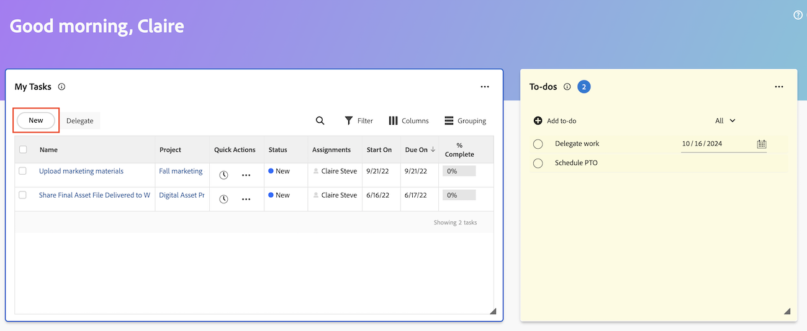
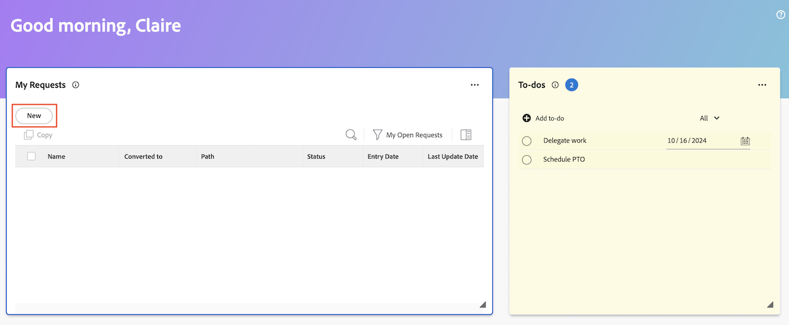

# Crear elementos de trabajo y proyectos desde el área de Inicio

Puede crear elementos de trabajo y proyectos desde el área [!UICONTROL Inicio].

Desde Inicio, puede hacer lo siguiente

* Envían solicitudes
* Agregar tareas y problemas a proyectos específicos
* Cree proyectos a partir de una plantilla o un proyecto en blanco, o importe un proyecto de MS.

## Requisitos de acceso

+++ Expanda para ver los requisitos de acceso para la funcionalidad en este artículo.

Debe tener el siguiente acceso para realizar los pasos de este artículo:

<table style="table-layout:auto"> 
 <col> 
 <col> 
 <tbody> 
  <tr> 
   <td role="rowheader"><strong>[!DNL Adobe Workfront plan*]</strong></td> 
   <td> 
Cualquiera
 </td> 
  </tr> 
  <tr> 
   <td role="rowheader"><strong>[!DNL Adobe Workfront] licencia*</strong></td> 
   <td> 
[!UICONTROL Work] o superior
 </td> 
  </tr> 
  <tr> 
   <td role="rowheader"><strong>Configuraciones de nivel de acceso*</strong></td> 
   <td> 
[!UICONTROL Worker]
 
<b>NOTA</b>
 
   
Si todavía no tiene acceso, pregunte al administrador de [!DNL Workfront] si ha establecido restricciones adicionales en su nivel de acceso. Para obtener información sobre cómo un administrador de [!DNL Workfront] puede modificar su nivel de acceso, consulte <a href="../../../administration-and-setup/add-users/configure-and-grant-access/create-modify-access-levels.md" class="MCXref xref">Creación o modificación de niveles de acceso personalizados</a>.
 </td> 
  </tr> 
  <tr> 
   <td role="rowheader"><strong>Permisos de objeto</strong></td> 
   <td> 
Acceso a [!UICONTROL Edit] o superior en tareas
 
Para obtener información sobre cómo solicitar acceso adicional, consulte <a href="../../../workfront-basics/grant-and-request-access-to-objects/request-access.md" class="MCXref xref">Solicitar acceso a objetos</a>.
 </td> 
  </tr> 
 </tbody> 
</table>

&#42;Para saber qué plan, tipo de licencia o acceso tiene, póngase en contacto con el administrador de [!DNL Workfront].

+++

## Crear un elemento de tarea personal

Puede crear un elemento personal de tareas pendientes en el widget de tareas pendientes del área [!UICONTROL Inicio]. Los elementos pendientes son tareas personales que crea usted mismo.

Usted y otros usuarios pueden ver sus tareas personales en un informe de tareas personales. A partir de ahí, pueden agregarlos a proyectos si es necesario.

>[!TIP]
>
>Los elementos de trabajo que se envíen a otros usuarios o a sí mismos desde la página de perfil de usuario también se muestran en el widget Tareas pendientes del área de Inicio del usuario. Para obtener más información, consulte [Crear tareas personales](/help/quicksilver/workfront-basics/updating-work-items-and-viewing-updates/create-personal-tasks.md).

Para crear un elemento pendiente:

1. Haga clic en el **[!UICONTROL icono del menú principal]**  en la esquina superior derecha, o en el **icono de las líneas del menú principal**  en la esquina superior izquierda, si está disponible, y luego haga clic en **[!UICONTROL Inicio]**.
1. (Condicional) Haz clic en **Personalizar** y luego haz clic en **Tareas pendientes** para agregar el widget Tareas pendientes a la pantalla de inicio.
1. Vaya al widget **Tareas pendientes** y haga clic en **Agregar tareas pendientes**.
1. Escriba el nombre del elemento personal y haga clic en Entrar.
1. (Opcional) Haga clic en el icono **Fecha**  para agregar una fecha límite para el elemento.
   
1. (Opcional) Cree un informe de tareas personales o un filtro. Para obtener información acerca de cómo crear un filtro de tareas personales, vea [Filtro: tarea personal](/help/quicksilver/reports-and-dashboards/reports/custom-view-filter-grouping-samples/filter-personal-tasks.md).
Puede ver los elementos pendientes, así como los elementos pendientes de otros usuarios, en el informe de tareas personales.

## Agregar una tarea a un proyecto

Puede agregar una tarea a un proyecto existente directamente desde el área de Inicio:

1. Haga clic en el **[!UICONTROL Menú principal]**  en la esquina superior derecha y, a continuación, haga clic en **[!UICONTROL Inicio]**.
1. (Condicional) Agrega el widget **Mis tareas** a la pantalla de inicio. Haga clic en **Personalizar** y busque **Mis tareas**.
1. Vaya al widget **Mis tareas** y, a continuación, haga clic en **Nuevo**.
   
1. En el cuadro de diálogo **Nueva tarea**, escriba el nombre de la tarea.
1. Empiece a escribir el nombre de un proyecto y selecciónelo en la lista.
1. (Opcional) Introduzca información en los campos siguientes:

   | Campo | Instrucciones |
   |----------|----------|
   | **Descripción** | Introduzca una descripción. |
   | **Asignaciones** | Asignar usuarios. |
   | **Duración** | Introduzca la duración. |
   | **Fecha planificada de finalización** | Elija una fecha planificada de finalización. |
   | **Más opciones** | Elija más opciones para configurar más ajustes para la tarea. Para obtener más información sobre cómo crear tareas, consulte [Editar tareas](/help/quicksilver/manage-work/tasks/manage-tasks/edit-tasks.md). |

1. Haga clic en **Crear tarea**.

## Agregar un problema a un proyecto

Puede agregar un problema a un proyecto existente directamente desde el área de Inicio:

1. Haga clic en el **[!UICONTROL Menú principal]**  en la esquina superior derecha y, a continuación, haga clic en **[!UICONTROL Inicio]**.
1. (Condicional) Agrega el widget **Mis problemas** a la pantalla de inicio. Haga clic en **Personalizar** y busque **Mis problemas**.
1. Vaya al widget **Mis problemas** y, a continuación, haga clic en **Nuevo**.
   
1. En el cuadro de diálogo **Nuevo problema**, empiece a escribir un nombre de proyecto y, a continuación, seleccione el nombre en la lista.
1. Introduzca un nombre de problema.
1. (Opcional) Introduzca información en los campos siguientes:

   | Campo | Instrucciones |
   |----------|----------|
   | **Descripción** | Introduzca una descripción. |
   | **Asignaciones** | Asignar usuarios. |
   | **Prioridad** | Elija un nivel de prioridad. |
   | **Documentos** | Cargue un documento. |

1. Haga clic en **Guardar nuevo problema**.

## Creación de una solicitud

Puede crear una solicitud directamente desde el área de Inicio:

1. Haga clic en el **[!UICONTROL Menú principal]**  en la esquina superior derecha y, a continuación, haga clic en **[!UICONTROL Inicio]**.
1. (Condicional) Agrega el widget **Mis solicitudes** a la pantalla de inicio. Haga clic en **Personalizar** y busque **Mis solicitudes**.
1. Vaya al widget de **Mis solicitudes** y haga clic en **Nuevo**.
   

1. En el cuadro de diálogo **Nueva solicitud**, empiece a escribir el nombre de la cola de solicitudes.
1. Rellene los campos correspondientes.
1. Haga clic en **Enviar**.

Para obtener más información sobre cómo enviar solicitudes, consulte [Crear y enviar solicitudes](/help/quicksilver/manage-work/requests/create-requests/create-submit-requests.md).

## Crear un proyecto

Puede crear un proyecto directamente desde el área de Inicio:

1. Haga clic en el **[!UICONTROL Menú principal]**  en la esquina superior derecha y, a continuación, haga clic en **[!UICONTROL Inicio]**.
1. (Condicional) Agrega el widget **Mis proyectos** a la pantalla de inicio. Haga clic en **Personalizar** y busque **Mis proyectos**.
1. Vaya al widget de **Mis proyectos** y, a continuación, haga clic en **Nuevo**.
   
1. Elija una de las siguientes opciones:

   | Campo | Instrucciones |
   |----------|----------|
   | Desde una plantilla | Vaya a [Crear un proyecto con una plantilla](/help/quicksilver/manage-work/projects/create-projects/create-project-from-template.md) para obtener instrucciones detalladas sobre cómo crear un proyecto a partir de una plantilla. |
   | Proyecto en blanco | Vaya a [Crear un proyecto desde cero](/help/quicksilver/manage-work/projects/create-projects/create-project.md#create-a-project-from-scratch) para obtener instrucciones detalladas sobre cómo crear un proyecto en blanco. |
   | Importar MS Project | Vaya a [Importar un proyecto desde un proyecto de Microsoft](/help/quicksilver/manage-work/projects/create-projects/import-project-from-ms-project.md) para obtener instrucciones detalladas sobre cómo importar un proyecto de MS. |

<!--
## Create a board

You can create a board directly from the Home area:

1. Click the **[!UICONTROL Main Menu]**  in the upper-right corner, then click **[!UICONTROL Home]**.
1. (Conditional) Add the **Boards** widget to your home screen. Click **Customize**, and find **Boards**. -->

<!--
## Delete a to-do item

1. Click the **[!UICONTROL Main Menu]**  in the upper-right corner, then click **[!UICONTROL Home]**.
1. Go to the to-do widget.
1. Hover over the item, then click the **Delete** icon . 

## Edit a to-do item

1. Click the **[!UICONTROL Main Menu]**  in the upper-right corner, then click **[!UICONTROL Home]**.
1. Go to the to-do widget.
1. Edit the item name.
1. Click on the **Date** icon  to add or adjust a due date. -->
