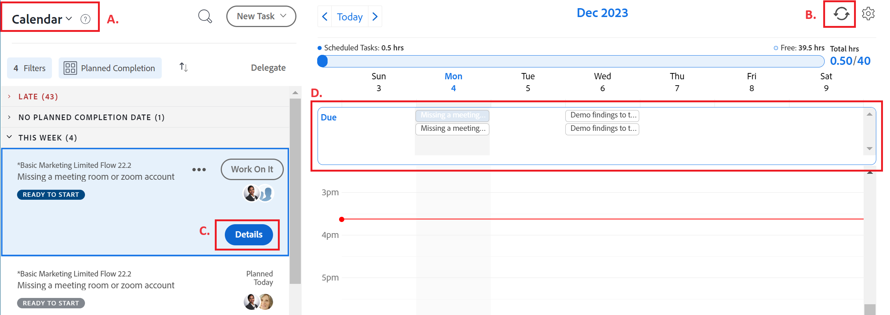

# Introducción a [!UICONTROL Inicio]

Este artículo describe una descripción general de las [!UICONTROL Inicio] área en [!DNL Adobe Workfront]. Para obtener información sobre cómo trabajar en el nuevo [!UICONTROL Inicio], consulte [Introducción a la nueva página de inicio en Adobe Workfront](../new-home/get-started-with-new-home.md).

Existen dos formas de ver su trabajo en el [!UICONTROL Inicio] área:

* Desde el [!UICONTROL Lista de trabajos]
* Desde el [!UICONTROL Calendario].

## Lista de trabajos

Puede ver todo el trabajo asignado en un solo lugar, en el [!UICONTROL Lista de trabajos]:

![[!UICONTROL Lista de trabajos] paneles](assets/worklist-and-right-panel-home.png)

Revise las siguientes secciones de la [!UICONTROL Inicio] , como se indica en la imagen anterior:

* **A**: utilice el panel izquierdo para filtrar, ordenar y seleccionar el trabajo que tiene asignado.

* **B**: Después de seleccionar un elemento de trabajo en el panel izquierdo, utilice el panel derecho para interactuar con campos personalizados, realizar actualizaciones y registrar el tiempo.

Para obtener más información sobre el uso de [!UICONTROL Lista de trabajoss en Inicio], consulte los siguientes artículos:

* [Mostrar elementos en [!UICONTROL Lista de trabajos] en el [!UICONTROL Inicio] área](../../../workfront-basics/using-home/using-the-home-area/display-items-in-home-work-list.md)
* [Cree elementos de trabajo a partir de [!UICONTROL Inicio] área](../../../workfront-basics/using-home/using-the-home-area/create-work-items-in-home.md)

## Calendario

Puede visualizar el trabajo mostrando cuándo vencen los elementos de trabajo y puede bloquear el tiempo para completarlos revisando el trabajo en [!UICONTROL Calendario] en el [!UICONTROL Inicio] área:

Revise las siguientes secciones de la [!UICONTROL Inicio] , como se indica en la imagen anterior:

* **A**: utilice el [!UICONTROL Calendario] para crear un mapa visual del trabajo que debe completar. Simplemente haga clic y arrastre los elementos de trabajo desde el [!UICONTROL Lista de trabajos] en el [!UICONTROL Calendario] para bloquear el tiempo de trabajo.

* **B**: utilice el [!UICONTROL Calendario]Opción de sincronización de para sincronizar con su [!DNL Outlook] calendario. Gestione reuniones y trabaje en un solo lugar.

* **C**: utilice el [!UICONTROL Detalles] para abrir un nuevo panel derecho en el que puede ver más información sobre el elemento de trabajo.

* **D**: utilice la barra de vencimiento para realizar un seguimiento de cuándo vence el trabajo asignado a usted.

Para obtener más información sobre cómo utilizar el Calendario principal, consulte [Utilice el [!UICONTROL Calendario principal] vista](../../../workfront-basics/using-home/using-the-home-area/use-home-calendar-view.md).

## Encontrar su trabajo

El [!UICONTROL Inicio] es su punto de encuentro para encontrar las tareas, problemas y aprobaciones que le han sido asignadas. Las opciones de filtro y ordenación integradas en la variable [!UICONTROL Inicio] trabaje en conjunto para ayudarle a trabajar de la manera que desee. Puede usar el complemento [!UICONTROL Ordenar por] para agrupar los elementos y, a continuación, utilizar el filtro para centrarse en el trabajo que debe completarse.

>[!NOTE]
>
>Las opciones de filtro y ordenación se almacenan en el explorador. Si utiliza el mismo explorador de forma consistente en el mismo equipo (y no borra los datos del sitio), los filtros y la ordenación no cambiarán, pero si cambia de explorador o de equipo, los filtros y la ordenación serán diferentes.

### Agrupar elementos de trabajo similares con &#39;[!UICONTROL Agrupar por]&#39; opción

El [!UICONTROL Ordenar por] permite agrupar como elementos en la Lista de trabajos. Puede ordenar por:

* [!UICONTROL Finalización planificada]
* [!UICONTROL Inicio planificado]
* [!UICONTROL Fecha de confirmación]
* [!UICONTROL Proyecto]
* [!UICONTROL Mi prioridad]

Para obtener más información sobre cómo utilizar las agrupaciones, consulte [Mostrar elementos en [!UICONTROL Lista de trabajos] en el [!UICONTROL Inicio] área](../../../workfront-basics/using-home/using-the-home-area/display-items-in-home-work-list.md).

### Reduzca su enfoque con filtros

El [!UICONTROL Lista de trabajos] El filtro le permite centrarse en elementos de trabajo específicos.

A continuación se muestran ejemplos de cómo puede filtrar los elementos que ve en Inicio:

* Filtre por tipo de elemento y estado.

  Por ejemplo, si desea mostrar todas las tareas, puede seleccionar la opción [!UICONTROL Tareas] filtro. Si desea ser más específico que esto y mostrar solo las tareas que están listas para que empiece a trabajar en, seleccione la [!UICONTROL Listo para empezar] filtros bajo la etiqueta [!UICONTROL Tareas] filtro.

* Filtre solo por tipo de elemento.

  Por ejemplo, puede seleccionar [!UICONTROL Problemas] para ver todos los problemas en todos los estados ([!UICONTROL Trabajando en] o [!UICONTROL Solicitado]), o [!UICONTROL Aprobaciones] para ver todos los elementos de trabajo, las solicitudes de acceso, las hojas de horas, los documentos y las aprobaciones de pruebas.

* Filtrar solo por estado.

  Por ejemplo, puede seleccionar la variable [!UICONTROL Completado] filtre para mostrar las tareas y los problemas que se han completado. Esto incluye tareas personales, pero no aprobaciones.

Para obtener más información sobre cómo utilizar los filtros, consulte [Mostrar elementos en [!UICONTROL Lista de trabajos] en el [!UICONTROL Inicio] área](../../../workfront-basics/using-home/using-the-home-area/display-items-in-home-work-list.md).

### Acceder al trabajo asignado a su equipo

El [!UICONTROL Inicio] El área tiene una agrupación permanente dedicada a solicitudes de equipo con un vínculo directo a la página de solicitudes del equipo. Utilice esta agrupación para ver y acceder a las solicitudes de cualquiera de los equipos en los que participa.

>[!NOTE]
>
>El [!UICONTROL Filtrar] y [!UICONTROL Ordenar por] Las opciones de no afectan a [!UICONTROL Solicitudes de equipo] agrupación. Esta agrupación es visible siempre y cuando tenga trabajo asignado a su equipo.

Para obtener más información sobre el acceso a las solicitudes de equipo, consulte el artículo [[!UICONTROL Administrar] solicitudes de trabajo y equipo en la [!UICONTROL Inicio] área](../../../workfront-basics/using-home/using-the-home-area/manage-work-and-team-requests-home.md).

### Supervisar el trabajo enviado

Realizar un seguimiento del trabajo enviado para su aprobación directamente desde [!UICONTROL Lista de trabajos]. Puede recordar al aprobador el trabajo que necesita aprobación. También puede recuperar la aprobación si es necesario.

>[!NOTE]
>
>El [!UICONTROL Filtrar] y [!UICONTROL Ordenar por] Las opciones de no afectan a [!UICONTROL Aprobaciones que he enviado] agrupación. Esta agrupación es visible siempre y cuando tenga trabajo pendiente de aprobación.

## Priorice lo que es importante para usted

El [!UICONTROL Lista de trabajos] le permite mostrar y priorizar el trabajo que es importante para usted con la variable [!UICONTROL Mi prioridad Ordenar por] opción. Puede añadir hasta 20 elementos a su [!UICONTROL Mi prioridad] lista. Utilice el [!UICONTROL Más] para agregar elementos de trabajo a la lista de prioridades.

>[!NOTE]
>
>Cualquier elemento de trabajo agregado a [!UICONTROL Mi prioridad] solo son visibles para usted y nadie puede priorizar el trabajo por usted.

Para obtener más información sobre cómo utilizar [!UICONTROL Mi prioridad], consulte [Priorizar el trabajo en [!UICONTROL Inicio] área](../../../workfront-basics/using-home/using-the-home-area/prioritize-work-in-home.md).

## Consiga que se haga

Uso del panel derecho en [!UICONTROL Inicio] para actualizar y completar su trabajo.

### Trabaje en un espacio personalizado para usted

Su [!DNL Adobe Workfront] El administrador de puede añadir hasta 16 campos personalizados para facilitar la búsqueda y actualización de la información que necesita. La mayoría de los campos son editables, por lo que no tiene que desplazarse a en el elemento de trabajo.

Para actualizar cualquiera de los campos de esta área, simplemente haga clic en el campo.

>[!NOTE]
>
>No se puede actualizar el [!UICONTROL Fecha de confirmación] en esta área.

### Actualice a sus compañeros con información importante

Comuníquese de forma rápida y eficaz con compañeros de trabajo de [!UICONTROL Inicio] área. Usted hace preguntas a sus compañeros de trabajo, les notifica de actualizaciones recientes o responde a comentarios directos. Además, puede actualizar a otros usuarios sobre el progreso que está realizando mediante:

* Actualización del [!UICONTROL Fecha de confirmación]

  <!--
  <note type="note">
  This is the only place you can update the Commit Date in Home.
   
  </note>
  -->

* Informar sobre cómo sientes que van las cosas
* Actualizando la barra de porcentaje completado

Para obtener más información sobre la comunicación en [!UICONTROL Inicio] área, consulte [Actualizar trabajo](../../../workfront-basics/updating-work-items-and-viewing-updates/update-work.md).

### Registre su tiempo

Realice un seguimiento de las horas que ha trabajado en elementos de trabajo individuales. Puede elegir un tipo de hora general, como [!UICONTROL Hora de tarea]o puede elegir un tipo de hora específico del proyecto configurado por su [!DNL Workfront] administrador.

Para obtener más información sobre cómo registrar tiempo en [!UICONTROL Inicio] , consulte la sección [Inicio](../../../timesheets/create-and-manage-timesheets/log-time.md#home) en el artículo [Registrar tiempo](../../../timesheets/create-and-manage-timesheets/log-time.md).

