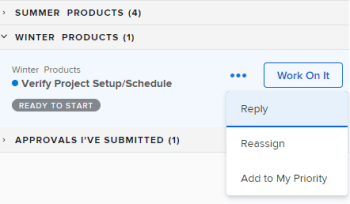

# Administrar elementos de trabajo y solicitudes de equipo en el área [!UICONTROL Inicio]

Cuando se le asignan tareas de trabajo y problemas, aparecen enumerados en los widgets Mi trabajo, Mis tareas y Mis problemas.  Puede ver, trabajar o quitar elementos de trabajo y solicitudes.

+++ Expanda para ver los requisitos de acceso para la funcionalidad en este artículo.

## Requisitos de acceso

+++ Expanda para ver los requisitos de acceso para la funcionalidad en este artículo. 

<table style="table-layout:auto"> 
 <col> 
 </col> 
 <col> 
 </col> 
 <tbody> 
  <tr> 
   <td role="rowheader"><strong>[!DNL Adobe Workfront package]</strong></td> 
   <td> 
Cualquiera
 </td> 
  </tr> 
  <tr> 
   <td role="rowheader"><strong>[!DNL Adobe Workfront] licencia</strong></td> 
   <td>
   
Estándar

    
Trabajo o superior
 </td> 
  </tr> 
  <tr> 
   <td role="rowheader"><strong>Configuraciones de nivel de acceso</strong></td> 
   <td> 
Acceso de [!UICONTROL Edit] a tareas y problemas
 </td> 
  </tr> 
  <tr> 
   <td role="rowheader"><strong>Permisos de objeto</strong></td> 
   <td> 
Permisos de aportación o superiores para las tareas y problemas en los que debe trabajar
</td> 
  </tr> 
 </tbody> 
</table>

Para obtener más información, consulte [Requisitos de acceso en la documentación de Workfront](/help/quicksilver/administration-and-setup/add-users/access-levels-and-object-permissions/access-level-requirements-in-documentation.md).

+++

## Ver un elemento de trabajo en el widget Mi trabajo

Los elementos de trabajo que se le hayan asignado se mostrarán en el widget Mi trabajo de [!UICONTROL Inicio]. Puede configurar qué elementos de trabajo se muestran en el widget Mi trabajo mediante el filtro en la parte superior del widget [!UICONTROL lista de trabajo].

Puede seleccionar filtros que muestren elementos que estén listos para que usted trabaje o elementos en los que ya esté trabajando.

Este artículo describe cómo usar los filtros en el área [!UICONTROL Inicio] para ver los elementos en los que está trabajando o en los que podría considerar comenzar a trabajar. Para obtener información sobre cómo usar filtros en el área [!UICONTROL Hogar], consulte [Mostrar elementos en la [!UICONTROL lista de trabajo] en el área [!UICONTROL Hogar]](/help/quicksilver/workfront-basics/using-home/using-the-home-area/display-items-in-home-work-list.md).

Para ver un elemento de trabajo en el widget Mi trabajo:

1. Haga clic en el **[!UICONTROL Menú principal]**  en la esquina superior derecha y, a continuación, haga clic en **[!UICONTROL Inicio]**.
1. (Condicional) Haga clic en **Personalizar** para agregar el widget **Mi trabajo**.

1. Haga clic en el icono **Filtro**  en la esquina superior izquierda de la lista de trabajos del widget.

1. Haga clic en una o ambas de las siguientes opciones para las tareas:

   **[!UICONTROL Listo para el inicio]:** Muestra solamente las tareas y los problemas que están listos para el inicio. Las dos instrucciones siguientes deben ser verdaderas:

   * Las tareas y sus tareas principales no tienen predecesoras ni restricciones de tarea que impidan trabajar con ellas.
   * La [!UICONTROL fecha planificada de inicio] de las tareas o problemas se encuentra en las últimas o en un máximo de dos semanas en el futuro.

   **[!UICONTROL No está listo]**: muestra solamente las tareas y los problemas que aún no están listos para iniciarse. Cualquiera de las siguientes instrucciones debe ser verdadera:

   * Las tareas y sus tareas principales pueden tener predecesoras o restricciones de tareas que impiden que se trabaje con ellas.
   * Las tareas o problemas tienen una [!UICONTROL Fecha planificada de inicio] que es más de dos semanas en el futuro.

1. Haga clic en **[!UICONTROL Trabajando en]** en [!UICONTROL Tareas] o [!UICONTROL Problemas] para mostrar las tareas y los problemas en los que está trabajando actualmente.
1. Haga clic en **[!UICONTROL Solicitado]** en [!UICONTROL Problemas] para mostrar los problemas que se le han solicitado (está asignado a ellos), pero aún no ha aceptado trabajar con ellos.

## Acceder a una solicitud de equipo en el widget de solicitud de equipo

Puede acceder a una solicitud asignada a su equipo directamente desde el widget Solicitudes de equipo en el área [!UICONTROL Inicio]. Para obtener más información sobre las solicitudes de equipo, consulte [Resumen de las solicitudes de equipo](../../../people-teams-and-groups/work-with-team-requests/team-requests-overview.md).

Para acceder a una solicitud de equipo:

1. Haga clic en el **[!UICONTROL Menú principal]**  en la esquina superior derecha y, a continuación, haga clic en **[!UICONTROL Inicio]**.
1. (Condicional) Haga clic en **Personalizar** para agregar el widget **Solicitudes de equipo**.

   El widget muestra las solicitudes de equipo en agrupaciones de equipos. El widget **[!UICONTROL Solicitudes de equipo]** muestra y muestra todas las solicitudes asignadas a cualquier equipo en el que se encuentre. Para obtener más información sobre cómo trabajar con solicitudes de equipo, consulte [Administrar solicitudes de trabajo y equipo](../../../people-teams-and-groups/work-with-team-requests/manage-work-and-team-requests.md).

   

## Trabajar en un elemento de trabajo en el widget Mi trabajo

Al hacer clic en el botón [!UICONTROL Trabajar en ello], está indicando al usuario que envió el elemento de trabajo y a cualquier otro usuario que esté asignado al elemento de trabajo que va a iniciar el trabajo.

Para trabajar en un elemento de trabajo:

1. Haga clic en el **[!UICONTROL Menú principal]**  en la esquina superior derecha y, a continuación, haga clic en **[!UICONTROL Inicio]**.
1. (Condicional) Haga clic en **Personalizar** para agregar el widget **Mi trabajo**.

1. En el área **[!UICONTROL lista de trabajo]** del widget, seleccione la solicitud en la que desea trabajar y haga clic en **[!UICONTROL Trabajar en ello]**.
1. Pase el ratón sobre el elemento de trabajo y luego haga clic en el icono **Resumen** para ver información sobre el elemento de trabajo.

   

## Quitar un elemento de trabajo

Si decide que no debería estar trabajando en el elemento de trabajo, puede quitarlo de la lista.

Para quitar un elemento de trabajo:

1. Haga clic en el **[!UICONTROL Menú principal]**  en la esquina superior derecha y, a continuación, haga clic en **[!UICONTROL Inicio]**.
1. (Condicional) Haga clic en **Personalizar** para agregar el widget **Mi trabajo**.

1. En la lista de trabajo del widget, pase el ratón sobre el elemento de trabajo y haga clic en el icono **Resumen** para ver información sobre el elemento de trabajo.
   
1. en la sección **Asignaciones**, quite el nombre.
   

<!--
## Reassign a request

1. Click the **[!UICONTROL Main Menu]**  in the upper-right corner, then click **[!UICONTROL Home]**.
1. In the **[!UICONTROL Work List]** area, select the request you want to reassign.

1. Click on the **[!UICONTROL Assignments]** widget and remove yourself from the request, then type the name of the user you want to reassign the request to.

   >[!TIP]
   >
   >If the work request is still in the Ready to Start or Not Ready state, you can use the **[!UICONTROL Reassign]** button in the **[!UICONTROL More]** menu in the [!UICONTROL Work List].\
   >

1. If a task's status is changed to [!UICONTROL New] or [!UICONTROL In Progress] after it was completed, you must unassign the user, save the task, then reassign the user in order for the task to reappear in their Home Work List.

## Reply to a request

You can reply to a request to further clarify the request or to propose a new date.

1. Click the **[!UICONTROL Main Menu]**  in the upper-right corner, then click **[!UICONTROL Home]**.
1. In the **[!UICONTROL Work List]** area, select the request you want to reply to.
1. Locate the individual who assigned the request to you.

   You can find this information on the [!UICONTROL Updates] tab of the task. Make sure the option to **[!UICONTROL Show System Updates]** is enabled.

1. Click **[!UICONTROL Start new update]** and begin typing your reply.
1. Enter the name of the recipient in the **[!UICONTROL Notify]** box, then click **[!UICONTROL Update]**.

   >[!TIP]
   >
   >If the work request is still in the Ready to Start or [!UICONTROL Not Ready] state, you can use the **[!UICONTROL Reply]** button in the **[!UICONTROL More]** menu in the [!UICONTROL Work List].\
   >![[!UICONTROL Reply button]](assets/reassign-in-left-panel-350x204.png)   

   -->
