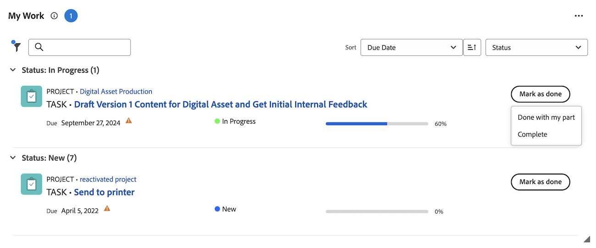

# Marcar un elemento como [!UICONTROL Listo] en el área de [!UICONTROL Inicio]

Puede marcar una tarea o un problema como Listo si es el usuario asignado de la tarea o el problema. Cuando marca una tarea o un problema como [!UICONTROL Listo], el estado de la tarea o del problema cambia a [!UICONTROL Completado].

>[!NOTE]
>
>No ve el botón [!UICONTROL Listo] a menos que sea uno de los recursos asignados a la tarea o al problema.

+++ Expanda para ver los requisitos de acceso para la funcionalidad en este artículo.

## Requisitos de acceso

Debe tener el siguiente acceso para realizar los pasos de este artículo:

<table style="table-layout:auto"> 
 <col> 
 </col> 
 <col> 
 </col> 
 <tbody> 
  <tr> 
   <td role="rowheader"><strong>[!DNL Adobe Workfront plan*]</strong></td> 
   <td> 
Cualquiera
 </td> 
  </tr> 
  <tr> 
   <td role="rowheader"><strong>[!DNL Adobe Workfront] licencia*</strong></td> 
   <td> 
[!UICONTROL Trabajo] o superior
 </td> 
  </tr> 
  <tr> 
   <td role="rowheader"><strong>Configuraciones de nivel de acceso*</strong></td> 
   <td> 
Acceso de [!UICONTROL Edit] a tareas y problemas
 
Nota: si todavía no tiene acceso, pregunte al administrador de [!DNL Workfront] si ha establecido restricciones adicionales en su nivel de acceso. Para obtener información sobre cómo un administrador de [!DNL Workfront] puede modificar su nivel de acceso, vea <a href="../../../administration-and-setup/add-users/configure-and-grant-access/create-modify-access-levels.md" class="MCXref xref">Crear o modificar niveles de acceso personalizados</a>.
 </td> 
  </tr> 
  <tr> 
   <td role="rowheader"><strong>Permisos de objeto</strong></td> 
   <td> 
Permisos de Contribute o superiores para las tareas y problemas en los que debe trabajar
 
Para obtener información sobre cómo solicitar acceso adicional, vea <a href="../../../workfront-basics/grant-and-request-access-to-objects/request-access.md" class="MCXref xref">Solicitar acceso a los objetos </a>.
 </td> 
  </tr> 
 </tbody> 
</table>

&#42;Para saber qué plan, tipo de licencia o acceso tiene, póngase en contacto con el administrador de [!DNL Workfront].

+++

## Marcar un elemento de trabajo como Listo en el widget Mi trabajo

1. Haga clic en **[!UICONTROL Menú principal]**  en la esquina superior derecha y, a continuación, haga clic en **[!UICONTROL Inicio]**.
1. (Condicional) Haga clic en **Personalizar** para agregar el widget **Mi trabajo**.
1. Busque el elemento de trabajo y haga clic en **[!UICONTROL Marcar como listo]** en el elemento de trabajo.
Vea [Comprender las opciones del botón [!UICONTROL Listo]](#understand-the-options-of-the-done-button) para obtener información más detallada sobre cómo puede aparecer este botón.
   

## Marcar un elemento de trabajo como Listo en el panel Resumen

Puede marcar un elemento de trabajo como Listo en el widget Mis tareas y Mis problemas mediante el Panel de resumen.

1. Haga clic en **[!UICONTROL Menú principal]**  en la esquina superior derecha y, a continuación, haga clic en **[!UICONTROL Inicio]**.
1. (Condicional) Haga clic en **Personalizar** para agregar los widgets **Mis tareas** o **Mis problemas**.
1. Pase el ratón sobre el elemento de trabajo y luego haga clic en el icono **Resumen**.
   
1. Haga clic en **Marcar como listo** en la parte superior del panel Resumen.

## Comprender las opciones del botón [!UICONTROL Listo]

De manera predeterminada, al hacer clic en el botón [!UICONTROL Listo] en un elemento de trabajo, se cambia el estado de ese elemento a [!UICONTROL Completado] (para tareas) o [!UICONTROL Resuelto] (para problemas).

El administrador de [!DNL Adobe Workfront] puede personalizar los estados asociados con el botón [!UICONTROL Listo] y aplicar esas personalizaciones a su equipo de inicio.

Dependiendo de cuántos estados estén asociados con el botón [!UICONTROL Listo] o de cuántos recursos estén asignados a la tarea o al problema, el aspecto del botón [!UICONTROL Listo] puede cambiar.

* [Botón [!UICONTROL Listo] asociado con un estado](#done-button-associated-with-one-status)
* [Botón [!UICONTROL Listo] asociado con varios estados](#done-button-associated-with-multiple-statuses)
* [Botón [!UICONTROL Listo] para elementos asignados a varios recursos](#done-button-for-items-assigned-to-multiple-resources)

### Botón [!UICONTROL Listo] asociado con un estado

Cuando el botón [!UICONTROL Listo] está asociado a un estado y el elemento de trabajo se le asigna solamente a usted, el botón indica **[!UICONTROL Listo]**. Al hacer clic en él, el estado de la tarea o del problema cambia al estado asociado con el botón [!UICONTROL Listo].

Para saber qué estado está asociado con el botón [!UICONTROL Listo], consulte la sección [!UICONTROL Configuración del equipo] de su equipo de inicio [!UICONTROL Botón Listo], tal como se describe en [Editar configuración del equipo](../../../people-teams-and-groups/create-and-manage-teams/edit-team-settings.md).

Si no está asignado a un equipo de inicio, se elige el estado predeterminado al hacer clic en [!UICONTROL Listo], tal como se describe más arriba en [Comprender las opciones del botón [!UICONTROL Listo]](#understand-the-options-of-the-done-button).

### Botón [!UICONTROL Listo] asociado con varios estados

Cuando el botón [!UICONTROL Listo] está asociado con más de un estado, el botón muestra la palabra **[!UICONTROL Listo]**, que va seguida de un menú desplegable. En este escenario, no puede simplemente hacer clic en [!UICONTROL Listo]. Debe seleccionar un estado en el menú desplegable. Seleccione el estado que mejor se ajuste a la finalización del elemento de trabajo. Al hacerlo, cambia el estado del elemento de trabajo.

Para comprender cómo puede asociar varios estados con el botón [!UICONTROL Listo], consulte [Configurar el botón [!UICONTROL Listo] para las tareas](../../../people-teams-and-groups/create-and-manage-teams/configure-the-done-button-for-tasks.md) y [Configurar el botón [!UICONTROL Listo] para los problemas](../../../people-teams-and-groups/create-and-manage-teams/configure-the-done-button-for-issues.md).

### Botón [!UICONTROL Listo] para elementos asignados a varios recursos

Cuando la tarea o el problema se asignan a más de un recurso, el botón muestra la palabra **[!UICONTROL Listo]**, seguida de un menú desplegable. En el menú desplegable, tiene la opción de elegir entre **[!UICONTROL Listo con mi parte]** (lo que permite a los integrantes del equipo saber que ha completado su parte de la tarea) o el estado asociado con el botón [!UICONTROL Listo] (lo que completa el elemento). Después de seleccionar **[!UICONTROL Listo con mi parte]**, el elemento de trabajo se quitará de su Lista de trabajos, pero permanecerá en la Lista de trabajos de los que aún se hayan asignado al elemento de trabajo.\
Si el botón Listo está asociado con varios estados, se enumeran en **Listo con mi parte**.

>[!NOTE]
>
>En una tarea o un problema con varias personas asignadas, cada usuario es responsable de indicar que se ha completado su propia asignación en la tarea o el problema. Por este motivo, cada usuario asignado debe hacer clic en [!UICONTROL Listo] para mostrar que ha completado el trabajo que se le ha asignado en el elemento.

