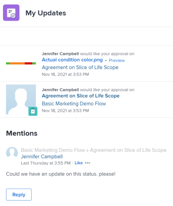

# Usar el área [!UICONTROL Mis actualizaciones]

<!--The highlighted information on this page refers to functionality not yet generally available. It is available only in the Preview environment for all customers. After the monthly releases to Production, the same features are also available in the Production environment for customers who enabled fast releases.    

For information about fast releases, see [Enable or disable fast releases for your organization](/help/quicksilver/administration-and-setup/set-up-workfront/configure-system-defaults/enable-fast-release-process.md). -->

Puede usar el área [!UICONTROL Mis actualizaciones] para revisar rápidamente las aprobaciones que esperan su decisión o las conversaciones en las que se le ha incluido.

Como usuario con una licencia de [!UICONTROL Revisión], puede encontrar el área [!UICONTROL Mis actualizaciones] en el [!UICONTROL Menú principal] de forma predeterminada, mientras que el área [!UICONTROL Mis actualizaciones] será su página de aterrizaje predeterminada.

Para obtener información acerca de [!DNL Adobe Workfront] licencias, consulte [[!DNL Adobe Workfront] Información general sobre licencias](../../../administration-and-setup/add-users/access-levels-and-object-permissions/wf-licenses.md).

Si posee un tipo de licencia diferente al de Revisión, el administrador de [!DNL Workfront] o de grupo deberá añadir el área [!UICONTROL Mis actualizaciones] a la plantilla de diseño para mostrarla en el menú principal. Para obtener más información, consulte [Personalizar [!UICONTROL Menú principal] con una plantilla de diseño](../../../administration-and-setup/customize-workfront/use-layout-templates/customize-main-menu.md).

## Requisitos de acceso

+++ Expanda para ver los requisitos de acceso para la funcionalidad en este artículo.

Debe tener el siguiente acceso para realizar los pasos de este artículo:

<table style="table-layout:auto"> 
 <col> 
 <col> 
 <tbody> 
  <tr> 
   <td role="rowheader"><strong>[!DNL Adobe Workfront plan]</strong></td> 
   <td> 
Cualquiera
 </td> 
  </tr> 
  <tr> 
   <td role="rowheader"><strong>[!DNL Adobe Workfront] licencia*</strong></td> 
   <td> 
Nuevo: colaborador o superior

   O   
   
Actual: [!UICONTROL Request] o superior
 </td> 
  </tr> 
  <tr> 
   <td role="rowheader"><strong>Configuración de nivel de acceso</strong></td> 
   <td> 
Ver el acceso o superior a cualquier objeto para el que esté etiquetado en una conversación o para el que necesite resolver una aprobación (proyectos, tareas, problemas, documentos)
 </td> 
  </tr> 
  <tr> 
   <td role="rowheader"><strong>Permisos de objeto</strong></td> 
   <td> 
Permisos de [!UICONTROL View] o superiores para proyectos, tareas, problemas o documentos en los que esté etiquetado en una conversación o necesite resolver una aprobación
 </td> 
  </tr> 
 </tbody> 
</table>

*Para saber qué plan, tipo de licencia o acceso tiene, póngase en contacto con el administrador de [!DNL Workfront]. Para obtener más información, consulte [Requisitos de acceso en la documentación de Workfront](/help/quicksilver/administration-and-setup/add-users/access-levels-and-object-permissions/access-level-requirements-in-documentation.md).

+++

## Requisitos previos

Debe tener lo siguiente antes de empezar:

* Si posee una licencia de [!DNL Workfront] distinta a la de [!UICONTROL Revisión], su administrador de [!DNL Workfront] o de grupo debe añadir el área [!UICONTROL Mis actualizaciones] al [!UICONTROL Menú principal] mediante una plantilla de diseño y asignarle a esa plantilla.

* Los usuarios con licencia de revisión pueden ver el área [!UICONTROL Mis actualizaciones] en su [!UICONTROL Menú principal] de forma predeterminada.

## Obtener acceso al área [!UICONTROL Mis actualizaciones]

1. Haga clic en **[!UICONTROL Mis actualizaciones]** en el **[!UICONTROL Menú principal]**.

   

   Se abre el área [!UICONTROL Mis actualizaciones].

   Las aprobaciones y solicitudes de acceso que se le hayan asignado se enumeran en la primera mitad de la página, en **Mis actualizaciones**.

   

1. (Opcional) Desplácese hasta la parte inferior del área de [!UICONTROL **Mis actualizaciones**] y haga clic en la flecha hacia la derecha para mostrar más aprobaciones que se muestran en páginas adicionales.

   >[!TIP]
   >
   >Las primeras cinco aprobaciones o solicitudes de acceso se muestran de forma predeterminada. Las aprobaciones restantes se muestran en páginas adicionales. Puede mostrar un máximo de 2000 aprobaciones en el área [!UICONTROL Mis actualizaciones].

   

1. (Opcional) Expanda el menú desplegable **[!UICONTROL Filtro]**  en la esquina superior derecha de la sección **[!UICONTROL Mis actualizaciones]** y seleccione una de las siguientes opciones:

   <table style="table-layout:auto"> 
    <col> 
    </col> 
    <col> 
    </col> 
    <tbody> 
     <tr> 
      <td role="rowheader"><strong>[!UICONTROL All]</strong></td> 
      <td>Aprobaciones que se le han enviado o que le ha delegado otro usuario. Para obtener información sobre la delegación de aprobaciones, consulte <a href="../../../review-and-approve-work/manage-approvals/delegate-approval-requests.md" class="MCXref xref">Delegar solicitud de aprobación</a>. </td> 
     </tr> 
     <tr> 
      <td role="rowheader"><strong>[!UICONTROL Delegated Approvals]</strong></td> 
      <td>Aprobaciones delegadas por otro usuario. </td> 
     </tr> 
     <tr> 
      <td role="rowheader"><strong>[!UICONTROL My Approvals]</strong></td> 
      <td> 
Aprobaciones que se le han enviado. 
 
Para obtener más información sobre la aprobación de elementos, consulte <a href="../../../review-and-approve-work/manage-approvals/approving-work.md" class="MCXref xref">Aprobación del trabajo </a>.
 </td> 
     </tr> 
    </tbody> 
   </table>

1. Para aprobar o rechazar un elemento o sugerir cambios en un documento antes de aprobarlo, haga lo siguiente:

   1. (Opcional) Haga clic en el icono **desplegable**  junto a la decisión de aprobación (**[!UICONTROL Aprobar]**, **[!UICONTROL Cambios]**,**[!UICONTROL Rechazar]**) y agregue un comentario. A continuación, haga clic en **[!UICONTROL Agregar]**.

      O

      Haga clic en **[!UICONTROL Omitir]** si no desea escribir ningún comentario.

      

      >[!NOTE]
      >
      >La opción [!UICONTROL Cambios] solo se muestra para las aprobaciones de documentos.

      Según el icono desplegable seleccionado, el elemento se aprueba, rechaza o, en el caso de una aprobación de documento, se aprueba con una solicitud de realizar cambios adicionales.

      >[!TIP]
      >
      >Si no desea añadir un comentario a su decisión, puede hacer clic en el botón **[!UICONTROL Aprobar]**, **[!UICONTROL Rechazar]** o **[!UICONTROL Cambios]** para que la decisión de aprobación se conceda de inmediato.
      >
      >
      >
      >
      >Para obtener más información sobre la aprobación de trabajo, consulte [Aprobación de trabajo](../../../review-and-approve-work/manage-approvals/approving-work.md).

1. Haga clic en **[!UICONTROL Grant access]** para conceder la solicitud de acceso que se le ha enviado

   O

   Expanda el menú desplegable **[!UICONTROL Change access]** para modificar el acceso solicitado antes de concederlo.

   

1. (Opcional) Haga clic en **[!UICONTROL Ignore]** para borrar la solicitud de acceso de su lista de aprobación sin concederla.
1. Haga clic en **[!UICONTROL Delegate my approvals]** para delegar las aprobaciones enviadas si no está disponible para tomar decisiones de aprobación durante algún tiempo. Para obtener más información sobre la delegación de aprobaciones, consulte [Delegar solicitud de aprobación](../../../review-and-approve-work/manage-approvals/delegate-approval-requests.md).
1. Desplácese al área de **[!UICONTROL Mentions]** que se encuentra debajo de las aprobaciones. Aquí puede ver todos los elementos en los que le hayan incluido en una conversación.

   >[!TIP]
   >
   >Las primeras 50 menciones se muestran de forma predeterminada.

1. (Opcional) Haga clic en **[!UICONTROL Show More Updates]** para ver más menciones.
1. (Opcional) Haga clic en **[!UICONTROL Reply]** para responder a un comentario y realice una de las siguientes acciones:
   * Empiece a escribir una respuesta
   * Utilice la barra de herramientas Texto enriquecido para dar formato al texto y añadir vínculos, listas, emojis, comillas o imágenes al mensaje
   * Añada usuarios o equipos para notificarles su respuesta.

     Para obtener más información acerca de cómo responder a las actualizaciones, vea [Trabajo de actualización](/help/quicksilver/workfront-basics/updating-work-items-and-viewing-updates/update-work.md).

     Cuando termine de agregar la respuesta, haga clic en **[!UICONTROL Enviar]**.

     

1. (Opcional) Haga clic en **[!UICONTROL Pin current page]** para anclar el área de [!UICONTROL My Updates] a su barra de navegación superior.
