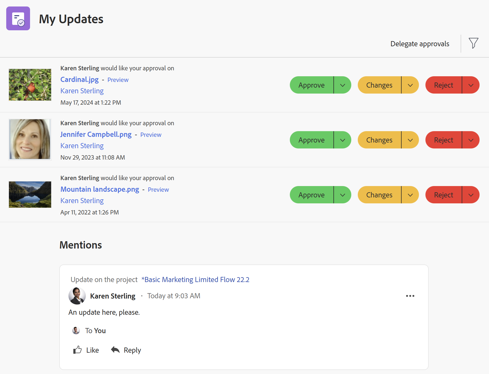

# Utilice la variable [!UICONTROL Mis actualizaciones] area

<!--

(NOTE: there is a similar article like this in the "My Work" folder that is conditioned for Classic only)

-->

Puede usar la variable [!UICONTROL Mis actualizaciones] para revisar rápidamente las aprobaciones a la espera de su decisión o las conversaciones en las que se ha incluido.

Como usuario con un [!UICONTROL Consulte] licencia, puede encontrar la [!UICONTROL Mis actualizaciones] en el [!UICONTROL Menú principal] de forma predeterminada, y [!UICONTROL Mis actualizaciones] es la página de aterrizaje predeterminada.

Para obtener información sobre [!DNL Adobe Workfront] licencias, consulte [[!DNL Adobe Workfront] información general sobre licencias](../../../administration-and-setup/add-users/access-levels-and-object-permissions/wf-licenses.md).

Si tiene un tipo de licencia diferente a Review, la variable [!DNL Workfront] o el administrador del grupo debe agregar la variable [!UICONTROL Mis actualizaciones] a la plantilla de diseño para mostrarla en el menú principal. Para obtener más información, consulte [Personalice el [!UICONTROL Menú principal] uso de una plantilla de diseño](../../../administration-and-setup/customize-workfront/use-layout-templates/customize-main-menu.md).

## Requisitos de acceso

Debe tener el siguiente acceso para realizar los pasos de este artículo:

<table style="table-layout:auto"> 
 <col> 
 <col> 
 <tbody> 
  <tr> 
   <td role="rowheader"><strong>[!DNL Adobe Workfront plan*]</strong></td> 
   <td> 
Cualquiera
 </td> 
  </tr> 
  <tr> 
   <td role="rowheader"><strong>[!DNL Adobe Workfront] licencia*</strong></td> 
   <td> 
[!UICONTROL Request] o superior
 </td> 
  </tr> 
  <tr> 
   <td role="rowheader"><strong>Configuraciones de nivel de acceso*</strong></td> 
   <td> 
Ver el acceso o superior a cualquier objeto para el que esté etiquetado en una conversación o necesite resolver una aprobación (Proyectos, Tareas, Problemas, Documentos)
 
Nota: Si todavía no tiene acceso, pregunte a su [!DNL Workfront] administrador si establecen restricciones adicionales en su nivel de acceso. Para obtener información sobre cómo se [!DNL Workfront] administrador puede modificar el nivel de acceso, consulte <a href="../../../administration-and-setup/add-users/configure-and-grant-access/create-modify-access-levels.md" class="MCXref xref">Crear o modificar niveles de acceso personalizados</a>.
 </td> 
  </tr> 
  <tr> 
   <td role="rowheader"><strong>Permisos de objeto</strong></td> 
   <td> 
Permisos de [!UICONTROL View] o superiores para proyectos, tareas, problemas, documentos en los que esté etiquetado en una conversación o necesite resolver una aprobación
 
Para obtener información sobre la solicitud de acceso adicional, consulte <a href="../../../workfront-basics/grant-and-request-access-to-objects/request-access.md" class="MCXref xref">Solicitar acceso a objetos </a>.
 </td> 
  </tr> 
 </tbody> 
</table>

Para saber qué plan, tipo de licencia o acceso tiene, póngase en contacto con su [!DNL Workfront] administrador.

## Requisitos previos

Debe tener lo siguiente antes de comenzar:

* Si tiene una [!DNL Workfront] licencia distinta de [!UICONTROL Consulte], su [!DNL Workfront] o el administrador del grupo debe agregar la variable [!UICONTROL Mis actualizaciones] del área [!UICONTROL Menú principal] mediante una plantilla de diseño y asígnele a esa plantilla.

* Los usuarios con licencia de revisión pueden ver la [!UICONTROL Mis actualizaciones] área de [!UICONTROL Menú principal] de forma predeterminada.

## Acceda a la [!UICONTROL Mis actualizaciones] area

1. Haga clic en **[!UICONTROL Mis actualizaciones]** en el **[!UICONTROL Menú principal]**.

   

   La variable [!UICONTROL Mis actualizaciones] se abre.

   Las aprobaciones y solicitudes de acceso asignadas a usted se enumeran en la primera mitad de la página, en Mis actualizaciones.

   

1. (Opcional) Desplácese hasta la parte inferior del [!UICONTROL Mis actualizaciones] y haga clic en la flecha hacia la derecha para mostrar más aprobaciones que se muestran en páginas adicionales.

   >[!TIP]
   >
   >Las cinco primeras aprobaciones o solicitudes de acceso se muestran de forma predeterminada. Las aprobaciones restantes se muestran en páginas adicionales. Puede mostrar un máximo de 2000 aprobaciones en la variable [!UICONTROL Mis actualizaciones] .

   

1. (Opcional) Expanda el **[!UICONTROL Filtro]** menú desplegable  en la esquina superior derecha del **[!UICONTROL Mis actualizaciones]** y seleccione una de las siguientes opciones:

   <table style="table-layout:auto"> 
    <col> 
    </col> 
    <col> 
    </col> 
    <tbody> 
     <tr> 
      <td role="rowheader"><strong>[!UICONTROL Todo]</strong></td> 
      <td>Aprobaciones que otro usuario le envía o delega en usted. Para obtener información sobre la delegación de aprobaciones, consulte <a href="../../../review-and-approve-work/manage-approvals/delegate-approval-requests.md" class="MCXref xref">Delegar solicitud de aprobación</a>. </td> 
     </tr> 
     <tr> 
      <td role="rowheader"><strong>[!UICONTROL Aprobaciones delegadas]</strong></td> 
      <td>Aprobaciones delegadas en usted por otro usuario. </td> 
     </tr> 
     <tr> 
      <td role="rowheader"><strong>[!UICONTROL Mis aprobaciones]</strong></td> 
      <td> 
Aprobaciones enviadas a usted. 
 
Para obtener más información sobre la aprobación de elementos, consulte <a href="../../../review-and-approve-work/manage-approvals/approving-work.md" class="MCXref xref">Aprobación del trabajo </a>.
 </td> 
     </tr> 
    </tbody> 
   </table>

1. Para aprobar o rechazar un elemento o sugerir cambios en un documento antes de aprobarlo, haga lo siguiente:

   1. (Opcional) Haga clic en el **lista desplegable** icono  junto a su decisión de aprobación (**[!UICONTROL Aprobar]**, **[!UICONTROL Cambios]**,**[!UICONTROL Rechazar]**) y añada un comentario y, a continuación, haga clic en **[!UICONTROL Agregar]**.

      O

      Haga clic en **[!UICONTROL Omitir]** si no desea introducir un comentario.

      

      >[!NOTE]
      >
      >La variable [!UICONTROL Cambios] solo se muestra para las aprobaciones de documentos.

      Según el icono desplegable que haya seleccionado, el elemento se aprueba, rechaza o, en el caso de una aprobación de documento, se aprueba con una solicitud para realizar cambios adicionales.

      >[!TIP]
      >
      >Si no desea agregar un comentario a su decisión, puede hacer clic en el botón **[!UICONTROL Aprobar]**, **[!UICONTROL Rechazar]** o **[!UICONTROL Cambios]** y la decisión de aprobación se concede inmediatamente.
      >
      >
      >      >

      Para obtener más información sobre la aprobación del trabajo, consulte [Aprobación del trabajo](../../../review-and-approve-work/manage-approvals/approving-work.md).

1. Haga clic en **[!UICONTROL Conceder acceso]** para conceder la solicitud de acceso que se le haya enviado

   O

   Expanda el **[!UICONTROL Cambiar acceso]** menú desplegable para modificar el acceso solicitado antes de concederlo.

   

1. (Opcional) Haga clic en **[!UICONTROL Ignorar]** para borrar la solicitud de acceso de su lista de aprobación sin concederla.
1. Haga clic en **[!UICONTROL Delegación de mis aprobaciones]** para delegar las aprobaciones enviadas si no está disponible, para tomar decisiones de aprobación durante algún tiempo. Para obtener más información sobre la delegación de aprobaciones, consulte [Delegar solicitud de aprobación](../../../review-and-approve-work/manage-approvals/delegate-approval-requests.md).
1. Desplácese hasta el **[!UICONTROL Menciones]** debajo de sus aprobaciones. Aquí puede ver todos los elementos donde ha sido incluido en una conversación.

   

   >[!TIP]
   >
   >Las 50 primeras menciones se muestran de forma predeterminada.

1. (Opcional) Haga clic en **[!UICONTROL Mostrar más actualizaciones]** para ver más menciones.
1. (Opcional) Haga clic en **[!UICONTROL Responder]** para responder a un comentario, introduzca su respuesta y haga clic en **[!UICONTROL Responder]** de nuevo.

   Para obtener más información sobre la actualización de elementos, consulte [Actualizar trabajo](../../../workfront-basics/updating-work-items-and-viewing-updates/update-work.md).

1. (Opcional) Haga clic en **[!UICONTROL Fijar la página actual]** para fijar el [!UICONTROL Mis actualizaciones] a la barra de navegación superior.
