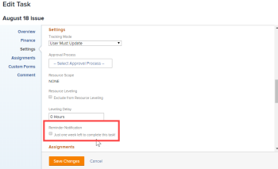

# Adjuntar una notificación de recordatorio a un objeto

Puede asociar notificaciones de recordatorio con varios tipos de objetos diferentes: proyectos, tareas, problemas, hojas de horas, plantillas, tareas de plantilla y perfiles de hojas de horas recurrentes.

Para poder adjuntar notificaciones de recordatorio a un objeto, un administrador de [!DNL Adobe Workfront] debe crear la notificación, tal como se describe en [Configurar notificaciones de recordatorio](../../administration-and-setup/manage-workfront/emails/set-up-reminder-notifications.md).

Los pasos para adjuntar notificaciones de recordatorio son los mismos, independientemente del tipo de objeto al que se adjunten.

## Requisitos de acceso

+++ Expanda para ver los requisitos de acceso para la funcionalidad en este artículo.

<table style="table-layout:auto"> 
 <col> 
 </col> 
 <col> 
 </col> 
 <tbody> 
  <tr> 
   <td role="rowheader">[!DNL Adobe Workfront package]</td> 
   <td> 
Cualquiera
 </td> 
  </tr> 
  <tr> 
   <td role="rowheader">[!DNL Adobe Workfront] licencia</td> 
   <td> 
   
Estándar

   
Trabajo o superior
 </td> 
  </tr> 
  <tr> 
   <td role="rowheader">Permisos de objeto</td> 
   <td> 
Administrar el acceso al objeto
  </td> 
  </tr> 
 </tbody> 
</table>

Para obtener más información, consulte [Requisitos de acceso en la documentación de Workfront](/help/quicksilver/administration-and-setup/add-users/access-levels-and-object-permissions/access-level-requirements-in-documentation.md).

+++

## Adjuntar notificaciones de recordatorio a un objeto

1. Vaya al objeto en el que desea adjuntar la notificación de recordatorio.
1. Haga clic en el icono Editar .
1. En el panel izquierdo del cuadro **[!UICONTROL Editar]** que aparece, haga clic en **[!UICONTROL Configuración]**.

1. En **[!UICONTROL Notificación de recordatorio]**, seleccione las notificaciones que desee adjuntar al objeto.

   En este ejemplo, el objeto que se está editando es una tarea:

   

   Si el administrador de [!DNL Workfront] ha creado varias notificaciones de recordatorio, puede adjuntar varias notificaciones a un único objeto.

1. Haga clic en **[!UICONTROL Guardar cambios]**.

   Si necesita ayuda para probar el envío de una notificación de recordatorio, consulte con su administrador de [!DNL Workfront].
